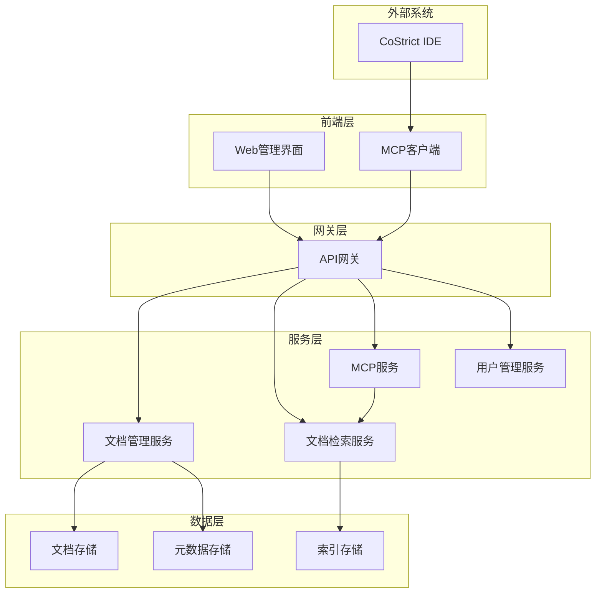
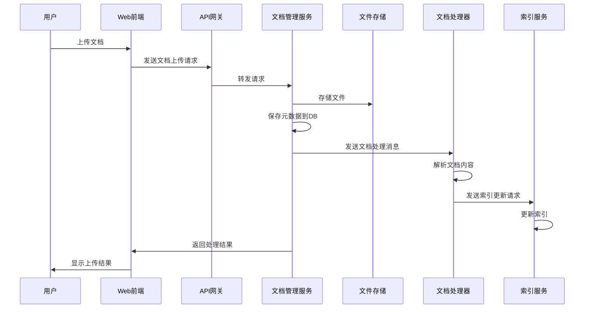
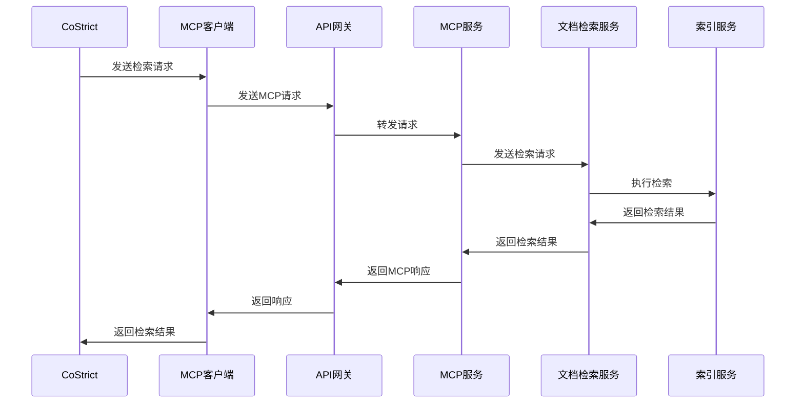
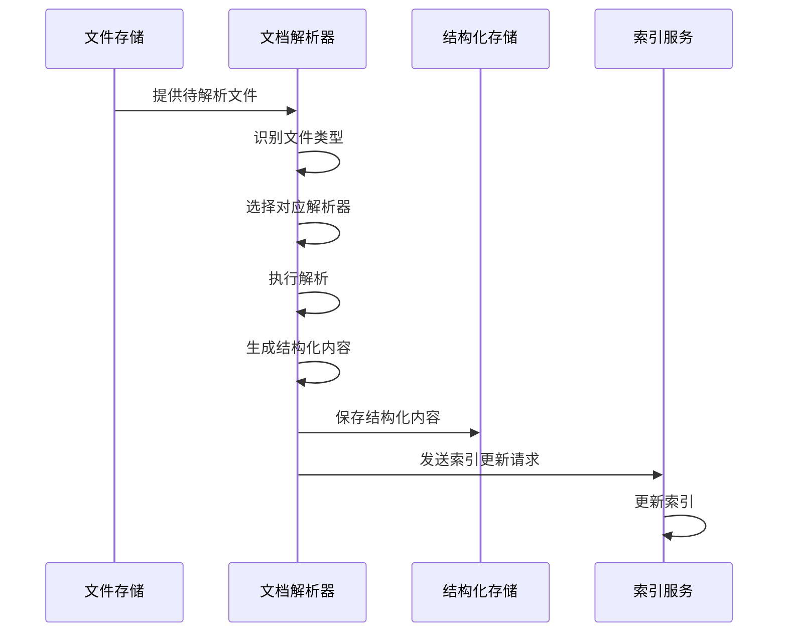
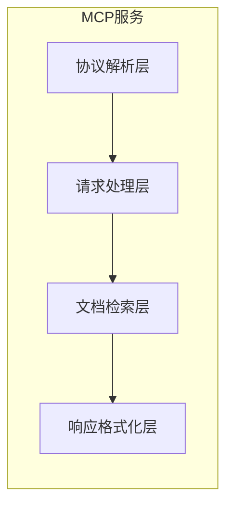
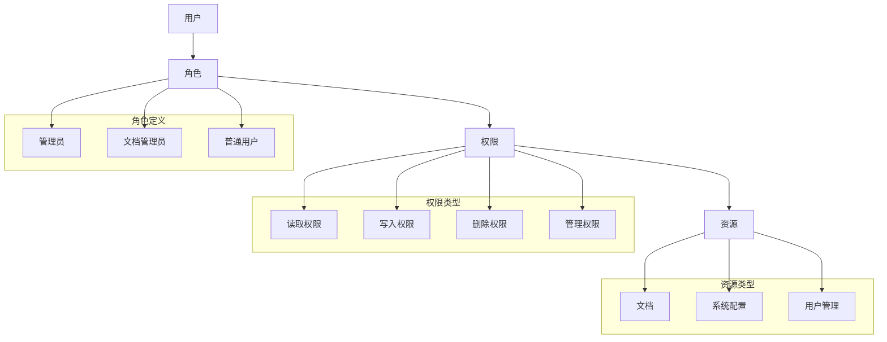

# AI技术文档库设计文档

## 1. 架构概述

### 1.1 架构目标

* **可扩展性**: 系统采用微服务架构，支持水平扩展，可根据文档量和访问量动态调整资源
* **高可用性**: 系统设计为无状态服务，支持多实例部署，避免单点故障
* **可维护性**: 模块化设计，各组件职责明确，便于维护和升级
* **高性能**: 文档检索1秒内返回结果，文档更新1分钟内完成

### 1.2 架构原则

* **单一职责原则**: 每个服务只负责特定的功能领域
* **开闭原则**: 对扩展开放，对修改关闭
* **里氏替换原则**: 子类可以替换父类
* **接口隔离原则**: 使用最小接口，避免接口污染
* **依赖倒置原则**: 依赖抽象而不是具体实现

## 2. 系统架构

### 2.1 整体架构图



### 2.2 架构分层

#### 2.2.1 表示层

* **Web管理界面**: 基于Vue技术栈，提供文档上传、管理、系统监控等功能
* **MCP客户端**: CoStrict插件中的客户端组件，负责与MCP服务通信

#### 2.2.2 业务层

* **微服务架构**: 将系统功能拆分为多个独立的服务
* **服务拆分原则**: 按业务领域和功能边界进行拆分

#### 2.2.3 数据层

* **文档存储**: 使用文件系统存储原始文档，支持多种格式
* **索引存储**: 使用Elasticsearch存储文档索引，支持高效检索
* **元数据存储**: 使用PostgreSQL存储文档元数据和系统配置

## 3. 服务设计

### 3.1 服务拆分

| 服务名称 | 职责 | 技术栈 | 数据库 |
|----------|------|--------|--------|
| 文档管理服务 | 负责文档上传、解析、版本管理 | Go | PostgreSQL, 文件系统 |
| 文档检索服务 | 负责文档索引构建和检索 | Go | Elasticsearch |
| MCP服务 | 实现MCP协议，与CoStrict插件通信 | Go | - |
| 用户管理服务 | 负责用户认证和权限管理 | Go | PostgreSQL |

### 3.2 服务间通信

#### 3.2.1 同步通信

* **协议**: REST/gRPC
* **负载均衡**: 使用Nginx或Kubernetes Service进行负载均衡

#### 3.2.2 异步通信

* **消息队列**: 使用RabbitMQ或Kafka处理文档处理等耗时任务
* **事件驱动架构**: 服务间通过事件进行解耦

### 3.3 API设计

#### 3.3.1 文档上传API

* **URL**: `/api/v1/documents`

* **Method**: POST
* **描述**: 上传文档到系统
* **请求参数**:

  ```json
  {
    "name": "string, 文档名称",
    "type": "string, 文档类型",
    "version": "string, 文档版本",
    "tags": "array, 文档标签",
    "file": "file, 文件内容"
  }
  ```

* **响应格式**:

  ```json
  {
    "code": 200,
    "data": {
      "id": "string, 文档ID",
      "name": "string, 文档名称",
      "status": "string, 处理状态"
    },
    "message": "成功"
  }
  ```

#### 3.3.2 文档检索API

* **URL**: `/api/v1/search`

* **Method**: GET
* **描述**: 检索文档
* **请求参数**:

  ```json
  {
    "query": "string, 搜索关键词",
    "filters": {
      "type": "string, 文档类型",
      "version": "string, 文档版本",
      "tags": "array, 文档标签"
    },
    "page": "number, 页码",
    "size": "number, 每页大小"
  }
  ```

* **响应格式**:

  ```json
  {
    "code": 200,
    "data": {
      "total": "number, 总数",
      "items": [
        {
          "id": "string, 文档ID",
          "name": "string, 文档名称",
          "snippet": "string, 内容片段",
          "score": "number, 相关度得分"
        }
      ]
    },
    "message": "成功"
  }
  ```

#### 3.3.3 MCP服务API

* **URL**: `/mcp`

* **Method**: POST
* **描述**: 处理MCP协议请求
* **请求参数**: 遵循MCP协议规范
* **响应格式**: 遵循MCP协议规范

## 4. 数据架构

### 4.1 数据存储策略

* **文件系统**: 存储原始文档文件，支持多种格式
* **Elasticsearch**: 存储文档索引和内容，支持全文检索
* **PostgreSQL**: 存储文档元数据、用户信息、系统配置等结构化数据

### 4.2 数据一致性

* **强一致性场景**: 用户认证、权限控制等需要强一致性的场景
* **最终一致性场景**: 文档索引更新、文档处理等可以接受最终一致性的场景

### 4.3 数据模型

#### 4.3.1 文档元数据模型

```json
{
  "id": "string, 唯一标识",
  "name": "string, 文档名称",
  "type": "string, 文档类型",
  "version": "string, 文档版本",
  "tags": "array, 文档标签",
  "file_path": "string, 文件路径",
  "file_size": "number, 文件大小",
  "status": "string, 处理状态",
  "created_at": "datetime, 创建时间",
  "updated_at": "datetime, 更新时间"
}
```

#### 4.3.2 用户模型

```json
{
  "id": "string, 唯一标识",
  "username": "string, 用户名",
  "email": "string, 邮箱",
  "role": "string, 用户角色",
  "created_at": "datetime, 创建时间",
  "updated_at": "datetime, 更新时间"
}
```

## 5. 文档处理流程

### 5.1 文档上传流程



### 5.2 文档检索流程



## 6. 系统扩展性设计

### 6.1 服务扩展性

* **水平扩展**: 通过增加服务实例数量来提升系统处理能力
* **服务拆分**: 按业务领域和功能边界进行服务拆分，支持独立扩展

### 6.2 存储扩展性

* **存储策略**: 支持多种存储策略，可根据需求选择本地存储或分布式存储
* **数据分片**: 支持数据分片存储，提高数据处理能力

## 7. 关键功能设计

### 7.1 AI友好格式设计

#### 7.1.1 文档结构化处理

系统将上传的文档转换为AI友好的结构化格式，包括：

* **内容分段**: 将文档内容按逻辑划分为段落，每个段落包含明确的主题和内容
* **代码示例提取**: 从文档中提取代码示例，并标注语言、用途等信息
* **语义标注**: 为文档内容添加语义标注，如概念、定义、步骤、示例等
* **关联关系**: 建立文档内容间的关联关系，形成知识图谱

#### 7.1.2 LLM优化格式

* **上下文优化**: 针对LLM的上下文限制，对文档内容进行优化，确保在有限上下文中提供最有价值的信息
* **信息密度平衡**: 平衡信息密度和可理解性，避免信息过载
* **多粒度表示**: 提供不同粒度的文档表示，从概览到详细内容，支持按需获取

### 7.2 文档解析器设计

#### 7.2.1 多格式支持

系统支持解析多种文档格式：

* **Markdown**: 直接解析为结构化内容
* **PDF**: 使用PDF解析库提取文本内容和结构
* **DOCX**: 使用Office文档解析库提取内容和格式
* **Swagger/OpenAPI**: 解析API文档，提取接口定义和示例
* **Java Doc**: 解析Java文档注释，提取API说明

#### 7.2.2 解析流程



### 7.3 MCP协议实现

#### 7.3.1 MCP服务架构



#### 7.3.2 MCP配置接口

系统提供与Context7兼容的MCP配置接口：

```json
{
  "mcpServers": {
    "ai-doc-library": {
      "type": "streamable-http",
      "url": "http://ai-doc-library:8080/mcp",
      "headers": {
        "API_KEY": "YOUR_API_KEY"
      }
    }
  }
}
```

#### 7.3.3 MCP请求处理流程

1. 接收MCP协议请求
2. 解析请求参数，包括查询内容、过滤条件等
3. 调用文档检索服务获取相关文档
4. 对检索结果进行格式化和优化
5. 按MCP协议格式返回响应

### 7.4 文档版本管理

#### 7.4.1 版本控制策略

* **语义化版本**: 采用语义化版本号（主版本.次版本.修订版本）
* **版本关联**: 同一文档的不同版本间建立关联关系
* **默认版本**: 支持设置默认版本，未指定版本时使用默认版本

#### 7.4.2 版本存储结构

```
文档存储/
├── 文档ID/
│   ├── v1.0.0/
│   │   ├── 原始文件
│   │   └── 解析结果
│   ├── v1.1.0/
│   │   ├── 原始文件
│   │   └── 解析结果
│   └── current -> v1.1.0 (符号链接)
```

#### 7.4.3 版本检索机制

* **精确版本匹配**: 检索指定版本的文档
* **最新版本检索**: 检索文档的最新版本
* **版本范围检索**: 检索指定版本范围内的文档

### 7.5 用户管理设计

#### 7.5.1 用户认证机制

* **JWT认证**: 使用JWT进行用户身份认证
* **API密钥认证**: 支持API密钥认证，用于MCP服务调用
* **多因素认证**: 支持多因素认证，提高安全性

#### 7.5.2 权限控制模型



#### 7.5.3 用户数据模型

```json
{
  "id": "string, 用户唯一标识",
  "username": "string, 用户名",
  "email": "string, 电子邮箱",
  "password_hash": "string, 密码哈希",
  "role": "string, 用户角色",
  "api_keys": [
    {
      "key": "string, API密钥",
      "name": "string, 密钥名称",
      "created_at": "datetime, 创建时间",
      "expires_at": "datetime, 过期时间",
      "last_used": "datetime, 最后使用时间"
    }
  ],
  "created_at": "datetime, 创建时间",
  "updated_at": "datetime, 更新时间"
}
```
