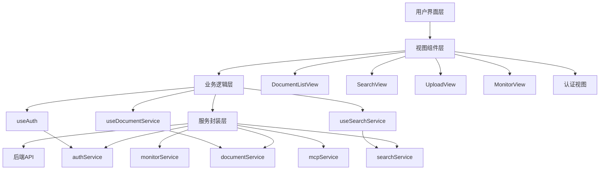
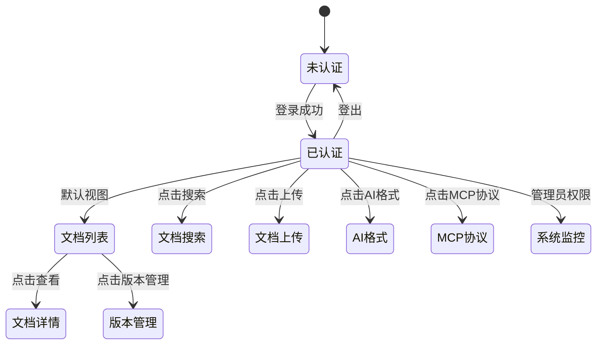
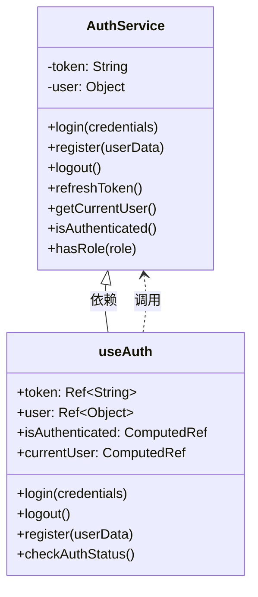
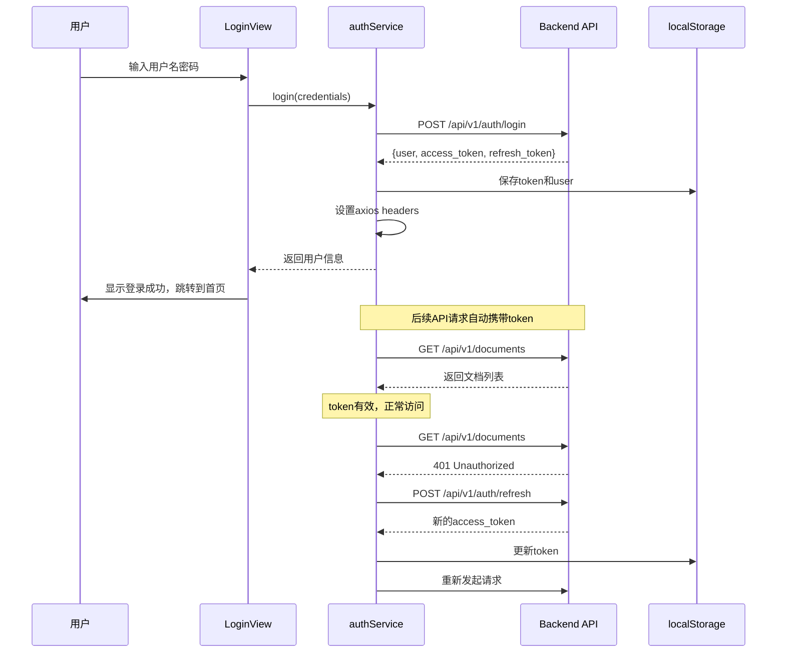
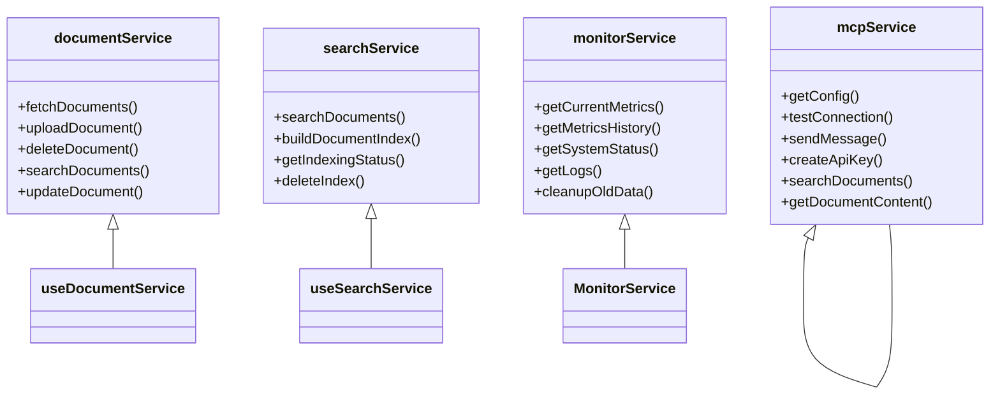
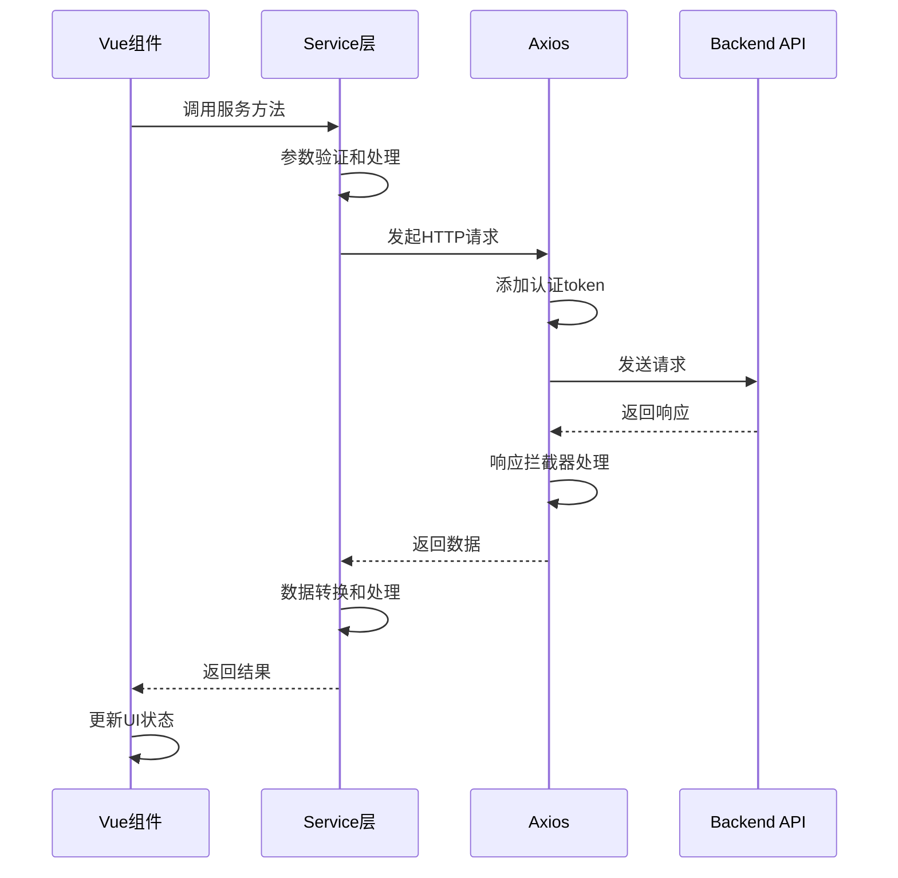
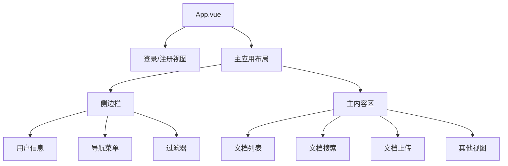

# 10、前端应用架构

<details>
<summary>相关源文件</summary>
web/src/App.vue
web/src/main.js
web/src/utils/authService.js
web/src/composables/useAuth.js
web/src/utils/documentService.js
web/src/utils/searchService.js
web/src/utils/monitorService.js
web/src/utils/mcpService.js
web/src/views/DocumentListView.vue
web/src/views/SearchView.vue
web/src/views/UploadView.vue
web/vite.config.js
web/package.json
</details>

## 概述

本文档深入解析AI技术文档库的Vue.js 3前端应用架构设计。前端应用采用现代化的组件化架构，通过Vue 3 Composition API实现响应式状态管理，集成Bootstrap 5提供美观的用户界面，并通过Axios实现与后端API的高效通信。应用实现了完整的用户认证流程、文档管理、智能搜索、系统监控等功能，为用户提供流畅的文档管理体验。

## 前端架构总览

### 技术栈与架构设计

前端应用基于Vue.js 3框架构建，采用Vite作为构建工具，实现了快速的开发体验和优化的生产构建。架构设计遵循关注点分离原则，将视图层、业务逻辑层和数据访问层清晰分离。

**核心技术栈：**
- **Vue.js 3.3.4**：采用Composition API，提供更灵活的代码组织和复用能力
- **Vite 7.2.6**：基于ESM的构建工具，提供极快的冷启动和热更新
- **Bootstrap 5.3.0**：提供响应式布局和UI组件
- **Axios 1.13.2**：处理HTTP请求，支持拦截器和错误处理
- **Chart.js 4.4.0**：用于监控视图的数据可视化

### 应用架构图



### 核心目录结构

```
web/
├── src/
│  ├── App.vue              # 主应用组件，包含路由和状态管理
│  ├── main.js               # 应用入口，初始化Vue实例
│  ├── assets/               # 静态资源
│  │  └── css/
│  │     └── main.css        # 全局样式
│  ├── composables/          # 组合式函数
│  │  └── useAuth.js         # 认证状态管理
│  ├── utils/                # 工具和服务层
│  │  ├── authService.js      # 认证服务
│  │  ├── documentService.js # 文档服务
│  │  ├── searchService.js   # 搜索服务
│  │  ├── monitorService.js  # 监控服务
│  │  └── mcpService.js      # MCP协议服务
│  └── views/                # 视图组件
│     ├── LoginView.vue      # 登录视图
│     ├── RegisterView.vue   # 注册视图
│     ├── DocumentListView.vue # 文档列表视图
│     ├── DocumentView.vue   # 文档详情视图
│     ├── SearchView.vue     # 搜索视图
│     ├── UploadView.vue     # 上传视图
│     ├── MonitorView.vue    # 监控视图
│     └── MCPView.vue        # MCP协议视图
├── index.html               # HTML入口
├── vite.config.js           # Vite配置
└── package.json             # 依赖管理
```

### 路由与状态管理

应用采用基于状态的路由管理，通过`currentView`响应式变量控制视图切换。认证状态由`useAuth`组合式函数统一管理，确保认证信息在组件间正确传递。



## 核心组件

### DocumentListView（文档列表视图）

**设计理念：** 提供清晰的文档浏览体验，支持搜索、分页和过滤功能，帮助用户快速找到所需文档。

**核心功能实现：**

1. **文档列表展示**：通过`v-for`指令遍历文档数组，展示文档名称、描述、类型、版本、所属库、状态等信息。使用Bootstrap的badge组件显示文档状态和分类。

2. **搜索功能**：提供实时搜索输入框，支持按文档名称搜索。通过`watch`监听搜索框变化，当搜索框为空时自动刷新完整列表。

3. **分页管理**：实现智能分页算法，最多显示5个页码，自动计算起始页和结束页，确保分页导航的可用性和美观性。

4. **状态管理**：接收父组件传递的文档列表、分页信息和搜索查询，通过emits机制向父组件发送用户操作事件，实现父子组件间的松耦合通信。

**实现特点：**
- 使用Composition API的`ref`和`watch`管理本地状态
- 状态徽章样式动态计算，提供直观的视觉反馈
- 空状态处理，当没有文档时显示友好的提示和上传引导
- 防抖搜索优化，避免频繁触发API请求

### SearchView（文档检索视图）

**设计理念：** 提供强大的文档搜索能力，支持关键词搜索、语义搜索和混合搜索三种模式，满足不同场景的需求。

**核心功能实现：**

1. **搜索表单**：提供搜索关键词输入框和搜索类型选择器。搜索类型包括：
   - 关键词搜索：基于全文索引的精确匹配
   - 语义搜索：基于向量相似度的智能搜索
   - 混合搜索：结合关键词和语义搜索的综合结果

2. **高级搜索选项**：支持按文档类型、分类、所属库、内容类型、版本等多个维度过滤，提供灵活的搜索精确度控制。

3. **搜索结果展示**：
   - 显示文档名称、内容摘要
   - 展示文档类型、分类、所属库、版本等元数据
   - 显示相关度评分（0-100%）
   - 支持查看文档详情

4. **分页控制**：提供每页显示数量选项（10/20/50条），支持翻页导航。

**算法与优化：**
- 搜索请求使用`async/await`处理异步操作
- 计算属性自动计算总页数和分页页码数组
- 搜索状态管理，区分"未搜索"、"搜索中"、"有结果"、"无结果"四种状态
- 防抖机制避免重复搜索

### UploadView（文档上传视图）

**设计理念：** 提供直观便捷的文档上传体验，支持拖拽上传和点击上传两种方式。

**核心功能实现：**

1. **表单验证**：
   - 必填字段验证：文档名称、文档类型、文档分类、版本、所属库
   - 可选字段：描述、标签
   - 表单提交前验证文件是否已选择

2. **文件上传支持**：
   - 点击上传：通过隐藏的`<input type="file">`实现
   - 拖拽上传：监听`dragover`、`dragleave`、`drop`事件
   - 文件类型提示：显示支持的格式列表

3. **用户体验优化**：
   - 拖拽视觉反馈：拖拽时改变边框样式和背景色
   - 已选择文件显示：显示文件名确认
   - 上传状态反馈：显示加载动画和禁用状态

**实现细节：**
- 使用Vue 3的`v-model`实现双向数据绑定
- FormData对象封装文件和元数据，支持`multipart/form-data`编码
- 事件委托机制，将文件操作事件传递给父组件处理

### MonitorView（系统监控视图）

**设计理念：** 为管理员提供全面的系统监控能力，实时展示系统状态和性能指标。

**核心功能实现：**

1. **系统状态监控**：
   - 整体状态、CPU状态、内存状态、数据库状态、服务状态
   - 状态徽章根据状态显示不同颜色（绿色健康、黄色警告、红色错误）

2. **当前指标展示**：
   - CPU使用率、核心数、Goroutine数量
   - 内存使用情况（堆分配、系统内存、堆内存）
   - GC统计（GC次数、暂停时间、下次GC阈值）
   - 请求统计（请求数、错误数、平均延迟）
   - 数据库连接（总连接数、最大连接、使用中、空闲）

3. **性能报告可视化**：
   - 使用Chart.js绘制CPU使用率、内存使用、请求数量、平均延迟的趋势图
   - 数据时间范围：最近24小时
   - 自动刷新机制，实时更新图表

4. **系统日志查看**：
   - 支持按日志级别过滤（debug/info/warn/error）
   - 支持按服务过滤（文档/搜索/MCP/用户）
   - 支持按消息内容搜索
   - 分页展示（20/50/100条/页）

**技术实现：**
- 定时轮询机制，每隔一定时间自动刷新指标
- 响应式数据绑定，自动更新UI
- Chart.js集成，实现数据可视化
- 格式化工具函数，将字节数、纳秒数、时间戳转换为易读格式

## 认证集成

### 双层认证架构

应用采用`authService`和`useAuth`双层架构实现认证功能：



### authService（认证服务）

**职责：** 封装所有与认证相关的API调用和状态管理。

**核心实现：**

1. **JWT令牌管理**：
   - 访问令牌（access_token）和刷新令牌（refresh_token）分别存储
   - 使用localStorage持久化令牌和用户信息
   - 自动将访问令牌添加到Axios默认请求头

2. **登录流程**：
   ```javascript
   async login(credentials) {
     const response = await axios.post(`${API_BASE_URL}/auth/login`, credentials);
     const { user, access_token, refresh_token } = response.data;
     
     // 保存令牌和用户信息
     this.token = access_token;
     this.user = user;
     
     localStorage.setItem('token', access_token);
     localStorage.setItem('refreshToken', refresh_token);
     localStorage.setItem('user', JSON.stringify(user));
     
     // 设置axios默认headers
     axios.defaults.headers.common['Authorization'] = `Bearer ${access_token}`;
   }
   ```

3. **令牌刷新机制**：
   - 当访问令牌过期时，使用刷新令牌获取新的访问令牌
   - 刷新失败时清除所有认证信息并跳转到登录页
   - 自动更新Axios请求头

4. **密码管理**：
   - 请求密码重置：发送重置邮件
   - 重置密码：使用令牌重置密码
   - 修改密码：登录用户修改密码

**设计亮点：**
- 单例模式，确保全局只有一个认证服务实例
- localStorage同步，支持跨标签页的认证状态共享
- 完善的错误处理，提供友好的错误提示

### useAuth（认证状态管理）

**职责：** 为Vue组件提供响应式认证状态和操作方法。

**核心实现：**

1. **响应式状态**：
   - 使用`ref`管理token和user的响应式数据
   - 使用`computed`计算`isAuthenticated`和`currentUser`
   - 监听localStorage变化，支持跨标签页状态同步

2. **认证状态检查**：
   ```javascript
   const checkAuthStatus = async () => {
     const localToken = localStorage.getItem('token');
     if (!localToken) return false;
     
     token.value = localToken;
     
     try {
       const currentUser = await authService.getCurrentUser();
       user.value = currentUser;
       return true;
     } catch (error) {
       logout();
       return false;
     }
   }
   ```

3. **统一认证操作**：
   - 封装authService的所有方法为Vue组合式函数
   - 更新本地响应式状态，触发UI更新
   - 提供角色检查方法（hasRole、isAdmin）

**权限控制集成：**
```vue
<!-- 仅管理员可见 -->
<li class="nav-item mb-2" v-if="currentUser.role === 'admin'">
  <a class="nav-link" href="#" @click="currentView = 'monitor'">
    <i class="bi bi-activity me-2"></i>系统监控
  </a>
</li>

<!-- 使用hasRole方法 -->
<button v-if="hasRole('admin')" @click="showAdminPanel">
  管理面板
</button>
```

### 认证流程图



## API服务封装

### 服务层架构设计

应用采用清晰的服务层架构，将不同业务领域的API调用封装为独立的服务模块，遵循单一职责原则。



### documentService（文档服务）

**设计目的：** 封装所有文档相关的API调用，提供统一的文档管理接口。

**核心功能：**

1. **文档列表获取**：
   ```javascript
   const fetchDocuments = async () => {
     const params = {
       page: pagination.page,
       size: pagination.size,
       library: filters.library,
       type: filters.type,
       version: filters.version,
       status: filters.status
     };
     
     const response = await axios.get(`${apiBase}/documents`, { params });
     documents.value = response.data.data.items;
     pagination.total = response.data.data.total;
   }
   ```
   - 支持分页查询
   - 支持多条件过滤
   - 自动更新分页总数

2. **文档上传**：
   - 使用FormData封装文件和元数据
   - 支持`multipart/form-data`编码
   - 上传成功后自动跳转到文档列表
   - 提供详细的调试日志

3. **文档删除**：
   - 删除前二次确认
   - 删除成功后自动刷新列表
   - 完善的错误处理

4. **文档版本管理**：
   - 获取文档版本列表
   - 获取最新版本
   - 删除指定版本
   - 更新版本信息

**错误处理策略：**
- 统一的try-catch错误捕获
- 用户友好的错误提示
- 控制台日志记录详细错误信息
- loading状态管理

### searchService（搜索服务）

**设计目的：** 封装文档搜索相关API，支持多种搜索模式。

**核心功能：**

1. **多种搜索方式**：
   - POST方式搜索：支持复杂查询参数
   - GET方式搜索：简单查询场景

2. **索引管理**：
   ```javascript
   const buildDocumentIndex = async (documentId, version) => {
     const response = await axios.post(
       `${apiBase}/search/documents/${documentId}/versions/${version}/index`
     );
     return response.data;
   }
   ```
   - 为指定文档版本构建搜索索引
   - 获取索引构建状态
   - 删除文档索引
   - 删除指定版本的索引

3. **搜索请求格式**：
   ```javascript
   const searchDocuments = async (request) => {
     const response = await axios.post(`${apiBase}/search`, {
       query: request.query,
       search_type: request.searchType,
       filters: {
         type: request.filters.type,
         category: request.filters.category,
         library: request.filters.library,
         version: request.filters.version,
         content_type: request.filters.content_type
       },
       page: request.page,
       page_size: request.pageSize
     });
     return response.data;
   }
   ```

### monitorService（监控服务）

**设计目的：** 提供系统监控和日志查询功能。

**核心功能：**

1. **指标获取**：
   - 获取当前系统指标
   - 获取历史指标数据
   - 获取指标报告（指定时间范围）

2. **系统状态**：
   - 获取整体系统状态
   - 监控各子系统状态（CPU、内存、数据库、服务）

3. **日志管理**：
   - 获取系统日志列表
   - 获取日志统计数据
   - 支持多维度过滤

4. **数据清理**：
   ```javascript
   const cleanupOldData = async (retentionDays = 30) => {
     const response = await axios.post(`${API_BASE_URL}/cleanup`, null, {
       params: { retention_days: retentionDays }
     });
     return response.data;
   }
   ```

### mcpService（MCP协议服务）

**设计目的：** 实现MCP（Model Context Protocol）协议，支持与AI助手集成。

**核心功能：**

1. **Axios实例配置**：
   ```javascript
   const api = axios.create({
     baseURL: '/api/v1',
     timeout: 30000,
   });
   
   // 请求拦截器
   api.interceptors.request.use((config) => config);
   
   // 响应拦截器
   api.interceptors.response.use(
     (response) => response.data,
     (error) => Promise.reject(new Error(error.response?.data?.error || error.message))
   );
   ```

2. **API密钥管理**：
   - 创建API密钥
   - 获取API密钥列表
   - 删除API密钥

3. **MCP协议实现**：
   - 初始化MCP连接
   - 发送MCP消息（JSON-RPC 2.0格式）
   - 测试MCP连接

4. **MCP工具调用**：
   ```javascript
   const searchDocuments = async (query, options = {}) => {
     const apiKey = localStorage.getItem('mcp_api_key') || 'demo-key';
     
     const message = {
       jsonrpc: '2.0',
       id: Date.now().toString(),
       method: 'tools/call',
       params: {
         name: 'search_documents',
         arguments: { query, types, version, limit }
       }
     };
     
     const response = await this.sendMessage(message, apiKey);
     return response.result;
   }
   ```

**MCP协议特点：**
- 采用JSON-RPC 2.0协议
- 支持工具列表查询
- 支持文档搜索和内容获取
- 与CoStrict等AI助手无缝集成

### API调用流程



## 布局与导航

### 整体布局设计

应用采用经典的侧边栏+主内容区布局，使用Bootstrap的栅格系统实现响应式设计。



### App.vue主组件架构

**核心状态管理：**

```javascript
// 视图切换状态
const currentView = ref('login')

// 认证状态
const isAuthenticated = useAuth().isAuthenticated
const currentUser = useAuth().currentUser

// 文档数据
const documents = ref([])
const pagination = ref({ page: 1, size: 10, total: 0 })

// 过滤器
const filters = ref({
  library: '',
  type: '',
  category: '',
  version: '',
  status: ''
})

// 上传表单
const uploadForm = ref({
  name: '',
  type: '',
  category: '',
  version: '',
  library: '',
  description: '',
  tags: '',
  file: null
})
```

### 侧边栏设计

**功能分区：**

1. **顶部用户信息区**：
   - 应用标题："AI技术文档库"
   - 用户下拉菜单：显示当前用户名
   - 用户操作：个人资料、API密钥、用户管理（管理员）、系统监控（管理员）、退出登录

2. **导航菜单区**：
   ```vue
   <ul class="nav flex-column">
     <li class="nav-item mb-2">
       <a class="nav-link" :class="{ active: currentView === 'list' }" @click="currentView = 'list'">
         <i class="bi bi-file-earmark-text me-2"></i>文档列表
       </a>
     </li>
     <li class="nav-item mb-2">
       <a class="nav-link" :class="{ active: currentView === 'search' }" @click="currentView = 'search'">
         <i class="bi bi-search me-2"></i>文档检索
       </a>
     </li>
     <!-- 更多导航项... -->
   </ul>
   ```
   - 使用Bootstrap Icons提供视觉图标
   - 动态`active`类控制选中状态
   - 权限控制：管理员工具根据角色显示

3. **过滤器区**（文档列表视图）：
   - 所属库过滤
   - 文档类型过滤
   - 文档分类过滤
   - 版本过滤
   - 状态过滤
   - 应用过滤按钮

**响应式设计：**
- 左侧占3列（col-md-3），右侧占9列（col-md-9）
- 移动端自动堆叠
- 最小高度100vh确保侧边栏充满屏幕

### 视图切换机制

应用采用基于状态的视图切换，而非传统路由：

```javascript
// 登录成功处理
const handleLoginSuccess = (user) => {
  currentView.value = 'list'
  // 加载文档数据
  fetchDocuments()
}

// 导航切换
const changeView = (viewName) => {
  currentView.value = viewName
}

// 条件渲染
<LoginView v-if="currentView === 'login'" @login-success="handleLoginSuccess" />
<DocumentListView v-if="currentView === 'list'" :documents="documents" />
<SearchView v-if="currentView === 'search'" />
```

**视图状态图：**

```mermaid
stateDiagram-v2
    [*] --> login: 应用启动
    login --> register: 点击注册
    login --> forgot-password: 点击忘记密码
    register --> list: 注册成功
    list --> search: 点击搜索
    list --> upload: 点击上传
    list --> ai-format: 点击AI格式
    list --> mcp: 点击MCP协议
    list --> view: 点击查看文档
    list --> versions: 点击版本管理
    search --> list: 返回
    upload --> list: 上传成功
    view --> list: 返回
    view --> edit: 点击编辑
    edit --> list: 保存成功
    versions --> list: 返回
```

### 权限控制菜单

根据用户角色动态显示菜单项：

```vue
<!-- 用户菜单 -->
<ul class="dropdown-menu">
  <li><a class="dropdown-item" @click="currentView = 'profile'">
    <i class="bi bi-person me-2"></i>个人资料
  </a></li>
  <li><a class="dropdown-item" @click="currentView = 'api-keys'">
    <i class="bi bi-key me-2"></i>API密钥
  </a></li>
  
  <!-- 仅管理员可见 -->
  <li v-if="currentUser.role === 'admin'">
    <a class="dropdown-item" @click="currentView = 'user-management'">
      <i class="bi bi-people me-2"></i>用户管理
    </a>
  </li>
  <li v-if="currentUser.role === 'admin'">
    <a class="dropdown-item" @click="currentView = 'monitor'">
      <i class="bi bi-activity me-2"></i>系统监控
    </a>
  </li>
  
  <li><hr class="dropdown-divider"></li>
  <li><a class="dropdown-item" @click="logout">
    <i class="bi bi-box-arrow-right me-2"></i>退出登录
  </a></li>
</ul>
```

### 样式设计

**全局样式（main.css）：**

1. **侧边栏样式**：
   ```css
   .sidebar {
     min-height: 100vh;
     background-color: #f8f9fa;
   }
   ```

2. **导航链接样式**：
   ```css
   .nav-link.active {
     background-color: #0d6efd;
     color: white;
     border-radius: 4px;
   }
   ```

3. **文档卡片样式**：
   ```css
   .document-item {
     border: 1px solid #dee2e6;
     border-radius: 4px;
     padding: 15px;
     margin-bottom: 15px;
     transition: all 0.3s ease;
   }
   
   .document-item:hover {
     box-shadow: 0 4px 8px rgba(0,0,0,0.1);
   }
   ```

4. **上传区域样式**：
   ```css
   .upload-area {
     border: 2px dashed #6c757d;
     border-radius: 4px;
     padding: 30px;
     text-align: center;
     cursor: pointer;
   }
   
   .upload-area:hover {
     border-color: #0d6efd;
     background-color: #f8f9fa;
   }
   
   .upload-area.drag-over {
     border-color: #0d6efd;
     background-color: #e9ecef;
   }
   ```

### UX优化

1. **加载状态**：全局loading指示器
2. **错误提示**：友好的错误消息展示
3. **成功反馈**：操作成功的确认提示
4. **空状态处理**：没有数据时的友好提示
5. **过渡动画**：视图切换和平滑过渡

## 技术深度剖析

### Composition API的优势

Vue 3的Composition API提供了更好的代码组织和复用能力：

1. **逻辑复用**：
   - 将认证逻辑封装为`useAuth`
   - 将文档逻辑封装为`useDocumentService`
   - 跨组件共享逻辑变得简单

2. **类型推断**：更好的TypeScript支持
3. **代码组织**：按功能而非选项组织代码
4. **性能优化**：更细粒度的响应式控制

### 状态管理策略

应用采用多种状态管理方式：

1. **组件内状态**：使用`ref`和`reactive`管理本地状态
2. **共享状态**：通过prop和emit在父子组件间传递
3. **全局状态**：使用localStorage持久化认证状态
4. **服务层状态**：在服务方法中管理API调用状态

### 性能优化

1. **懒加载**：视图按需加载，减少初始加载时间
2. **防抖搜索**：避免频繁触发搜索请求
3. **分页加载**：文档列表分页显示，减少数据量
4. **缓存策略**：使用localStorage缓存认证信息

### 错误处理

1. **统一错误处理**：在服务层统一捕获和处理错误
2. **用户友好提示**：将技术错误转换为用户友好的消息
3. **日志记录**：在控制台记录详细错误信息
4. **恢复机制**：token刷新、自动重试等

## 部署和运维

### 构建配置

**Vite配置（vite.config.js）：**

```javascript
export default defineConfig({
  plugins: [vue()],
  base: '/',
  root: './',
  server: {
    port: 3000,
    proxy: {
      '/api': {
        target: 'http://localhost:8080',
        changeOrigin: true,
        secure: false
      }
    }
  },
  resolve: {
    alias: {
      '@': resolve('./src')
    }
  },
  build: {
    outDir: 'dist',
    emptyOutDir: true
  }
})
```

**开发代理**：
- 前端运行在3000端口
- API代理到808端口（后端服务）
- 避免跨域问题

### 构建流程

```bash
# 安装依赖
npm install

# 开发模式
npm run dev

# 生产构建
npm run build

# 预览构建结果
npm run preview
```

### 环境变量

当前配置未使用环境变量文件，建议在生产环境中添加：

```
VITE_API_BASE_URL=/api/v1
VITE_APP_TITLE=AI技术文档库
```

### 部署建议

1. **静态资源部署**：将`dist`目录部署到Nginx或CDN
2. **API代理配置**：在生产环境中配置反向代理
3. **启用HTTPS**：确保生产环境使用HTTPS
4. **缓存策略**：合理配置静态资源缓存
5. **CDN加速**：将静态资源上传到CDN提升访问速度

## 总结

AI技术文档库的前端应用采用现代化的Vue.js 3架构，通过组件化设计、服务层封装和响应式状态管理，实现了一个功能完善、用户体验优秀的文档管理平台。应用的核心优势包括：

1. **清晰的架构分层**：视图层、业务逻辑层、服务层职责明确
2. **完善的认证机制**：JWT令牌管理、自动刷新、权限控制
3. **强大的搜索能力**：支持关键词、语义、混合三种搜索模式
4. **友好的用户界面**：Bootstrap 5提供美观的UI和良好的响应式体验
5. **高效的API调用**：统一的服务层封装，完善的错误处理
6. **灵活的权限控制**：基于角色的菜单和功能访问控制

前端应用为用户提供了完整的文档管理、搜索、监控等功能，是整个AI技术文档库系统的重要组成部分。