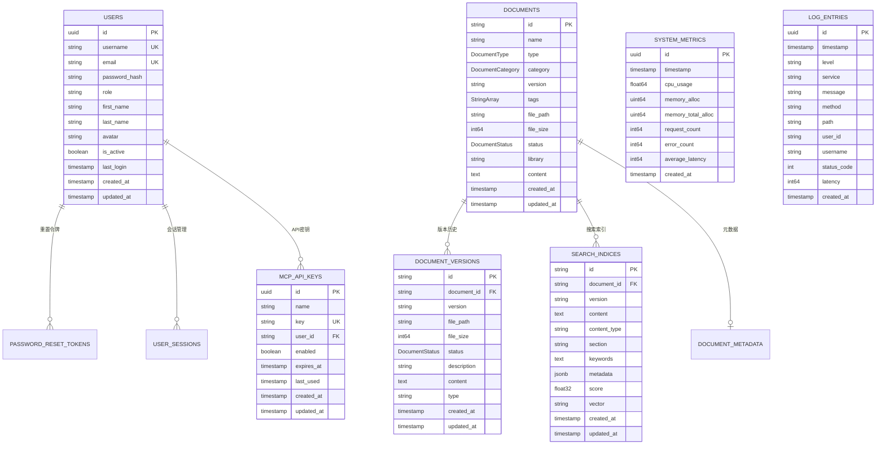
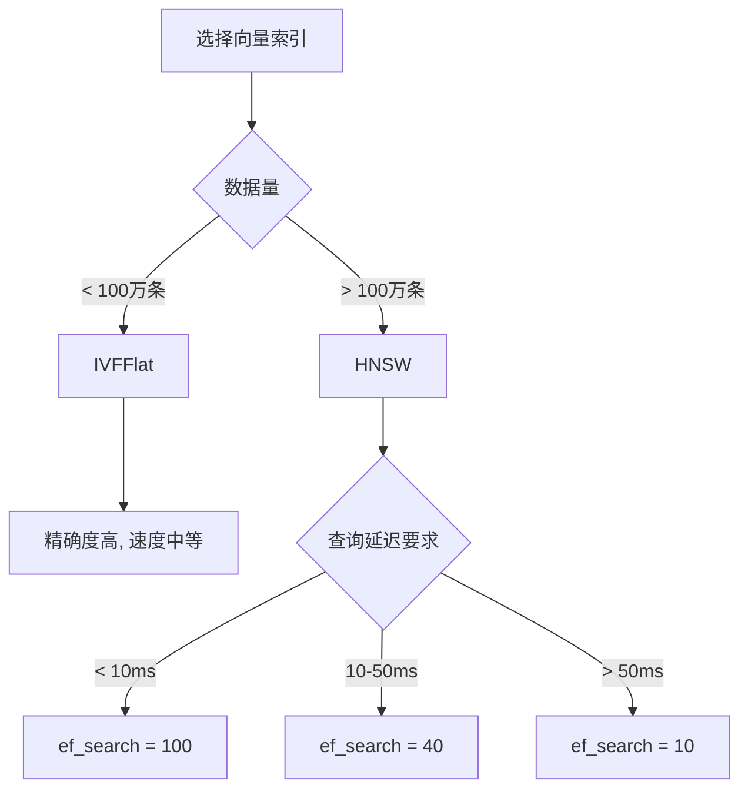
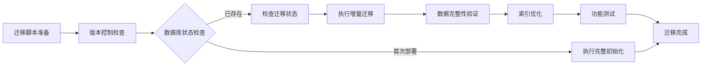
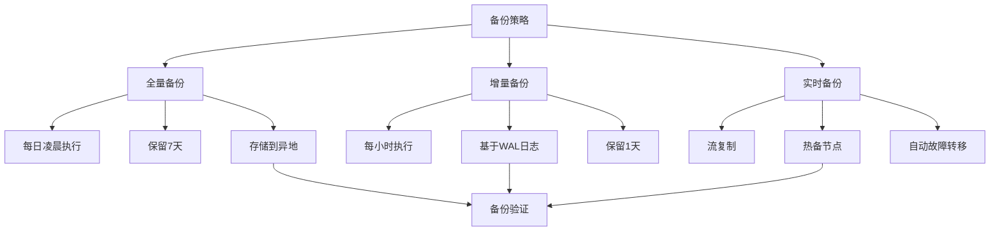
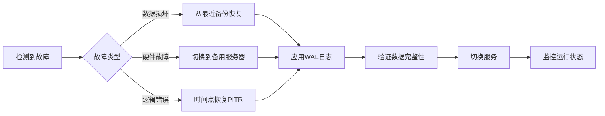

# 数据库设计详解

<details>
<summary>相关源文件</summary>
internal/model/user.go
internal/model/document.go
internal/model/search_index.go
internal/model/mcp.go
internal/model/monitor.go
scripts/init.sql
scripts/setup_pgvector.sql
scripts/migration_add_user_tables.sql
scripts/migration_add_search_indices.sql
scripts/migration_add_mcp_tables.sql
internal/service/postgres_backup.go
</details>

## 概述

AI技术文档库采用PostgreSQL作为核心数据存储系统，充分利用其强大的JSON支持、全文搜索能力和可扩展性。数据库设计遵循关系型数据库范式，同时结合现代NoSQL特性，通过JSONB类型存储灵活的元数据，为文档管理、向量搜索、用户管理和系统监控提供高效、可靠的数据支撑。核心设计理念包括：数据完整性约束、智能索引策略、向量搜索集成、自动化时间戳管理以及全面的备份恢复机制。

## 数据库表结构

### 核心表设计

系统包含12个核心数据表，构建了一个完整的数据管理体系：



### 用户管理表

#### users表
[`users`](internal/model/user.go:8)表是用户管理的核心，采用UUID作为主键确保全局唯一性：

| 字段 | 类型 | 约束 | 说明 |
|------|------|------|------|
| id | UUID | PRIMARY KEY | 使用`gen_random_uuid()`生成 |
| username | VARCHAR(255) | NOT NULL, UNIQUE | 用户名，建立唯一索引 |
| email | VARCHAR(255) | NOT NULL, UNIQUE | 电子邮箱，建立唯一索引 |
| password_hash | VARCHAR(255) | NOT NULL | bcrypt加密后的密码哈希 |
| role | VARCHAR(50) | NOT NULL, DEFAULT 'user' | 用户角色：admin/editor/user |
| is_active | BOOLEAN | DEFAULT TRUE | 账户激活状态 |
| last_login | TIMESTAMP | NULL | 最后登录时间 |

**设计理由**：
- 使用UUID而非自增ID，避免ID泄露和分布式场景下的ID冲突
- 用户名和邮箱建立唯一索引，确保身份唯一性
- 密码哈希字段使用`json:"-"`标签，防止在API响应中意外泄露
- 角色字段采用枚举设计，便于权限控制

#### password_reset_tokens表
用于存储密码重置令牌，实施严格的安全策略：

| 字段 | 类型 | 约束 | 说明 |
|------|------|------|------|
| id | UUID | PRIMARY KEY | 令牌唯一标识 |
| user_id | UUID | FOREIGN KEY | 关联用户，级联删除 |
| token | VARCHAR(255) | UNIQUE | 重置令牌 |
| expires_at | TIMESTAMP | NOT NULL | 令牌过期时间 |

**安全特性**：
- 外键约束确保令牌与用户关联
- 唯一索引防止令牌重复使用
- 过期时间机制实现令牌自动失效
- 级联删除策略，用户删除时自动清理相关令牌

#### user_sessions表
管理用户会话，支持JWT令牌生命周期管理：

| 字段 | 类型 | 约束 | 说明 |
|------|------|------|------|
| id | UUID | PRIMARY KEY | 会话唯一标识 |
| user_id | UUID | FOREIGN KEY | 关联用户 |
| token_id | VARCHAR(255) | NOT NULL | JWT令牌ID |
| ip_address | VARCHAR(45) | NULL | 客户端IP地址 |
| user_agent | TEXT | NULL | 用户代理信息 |

**会话管理策略**：
- 记录IP地址和用户代理，支持安全审计
- 过期时间机制实现会话自动失效
- 级联删除策略，用户注销时清理会话

### 文档管理表

#### documents表
文档管理的核心表，支持多种文档类型和分类：

| 字段 | 类型 | 约束 | 说明 |
|------|------|------|------|
| id | VARCHAR(255) | PRIMARY KEY | 文档唯一标识 |
| name | VARCHAR(255) | NOT NULL, INDEX | 文档名称 |
| type | DocumentType | NOT NULL, INDEX | 文档类型枚举 |
| category | DocumentCategory | NOT NULL, INDEX | 文档分类：code/document |
| version | VARCHAR(255) | NOT NULL, INDEX | 版本号 |
| tags | character varying[] | ARRAY | PostgreSQL数组类型存储标签 |
| file_path | VARCHAR(255) | NOT NULL | 文件存储路径 |
| file_size | BIGINT | NOT NULL | 文件大小（字节） |
| status | DocumentStatus | NOT NULL, INDEX | 处理状态 |
| library | VARCHAR(255) | INDEX | 所属库 |
| content | TEXT | NULL | 解析后的内容摘要 |

**文档类型枚举**：
```go
const (
    DocumentTypeMarkdown DocumentType = "markdown"
    DocumentTypePDF      DocumentType = "pdf"
    DocumentTypeDocx     DocumentType = "docx"
    DocumentTypeSwagger  DocumentType = "swagger"
    DocumentTypeOpenAPI  DocumentType = "openapi"
    DocumentTypeJavaDoc  DocumentType = "java_doc"
)
```

**分类系统**：
- CategoryCode：代码类文档
- CategoryDocument：文档类文档

**状态管理**：
- DocumentStatusUploading：上传中
- DocumentStatusProcessing：处理中
- DocumentStatusCompleted：完成
- DocumentStatusFailed：失败

**标签存储创新**：
采用PostgreSQL原生数组类型`character varying[]`，通过自定义的[`StringArray`](internal/model/document.go:12)类型实现Go与PostgreSQL之间的无缝转换，支持高效的标签查询和聚合操作。

#### document_versions表
文档版本控制的核心，实现完整的版本历史追踪：

| 字段 | 类型 | 约束 | 说明 |
|------|------|------|------|
| id | VARCHAR(255) | PRIMARY KEY | 版本唯一标识 |
| document_id | VARCHAR(255) | FOREIGN KEY | 关联文档，级联删除 |
| version | VARCHAR(255) | NOT NULL, INDEX | 版本号 |
| file_path | VARCHAR(255) | NOT NULL | 版本文件路径 |
| file_size | BIGINT | NOT NULL | 版本文件大小 |
| status | DocumentStatus | NOT NULL | 版本状态 |
| content | TEXT | NULL | 版本内容 |
| type | TEXT | NOT NULL, DEFAULT 'markdown' | 文件类型 |

**版本管理特点**：
- 外键约束确保版本与文档关联
- 级联删除策略，文档删除时自动清理版本历史
- 复合索引`(document_id, version)`优化版本查询
- type字段通过迁移脚本添加，支持基于文件扩展名的自动类型识别

#### document_metadata表
使用JSONB类型存储灵活的文档元数据：

| 字段 | 类型 | 约束 | 说明 |
|------|------|------|------|
| id | VARCHAR(255) | PRIMARY KEY | 元数据唯一标识 |
| document_id | VARCHAR(255) | FOREIGN KEY | 关联文档 |
| metadata | JSONB | NULL | 灵活的元数据存储 |

**JSONB优势**：
- 支持高效的JSON查询和索引
- 自动压缩存储，节省空间
- 支持部分更新和查询
- 可扩展性极强，适应不同文档类型的元数据需求

### 搜索索引表

#### search_indices表
向量搜索和全文搜索的核心，融合了传统关键词搜索和现代语义搜索：

| 字段 | 类型 | 约束 | 说明 |
|------|------|------|------|
| id | VARCHAR(255) | PRIMARY KEY | 索引唯一标识 |
| document_id | VARCHAR(255) | FOREIGN KEY | 关联文档 |
| version | VARCHAR(255) | NOT NULL, INDEX | 文档版本 |
| content | TEXT | NOT NULL | 索引内容 |
| content_type | VARCHAR(50) | NOT NULL, INDEX | 内容类型 |
| section | VARCHAR(255) | INDEX | 文档章节 |
| keywords | TEXT | NULL | 关键词 |
| metadata | JSONB | NULL | 额外元数据 |
| score | FLOAT | DEFAULT 0 | 搜索相关度得分 |
| vector | FLOAT[] | NULL | 向量表示（语义搜索） |

**索引策略**：
1. **全文搜索索引**：`to_tsvector('simple', content)`使用GIN索引
2. **关键词搜索索引**：`to_tsvector('simple', keywords)`优化关键词查询
3. **复合索引**：
   - `(document_id, version)`：文档版本查询优化
   - `(document_id, content_type, score)`：过滤和排序优化
   - `(created_at, score)`：时间范围和相关性排序
4. **唯一约束**：`(document_id, version, content_type, section)`防止重复索引

**向量存储策略**：
当前使用FLOAT数组类型存储向量，通过自定义的[`Vector`](internal/model/search_index.go:11)类型实现Go与PostgreSQL之间的转换。未来可迁移至pgvector扩展的原生向量类型，获得更好的搜索性能。

### MCP管理表

#### mcp_api_keys表
MCP协议API密钥管理，支持细粒度的API访问控制：

| 字段 | 类型 | 约束 | 说明 |
|------|------|------|------|
| id | UUID | PRIMARY KEY | 密钥唯一标识 |
| name | VARCHAR(255) | NOT NULL | 密钥名称 |
| key | VARCHAR(255) | UNIQUE | API密钥 |
| user_id | VARCHAR(255) | NOT NULL | 关联用户ID |
| enabled | BOOLEAN | DEFAULT TRUE | 启用状态 |
| expires_at | TIMESTAMP | NULL | 过期时间 |
| last_used | TIMESTAMP | NULL | 最后使用时间 |

**安全特性**：
- 唯一索引确保密钥全局唯一
- 启用/禁用机制实现灵活的访问控制
- 过期时间支持临时密钥
- 最后使用时间追踪支持密钥使用分析

#### mcp_configs表
MCP服务器配置管理：

| 字段 | 类型 | 约束 | 说明 |
|------|------|------|------|
| id | UUID | PRIMARY KEY | 配置唯一标识 |
| name | VARCHAR(255) | NOT NULL | 配置名称 |
| description | TEXT | NULL | 配置描述 |
| endpoint | VARCHAR(255) | NOT NULL | MCP服务端点 |
| api_key | VARCHAR(255) | NOT NULL | 认证密钥 |
| enabled | BOOLEAN | DEFAULT TRUE | 启用状态 |

### 监控管理表

#### system_metrics表
系统性能指标存储，支持历史趋势分析：

| 字段 | 类型 | 约束 | 说明 |
|------|------|------|------|
| id | UUID | PRIMARY KEY | 指标唯一标识 |
| timestamp | TIMESTAMP | NOT NULL, INDEX | 指标时间戳 |
| cpu_usage | FLOAT | NULL | CPU使用率（百分比） |
| memory_alloc | BIGINT | NULL | 已分配内存（字节） |
| memory_total_alloc | BIGINT | NULL | 累计分配内存 |
| gc_num | INT | NULL | GC次数 |
| gc_pause_total | BIGINT | NULL | GC总暂停时间（纳秒） |
| request_count | BIGINT | NULL | 请求总数 |
| error_count | BIGINT | NULL | 错误总数 |
| average_latency | BIGINT | NULL | 平均延迟（毫秒） |
| db_connections | INT | NULL | 数据库连接数 |

**监控维度**：
- CPU和内存使用情况
- 垃圾回收性能
- 请求处理性能
- 数据库连接池状态

#### log_entries表
结构化日志存储，支持高效的日志查询和分析：

| 字段 | 类型 | 约束 | 说明 |
|------|------|------|------|
| id | UUID | PRIMARY KEY | 日志唯一标识 |
| timestamp | TIMESTAMP | NOT NULL, INDEX | 日志时间戳 |
| level | VARCHAR(50) | NOT NULL, INDEX | 日志级别 |
| service | VARCHAR(255) | NOT NULL, INDEX | 服务名称 |
| message | TEXT | NOT NULL | 日志消息 |
| method | VARCHAR(10) | NULL | HTTP方法 |
| path | VARCHAR(255) | NULL | 请求路径 |
| user_id | VARCHAR(255) | INDEX | 用户ID |
| username | VARCHAR(255) | INDEX | 用户名 |
| status_code | INT | NULL | HTTP状态码 |
| latency | BIGINT | NULL | 请求延迟（毫秒） |
| ip_address | VARCHAR(45) | NULL | IP地址 |
| user_agent | TEXT | NULL | 用户代理 |

**日志级别**：
- debug：调试信息
- info：常规信息
- warn：警告信息
- error：错误信息

**索引策略**：
- 复合索引优化日志查询性能
- 时间戳索引支持时间范围查询
- 级别索引快速筛选错误日志
- 用户ID和用户名索引支持用户行为分析

## 数据库向量扩展

### pgvector扩展概述

pgvector是PostgreSQL的向量相似度搜索扩展，为AI文档库提供高效的语义搜索能力。当前系统设计支持两种向量存储方式：

1. **当前实现**：使用FLOAT数组类型`FLOAT[]`存储向量
2. **推荐实现**：使用pgvector原生`vector`数据类型

### 向量数据类型设计

#### Vector自定义类型
系统定义了[`Vector`](internal/model/search_index.go:11)类型，实现Go与PostgreSQL之间的向量转换：

```go
type Vector []float32

func (v Vector) Value() (driver.Value, error) {
    if v == nil {
        return nil, nil
    }
    return json.Marshal(v)
}

func (v *Vector) Scan(value interface{}) error {
    if value == nil {
        *v = nil
        return nil
    }
    bytes, ok := value.([]byte)
    if !ok {
        return errors.New("type assertion to []byte failed")
    }
    return json.Unmarshal(bytes, *v)
}
```

**设计权衡**：
- 使用JSON格式存储，兼容性好但性能较低
- 未来可迁移至pgvector原生类型，提升搜索性能

### 相似度函数

pgvector支持多种距离度量函数：

| 函数 | 说明 | 适用场景 |
|------|------|----------|
| l2_distance | 欧几里得距离 | 通用向量相似度 |
| cosine_distance | 余弦相似度 | 文本语义搜索 |
| ip_distance | 内积距离 | 高维向量搜索 |

**推荐配置**：
```sql
-- 查询示例（使用余弦相似度）
SELECT id, content, 
       1 - (vector <=> '[0.1, 0.2, 0.3]') as similarity
FROM search_indices
WHERE content_type = 'text'
ORDER BY vector <=> '[0.1, 0.2, 0.3]'
LIMIT 10;
```

### 向量索引策略

#### HNSW索引
层次化小世界图索引是最优选择：

```sql
-- 创建HNSW索引
CREATE INDEX idx_search_indices_vector_hnsw 
ON search_indices USING hnsw (vector vector_cosine_ops)
WITH (m = 16, ef_construction = 64);
```

**参数调优**：
- `m`：每个节点的最大连接数（默认16）
- `ef_construction`：构建时的搜索广度（默认64）
- `ef_search`：查询时的搜索广度（独立配置）

**索引选择决策树**：


### 性能优化策略

#### 分区表设计
对于大规模向量数据，建议按文档类别或时间分区：

```sql
-- 按内容类型分区
CREATE TABLE search_indices_text PARTITION OF search_indices
    FOR VALUES IN ('text');

CREATE TABLE search_indices_code PARTITION OF search_indices
    FOR VALUES IN ('code');
```

#### 向量归一化
使用余弦相似度时，预归一化向量提升性能：

```sql
-- 创建归一化向量列
ALTER TABLE search_indices 
ADD COLUMN vector_norm float[];

-- 触发器自动归一化
CREATE OR REPLACE FUNCTION normalize_vector()
RETURNS TRIGGER AS $$
BEGIN
    NEW.vector_norm := NEW.vector / sqrt(array_length(NEW.vector, 1));
    RETURN NEW;
END;
$$ LANGUAGE plpgsql;
```

#### 批量查询优化
使用批量相似度查询减少数据库往返：

```sql
-- 批量相似度查询
SELECT si.document_id, si.content, 1 - (si.vector <=> q.query_vector) as similarity
FROM search_indices si, 
     (VALUES 
         ('query1', $1::float[]),
         ('query2', $2::float[])
     ) AS q(query_id, query_vector)
ORDER BY similarity DESC;
```

## 数据库迁移

### 迁移策略

系统采用渐进式迁移策略，确保数据库版本管理和向后兼容性：



### 迁移脚本分析

#### 初始化脚本
[`init.sql`](scripts/init.sql:1)负责数据库基础配置：

```sql
-- 创建UUID生成扩展
CREATE EXTENSION IF NOT EXISTS "uuid-ossp";
```

**设计要点**：
- 使用`IF NOT EXISTS`避免重复执行
- 仅创建扩展，表结构由GORM自动管理
- 预留测试数据插入位置，便于开发调试

#### 用户表迁移
[`migration_add_user_tables.sql`](scripts/migration_add_user_tables.sql:1)实现用户管理功能：

**表创建**：
- 创建用户表、密码重置令牌表、用户会话表
- 建立完整的索引体系，包括用户名、邮箱、角色等关键字段
- 实现级联删除策略，保证数据一致性

**触发器自动化**：
```sql
CREATE OR REPLACE FUNCTION update_user_tables_updated_at()
RETURNS TRIGGER AS $$
BEGIN
    NEW.updated_at = CURRENT_TIMESTAMP;
    RETURN NEW;
END;
$$ language 'plpgsql';

CREATE TRIGGER update_users_updated_at
    BEFORE UPDATE ON users
    FOR EACH ROW
    EXECUTE FUNCTION update_user_tables_updated_at();
```

**默认数据插入**：
- 自动创建管理员账户（用户名：admin，密码：admin123）
- 使用`ON CONFLICT`避免重复插入
- 生产环境应立即更改默认密码

#### 搜索索引迁移
[`migration_add_search_indices.sql`](scripts/migration_add_search_indices.sql:1)构建向量化搜索能力：

**全文搜索索引**：
```sql
-- 使用GIN索引加速全文搜索
CREATE INDEX IF NOT EXISTS idx_search_indices_content_fts 
ON search_indices USING gin(to_tsvector('simple', content));
```

**复合索引设计**：
- `(document_id, version)`：文档版本查询优化
- `(document_id, content_type, score)`：多条件过滤优化
- `(created_at, score)`：时间范围和相关性排序
- 唯一约束防止重复索引：`(document_id, version, content_type, section)`

**外键约束**：
```sql
ALTER TABLE search_indices
ADD CONSTRAINT fk_search_indices_document_id
FOREIGN KEY (document_id) REFERENCES documents(id) ON DELETE CASCADE;
```

**自动更新触发器**：
```sql
CREATE OR REPLACE FUNCTION update_updated_at_column()
RETURNS TRIGGER AS $$
BEGIN
    NEW.updated_at = CURRENT_TIMESTAMP;
    RETURN NEW;
END;
$$ language 'plpgsql';
```

#### MCP表迁移
[`migration_add_mcp_tables.sql`](scripts/migration_add_mcp_tables.sql:1)实现MCP协议支持：

**API密钥管理**：
- 支持密钥启用/禁用
- 记录最后使用时间
- 过期时间机制

**默认服务配置**：
```sql
INSERT INTO mcp_configs (name, description, endpoint, api_key, enabled)
VALUES (
    'AI技术文档库MCP服务',
    'AI技术文档库的MCP协议支持服务',
    'http://localhost:8080/mcp',
    'ai-doc-library-default-key',
    TRUE
) ON CONFLICT DO NOTHING;
```

#### 增量迁移脚本

**文档分类迁移**：
[`migration_add_document_category.sql`](scripts/migration_add_document_category.sql:1)添加分类字段：

```sql
-- 安全添加字段
DO $$
BEGIN
    IF NOT EXISTS (
        SELECT 1 FROM information_schema.columns 
        WHERE table_name = 'documents' AND column_name = 'category'
    ) THEN
        ALTER TABLE documents ADD COLUMN category TEXT;
    END IF;
END $$;

-- 为现有数据设置默认值
UPDATE documents SET category = 'document' WHERE category IS NULL;

-- 设置非空约束
ALTER TABLE documents ALTER COLUMN category SET NOT NULL;
```

**版本类型迁移**：
[`migration_add_type_to_document_versions.sql`](scripts/migration_add_type_to_document_versions.sql:1)智能识别文件类型：

```sql
UPDATE document_versions 
SET type = CASE 
    WHEN file_path LIKE '%.pdf' THEN 'pdf'
    WHEN file_path LIKE '%.docx' OR file_path LIKE '%.doc' THEN 'docx'
    WHEN file_path LIKE '%.json' OR file_path LIKE '%.yaml' OR file_path LIKE '%.yml' THEN
        CASE 
            WHEN content LIKE '%swagger%' OR content LIKE '%openapi%' THEN 'swagger'
            ELSE 'openapi'
        END
    WHEN file_path LIKE '%.html' OR file_path LIKE '%.htm' THEN 'java_doc'
    ELSE 'markdown'
END;
```

**日志增强迁移**：
[`migration_add_username_to_logs.sql`](scripts/migration_add_username_to_logs.sql:1)同步用户名：

```sql
-- 对于现有的记录，根据user_id更新username
UPDATE log_entries l
SET username = u.username
FROM users u
WHERE l.user_id = u.id::text AND l.username IS NULL OR l.username = '';
```

### 迁移最佳实践

#### 1. 向后兼容性
- 使用`IF NOT EXISTS`语法避免重复执行
- 添加字段前检查是否存在
- 默认值设置确保数据完整性

#### 2. 数据完整性保护
- 使用事务确保原子性
- 外键约束保证引用完整性
- 级联删除防止孤立数据

#### 3. 性能考虑
- 大批量更新使用分批处理
- 索引创建在数据迁移完成后进行
- 避免在高峰期执行长时间迁移

#### 4. 回滚策略
- 每个迁移脚本应提供回滚脚本
- 保留迁移前数据备份
- 使用版本号管理迁移状态

## 数据库优化

### 查询优化策略

#### 慢查询分析
启用PostgreSQL查询日志，识别性能瓶颈：

```sql
-- 启用慢查询日志（超过1秒的查询）
ALTER system SET log_min_duration_statement = 1000;
SELECT pg_reload_conf();

-- 分析查询计划
EXPLAIN ANALYZE 
SELECT * FROM search_indices 
WHERE content_type = 'text' 
ORDER BY created_at DESC 
LIMIT 10;
```

#### 索引优化策略

**复合索引设计原则**：
1. 将选择性高的列放在前面
2. 考虑查询中的排序字段
3. 避免过宽的复合索引
4. 定期分析索引使用情况

**索引使用分析**：
```sql
-- 查看索引统计
SELECT schemaname, tablename, indexname, idx_scan, idx_tup_read, idx_tup_fetch
FROM pg_stat_user_indexes
ORDER BY idx_scan DESC;

-- 查看未使用的索引
SELECT schemaname, tablename, indexname
FROM pg_stat_user_indexes
WHERE idx_scan = 0
AND indexname NOT LIKE '%_pkey';
```

#### 查询重写优化

**使用CTE优化复杂查询**：
```sql
WITH filtered_docs AS (
    SELECT id, name, library 
    FROM documents 
    WHERE category = 'code' AND status = 'completed'
),
doc_versions AS (
    SELECT document_id, MAX(version) as max_version
    FROM document_versions
    WHERE document_id IN (SELECT id FROM filtered_docs)
    GROUP BY document_id
)
SELECT d.id, d.name, dv.version, dv.content
FROM documents d
JOIN doc_versions dv ON d.id = dv.document_id AND dv.version = dv.max_version;
```

**使用物化视图加速复杂聚合**：
```sql
CREATE MATERIALIZED VIEW document_stats AS
SELECT 
    category, 
    type, 
    status,
    COUNT(*) as total_count,
    SUM(file_size) as total_size,
    AVG(file_size) as avg_size
FROM documents
GROUP BY category, type, status;

-- 定期刷新物化视图
REFRESH MATERIALIZED VIEW CONCURRENTLY document_stats;
```

### 连接池优化

#### GORM连接池配置
根据应用负载调整连接池参数：

```go
// 连接池优化配置
db.DB().SetMaxIdleConns(10)           // 最大空闲连接数
db.DB().SetMaxOpenConns(100)           // 最大打开连接数
db.DB().SetConnMaxLifetime(time.Hour)  // 连接最大存活时间
db.DB().SetConnMaxIdleTime(10 * time.Minute) // 连接最大空闲时间
```

**调优建议**：
- `MaxIdleConns`：设置为预期的平均并发查询数的2倍
- `MaxOpenConCons`：根据数据库服务器性能和连接数限制设置
- `ConnMaxLifetime`：避免长连接导致的问题，建议1-2小时
- `ConnMaxIdleTime`：释放长期未使用的连接，建议10-30分钟

#### 连接池监控
实时监控连接池状态：

```sql
-- 查看当前活动连接
SELECT 
    datname,
    count(*) as connections,
    count(*) filter (where state = 'active') as active,
    count(*) filter (where state = 'idle') as idle,
    count(*) filter (where state = 'idle in transaction') as idle_in_transaction
FROM pg_stat_activity
GROUP BY datname;

-- 查看连接数限制
SELECT max_connections, 
       used, 
       res_for_super,
       max_connections - used - res_for_super as res_for_normal
FROM (
    SELECT 
        setting::int as max_connections,
        (SELECT count(*) FROM pg_stat_activity) as used,
        (SELECT setting::int FROM pg_settings WHERE name = 'superuser_reserved_connections') as res_for_super
) t;
```

### 缓存策略

#### Redis集成
使用Redis缓存热点数据，减少数据库压力：

```go
// 缓存文档元数据
func (s *DocumentService) GetDocumentWithCache(id string) (*Document, error) {
    // 尝试从Redis获取
    cacheKey := fmt.Sprintf("document:%s", id)
    cached, err := s.cache.Get(cacheKey)
    if err == nil {
        var doc Document
        json.Unmarshal([]byte(cached), &doc)
        return &doc, nil
    }
    
    // 从数据库查询
    doc, err := s.repo.FindByID(id)
    if err != nil {
        return nil, err
    }
    
    // 缓存到Redis（1小时过期）
    data, _ := json.Marshal(doc)
    s.cache.Set(cacheKey, string(data), time.Hour)
    
    return doc, nil
}
```

**缓存策略设计**：
- 热点文档：缓存1小时
- 用户会话：缓存24小时
- API密钥：缓存10分钟
- 系统配置：缓存1天

#### 查询结果缓存
使用PostgreSQL的prepared statements缓存：

```go
// 使用GORM的prepared statement
var documents []Document
err := db.Raw("SELECT * FROM documents WHERE category = ? AND status = ?", "code", "completed").Scan(&documents).Error
```

### 分库分表策略

对于超大规模数据，考虑垂直分库和水平分表：

#### 垂直分库
按功能模块分离数据库：
- 文档库：documents, document_versions, search_indices
- 用户库：users, user_sessions, password_reset_tokens
- 监控库：system_metrics, log_entries
- 配置库：mcp_api_keys, mcp_configs

#### 水平分表
按业务维度分表：
- 文档按library分表：`documents_library_xxx`
- 日志按时间分表：`log_entries_2026_01`, `log_entries_2026_02`
- 指标按时间分表：`system_metrics_daily`, `system_metrics_hourly`

## 数据库备份

### 备份策略

数据库备份是数据安全的关键保障，系统采用多层次备份策略：



### 备份实现

#### PostgreSQL备份服务
[`PostgreSQLBackup`](internal/service/postgres_backup.go:9)实现自动化备份：

```go
type PostgreSQLBackup struct {
    host     string
    port     string
    user     string
    password string
    dbname   string
}

// 全量备份
func (p *PostgreSQLBackup) DumpDatabase(ctx context.Context, destFile string) error {
    args := []string{
        "-h", p.host,
        "-p", p.port,
        "-U", p.user,
        "-d", p.dbname,
        "-f", destFile,
        "--no-password",
    }
    
    cmd := exec.CommandContext(ctx, "pg_dump", args...)
    cmd.Env = append(cmd.Env, fmt.Sprintf("PGPASSWORD=%s", p.password))
    
    output, err := cmd.CombinedOutput()
    if err != nil {
        return fmt.Errorf("pg_dump failed: %v, output: %s", err, string(output))
    }
    
    return nil
}

// 数据库恢复
func (p *PostgreSQLBackup) RestoreDatabase(ctx context.Context, sourceFile string) error {
    args := []string{
        "-h", p.host,
        "-p", p.port,
        "-U", p.user,
        "-d", p.dbname,
        "--no-password",
    }
    
    args = append(args, "-f", sourceFile)
    cmd := exec.CommandContext(ctx, "psql", args...)
    cmd.Env = append(cmd.Env, fmt.Sprintf("PGPASSWORD=%s", p.password))
    
    output, err := cmd.CombinedOutput()
    if err != nil {
        return fmt.Errorf("psql restore failed: %v, output: %s", err, string(output))
    }
    
    return nil
}
```

**备份参数优化**：
```bash
# 压缩备份
pg_dump -h localhost -U postgres -d ai_doc_library -F c -f /backups/daily_backup_$(date +%Y%m%d).dump

# 并行备份（多CPU优化）
pg_dump -h localhost -U postgres -d ai_doc_library -j 4 -F d -f /backups/parallel_backup_$(date +%Y%m%d)

# 仅备份特定表
pg_dump -h localhost -U postgres -d ai_doc_library -t users -t documents -f /backups/partial_backup_$(date +%Y%m%d).sql
```

### WAL增量备份

#### 配置归档模式
启用WAL日志归档，实现增量备份：

```sql
-- postgresql.conf配置
wal_level = replica              
archive_mode = on               
archive_command = 'cp %p /backups/wal/%f' 
max_wal_senders = 3            
wal_keep_size = 1GB            
```

**归档脚本设计**：
```bash
#!/bin/bash
# WAL归档脚本
WAL_FILE=$1
ARCHIVE_DIR="/backups/wal"
TIMESTAMP=$(date +%Y%m%d_%H%M%S)

# 创建归档目录
mkdir -p ${ARCHIVE_DIR}/${TIMESTAMP}

# 压缩并移动WAL文件
gzip -c ${WAL_FILE} > ${ARCHIVE_DIR}/${TIMESTAMP}/$(basename ${WAL_FILE}).gz

# 清理旧文件（保留7天）
find ${ARCHIVE_DIR} -mtime +7 -type d -exec rm -rf {} \;
```

#### 基于时间点恢复（PITR）
利用WAL日志实现精确到秒的数据恢复：

```bash
# 1. 创建基础备份
pg_basebackup -h localhost -U postgres -D /backups/base_backup -P -v

# 2. 在需要恢复时，配置recovery.conf
cat > /var/lib/postgresql/data/recovery.conf << EOF
restore_command = 'cp /backups/wal/%f %p'
recovery_target_time = '2026-01-04 16:00:00'
recovery_target_inclusive = true
EOF

# 3. 重启数据库
pg_ctl restart -D /var/lib/postgresql/data
```

### 备份压缩与加密

#### 压缩策略
使用多种压缩算法平衡压缩率和速度：

```bash
# gzip压缩（压缩率高，速度中等）
pg_dump -h localhost -U postgres -d ai_doc_library | gzip > /backups/backup_$(date +%Y%m%d).sql.gz

# pigz压缩（并行压缩，速度快）
pg_dump -h localhost -U postgres -d ai_doc_library | pigz -p 4 > /backups/backup_$(date +%Y%m%d).sql.gz

# zstd压缩（现代算法，性能最优）
pg_dump -h localhost -U postgres -d ai_doc_library | zstd -3 > /backups/backup_$(date +%Y%m%d).sql.zst
```

**压缩效果对比**：
| 算法 | 压缩率 | 压缩速度 | 解压速度 | 推荐场景 |
|------|--------|----------|----------|----------|
| gzip | 75% | 中等 | 快 | 通用场景 |
| pigz | 75% | 快（并行） | 快 | 多核服务器 |
| zstd | 70% | 很快 | 很快 | 大数据量 |

#### 加密策略
使用AES-256加密敏感备份数据：

```bash
# 使用OpenSSL加密
pg_dump -h localhost -U postgres -d ai_doc_library | \
gzip | \
openssl enc -aes-256-cbc -salt -pass pass:${BACKUP_PASSWORD} -out /backups/encrypted_backup_$(date +%Y%m%d).sql.gz.enc

# 解密并恢复
openssl enc -d -aes-256-cbc -in encrypted_backup.sql.gz.enc -pass pass:${BACKUP_PASSWORD} | \
gunzip | \
psql -h localhost -U postgres -d ai_doc_library
```

### 备份验证

#### 自动化验证脚本
定期验证备份完整性和可恢复性：

```bash
#!/bin/bash
# 备份验证脚本

BACKUP_FILE=$1
TEMP_DB="backup_verification_$(date +%s)"

echo "开始验证备份: ${BACKUP_FILE}"

# 1. 检查文件完整性
if [ ! -f "${BACKUP_FILE}" ]; then
    echo "错误：备份文件不存在"
    exit 1
fi

# 2. 创建临时数据库
createdb ${TEMP_DB}

# 3. 尝试恢复备份
if gzip -c ${BACKUP_FILE} | psql -q ${TEMP_DB} > /dev/null 2>&1; then
    echo "备份恢复成功"
    
    # 4. 验证数据完整性
    TABLE_COUNT=$(psql -t -c "SELECT COUNT(*) FROM information_schema.tables WHERE table_schema = 'public'" ${TEMP_DB})
    if [ ${TABLE_COUNT} -gt 0 ]; then
        echo "数据完整性验证通过"
        echo "表数量：${TABLE_COUNT}"
    else
        echo "警告：未找到任何表"
    fi
else
    echo "错误：备份恢复失败"
    exit 1
fi

# 5. 清理临时数据库
dropdb ${TEMP_DB}

echo "备份验证完成"
```

#### 数据一致性检查
在恢复后检查关键数据：

```sql
-- 检查表数量
SELECT count(*) as table_count FROM information_schema.tables WHERE table_schema = 'public';

-- 检查外键约束
SELECT 
    tc.table_name, 
    kcu.column_name, 
    ccu.table_name AS foreign_table_name,
    ccu.column_name AS foreign_column_name 
FROM information_schema.table_constraints AS tc 
JOIN information_schema.key_column_usage AS kcu
    ON tc.constraint_name = kcu.constraint_name
    AND tc.table_schema = kcu.table_schema
JOIN information_schema.constraint_column_usage AS ccu
    ON ccu.constraint_name = tc.constraint_name
    AND ccu.table_schema = tc.table_schema
WHERE tc.constraint_type = 'FOREIGN KEY';

-- 检查数据量
SELECT 
    'users' as table_name, count(*) as row_count FROM users
UNION ALL
SELECT 'documents', count(*) FROM documents
UNION ALL
SELECT 'search_indices', count(*) FROM search_indices;
```

### 备份存储策略

#### 本地存储
使用RAID配置提升可靠性：

```bash
# 创建RAID1镜像存储
mdadm --create /dev/md0 --level=1 --raid-devices=2 /dev/sdb1 /dev/sdc1

# 格式化并挂载
mkfs.ext4 /dev/md0
mount /dev/md0 /backups
```

#### 云存储
使用MinIO实现S3兼容的云存储：

```go
// 上传备份到MinIO
func (s *BackupService) UploadToS3(localFile, remoteKey string) error {
    client := s.minioClient
    
    // 获取文件信息
    info, err := os.Stat(localFile)
    if err != nil {
        return err
    }
    
    // 上传文件
    _, err = client.FPutObject(context.Background(), 
        s.bucketName, 
        remoteKey, 
        localFile, 
        minio.PutObjectOptions{
            ContentType: "application/gzip",
            UserMetadata: map[string]string{
                "Backup-Date": time.Now().Format(time.RFC3339),
                "Database":   s.dbname,
            },
        })
    
    return err
}
```

#### 异地备份
实现双数据中心架构：

```bash
# 同步到异地服务器
rsync -avz --progress \
    /backups/ \
    backup@remote-server:/remote/backups/ \
    --delete \
    --exclude="*.tmp"

# 使用rsync算法优化传输
rsync -avz --progress --checksum \
    /backups/daily_backup_20260104.sql.gz \
    backup@remote-server:/remote/backups/
```

### 备份生命周期管理

#### 自动清理脚本
定期清理过期备份，节省存储空间：

```bash
#!/bin/bash
# 备份清理脚本

BACKUP_DIR="/backups"
RETENTION_DAYS=30

echo "清理超过${RETENTION_DAYS}天的备份"

# 清理完整备份
find ${BACKUP_DIR} -name "daily_backup_*.sql.gz" -mtime +${RETENTION_DAYS} -delete

# 清理WAL归档（保留7天）
find ${BACKUP_DIR}/wal -type d -mtime +7 -exec rm -rf {} \;

# 清理临时文件
find ${BACKUP_DIR} -name "*.tmp" -mtime +1 -delete

# 输出清理结果
echo "备份清理完成"
echo "当前备份文件："
ls -lh ${BACKUP_DIR}/daily_backup_*.sql.gz
```

#### 备份监控
使用Prometheus监控备份状态：

```go
// 备份成功指标
backupSuccessCounter := promauto.NewCounterVec(prometheus.CounterOpts{
    Name: "database_backup_success_total",
    Help: "Total number of successful database backups",
}, []string{"type"})

// 备份失败指标
backupFailureCounter := promauto.NewCounterVec(prometheus.CounterOpts{
    Name: "database_backup_failure_total",
    Help: "Total number of failed database backups",
}, []string{"type"})

// 备份持续时间指标
backupDurationHistogram := promauto.NewHistogram(prometheus.HistogramOpts{
    Name:    "database_backup_duration_seconds",
    Help:    "Duration of database backup operations",
    Buckets: prometheus.DefBuckets,
})

// 执行备份并记录指标
func (s *BackupService) ExecuteBackup(backupType string) error {
    start := time.Now()
    defer func() {
        backupDurationHistogram.Observe(time.Since(start).Seconds())
    }()
    
    err := s.backupService.DumpDatabase(context.Background(), destFile)
    if err != nil {
        backupFailureCounter.WithLabelValues(backupType).Inc()
        return err
    }
    
    backupSuccessCounter.WithLabelValues(backupType).Inc()
    return nil
}
```

### 灾难恢复计划

#### RPO和RTO定义
明确数据恢复目标和时间目标：

| 指标 | 定义 | 当前实现 | 目标值 |
|------|------|----------|--------|
| RPO（恢复点目标） | 可接受的数据丢失量 | 1小时（WAL归档） | 15分钟 |
| RTO（恢复时间目标） | 系统恢复时间 | 2小时 | 30分钟 |

#### 故障恢复流程


#### 恢复演练
定期进行灾难恢复演练：

```bash
#!/bin/bash
# 灾难恢复演练脚本

echo "开始灾难恢复演练..."

# 1. 检查最新备份
LATEST_BACKUP=$(ls -t /backups/daily_backup_*.sql.gz | head -1)
echo "使用备份：${LATEST_BACKUP}"

# 2. 停止应用服务
docker-stop ai-doc-library

# 3. 删除旧数据库
dropdb ai_doc_library_recovery

# 4. 恢复备份
createdb ai_doc_library_recovery
gunzip -c ${LATEST_BACKUP} | psql ai_doc_library_recovery

# 5. 验证数据
RECORD_COUNT=$(psql -t -c "SELECT count(*) FROM documents" ai_doc_library_recovery)
echo "恢复文档数量：${RECORD_COUNT}"

# 6. 启动测试服务
docker-start ai-doc-library-recovery

# 7. 功能测试
python test_api_gateway.sh

# 8. 清理
docker-stop ai-doc-library-recovery
dropdb ai_doc_library_recovery

echo "灾难恢复演练完成"
```

## 总结

AI技术文档库的数据库设计采用了PostgreSQL的核心优势，结合传统关系型数据库和NoSQL特性，构建了一个高效、可靠、可扩展的数据存储系统。通过精心设计的表结构、索引策略、向量搜索集成、自动化迁移和全面的备份机制，为文档管理、语义搜索、用户监控等核心功能提供了坚实的数据基础。系统设计充分考虑了性能优化、数据安全、高可用性和可维护性，能够满足从小规模部署到大规模生产环境的多层次需求。