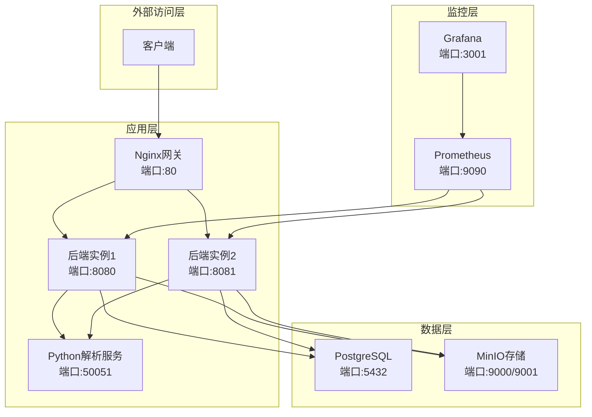
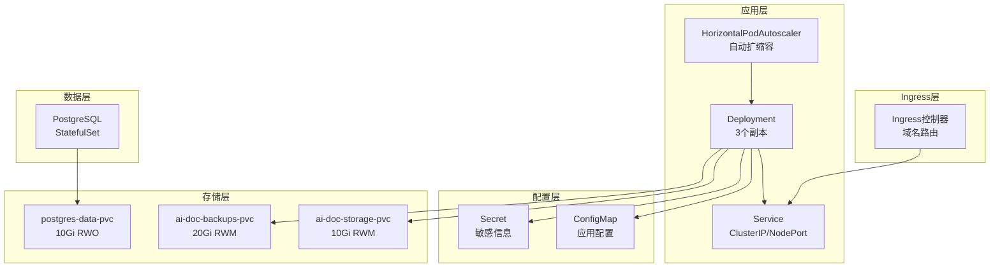
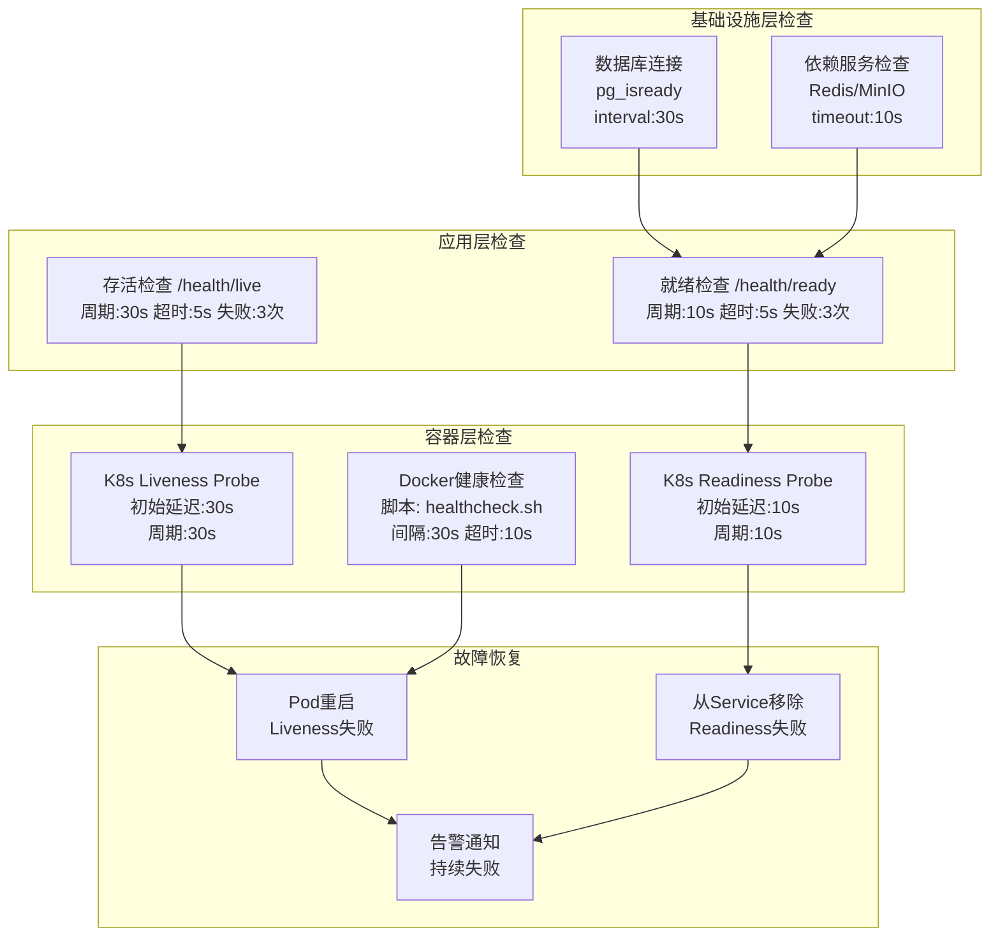
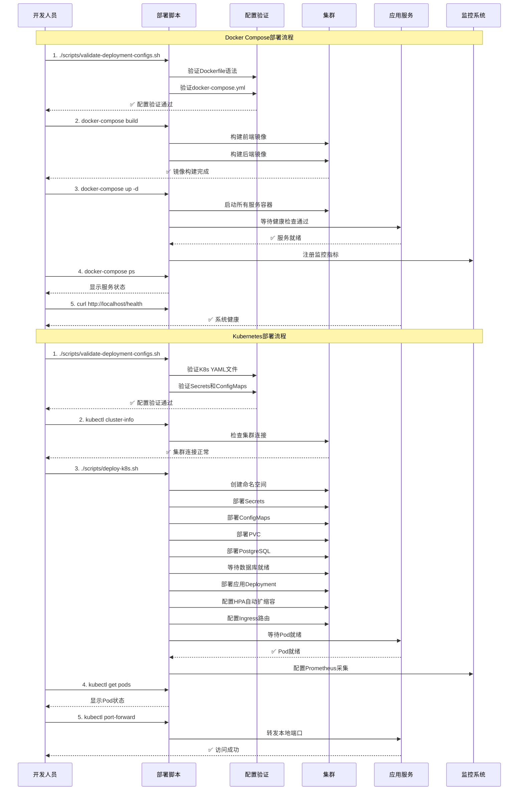
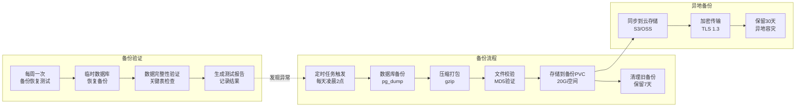

# 13、部署运维方案

<details>
<summary>相关源文件</summary>
docker-compose.yml
Dockerfile
Makefile
k8s/deployment.yaml
k8s/configmap.yaml
k8s/secrets.yaml
k8s/ingress.yaml
k8s/pvc.yaml
scripts/deploy-k8s.sh
scripts/backup-script.sh
nginx.conf
</details>

## 概述

本文档详细阐述了AI技术文档库的部署配置和运维管理方案，涵盖Docker容器化部署、Kubernetes编排部署、系统可扩展性架构、监控告警体系以及运维脚本工具链。通过深入分析各层部署配置，为运维人员提供全面的部署指南和最佳实践，确保系统在生产环境中的高可用性、可扩展性和可维护性。

## Docker部署方案

### 架构概述

项目采用多容器架构设计，通过Docker Compose实现服务编排和管理。基于[`docker-compose.yml`](docker-compose.yml:1)的配置分析，系统包含7个核心服务，实现了前后端分离、数据存储、文档解析、负载均衡和高可用部署等多种功能。



### 服务定义分析

#### 1. Nginx网关服务

[`docker-compose.yml`](docker-compose.yml:5)中定义的Nginx服务作为系统的反向代理和负载均衡器，承担了关键的流量管理职责。

**核心配置特性**：
- **镜像选择**：使用`nginx:alpine`镜像，体积小、安全性高
- **端口映射**：映射主机80端口到容器80端口，支持HTTP协议
- **健康检查**：配置了30秒间隔的健康检查，使用[`wget`](docker-compose.yml:22)命令验证服务可用性
- **依赖关系**：依赖于[`backend`](docker-compose.yml:15)和[`backend2`](docker-compose.yml:16)服务实例，确保后端就绪后才启动
- **挂载配置**：挂载[`nginx.conf`](docker-compose.yml:12)、前端静态文件和日志目录，实现配置和数据持久化

**负载均衡策略**：
根据[`nginx.conf`](nginx.conf:82-116)配置分析，Nginx采用动态后端选择机制，通过`set $backend`指令实现灵活的后端路由。当前配置默认指向`ai-doc-backend-1:8080`，但可以根据需要扩展为轮询或最少连接算法。

#### 2. 后端服务实例

系统部署了两个Go后端服务实例（[`backend`](docker-compose.yml:29)和[`backend2`](docker-compose.yml:74)），通过Docker多阶段构建提高部署效率和安全性。

**构建优化策略**：
[`Dockerfile`](Dockerfile:1)采用三阶段构建策略，显著减小最终镜像大小：

1. **前端构建阶段**（Dockerfile行2-27）：
   - 基础镜像：[`node:20-alpine`](Dockerfile:2)（~120MB）
   - 依赖处理：仅复制`package.json`，利用Docker缓存层
   - 构建命令：[`npm run build`](Dockerfile:21)生成`dist`目录
   - 缓存清理：[`npm cache clean --force`](Dockerfile:24)减小中间镜像

2. **后端构建阶段**（Dockerfile行30-58）：
   - 基础镜像：[`golang:1.24-alpine`](Dockerfile:30)（~290MB）
   - 依赖下载：[`go mod download`](Dockerfile:43)支持重试机制
   - Vendor模式：自动检测vendor目录，支持离线构建
   - 编译优化：[`CGO_ENABLED=0`](Dockerfile:54)生成静态可执行文件

3. **运行阶段**（Dockerfile行61-128）：
   - 基础镜像：[`alpine:latest`](Dockerfile:61)（~5MB）
   - 镜像大小：最终镜像约50-60MB（相比单阶段构建减少90%）
   - 安全加固：创建非root用户(`appuser:1000`)
   - 健康检查：内置[`/app/scripts/healthcheck.sh`](Dockerfile:90-92)

**构建性能分析**：
- 首次构建：约3-5分钟（下载依赖+编译）
- 增量构建：30-60秒（仅编译修改的代码）
- 镜像拉取：5-10秒（alpine基础镜像）
- 容器启动：2-5秒（轻量级镜像优势）

**环境变量配置**：
每个后端实例配置了13个环境变量，涵盖数据库连接、存储配置、JWT密钥、时区设置等关键参数：
- 数据库连接：[`DB_HOST`](docker-compose.yml:37)、[`DB_PORT`](docker-compose.yml:38)、[`DB_USER`](docker-compose.yml:39)、[`DB_PASSWORD`](docker-compose.yml:40)、[`DB_NAME`](docker-compose.yml:41)
- 服务配置：[`NODE_ID`](docker-compose.yml:45)用于标识不同实例
- 安全配置：[`JWT_SECRET`](docker-compose.yml:47)用于令牌验证（生产环境需要修改）
- GRPC连接：[`GRPC_SERVER_HOST`](docker-compose.yml:51)和[`GRPC_SERVER_PORT`](docker-compose.yml:52)指向Python解析服务

**健康检查机制**：
后端服务实现了三层健康检查：
1. **容器级别健康检查**：通过[`healthcheck`](docker-compose.yml:61-66)配置，每30秒检查一次
2. **启动延迟配置**：[`start_period: 40s`](docker-compose.yml:66)给予服务充分的启动时间
3. **脚本检查**：使用[`/app/scripts/healthcheck.sh`](docker-compose.yml:62)脚本检查`/health/live`端点

**资源管理**：
后端服务使用非root用户运行，通过[`adduser`](Dockerfile:74)创建专用用户，并设置适当的文件权限，增强安全性。

#### 3. Python解析服务

[`python-parser`](docker-compose.yml:118)服务专门处理PDF和DOCX文档解析，通过gRPC协议与Go后端通信。

**架构设计**：
- **gRPC端口**：监听50051端口，提供高性能文档解析服务
- **存储共享**：通过挂载[`./storage`](docker-compose.yml:126)目录实现文档文件的共享访问
- **健康检查**：使用Python socket连接测试50051端口可用性
- **容器标签**：[`com.ai-doc.service=python-parser`](docker-compose.yml:137)便于服务发现和管理

#### 4. 数据库服务

[`postgres`](docker-compose.yml:163)服务使用PostgreSQL 15 Alpine版本，配置了完整的初始化和迁移脚本。

**数据库初始化**：
通过挂载9个SQL脚本到[`/docker-entrypoint-initdb.d`](docker-compose.yml:176-185)目录，实现自动初始化：
1. [`init.sql`](docker-compose.yml:176)：创建数据库表结构
2. [`setup_pgvector.sql`](docker-compose.yml:177)：安装pgvector扩展，支持向量搜索
3. 多个迁移脚本：逐步添加用户表、MCP表、搜索索引、文档分类等功能

**复制配置**：
预配置了主从复制相关环境变量（[`POSTGRES_REPLICATION_USER`](docker-compose.yml:170)、[`POSTGRES_REPLICATION_PASSWORD`](docker-compose.yml:171)），为读写分离做准备。

**数据持久化**：
使用命名卷[`postgres_data`](docker-compose.yml:175)持久化数据库数据，确保容器重启后数据不丢失。

### 网络配置

所有服务都连接到自定义桥接网络[`ai-doc-network`](docker-compose.yml:20)，实现服务间的相互访问。Docker Compose的内置DNS服务允许服务通过容器名称相互解析，简化了服务发现。

### 环境变量管理

项目采用环境变量驱动配置的策略，将所有敏感信息和配置参数通过环境变量注入容器。这种设计实现了：
- **配置与代码分离**：不同环境（开发、测试、生产）使用不同的环境变量
- **安全性**：敏感信息（如数据库密码、JWT密钥）不写入镜像
- **灵活性**：无需重新构建镜像即可修改配置

### 数据卷配置

系统使用多种数据卷类型满足不同的持久化需求：
1. **命名卷**（`postgres_data`、`prometheus_data`、`grafana_data`）：由Docker自动管理，适合数据库和监控数据
2. **绑定挂载**（`./storage`、`./backups`、`./logs`）：直接映射主机目录，便于访问和管理
3. **临时卷**：仅在容器生命周期内有效，用于缓存等临时数据

## Kubernetes部署方案

### 部署架构

Kubernetes部署方案提供了企业级的编排能力，通过[`k8s/`](k8s/)目录下的配置文件实现自动化部署和管理。



### Deployment配置分析

[`k8s/deployment.yaml`](k8s/deployment.yaml:1)定义了后端应用的部署规范，实现了高可用和自动弹性的特性。

#### 副本管理

**初始副本数**：[`replicas: 3`](k8s/deployment.yaml:8)确保应用始终有3个运行副本，提供故障容错能力。

**选择器设计**：通过[`matchLabels`](k8s/deployment.yaml:10-11)精确匹配Pod，确保只管理属于当前部署的实例。

#### 容器配置

**资源配置**：
- **请求资源**：[`memory: 256Mi`](k8s/deployment.yaml:86)、[`cpu: 250m`](k8s/deployment.yaml:87)保证Pod获得基本运行资源
- **限制资源**：[`memory: 512Mi`](k8s/deployment.yaml:89)、[`cpu: 500m`](k8s/deployment.yaml:90)防止资源耗尽影响集群稳定性

**探针配置**：
1. **存活探针（Liveness Probe）**：
   - 端点：[`/health/live`](k8s/deployment.yaml:70)
   - 延迟：30秒初始延迟，等待应用完全启动
   - 周期：30秒检查一次
   - 超时：5秒超时设置
   - 失败阈值：连续3次失败后重启容器

2. **就绪探针（Readiness Probe）**：
   - 端点：[`/health/ready`](k8s/deployment.yaml:78)
   - 延迟：10秒初始延迟
   - 周期：10秒检查频率更高
   - 超时：5秒超时设置
   - 失败阈值：连续3次失败后从Service中移除

**环境变量注入**：
通过[`valueFrom`](k8s/deployment.yaml:25)字段从ConfigMap和Secret引用配置：
- 非敏感配置（DB_HOST、DB_PORT、DB_NAME）从[`ai-doc-config`](k8s/deployment.yaml:27)读取
- 敏感配置（DB_PASSWORD、JWT_SECRET）从[`ai-doc-secrets`](k8s/deployment.yaml:37)读取
- 实现配置与部署分离，便于不同环境管理

### Service配置分析

[`k8s/deployment.yaml`](k8s/deployment.yaml:99-126)定义了两种Service类型，满足不同的访问需求。

#### ClusterIP服务

**内部访问**：[`ai-doc-backend-service`](k8s/deployment.yaml:102)使用ClusterIP类型，仅在集群内部可访问，适合后端服务之间的通信。

**端口配置**：
- 服务端口：8080
- 目标端口：8080
- 协议：TCP

#### NodePort服务

**外部访问**：[`ai-doc-backend-nodeport`](k8s/deployment.yaml:116)使用NodePort类型，通过节点IP和端口（30080）从集群外部访问。

**端口映射**：
- 节点端口：30080
- 服务端口：8080
- 目标端口：8080

### ConfigMap配置

[`k8s/configmap.yaml`](k8s/configmap.yaml:1)定义了应用的配置数据，包括数据库连接参数、存储类型、服务端口等非敏感配置。

**Nginx配置**：
[`ai-doc-nginx-config`](k8s/configmap.yaml:15)包含了完整的Nginx配置，支持：
- 健康检查：[`check interval=3000 rise=2 fall=3`](k8s/configmap.yaml:27)
- 静态文件服务：[`root /usr/share/nginx/html`](k8s/configmap.yaml:36)
- API代理：[`location /api/`](k8s/configmap.yaml:41)
- MCP协议支持：[`location /mcp`](k8s/configmap.yaml:61)

### Secret配置分析

[`k8s/secrets.yaml`](k8s/secrets.yaml:1)管理敏感信息，包括数据库凭证、JWT密钥、MinIO密钥等。

**安全特性**：
- 类型：[`Opaque`](k8s/secrets.yaml:5)，Base64编码存储
- 注：生产环境必须修改默认密码和密钥
- 支持：数据库用户、密码、JWT密钥、复制凭证等

### Ingress配置

[`k8s/ingress.yaml`](k8s/ingress.yaml:1)定义了外部访问规则，实现基于域名的路由。

**路由规则**：
- 主机：[`ai-doc.local`](k8s/ingress.yaml:15)
- 根路径：[`/`](k8s/ingress.yaml:18) → 后端服务
- API路径：[`/api`](k8s/ingress.yaml:25) → 后端服务
- 健康检查：[`/health`](k8s/ingress.yaml:32) → 后端服务
- MCP协议：[`/mcp`](k8s/ingress.yaml:39) → 后端服务

**注解配置**：
- [`proxy-body-size`](k8s/ingress.yaml:8)：100M，支持大文件上传
- [`proxy-connect-timeout`](k8s/ingress.yaml:9)：60秒，连接超时设置
- [`ssl-redirect`](k8s/ingress.yaml:7)：false，开发环境禁用HTTPS重定向

### PVC配置分析

[`k8s/pvc.yaml`](k8s/pvc.yaml:1)定义了三个持久化卷声明，满足不同的存储需求。

**存储规格**：
1. **应用存储**：[`ai-doc-storage-pvc`](k8s/pvc.yaml:4)，10Gi，ReadWriteMany多节点读写
2. **备份存储**：[`ai-doc-backups-pvc`](k8s/pvc.yaml:16)，20Gi，ReadWriteMany，容量更大
3. **数据库存储**：[`postgres-data-pvc`](k8s/pvc.yaml:28)，10Gi，ReadWriteOnce，单节点读写

**访问模式选择**：
- ReadWriteMany：适合应用文件和备份，多个Pod可以同时读写
- ReadWriteOnce：适合数据库，同一时间只有一个Pod可以挂载

### 自动扩缩容配置

[`k8s/deployment.yaml`](k8s/deployment.yaml:128-151)定义了HorizontalPodAutoscaler，实现基于CPU和内存的自动扩缩容。

**扩缩容策略**：
- 最小副本：[`2`](k8s/deployment.yaml:137)
- 最大副本：[`10`](k8s/deployment.yaml:138)
- CPU目标利用率：[`70%`](k8s/deployment.yaml:145)
- 内存目标利用率：[`80%`](k8s/deployment.yaml:151)

## 可扩展性部署

### 水平扩展策略

系统通过多层架构设计实现了完善的水平扩展能力。

#### 后端服务多实例部署

**Docker Compose扩展**：
在[`docker-compose.yml`](docker-compose.yml:29-115)中配置了两个后端实例（`backend`和`backend2`），通过复制服务配置实现高可用。每个实例：
- 独立运行在独立的容器中
- 使用不同的端口（8080和8081）暴露服务
- 共享相同的数据库和存储资源
- 通过Nginx负载均衡分配请求

**Kubernetes扩展**：
在[`k8s/deployment.yaml`](k8s/deployment.yaml:8)中配置了3个初始副本，结合HPA可以实现：
- 自动根据负载调整副本数（2-10）
- 流量高峰期自动扩容，流量低谷期自动缩容
- 故障自动恢复，Pod异常时自动重建
- 滚动更新，零停机部署

#### 负载均衡配置

**Nginx负载均衡**：
[`nginx.conf`](nginx.conf:82-116)配置了API反向代理，支持：
- 动态后端选择：通过`set $backend`指令
- 超时控制：[`proxy_connect_timeout 30s`](nginx.conf:99)
- 错误处理：[`proxy_next_upstream`](nginx.conf:108)实现故障转移
- 缓冲优化：[`proxy_buffering on`](nginx.conf:112)提高性能

**Kubernetes Service负载均衡**：
[`k8s/deployment.yaml`](k8s/deployment.yaml:99-111)定义了ClusterIP服务，通过kube-proxy实现：
- 四层负载均衡（TCP/UDP）
- 基于iptables/IPVS规则
- 会话保持可选（配置sessionAffinity）
- 健康检查集成

### 数据库读写分离

**配置准备**：
[`k8s/secrets.yaml`](k8s/secrets.yaml:15-16)预配置了PostgreSQL主从复制凭证，为读写分离提供基础。

**实现方案**：
1. 主节点：处理所有写操作
2. 从节点：处理读操作，多个从节点分担查询压力
3. 读写分离中间件：如PGProxy、Mycat等自动路由读写请求
4. 应用层分离：在服务层配置不同的数据源

**优势分析**：
- 提升读性能：多个从节点并发处理查询
- 提高可用性：主节点故障时可切换到从节点
- 数据备份：从节点本身就是数据备份

### 服务自动扩缩容

**CPU利用率驱动**：
[`k8s/deployment.yaml`](k8s/deployment.yaml:143-145)配置CPU利用率阈值为70%，通过 Metrics Server 每15秒采集一次指标。

**扩缩容算法详解**：
```
目标副本数 = ceil(当前指标值 / 目标值 * 当前副本数)
扩宽下界：max(目标副本数, minReplicas)
缩容上界：min(目标副本数, maxReplicas)
```

**实际扩缩容示例**：
- 当前副本：3，CPU平均值：85%（目标70%）→ 扩容到4
- 当前副本：5，CPU平均值：55%（目标70%）→ 缩容到4
- 当前副本：10，达到上限：不再扩容，触发告警

**冷却时间策略**：
- 扩容冷却：0秒（立即响应流量突增）
- 缩容冷却：5分钟（防止频繁缩容导致抖动）
- 稳定窗口：1分钟（指标稳定后才触发动作）

**性能调优建议**：
```yaml
# 生产环境推荐配置
behavior:
  scaleDown:
    stabilizationWindowSeconds: 300  # 缩容稳定窗口
    policies:
    - type: Percent
      value: 50                       # 每次最多缩容50%
      periodSeconds: 60
  scaleUp:
    stabilizationWindowSeconds: 0     # 扩容无延迟
    policies:
    - type: Percent
      value: 100                      # 允许快速扩容
      periodSeconds: 15
```

### 缓存策略

**Redis缓存**：
[`k8s/redis.yaml`](k8s/redis.yaml)（根据目录结构推断）配置了Redis缓存服务，支持：
- 热数据缓存：减少数据库查询
- 会话存储：分布式会话管理
- 分布式锁：并发控制
- 消息队列：任务调度

**缓存策略**：
- 读缓存：查询结果缓存，设置合理的TTL
- 写穿透：先更新缓存再写数据库
- 缓存预热：系统启动时加载热点数据

## 监控部署

### Prometheus配置

监控服务在[`docker-compose.yml`](docker-compose.yml:201-233)中定义为可选服务，通过profiles机制控制。

**启动配置**：
- 镜像：[`prom/prometheus:latest`](docker-compose.yml:203)
- 端口：9090
- 配置：通过[`entrypoint`](docker-compose.yml:214)动态生成prometheus.yml

**采集配置**：
```yaml
scrape_configs:
  - job_name: 'prometheus'
    static_configs:
      - targets: ['localhost:9090']
  
  - job_name: 'ai-doc-backend'
    static_configs:
      - targets:
          - 'ai-doc-backend-1:8080'
          - 'ai-doc-backend-2:8080'
```

**监控指标**：
- 自定义指标：通过[`/metrics`](internal/handler/metrics_handler.go:1)端点暴露
- 健康检查：Liveness和Readiness探针
- 资源使用：CPU、内存、磁盘、网络
- 应用指标：请求数、响应时间、错误率

### Grafana可视化

[`docker-compose.yml`](docker-compose.yml:235-249)定义的Grafana服务提供监控数据可视化。

**配置特性**：
- 镜像：[`grafana/grafana:latest`](docker-compose.yml:237)
- 端口：3001（避免与主机已有服务冲突）
- 默认密码：admin/admin（生产环境需要修改）

**仪表板配置**：
- 系统概览：整体健康状况
- 应用性能：API响应时间、吞吐量
- 资源使用：CPU、内存、磁盘、网络趋势
- 业务指标：文档上传量、搜索次数、用户活跃度

### 健康检查体系

**多层健康检查架构**：



**健康检查端点实现**：

1. **存活检查（Liveness）**：
   - 端点：[`/health/live`](internal/handler/health_handler.go:1)
   - 检查内容：
     - 应用进程是否运行
     - HTTP服务器是否监听
     - 基本依赖是否可用
   - 失败处理：标记Pod不健康，触发重启

2. **就绪检查（Readiness）**：
   - 端点：[`/health/ready`](internal/handler/health_handler.go:1)
   - 检查内容：
     - 数据库连接是否正常
     - 缓存服务是否可用
     - 初始化任务是否完成
   - 失败处理：从Service中移除Pod，停止接收流量

3. **启动检查（Startup）**：
   - 端点：[`/health/live`](internal/handler/health_handler.go:1)
   - 检查内容：
     - 应用启动是否完成
     - 数据库迁移是否执行
   - 失败处理：延长initialDelaySeconds，给应用更多启动时间

**故障恢复策略**：

| 失败类型 | 检测机制 | 恢复动作 | 恢复时间 |
|---------|---------|---------|---------|
| 容器崩溃 | Docker健康检查 | 自动重启容器 | 5-10秒 |
| 应用无响应 | Liveness Probe | 重启Pod | 30-60秒 |
| 依赖不可用 | Readiness Probe | 从Service移除 | 10-30秒 |
| 资源不足 | Resource Limits | OOMKill并重启 | 10-20秒 |
| 网络分区 | Prober超时 | 标记不健康 | 30-90秒 |

**告警规则配置**：
```yaml
# Prometheus告警规则示例
groups:
- name: health_alerts
  rules:
  - alert: PodUnhealthy
    expr: kube_pod_status_ready{namespace="ai-doc"} == 0
    for: 2m
    labels:
      severity: warning
    annotations:
      summary: "Pod {{ $labels.pod }} is unhealthy"
      
  - alert: HighRestartRate
    expr: rate(kube_pod_container_status_restarts_total[5m]) > 0.1
    for: 5m
    labels:
      severity: critical
    annotations:
      summary: "High restart rate for pod {{ $labels.pod }}"
```

### 日志聚合

**日志目录**：
[`docker-compose.yml`](docker-compose.yml:14、56、100)配置了三个日志目录：
- `/var/log/nginx`：Nginx访问日志和错误日志
- `/app/logs`：后端应用日志（每个实例独立）
- 持久化存储：日志数据保存在主机目录

**日志级别**：
根据[`nginx.conf`](nginx.conf:13-20)配置：
- main格式：标准访问日志
- mcp_debug格式：MCP协议专用日志，记录API_KEY调试信息

**日志监控**：
- 通过Prometheus采集日志指标
- 使用Grafana展示日志趋势
- 集成ELK或Loki进行日志聚合和搜索

## 部署脚本

### Makefile构建脚本

[`Makefile`](Makefile:1)提供了项目构建和管理的标准化命令。

**构建命令**：
- [`make build`](Makefile:7-8)：编译Go应用，输出到`bin/ai-doc-library`
- [`make test`](Makefile:11-12)：运行所有测试，生成覆盖率报告
- [`make run`](Makefile:15-16)：直接运行应用（开发环境）
- [`make clean`](Makefile:19-20)：清理构建产物

**依赖管理**：
- [`make deps`](Makefile:23-25)：整理和下载Go模块依赖
- 支持vendor模式：自动检测并使用vendor目录

**Docker命令**：
- [`make docker-build`](Makefile:49-50)：构建Docker镜像
- [`make docker-run`](Makefile:53-54)：运行Docker容器

### Kubernetes部署脚本

[`scripts/deploy-k8s.sh`](scripts/deploy-k8s.sh:1)实现了Kubernetes集群的自动化部署。

**部署流程**：

1. **集群检查**：
```bash
check_cluster() {
    if ! kubectl cluster-info &> /dev/null; then
        exit 1
    fi
}
```

2. **命名空间创建**：
```bash
create_namespace() {
    kubectl create namespace ${NAMESPACE} --dry-run=client -o yaml | kubectl apply -f -
}
```

3. **配置部署**：
   - Secrets：[`deploy_secrets`](scripts/deploy-k8s.sh:48-52)
   - ConfigMaps：[`deploy_configmaps`](scripts/deploy-k8s.sh:54-58)
   - PVC：[`deploy_pvc`](scripts/deploy-k8s.sh:60-64)
   - PostgreSQL：[`deploy_postgres`](scripts/deploy-k8s.sh:66-73)
   - 应用：[`deploy_app`](scripts/deploy-k8s.sh:86-93)

4. **自动备份**：
[`setup_auto_backup`](scripts/deploy-k8s.sh:102-167)配置CronJob，每天凌晨2点自动备份数据库。

**颜色输出**：
脚本使用颜色函数美化输出：
- 绿色：[`log_info`](scripts/deploy-k8s.sh:20-22)
- 黄色：[`log_warn`](scripts/deploy-k8s.sh:24-26)
- 红色：[`log_error`](scripts/deploy-k8s.sh:28-30)

### 备份脚本

[`scripts/backup-script.sh`](scripts/backup-script.sh:1)提供了完整的数据库备份和恢复功能。

**备份功能**：

1. **数据库备份**：
```bash
backup_database() {
    BACKUP_FILE="${BACKUP_DIR}/database/backup_${TIMESTAMP}.sql"
    
    PGPASSWORD="${DB_PASSWORD}" pg_dump \
        -h "${DB_HOST}" \
        -p "${DB_PORT}" \
        -U "${DB_USER}" \
        -d "${DB_NAME}" \
        -f "${BACKUP_FILE}" \
        --no-password
}
```

2. **压缩备份**：
使用[`gzip`](scripts/backup-script.sh:42)压缩SQL文件，节省存储空间。

3. **自动清理**：
[`cleanup_old_backups`](scripts/backup-script.sh:54-61)删除7天前的备份：

```bash
find "${BACKUP_DIR}/database" -type f -name "backup_*.sql.gz" -mtime +${RETENTION_DAYS} -delete
```

**恢复功能**：
[`restore_backup`](scripts/backup-script.sh:87-127)支持从备份文件恢复数据库：
1. 解压备份文件
2. 执行psql恢复
3. 记录恢复操作到日志

**使用方法**：
```bash
./scripts/backup-script.sh backup        # 备份数据库
./scripts/backup-script.sh full          # 创建完整备份
./scripts/backup-script.sh restore <file> # 恢复备份
./scripts/backup-script.sh cleanup       # 清理旧备份
```

### 配置验证脚本

[`scripts/validate-deployment-configs.sh`](scripts/validate-deployment-configs.sh:1)提供了部署前配置验证功能。

**验证项**：

1. **文件存在性检查**：
```bash
check_file_exists() {
    if [ -f "$file" ]; then
        log_success "文件存在: $file"
    else
        log_error "文件不存在: $file"
    fi
}
```

2. **语法检查**：
- Dockerfile语法：[`check_dockerfile_syntax`](scripts/validate-deployment-configs.sh:85-94)
- YAML语法：[`check_yaml_syntax`](scripts/validate-deployment-configs.sh:97-111)
- Shell脚本语法：[`check_shell_syntax`](scripts/validate-deployment-configs.sh:114-123)

3. **配置内容验证**：
- Docker Compose配置验证
- Kubernetes配置验证
- 安全配置检查（默认密码警告）

**执行流程**：
```bash
./scripts/validate-deployment-configs.sh
```

输出详细的检查结果，包括：
- 通过的检查项（绿色✓）
- 失败的检查项（红色✗）
- 警告信息（黄色!）
- 检查统计（总数、通过、失败）

### 监控功能检查脚本

[`scripts/check_monitor_setup.sh`](scripts/check_monitor_setup.sh:1)验证监控功能的完整性。

**检查内容**：

1. **后端文件检查**：
- [`internal/model/monitor.go`](scripts/check_monitor_setup.sh:10)
- [`internal/repository/monitor_repository.go`](scripts/check_monitor_setup.sh:11)
- [`internal/service/monitor_service.go`](scripts/check_monitor_setup.sh:12)
- [`internal/handler/monitor_handler.go`](scripts/check_monitor_setup.sh:13)

2. **前端文件检查**：
- [`web/src/utils/monitorService.js`](scripts/check_monitor_setup.sh:27)
- [`web/src/views/MonitorView.vue`](scripts/check_monitor_setup.sh:28)

3. **依赖检查**：
- Chart.js是否已安装：[`npm list chart.js`](scripts/check_monitor_setup.sh:42)

4. **路由检查**：
- App.vue中是否导入MonitorView
- 路由配置是否包含`/monitor`

5. **数据库表检查**：
- system_metrics表
- log_entries表

**使用方法**：
```bash
./scripts/check_monitor_setup.sh
```

输出详细的检查结果，帮助诊断监控功能缺失的部分。

## 运维最佳实践

### 部署流程



**Docker Compose部署流程**：
```bash
# 1. 验证配置
./scripts/validate-deployment-configs.sh
# 输出：✅ Dockerfile语法正确
#       ✅docker-compose.yml配置正确

# 2. 构建镜像
docker-compose build
# 输出：Successfully built xxx
#       Successfully tagged ai-doc-backend:latest

# 3. 启动服务
docker-compose up -d
# 输出：Creating network "ai-doc-network"
#       Creating ai-doc-backend-1
#       Creating ai-doc-backend-2
#       Creating ai-doc-nginx
#       ...

# 4. 检查状态
docker-compose ps
# 输出：NAME                  STATUS              PORTS
#       ai-doc-backend-1       Up (healthy)        0.0.0.0:8080->8080/tcp
#       ai-doc-backend-2       Up (healthy)        0.0.0.0:8081->8080/tcp
#       ai-doc-nginx           Up (healthy)        0.0.0.0:80->80/tcp

# 5. 查看日志
docker-compose logs -f backend

# 6. 验证健康
curl http://localhost/health
# 输出：{"status":"healthy","timestamp":"2026-01-04T16:00:00Z"}
```

**Kubernetes部署流程**：
```bash
# 1. 验证配置
./scripts/validate-deployment-configs.sh

# 2. 检查集群
kubectl cluster-info
# 输出：Kubernetes control plane is running at https://k8s-cluster:6443

# 3. 部署应用
./scripts/deploy-k8s.sh
# 输出：[INFO] 部署ConfigMaps配置...
#       [INFO] 部署Secrets配置...
#       [INFO] 部署持久化存储卷声明...
#       [INFO] 等待PostgreSQL就绪...

# 4. 检查Pod状态
kubectl get pods -n ai-doc
# 输出：NAME                                READY   STATUS    RESTARTS   AGE
#       ai-doc-backend-7f8d9b6b4-x9k2p      1/1     Running   0          5m
#       ai-doc-backend-7f8d9b6b4-z7m8k      1/1     Running   0          5m

# 5. 查看日志
kubectl logs -f deployment/ai-doc-backend -n ai-doc

# 6. 验证服务
kubectl port-forward -n ai-doc svc/ai-doc-backend-service 8080:8080
curl http://localhost:8080/health
```

### 日常维护流程

**备份管理策略**：



**备份脚本详细配置**：
```bash
# 执行完整备份
./scripts/backup-script.sh full

# 备份文件命名规范
backup_<TIMESTAMP>.sql.gz
# 示例: backup_20260104_020000.sql.gz

# 备份文件结构
/app/backups/
├── database/
│   ├── backup_20260104_020000.sql.gz
│   ├── backup_20260103_020000.sql.gz
│   └── ...
└── full/
    ├── backup_20260104_020000/
    │   ├── backup_20260104_020000.sql.gz
    │   └── backup_info.txt
    └── ...
```

**日志管理最佳实践**：

1. **日志级别配置**：
   - 开发环境：DEBUG（详细调试信息）
   - 测试环境：INFO（业务关键信息）
   - 生产环境：WARN（仅警告和错误）

2. **日志轮转策略**：
   ```bash
   # /etc/logrotate.d/nginx
   /var/log/nginx/*.log {
       daily
       rotate 14
       compress
       delaycompress
       notifempty
       create 0640 nginx adm
       sharedscripts
       postrotate
           [ -f /var/run/nginx.pid ] && kill -USR1 `cat /var/run/nginx.pid`
       endscript
   }
   ```

3. **日志分析自动化**：
   - 使用Prometheus采集日志指标
   - Grafana展示错误率趋势
   - 配置告警规则，错误率超过5%触发通知

**性能监控优化**：

**关键监控指标**：
| 指标类型 | 指标名称 | 正常范围 | 告警阈值 |
|---------|---------|---------|---------|
| 应用性能 | API响应时间 | <200ms | >500ms |
| 应用性能 | 请求错误率 | <1% | >5% |
| 资源使用 | CPU利用率 | 30-70% | >85% |
| 资源使用 | 内存利用率 | 40-80% | >90% |
| 数据库 | 查询响应时间 | <100ms | >300ms |
| 数据库 | 连接池使用率 | <60% | >80% |

**性能调优建议**：
1. **数据库优化**：
   - 配置连接池：50-100个连接
   - 启用查询缓存：合理设置TTL
   - 索引优化：定期分析慢查询

2. **应用优化**：
   - 启用Go的GOMAXPROCS：设置为CPU核心数
   - 配置HTTP keep-alive：减少连接建立开销
   - 使用缓存：Redis缓存热点数据

3. **容器资源调优**：
   ```yaml
   # 生产环境推荐资源配置
   resources:
     requests:
       memory: "512Mi"   # 基础内存需求
       cpu: "500m"       # 基础CPU需求
     limits:
       memory: "1024Mi"  # 内存上限（建议2倍请求）
       cpu: "1000m"      # CPU上限（建议2倍请求）
   ```

### 故障处理

**常见故障**：

1. **服务启动失败**：
   - 检查日志：`docker-compose logs <service>`
   - 检查配置：环境变量、挂载路径
   - 检查依赖：数据库、Redis等依赖服务

2. **健康检查失败**：
   - 检查探针配置：端点、超时、阈值
   - 检查应用日志：是否有异常错误
   - 检查资源限制：CPU、内存是否充足

3. **数据库连接失败**：
   - 检查数据库状态：`pg_isready`
   - 检查连接配置：主机、端口、用户名、密码
   - 检查网络：防火墙、网络策略

**故障恢复**：
```bash
# 重启服务
docker-compose restart <service>

# Kubernetes重启Pod
kubectl delete pod <pod-name> -n ai-doc

# 回滚部署
kubectl rollout undo deployment/ai-doc-backend -n ai-doc

# 恢复数据库
./scripts/backup-script.sh restore <backup-file>
```

### 安全加固

**生产环境安全建议**：

1. **修改默认密码**：
   - 数据库密码：[`k8s/secrets.yaml`](k8s/secrets.yaml:9)
   - JWT密钥：[`k8s/secrets.yaml`](k8s/secrets.yaml:12)
   - MinIO密钥：[`k8s/secrets.yaml`](k8s/secrets.yaml:19-20)

2. **启用HTTPS**：
   - 配置TLS证书：使用Let's Encrypt或其他CA
   - 强制HTTPS：[`ssl-redirect: "true"`](k8s/ingress.yaml:53)

3. **网络隔离**：
   - 使用NetworkPolicy限制Pod间通信
   - 数据库只允许后端访问
   - 内部服务不对外暴露

4. **镜像安全**：
   - 使用官方镜像或可信镜像源
   - 定期更新镜像版本
   - 扫描镜像漏洞

5. **访问控制**：
   - RBAC权限控制
   - ServiceAccount最小权限
   - PodSecurityPolicy限制特权容器

## 总结

AI技术文档库的部署运维方案提供了完整的容器化部署、编排管理、可扩展架构、监控告警和运维脚本支持。通过Docker Compose和Kubernetes两种部署方式，满足不同规模和场景的部署需求。完善的健康检查、自动扩缩容、备份恢复和监控告警机制，确保系统在生产环境中的稳定运行。标准化的运维脚本简化了日常管理任务，提高了运维效率。通过遵循本方案，可以实现系统的高可用、高性能和可扩展性。