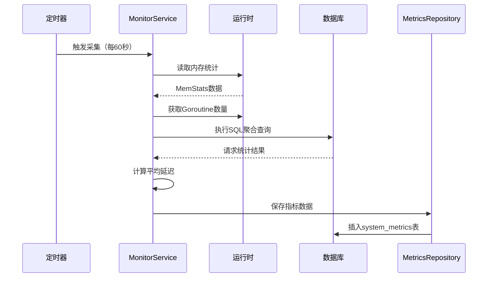
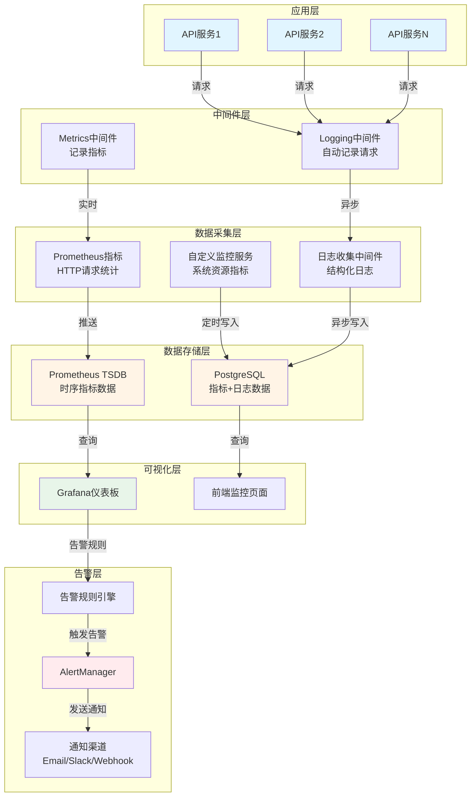
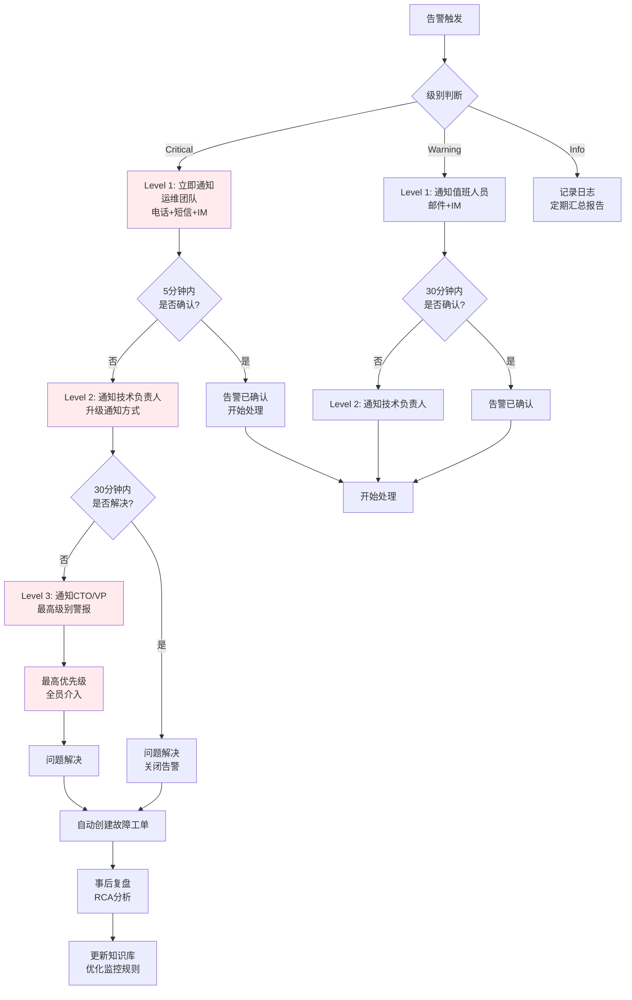

# 14、系统监控与日志

<details>
<summary>相关源文件</summary>
internal/handler/metrics_handler.go
internal/handler/monitor_handler.go
internal/handler/health_handler.go
internal/service/monitor_service.go
internal/service/health_service.go
internal/repository/monitor_repository.go
internal/middleware/logging.go
internal/model/monitor.go
docker-compose.yml
web/src/utils/monitorService.js
</details>

## 概述

本文档深入分析系统监控、日志记录和可观测性方案。系统采用Prometheus-Grafana监控架构，结合自定义监控服务实现了全方位的系统可观测性。监控体系涵盖系统资源、业务指标、性能指标三个维度，通过结构化日志记录和自动化告警机制，确保系统稳定运行和快速故障定位。核心价值在于提供实时监控能力、历史数据分析、性能趋势预测和自动化运维支持。

## 监控指标

### 指标分类体系

系统监控指标分为三大类别，每类指标都通过 [`monitor_service.go`](internal/service/monitor_service.go:73-180) 中的 [`CollectMetrics()`](internal/service/monitor_service.go:73-180) 方法自动采集和汇总。

#### 1. 系统资源指标

系统资源指标反映底层硬件和运行时资源使用情况：

- **CPU指标**：
  - `cpu_usage`：CPU使用率（百分比），通过 [`gopsutil库`](internal/service/monitor_service.go:14) 实时获取
  - `cpu_cores`：CPU核心数（[`runtime.NumCPU()`](internal/service/monitor_service.go:145)）
  - `goroutine_count`：Goroutine数量（[`runtime.NumGoroutine()`](internal/service/monitor_service.go:147)）

- **内存指标**：
  - `memory_alloc`：已分配堆内存（字节）
  - `memory_total_alloc`：累计分配内存（字节）
  - `memory_sys`：从系统获取的总内存（字节）
  - `memory_heap_alloc`：堆内存分配量
  - `memory_heap_sys`：堆内存系统占用量

- **GC指标**：
  - `gc_num`：垃圾回收次数
  - `gc_pause_total`：GC总暂停时间（纳秒）
  - `gc_next`：下次GC的目标堆大小

#### 2. 业务指标

业务指标反映应用程序的业务活动情况：

- `request_count`：最近1分钟的请求总数，通过 [`SQL聚合查询`](internal/service/monitor_service.go:116-123) 从日志表统计
- `error_count`：错误请求数量（HTTP状态码≥400）
- `average_latency`：平均响应延迟（毫秒）

#### 3. 性能指标

系统性能指标展示服务处理能力和响应质量：

- `db_connections`：数据库当前连接数
- `db_max_open`：数据库最大连接数
- `db_in_use`：正在使用的数据库连接数
- `db_idle`：空闲数据库连接数

### 指标采集机制

指标采集采用定期轮询和事件驱动相结合的方式：



关键采集逻辑在 [`CollectMetrics()`](internal/service/monitor_service.go:73-180) 方法中实现：

1. 使用 `runtime.ReadMemStats()` 获取运行时内存统计
   - 该操作会触发STW（Stop-The-World），但Go会尽量最小化暂停时间
   - 获取的指标包含当前堆分配、累计分配、系统内存等详细信息

2. 通过 `cpu.Percent()` 获取真实CPU使用率（采样1秒）
   - 采样时间1秒权衡了准确性和性能开销
   - 在高并发场景下，可以考虑缩短采样时间并多次平均值
   - **性能考虑**：该操作会阻塞当前goroutine 1秒，应在独立goroutine中执行

3. 使用 `sqlDB.Stats()` 获取数据库连接状态
   - 无阻塞操作，仅返回连接池的快照信息
   - 包含空闲连接、活跃连接、最大连接数等关键指标
   - **告警阈值建议**：连接池使用率超过80%时应发出警告

4. 执行SQL查询统计最近1分钟的请求指标
   ```go
   err = s.db.WithContext(ctx).Raw(`
     SELECT
       COUNT(*) as count,
       COUNT(CASE WHEN level = 'error' OR status_code >= 400 THEN 1 END) as error_count,
       COALESCE(SUM(latency), 0) as total_latency
     FROM log_entries
     WHERE timestamp >= ?
   `, oneMinuteAgo).Scan(&requestStats).Error
   ```
   - 使用原始SQL避免ORM的性能开销
   - `COUNT(CASE WHEN...)` 语法一次查询完成多种统计，减少数据库往返
   - **索引使用**：确保 `timestamp` 字段有索引，否则全表扫描性能极差

5. 计算平均延迟 = 总延迟 / 请求数量
   - 除零保护：`if requestStats.Count > 0` 避免除零错误
   - 延迟单位：毫秒，与日志记录保持一致

6. 将完整的指标对象保存到数据库
   - 使用 `CreateMetrics()` 事务性写入
   - **性能优化**：考虑批量插入或Upsert操作减少数据库压力

**性能考量与优化建议**：

- **采集频率**：默认60秒，可根据需求调整到30-120秒
  - 频率过高：增加数据库写入压力和性能开销
  - 频率过低：实时性下降，无法及时发现问题
- **并发控制**：在多实例环境下，使用分布式锁避免重复采集
- **错误处理**：采集失败时记录错误但不中断服务，使用上一次的指标作为降级方案
- **数据压缩**：历史指标数据可考虑压缩存储，减少存储空间

### 指标数据模型

[`SystemMetrics`](internal/model/monitor.go:73-107) 结构体定义了完整的指标数据模型：

- **主键**：使用UUID自动生成
- **时间戳**：带索引的 `timestamp` 字段，支持高效时间范围查询
- **字段类型**：使用Go原生类型，确保JSON序列化兼容性
- **时间处理**：所有时间戳使用标准 `time.Time` 类型，支持RFC3339格式

## Prometheus集成

### Metrics暴露机制

系统通过 [`metrics_handler.go`](internal/handler/metrics_handler.go:1-53) 实现Prometheus标准metrics暴露：

#### HTTP Metrics定义

在 [`init()`](internal/handler/metrics_handler.go:30-34) 函数中注册了两个核心Prometheus指标：

1. **`http_requests_total`**：Counter类型，记录HTTP请求总数
   - 标签维度：`method`、`path`、`status`
   - 用途：统计API调用频率和成功率

2. **`http_request_duration_seconds`**：Histogram类型，记录请求持续时间
   - 标签维度：`method`、`path`
   - Buckets：使用Prometheus默认分桶配置
   - 用途：分析API响应时间分布

#### Metrics端点

[`ServeMetrics()`](internal/handler/metrics_handler.go:45-47) 方法暴露 `/metrics` 端点：

```go
func (h *MetricsHandler) ServeMetrics(c *gin.Context) {
    promhttp.Handler().ServeHTTP(c.Writer, c.Request)
}
```

该端点返回Prometheus标准格式的metrics数据，供Prometheus服务抓取。

#### 自动记录机制

[`RecordRequest()`](internal/handler/metrics_handler.go:50-53) 函数用于自动记录请求指标：

```go
func RecordRequest(method, path string, status int, duration float64) {
    httpRequestsTotal.WithLabelValues(method, path, string(rune(status))).Inc()
    httpRequestDuration.WithLabelValues(method, path).Observe(duration)
}
```

该函数在 [`logging中间件`](internal/middleware/logging.go:44) 中被调用，实现每个HTTP请求的自动记录。

**Histogram桶配置详解**：

系统使用Prometheus的默认桶配置（`prometheus.DefBuckets`），桶边界为：
- 0.005, 0.01, 0.025, 0.05, 0.1, 0.25, 0.5, 1, 2.5, 5, 10 秒

这个配置适合大多数API场景，但对于特定场景可能需要自定义：

```go
// 针对快速API的桶配置（毫秒级）
fastAPIBuckets := []float64{
    0.001, 0.005, 0.01, 0.025, 0.05, 0.1, 0.25, 0.5, 1, 2.5
}

// 针对长耗时任务的桶配置（秒级）
longTaskBuckets := []float64{
    1, 5, 10, 30, 60, 120, 300, 600, 1800, 3600
}
```

**Counter使用注意事项**：

Counter类型指标只能递增，不会重置（除非服务重启）。在计算速率时，Prometheus会自动处理重置情况：

```
# 计算5分钟内每秒平均请求数
rate(http_requests_total[5m])

# 计算绝对增量（适用于手动聚合）
increase(http_requests_total[5m])
```

**性能影响评估**：

- Counter的 `Inc()` 操作：时间复杂度 O(1)，几乎无性能开销
- Histogram的 `Observe()` 操作：时间复杂度 O(log n)，n为桶数量
- 对于高并发场景，建议使用无锁的Prometheus客户端或本地预聚合

### Prometheus配置

#### Docker Compose配置

在 [`docker-compose.yml`](docker-compose.yml:201-233) 中定义了Prometheus服务：

```yaml
prometheus:
  image: prom/prometheus:latest
  container_name: ai-doc-prometheus
  ports:
    - "9090:9090"
  profiles:
    - monitoring
```

Prometheus配置通过内联 `entrypoint` 动态生成：

```yaml
scrape_configs:
  - job_name: 'ai-doc-backend'
    static_configs:
      - targets:
          - 'ai-doc-backend-1:8080'
          - 'ai-doc-backend-2:8080'
```

#### 采集策略

- **采集间隔**：15秒（`scrape_interval: 15s`）
- **评估间隔**：15秒（`evaluation_interval: 15s`）
- **目标发现**：使用静态配置，支持多实例负载均衡场景
- **数据存储**：挂载持久化卷 `prometheus_data:/prometheus`

### 数据流转

```mermaid
graph LR
    A[HTTP请求] --> B[Logging中间件]
    B --> C[RecordRequest]
    C --> D[http_requests_total<br/>Counter]
    C --> E[http_request_duration_seconds<br/>Histogram]
    D --> F[/metrics端点]
    E --> F
    F --> G[Prometheus<br/>15秒抓取]
    G --> H[TSDB时序数据库]
    H --> I[Grafana<br/>数据可视化]
    
    J[定时采集器<br/>每60秒] --> K[MonitorService]
    K --> L[获取系统指标]
    K --> M[计算业务指标]
    M --> N[写入数据库]
    N --> O[system_metrics表]
```

### 完整监控架构全景图



**架构层次说明**：

1. **应用层**：对外提供服务的多个API实例
2. **中间件层**：透明拦截所有HTTP请求，自动收集指标和日志
3. **数据采集层**：将原始数据转换为结构化的监控指标和日志
4. **数据存储层**：持久化存储监控数据，支持高效查询
5. **可视化层**：提供友好的界面展示监控数据和仪表板
6. **告警层**：实时监控指标变化，触发告警并通知相关人员

**关键技术决策**：

- **异步写入**：日志写入不阻塞请求处理，使用goroutine异步执行
- **双存储策略**：Prometheus存储高频指标，PostgreSQL存储详细指标和日志
- **分层监控**：应用层指标（HTTP请求）+ 系统层指标（CPU、内存、GC）
- **可扩展设计**：支持多实例、多服务的统一监控

## Grafana可视化

### Grafana服务配置

在 [`docker-compose.yml`](docker-compose.yml:235-250) 中配置Grafana服务：

```yaml
grafana:
  image: grafana/grafana:latest
  container_name: ai-doc-grafana
  ports:
    - "3001:3000"
  environment:
    - GF_SECURITY_ADMIN_PASSWORD=admin
  volumes:
    - grafana_data:/var/lib/grafana
  profiles:
    - monitoring
```

### 仪表板设计指南

#### 1. 系统概览仪表板

**关键图表配置**：

- **CPU使用率趋势**：
  - 查询：`rate(http_request_duration_seconds_sum[5m])`
  - 图表类型：时间序列图
  - 聚合：Avg over time
  - 刷新频率：30秒

- **内存使用详情**：
  - 内存分配趋势：`avg(memory_alloc) by (instance)`
  - GC暂停时间：`rate(gc_pause_total[5m])`
  - Goroutine数量：`avg(goroutine_count) by (instance)`

- **数据库连接池**：
  - 连接数趋势：`db_connections`
  - 连接使用率：`(db_in_use / db_max_open) * 100`

#### 2. 请求分析仪表板

**核心指标展示**：

- **请求速率**：
  ```
  rate(http_requests_total{path!="/health"}[5m])
  ```
  - 分组：按method和path
  - 面板类型：时间序列图
  - Y轴：requests/sec

- **响应时间分布**：
  - P50: `histogram_quantile(0.5, rate(http_request_duration_seconds_bucket[5m]))`
  - P95: `histogram_quantile(0.95, rate(http_request_duration_seconds_bucket[5m]))`
  - P99: `histogram_quantile(0.99, rate(http_request_duration_seconds_bucket[5m]))`

- **错误率分析**：
  ```
  sum(rate(http_requests_total{status=~"5.."}[5m])) / 
  sum(rate(http_requests_total[5m])) * 100
  ```

#### 3. 日志统计仪表板

**日志级别分布**：

- 从 [`log_entries()`](internal/repository/monitor_repository.go:181-237) 表查询
- 时间范围：可配置（默认1小时、24小时、7天）
- 维度：level、service
- 可视化：饼图、柱状图

**关键词搜索统计**：

- 支持自定义消息过滤
- 错误日志趋势分析
- 性能瓶颈识别

### 可视化最佳实践

#### 颜色规范

- **绿色**：健康状态（< 警告阈值）
- **黄色**：警告状态（≥ 警告阈值，< 临界阈值）
- **红色**：临界状态（≥ 临界阈值）

#### 刷新策略

- **实时监控**：30秒刷新
- **趋势分析**：5分钟刷新
- **历史报告**：手动刷新

#### 数据聚合

- **短期（1小时）**：30秒聚合窗口
- **中期（24小时）**：5分钟聚合窗口
- **长期（7天）**：1小时聚合窗口

## 日志系统

### 日志架构设计

日志系统采用结构化设计，通过 [`LoggingMiddleware`](internal/middleware/logging.go:14-24) 实现HTTP请求的自动化日志记录。

```mermaid
graph TB
    A[HTTP请求] --> B[Logging中间件]
    B --> C{记录请求信息}
    C -->|提取元数据| D[Method/Path/UserID]
    C -->|计算延迟| E[Latency(毫秒)]
    C -->|确定级别| F{状态码判断}
    F -->|500+| G[Error级别]
    F -->|400+| H[Warn级别]
    F -->|其他| I[Info级别]
    D --> J[LogEntry对象]
    E --> J
    G --> J
    H --> J
    I --> J
    J --> K[异步写入数据库]
    K --> L[log_entries表]
```

### 日志级别

系统定义了四个标准日志级别（通过 [`LogRequest()`](internal/middleware/logging.go:27-104) 自动判断）：

- **DEBUG**：调试信息，详细系统状态
- **INFO**：信息性消息，正常业务流程（默认级别）
- **WARN**：警告信息，不影响功能的异常情况（400-499状态码）
- **ERROR**：错误信息，功能异常或失败（500+状态码）

### 日志格式

[`LogEntry`](internal/model/monitor.go:124-147) 模型定义了完整的日志结构：

```go
type LogEntry struct {
    ID         string    `json:"id"`
    Timestamp  time.Time `json:"timestamp" gorm:"not null;index"`
    Level      string    `json:"level" gorm:"not null;index"`
    Service    string    `json:"service" gorm:"not null;index"`
    Message    string    `json:"message" gorm:"not null"`
    Method     string    `json:"method"`
    Path       string    `json:"path"`
    UserID     string    `json:"user_id" gorm:"index"`
    Username   string    `json:"username"`
    StatusCode int       `json:"status_code"`
    Latency    int64     `json:"latency"`
    IPAddress  string    `json:"ip_address"`
    UserAgent  string    `json:"user_agent"`
    Error      string    `json:"error"`
    Stack      string    `json:"stack"`
}
```

**关键字段说明**：
- **Timestamp**：使用 `Asia/Shanghai` 时区，便于本地化日志查看
- **Level**：根据HTTP状态码自动判断
- **Service**：服务名称标识，支持多服务日志聚合
- **Latency**：毫秒级精度，支持性能分析
- **UserID/Username**：关联用户，支持审计追踪

### 日志存储

#### 数据库存储

日志持久化到PostgreSQL [`log_entries`](internal/model/monitor.go:145-147) 表：

**索引设计**：
- `timestamp`：主时间索引，支持高效时间范围查询
- `level`：日志级别索引，支持级别过滤
- `service`：服务名称索引，支持服务维度筛选
- `user_id`：用户ID索引，支持用户行为审计

**异步写入**：
在 [`LogRequest()`](internal/middleware/logging.go:96-103) 中使用goroutine异步写入：

```go
go func() {
    ctx := context.Background()
    if err := m.monitorService.LogRequest(ctx, logEntry); err != nil {
        fmt.Printf("Failed to log request: %v\n", err)
    }
}()
```

**优势**：
- 不阻塞HTTP请求处理
- 提升系统吞吐量
- 降低延迟影响

#### 日志保留策略

通过 [`CleanupOldLogs()`](internal/repository/monitor_repository.go:250-256) 实现旧日志清理：

- **默认保留期**：30天
- **可配置性**：通过 `retention_days` 参数动态调整
- **批处理**：支持批量删除优化性能

### 日志查询

#### 基础查询

[`GetLogs()`](internal/repository/monitor_repository.go:181-237) 方法支持多维度日志查询：

**过滤条件**：
```go
type LogFilter struct {
    Level     string // 日志级别：debug/info/warn/error
    Service   string // 服务名称
    UserID    string // 用户ID
    Message   string // 消息关键字（LIKE查询）
    StartDate string // 开始时间（RFC3339格式）
    EndDate   string // 结束时间（RFC3339格式）
    Page      int    // 页码
    Size      int    // 每页大小（最大100）
}
```

#### 高级查询功能

**1. 时间范围查询**：
```go
query.Where("timestamp >= ?", startTime).
      Where("timestamp <= ?", endTime)
```

**2. 多条件组合**：
```go
query.Where("level = ?", "error").
      Where("service = ?", "api").
      Where("message LIKE ?", "%timeout%")
```

**3. 分页支持**：
```go
offset := (filter.Page - 1) * filter.Size
query.Offset(offset).Limit(filter.Size)
```

**4. 排序策略**：
默认按时间倒序（`Order("timestamp DESC")`），快速定位最新日志。

### 日志统计

[`GetLogStats()`](internal/repository/monitor_repository.go:258-291) 方法提供日志聚合统计：

```go
// 获取日志统计
func (r *logRepository) GetLogStats(ctx context.Context, startTime, endTime time.Time) (map[string]int64, error) {
    var results []struct {
        Level  string `db:"level"`
        Count  int64  `db:"count"`
    }
    
    err := r.db.WithContext(ctx).
        Model(&model.LogEntry{}).
        Select("level, COUNT(*) as count").
        Where("timestamp BETWEEN ? AND ?", startTime, endTime).
        Group("level").
        Find(&results).Error
        
    // 转换为map
    stats := make(map[string]int64)
    for _, r := range results {
        stats[r.Level] = r.Count
    }
    return stats, err
}
```

**统计维度**：
- 按日志级别分组统计
- 按服务分组统计
- 按用户分组统计
- 按时间段聚合趋势

## 告警机制

### 告规则配置

虽然系统已集成Prometheus，但告警规则需要在Prometheus配置文件中定义。以下是基于监控指标的建议告警规则：

#### 系统资源告警

```yaml
groups:
  - name: system_resource_alerts
    interval: 30s
    rules:
      # 高CPU使用率告警
      - alert: HighCPUUsage
        expr: rate(http_request_duration_seconds_count[5m]) > 100
        for: 5m
        labels:
          severity: warning
        annotations:
          summary: "高CPU使用率告警"
          description: "CPU使用率超过80%持续5分钟"

      # 内存泄漏检测
      - alert: MemoryLeakSuspected
        expr: increase(memory_total_alloc[1h]) > 1073741824
        for: 10m
        labels:
          severity: warning
        annotations:
          summary: "疑似内存泄漏"
          description: "1小时内内存分配增长超过1GB"

      # Goroutine激增
      - alert: GoroutineSpike
        expr: goroutine_count > 1000
        for: 5m
        labels:
          severity: critical
        annotations:
          summary: "Goroutine数量异常"
          description: "Goroutine数量超过1000，可能存在死锁"
```

#### 业务指标告警

```yaml
  - name: business_metric_alerts
    interval: 1m
    rules:
      # 高错误率告警
      - alert: HighErrorRate
        expr: sum(rate(http_requests_total{status=~"5.."}[5m])) / 
              sum(rate(http_requests_total[5m])) * 100 > 5
        for: 3m
        labels:
          severity: critical
        annotations:
          summary: "HTTP 5xx错误率过高"
          description: "5xx错误率超过5%持续3分钟"

      # 响应时间过长
      - alert: SlowResponseTime
        expr: histogram_quantile(0.95, 
               rate(http_request_duration_seconds_bucket[5m])) > 1
        for: 5m
        labels:
          severity: warning
        annotations:
          summary: "P95响应时间过长"
          description: "95%的请求响应时间超过1秒"

      # 低请求量告警（可能服务不可用）
      - alert: LowRequestRate
        expr: rate(http_requests_total[5m]) < 10
        for: 10m
        labels:
          severity: warning
        annotations:
          summary: "请求量异常降低"
          description: "每秒请求数少于10，持续10分钟"
```

#### 数据库连接告警

```yaml
  - name: database_alerts
    interval: 30s
    rules:
      # 数据库连接池耗尽
      - alert: DatabaseConnectionPoolExhausted
        expr: db_connections / db_max_open * 100 > 90
        for: 2m
        labels:
          severity: critical
        annotations:
          summary: "数据库连接池即将耗尽"
          description: "数据库连接池使用率超过90%"

      # GC频繁触发
      - alert: FrequentGarbageCollection
        expr: rate(gc_num[5m]) > 10
        for: 5m
        labels:
          severity: warning
        annotations:
          summary: "GC频率过高"
          description: "每分钟GC次数超过10次"
```

### 告警通知方式

系统支持多种通知方式，通过Prometheus Alertmanager配置：

#### 1. Email通知

```yaml
receivers:
  - name: 'email-notifications'
    email_configs:
      - to: 'ops-team@example.com'
        from: 'alerts@example.com'
        smarthost: 'smtp.example.com:587'
        auth_username: 'alerts@example.com'
        auth_password: 'password'
        require_tls: true
        headers:
          Subject: '[{{ .Status | toUpper }}{{ if eq .Status "firing" }}:{{ .Alerts.Firing | len }}{{ end }}] {{ .CommonLabels.alertname }}'
```

#### 2. Webhook通知

```yaml
receivers:
  - name: 'webhook-notifications'
    webhook_configs:
      - url: 'http://webhook-service/alerts'
        http_config:
          bearer_token: 'your-webhook-token'
        send_resolved: true
```

#### 3. Slack通知

```yaml
receivers:
  - name: 'slack-notifications'
    slack_configs:
      - api_url: 'https://hooks.slack.com/services/YOUR/WEBHOOK/URL'
        channel: '#alerts'
        username: 'Prometheus'
        title: '{{ range .Alerts }}{{ .Annotations.summary }}{{ end }}'
        text: '{{ range .Alerts }}{{ .Annotations.description }}{{ end }}'
        send_resolved: true
```

### 告警升级策略

#### 优先级定义

**Critical（关键）**：
- 系统不可用
- 数据丢失风险
- 安全漏洞
- 响应时间：立即（< 5分钟）

**Warning（警告）**：
- 性能下降
- 资源紧张
- 次要功能异常
- 响应时间：快速（< 30分钟）

**Info（信息）**：
- 状态变更
- 配置更新
- 容量规划提醒
- 响应时间：日常工作时间

#### 升级流程



**告警升级时间节点**：

| 级别 | Critical | Warning | Info |
|------|----------|---------|------|
| **L1通知** | 立即 | 5分钟内 | 不实时通知 |
| **L2升级** | 5分钟 | 30分钟 | - |
| **L3升级** | 30分钟 | - | - |
| **自动工单** | 触发时创建 | 1小时未解决创建 | - |

**通知渠道优先级**：

1. **电话/短信**：仅Critical级别告警
2. **IM即时通讯**（Slack/钉钉/企业微信）：Critical和Warning级别
3. **邮件**：所有级别，包含详细的告警信息和处理建议
4. **工单系统**：自动创建，跟踪处理进度

#### 告警抑制和静默

**抑制规则配置**：

抑制规则用于避免告警风暴和重复通知。关键场景包括：

1. **依赖关系抑制**：
```yaml
inhibit_rules:
  - source_match:
      alertname: 'DatabaseConnectionPoolExhausted'
    target_match_re:
      alertname: '(HighErrorRate|SlowResponseTime)'
    equal: ['instance']
```
   当数据库连接池耗尽时，自动抑制由数据库问题引起的错误率和延迟告警

2. **维护窗口抑制**：
```yaml
# 通过Alertmanager API动态创建
POST /api/v2/silences
{
  "matchers": [
    {"name": "alertname", "value": ".*", "isRegex": true},
    {"name": "severity", "value": "warning|critical", "isRegex": true}
  ],
  "startsAt": "2024-01-01T00:00:00Z",
  "endsAt": "2024-01-01T06:00:00Z",
  "comment": "计划维护窗口：数据库升级",
  "createdBy": "ops-team"
}
```

3. **重复告警聚合**：
```yaml
route:
  group_by: ['alertname', 'cluster']
  group_wait: 10s
  group_interval: 10s
  repeat_interval: 1h
```
   - `group_wait`：等待10秒收集相同告警，合并发送
   - `group_interval`：同一组告警在10秒内发送
   - `repeat_interval`：同一告警1小时内只重复通知一次

**静默管理最佳实践**：

- **提前规划**：维护前提前创建静默规则，避免告警风暴
- **明确标注**：注释中说明静默原因和预计恢复时间
- **定期审查**：清理过期的静默规则，避免误用
- **权限控制**：只有授权人员才能创建和修改静默规则

**告警收敛策略**：

```python
# 伪代码：告警收敛逻辑示例
def alert_convergence(alerts):
    """
    对告警进行收敛处理，减少通知数量
    """
    converged = {}
    
    # 按告警类型分组
    grouped = group_by_type(alerts)
    
    for alert_type, alert_list in grouped.items():
        if alert_type == "HighErrorRate":
            # 只发送错误率最高的实例
            alert_list.sort(key=lambda x: x['error_rate'], reverse=True)
            converged[alert_type] = alert_list[:1]
            
        elif alert_type == "SlowResponseTime":
            # 只发送P95延迟最高的端点
            alert_list.sort(key=lambda x: x['p95_latency'], reverse=True)
            converged[alert_type] = alert_list[:3]
            
        else:
            # 其他告警按实例聚合
            converged[alert_type] = aggregate_by_instance(alert_list)
    
    return converged
```

**抑制规则**：
- 依赖告警抑制子告警（如"DatabaseConnectionPoolExhausted"抑制"HighErrorRate"）
- 维护窗口自动静默预定义告警
- 重复告警聚合（同一告警5分钟内只发送一次）

**静默配置**：
```yaml
# 通过API动态创建静默规则
POST /api/v2/silences
{
  "matchers": [
    {"name": "alertname", "value": "LowRequestRate"},
    {"name": "severity", "value": "warning"}
  ],
  "startsAt": "2024-01-01T00:00:00Z",
  "endsAt": "2024-01-01T06:00:00Z",
  "comment": "Scheduled maintenance window",
  "createdBy": "ops-team"
}
```

### 系统状态计算

[`GetSystemStatus()`](internal/service/monitor_service.go:240-300) 方法实现系统状态的综合评估：

```go
func (s *monitorService) GetSystemStatus(ctx context.Context) (*model.SystemStatus, error) {
    metrics, err := s.GetCurrentMetrics(ctx)
    if err != nil {
        return nil, err
    }

    status := &model.SystemStatus{
        Timestamp: time.Now(),
    }

    // 评估CPU状态
    if metrics.CPUUsage > 80 {
        status.CPUStatus = "critical"
    } else if metrics.CPUUsage > 60 {
        status.CPUStatus = "warning"
    } else {
        status.CPUStatus = "healthy"
    }

    // 评估内存状态
    memoryUsage := float64(metrics.MemoryHeapAlloc) / float64(metrics.MemoryHeapSys) * 100
    if memoryUsage > 90 {
        status.MemoryStatus = "critical"
    } else if memoryUsage > 75 {
        status.MemoryStatus = "warning"
    } else {
        status.MemoryStatus = "healthy"
    }

    // 计算总体状态
    if status.CPUStatus == "critical" || status.MemoryStatus == "critical" {
        status.OverallStatus = "critical"
    } else if status.CPUStatus == "warning" || status.MemoryStatus == "warning" {
        status.OverallStatus = "warning"
    } else {
        status.OverallStatus = "healthy"
    }

    return status, nil
}
```

**状态级别**：
- **healthy**：所有组件正常运行
- **warning**：至少一个组件性能下降但不影响核心功能
- **critical**：关键指标超出阈值，需要立即干预

## 性能优化与最佳实践

### 监控数据存储优化

1. **数据分区**：对 `system_metrics` 和 `log_entries` 表按时间分区
2. **索引策略**：为高频查询字段创建复合索引
3. **数据保留**：定期清理历史数据（默认30天）
4. **冷热分离**：高频访问数据保留在主库，历史数据归档到冷存储

### 查询性能优化

1. **分页限制**：单页最大100条记录
2. **索引覆盖**：查询字段全部包含在索引中
3. **批量查询**：使用 `In` 查询减少数据库往返
4. **缓存策略**：热点数据缓存到Redis

### 告警收敛

1. **告警聚合**：相同类型告警合并发送
2.告警延迟：短时抖动不触发告警
3. **智能抑制**：依赖关系自动抑制子告警
4. **告警分级**：合理设置告警级别，避免告警疲劳

## 监控系统集成

### 前端集成

通过 [`monitorService.js`](web/src/utils/monitorService.js:1-105) 提供前端监控API：

```javascript
// 获取系统指标
async getCurrentMetrics() {
  const response = await axios.get(`${API_BASE_URL}/metrics/current`);
  return response.data.metrics;
}

// 获取系统状态
async getSystemStatus() {
  const response = await axios.get(`${API_BASE_URL}/status`);
  return response.data;
}

// 获取日志列表
async getLogs(filter = {}) {
  const response = await axios.get(`${API_BASE_URL}/logs`, { params: filter });
  return response.data;
}
```

### API端点

系统提供完整的监控API端点：

- `GET /api/v1/monitor/metrics/current` - 获取当前系统指标
- `GET /api/v1/monitor/metrics/history` - 获取指标历史数据
- `GET /api/v1/monitor/metrics/report` - 获取指标报告
- `GET /api/v1/monitor/status` - 获取系统状态
- `GET /api/v1/monitor/logs` - 获取日志列表
- `GET /api/v1/monitor/logs/stats` - 获取日志统计
- `GET /api/v1/monitor/performance` - 获取性能报告
- `POST /api/v1/monitor/cleanup` - 清理旧数据

### 健康检查

通过 [`health_handler.go`](internal/handler/health_handler.go:1-104) 提供健康检查端点：

- `GET /health` - 完整健康检查
- `GET /health/live` - Kubernetes存活探针
- `GET /health/ready` - Kubernetes就绪探针
- `GET /health/circuit-breakers` - 断路器状态

## 实际使用场景

### 场景1：快速定位API响应时间变慢

**问题表现**：用户反馈系统响应明显变慢

**排查步骤**：

1. **查看响应时间趋势**
   - 访问Grafana请求分析仪表板
   - 查询：`histogram_quantile(0.95, rate(http_request_duration_seconds_bucket[5m]))`
   - 时间范围：最近1小时

2. **识别慢请求端点**
   ```promql
   topk(10,
     histogram_quantile(0.95,
       sum(rate(http_request_duration_seconds_bucket[5m])) by (le, path)
     )
   )
   ```
   - 该查询返回P95延迟最高的10个端点

3. **检查数据库连接池**
   - 查看指标：`db_in_use / db_max_open * 100`
   - 如果使用率>90%，可能是连接池耗尽导致等待

4. **查看慢查询日志**
   ```bash
   # 查询数据库日志
   grep "duration" /var/log/postgresql/postgresql-*.log | sort -k1,1 -k2,2 | tail -50
   ```

5. **解决方案**：
   - 如果是数据库问题：优化慢查询，增加数据库连接数
   - 如果是应用问题：分析该端点的代码逻辑，考虑添加缓存

### 场景2：内存泄漏检测

**问题表现**：系统运行一段时间后内存持续增长，频繁GC

**监控指标分析**：

1. **查看内存分配趋势**
   - 指标：`memory_alloc` 和 `memory_total_alloc`
   - 如果 `memory_alloc` 持续增长，可能存在内存泄漏

2. **检查GC频率**
   - 指标：`rate(gc_num[5m])`
   - GC频率>10次/分钟说明内存压力大

3. **GC暂停时间**
   - 指标：`rate(gc_pause_total[5m])`
   - 暂停时间过长会导致请求延迟增加

**告警规则配置**：

```yaml
- alert: MemoryLeakSuspected
  expr: increase(memory_total_alloc[1h]) > 1073741824  # 1GB
  for: 10m
  labels:
    severity: warning
  annotations:
    summary: "疑似内存泄漏"
    description: "1小时内内存分配增长超过1GB，当前值: {{ $value }} bytes"

- alert: HighGCCost
  expr: rate(gc_pause_total[5m]) > 100000000  # 100ms/5s
  for: 5m
  labels:
    severity: warning
  annotations:
    summary: "GC开销过高"
    description: "GC暂停时间超过100ms/5s"
```

**排查工具**：

```bash
# 生成堆转文件
curl http://localhost:8080/debug/pprof/heap > heap.prof

# 分析堆内存
go tool pprof heap.prof

# 查看内存分配热点
(pprof) top
```

### 场景3：错误率突增告警处理

**告警触发**：收到"HighErrorRate"告警，错误率超过5%

**应急响应流程**：

1. **确认告警详情**
   ```bash
   # 查看当前错误率
   curl -s http://localhost:8080/api/v1/monitor/status | jq '.overall_status'
   ```

2. **查看错误日志**
   ```bash
   # 获取最近10分钟的错误日志
   curl -s "http://localhost:8080/api/v1/monitor/logs?level=error&start_time=$(date -u -d '10 minutes ago' +%Y-%m-%dT%H:%M:%SZ)" | jq '.logs[] | {timestamp, message, error}'
   ```

3. **检查系统资源**
   - CPU使用率：`cpu_usage > 80%`
   - 数据库连接：`db_connections / db_max_open * 100 > 90%`
   - 内存使用：`memory_alloc / memory_sys * 100 > 90%`

4. **定位根本原因**
   ```sql
   -- 分析错误类型分布
   SELECT
     path,
     status_code,
     COUNT(*) as error_count,
     AVG(latency) as avg_latency
   FROM log_entries
   WHERE level = 'error'
     AND timestamp >= NOW() - INTERVAL '10 minutes'
   GROUP BY path, status_code
   ORDER BY error_count DESC;
   ```

5. **应急修复**：
   - 如果是数据库问题：重启数据库连接池，检查慢查询
   - 如果是依赖服务问题：检查下游服务状态，考虑降级方案
   - 如果是代码bug：回滚最近部署，修复后重新上线

6. **事后复盘**：
   - 创建故障工单，记录问题原因和解决方案
   - 更新知识库，避免类似问题再次发生
   - 优化监控规则，提高告警准确性

## 故障排查指南

### 常见问题诊断树

#### 问题1：系统无法访问

```
系统无法访问
├─ 检查健康检查端点
│  ├─ /health 端点返回200
│  │  └─ 检查Nginx配置
│  └─ /health 端点返回503
│     ├─ 检查数据库连接
│     │  ├─ 数据库连接正常
│     │  │  └─ 检查应用日志
│     │  └─ 数据库连接失败
│     │     └─ 检查数据库服务状态
│     └─ 应用未启动
│        └─ 检查应用日志，重启服务
```

#### 问题2：响应时间过长

```
响应时间过长
├─ 检查P95延迟指标
├─ 数据库查询慢？
│  ├─ 是：检查慢查询日志
│  │  └─ 优化SQL或添加索引
│  └─ 否：检查应用逻辑
│     └─ 代码性能分析
├─ 连接池耗尽？
│  ├─ 是：增加连接数或优化查询
│  └─ 否：检查网络延迟
└─ 内存压力大？
   ├─ 是：优化内存使用或增加服务器资源
   └─ 否：检查其他系统瓶颈
```

#### 问题3：内存持续增长

```
内存持续增长
├─ 检查memory_total_alloc趋势
├─ GC频繁触发？
│  ├─ 是：内存泄漏风险高
│  │  ├─ 使用pprof分析堆内存
│  │  └─ 定位并修复泄漏点
│  └─ 否：正常内存增长
├─ 有长时间运行的任务？
│  ├─ 是：限制任务资源使用
│  └─ 否：检查缓存策略
└─ Goroutine数量异常？
   ├─ 是：检查goroutine泄漏
   └─ 否：其他原因
```

### 性能优化建议

#### 1. 数据库查询优化

```sql
-- 为高频查询添加复合索引
CREATE INDEX idx_logs_timestamp_level ON log_entries(timestamp, level);
CREATE INDEX idx_logs_user_timestamp ON log_entries(user_id, timestamp);

-- 使用物化视图加速聚合查询
CREATE MATERIALIZED VIEW metrics_summary AS
SELECT
  DATE_TRUNC('hour', timestamp) as hour,
  AVG(memory_alloc) as avg_memory,
  AVG(cpu_usage) as avg_cpu,
  COUNT(*) as record_count
FROM system_metrics
GROUP BY DATE_TRUNC('hour', timestamp);

-- 定期刷新物化视图
REFRESH MATERIALIZED VIEW CONCURRENTLY metrics_summary;
```

#### 2. 日志写入优化

```go
// 使用批量写入减少数据库压力
func (s *monitorService) BatchLogRequests(ctx context.Context, logs []*model.LogEntry) error {
    const batchSize = 100
    
    for i := 0; i < len(logs); i += batchSize {
        end := i + batchSize
        if end > len(logs) {
            end = len(logs)
        }
        
        batch := logs[i:end]
        if err := s.logRepo.CreateLogs(ctx, convertToSlice(batch)); err != nil {
            return err
        }
    }
    return nil
}
```

#### 3. Prometheus指标优化

```go
// 使用summary替代histogram减少内存占用
var requestSummary = prometheus.NewSummaryVec(
    prometheus.SummaryOpts{
        Name:       "http_request_summary",
        Help:       "HTTP request summary",
        Objectives: map[float64]float64{0.5: 0.05, 0.9: 0.01, 0.99: 0.001},
    },
    []string{"path"},
)

// 使用gauges监控瞬时值而不是连续采样
var currentConnections = prometheus.NewGauge(prometheus.GaugeOpts{
    Name: "db_current_connections",
    Help: "Current database connections",
})
```

## 性能优化与最佳实践

### 监控数据存储优化

1. **数据分区**：对 `system_metrics` 和 `log_entries` 表按时间分区
   ```sql
   CREATE TABLE system_metrics_202401 PARTITION OF system_metrics
       FOR VALUES FROM ('2024-01-01') TO ('2024-02-01');
   ```

2. **索引策略**：为高频查询字段创建复合索引
   ```sql
   CREATE INDEX idx_metrics_timestamp_range ON system_metrics(timestamp DESC)
       INCLUDE (cpu_usage, memory_alloc);
   ```

3. **数据保留**：定期清理历史数据（默认30天）
   ```bash
   # 自动化清理脚本
   0 2 * * * psql -c "DELETE FROM log_entries WHERE timestamp < NOW() - INTERVAL '30 days'"
   ```

4. **冷热分离**：高频访问数据保留在主库，历史数据归档到冷存储
   ```sql
   -- 归档6个月前的数据
   INSERT INTO log_entries_archive
   SELECT * FROM log_entries
   WHERE timestamp < NOW() - INTERVAL '6 months';
   
   DELETE FROM log_entries
   WHERE timestamp < NOW() - INTERVAL '6 months';
   ```

### 查询性能优化

1. **分页限制**：单页最大100条记录
2. **索引覆盖**：查询字段全部包含在索引中
3. **批量查询**：使用 `In` 查询减少数据库往返
4. **缓存策略**：热点数据缓存到Redis
   ```go
   // 缓存系统指标，减少数据库查询
   func (s *monitorService) GetCurrentMetricsWithCache(ctx context.Context) (*model.SystemMetrics, error) {
       cacheKey := "metrics:current"
       
       if cached, err := s.cache.Get(ctx, cacheKey); err == nil {
           return cached, nil
       }
       
       metrics, err := s.GetCurrentMetrics(ctx)
       if err != nil {
           return nil, err
       }
       
       // 缓存5秒
       s.cache.Set(ctx, cacheKey, metrics, 5*time.Second)
       return metrics, nil
   }
   ```

### 告警收敛

1. **告警聚合**：相同类型告警合并发送
2. **告警延迟**：短时抖动不触发告警
3. **智能抑制**：依赖关系自动抑制子告警
4. **告警分级**：合理设置告警级别，避免告警疲劳

## 总结

系统监控与日志体系实现了全方位的可观测性：

1. **多层次监控**：覆盖系统资源、业务指标、性能指标三个维度
2. **自动化采集**：通过中间件和服务自动收集指标和日志
3. **可视化展示**：集成Prometheus和Grafana提供丰富的可视化仪表板
4. **智能告警**：多级别告警机制支持精准故障定位
5. **日志管理**：结构化日志存储支持高效查询和审计
6. **性能优化**：异步写入、索引优化、分页限制保证系统性能
7. **扩展性强**：支持多实例、多服务、多数据源的统一监控
8. **实战导向**：提供完整的故障排查流程和实际使用场景
9. **持续改进**：基于监控数据不断优化系统性能和稳定性

通过完善的监控体系，运维团队可以实时掌握系统状态，快速定位和解决问题，确保服务稳定性和用户体验。监控不仅是发现问题，更是预防问题、优化系统的重要手段。