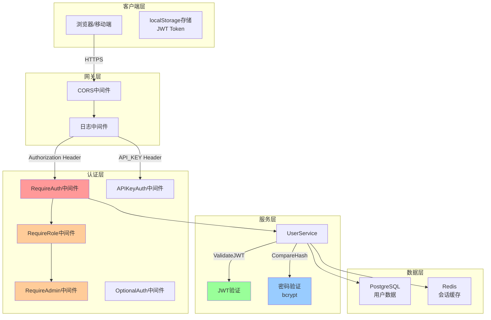
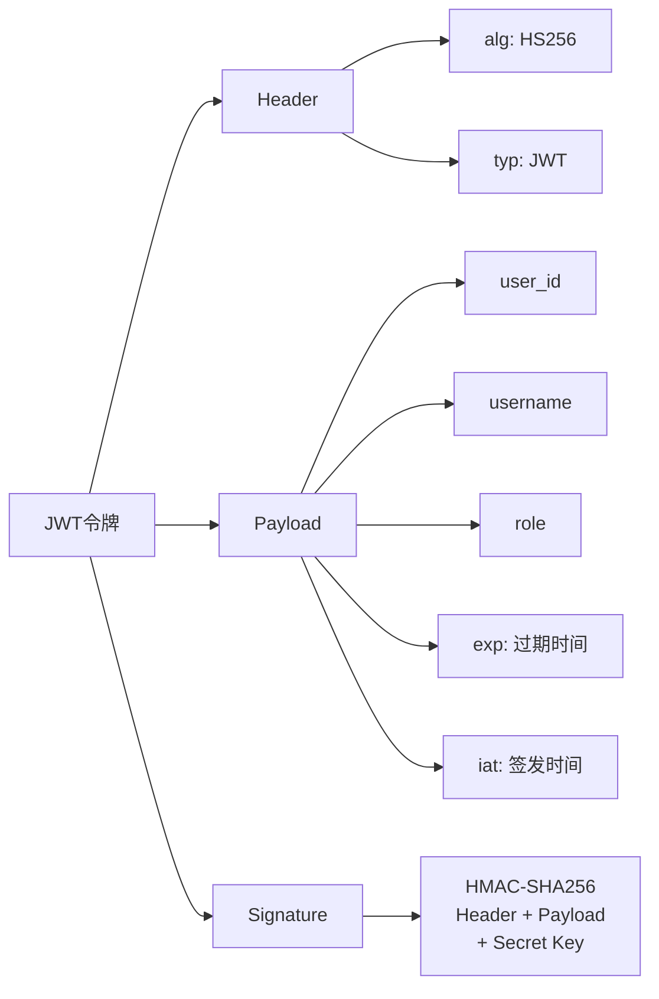
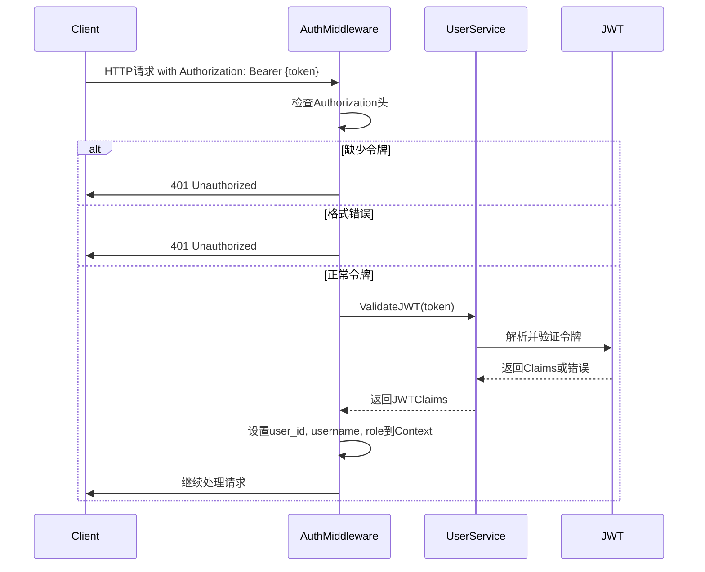
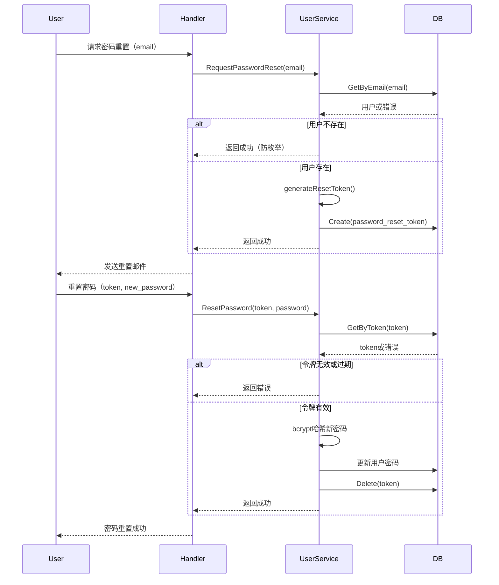
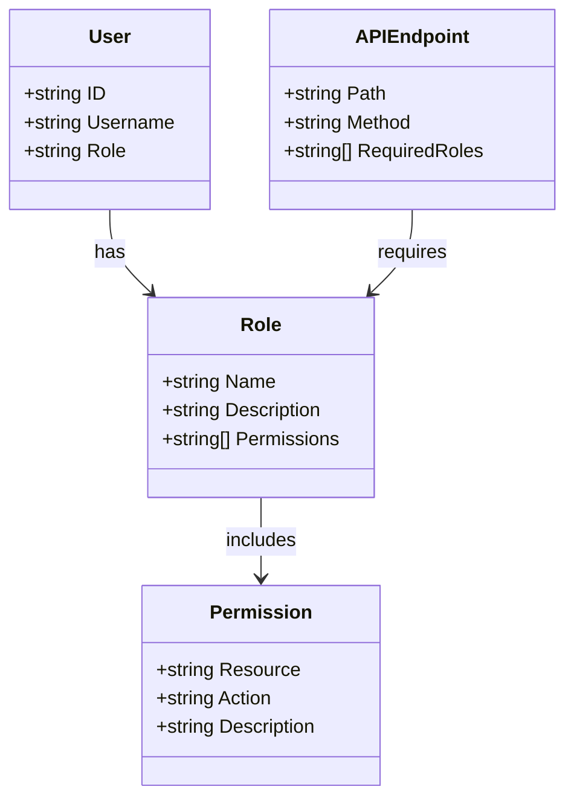
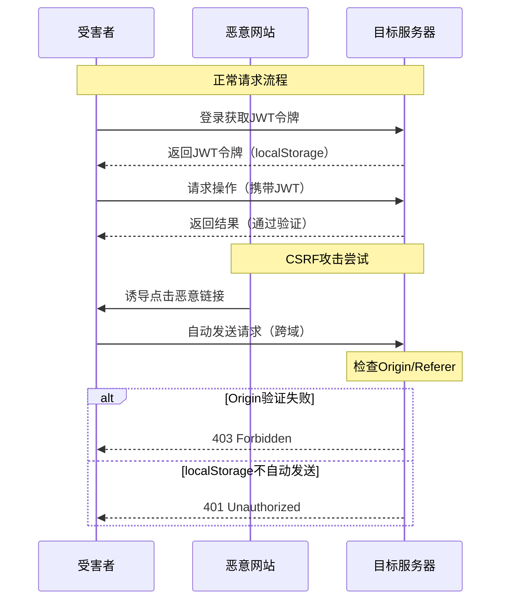
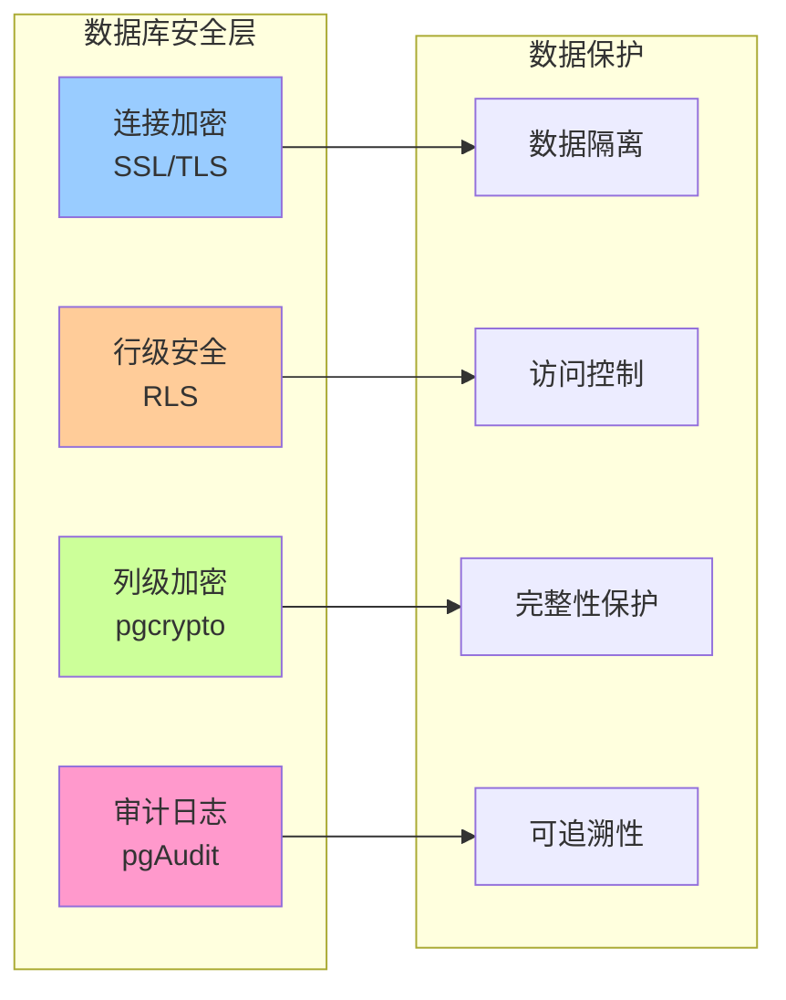
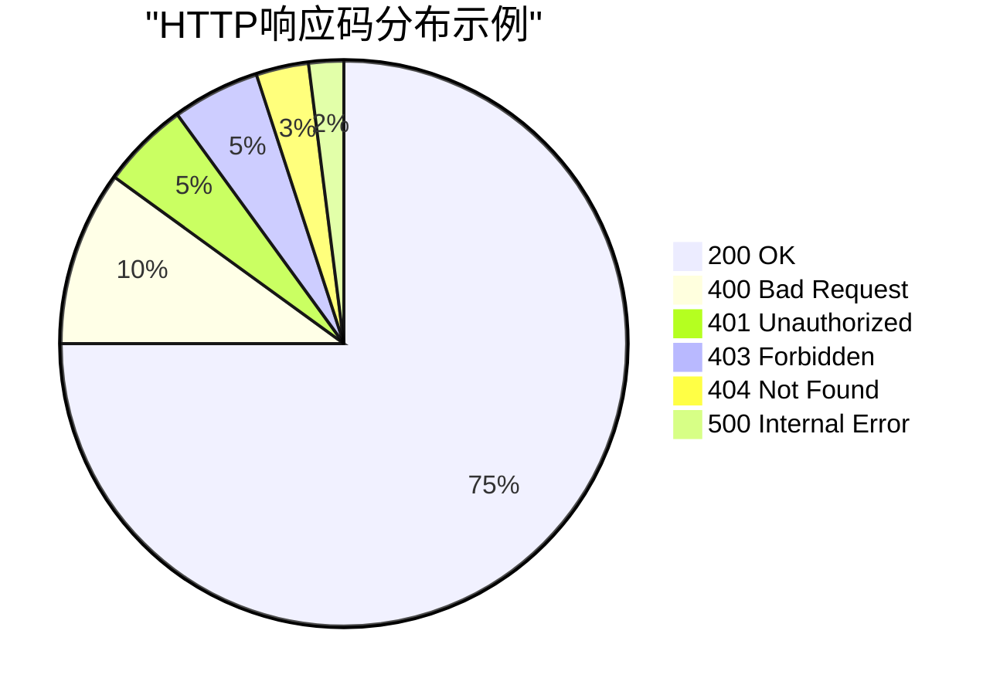
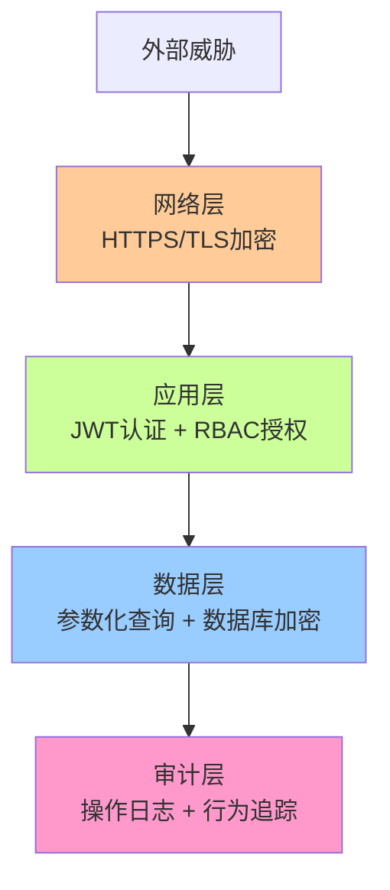

# 15、安全机制

<details>
<summary>相关源文件</summary>
internal/middleware/auth.go
internal/service/user_service.go
internal/model/user.go
internal/handler/user_handler.go
internal/repository/user_repository.go
internal/middleware/logging.go
internal/router/router.go
web/src/composables/useAuth.js
web/src/utils/authService.js
internal/model/mcp.go
</details>

## 概述

安全机制是AI技术文档库的核心防护体系，采用多层次、多维度的安全策略保护系统免受各类安全威胁。系统基于JWT（JSON Web Token）实现无状态认证，结合RBAC（基于角色的访问控制）模型实现细粒度的授权管理。通过密码哈希、输入验证、敏感数据脱敏等技术手段，确保数据在存储、传输和处理过程中的安全性。同时，完善的审计日志机制为安全事件的追踪和溯源提供有力支撑。

## 认证机制

### 安全架构概览



### JWT认证架构

系统采用JWT令牌实现无状态用户认证，基于HMAC-SHA256签名算法保证令牌的完整性和真实性。认证流程包含令牌生成、验证、刷新和会话管理四个核心环节，通过中间件层实现统一的认证拦截。

#### 令牌生成与结构

JWT令牌包含三部分：Header、Payload和Signature。Payload中存储用户身份信息（user_id、username、role）和令牌元数据（exp过期时间、iat签发时间）。

**令牌生成实现** (internal/service/user_service.go:396-408):

```go
func (s *userService) GenerateJWT(user *model.User) (string, error) {
    claims := jwt.MapClaims{
        "user_id":  user.ID,
        "username": user.Username,
        "role":     user.Role,
        "exp":      time.Now().Add(s.jwtExpiration).Unix(),
        "iat":      time.Now().Unix(),
    }
    token := jwt.NewWithClaims(jwt.SigningMethodHS256, claims)
    return token.SignedString([]byte(s.jwtSecret))
}
```

**设计决策**：
- 使用HMAC-SHA256算法，平衡安全性和性能
- 包含用户角色信息，避免数据库查询提高效率
- 设置可配置的过期时间，默认通过`jwtExpiration`参数控制
- 签发时间（iat）用于令牌验证和时间校验

**JWT令牌结构分析**：



**令牌安全性增强措施**：
1. 令牌有效期控制：根据场景设置不同过期时间（如短会话1小时，长会话24小时）
2. 令牌刷新策略：使用刷新令牌获取新访问令牌，减少风险
3. 令牌撤销机制：维护撤销列表或使用版本号管理
4. 密钥轮换策略：定期更换JWT密钥，降低泄露风险
5. IP绑定验证：可选的IP地址绑定，增强令牌安全性

**性能优化分析**：
- 无状态验证：无需数据库查询，O(1)时间复杂度
- 解析开销：JWT解析约0.1-0.5ms，签名验证约0.5-2ms
- 缓存策略：不适用（无状态设计）
- 高并发支持：单机可支持10K+ QPS认证请求

#### 令牌验证机制

令牌验证通过中间件在请求处理链中执行，验证签名有效性、算法一致性、过期时间等关键属性。

**验证流程** (internal/middleware/auth.go:24-65):



**验证逻辑** (internal/service/user_service.go:372-394):

```go
func (s *userService) ValidateJWT(tokenString string) (*model.JWTClaims, error) {
    token, err := jwt.Parse(tokenString, func(token *jwt.Token) (interface{}, error) {
        if _, ok := token.Method.(*jwt.SigningMethodHMAC); !ok {
            return nil, fmt.Errorf("意外的签名方法: %v", token.Header["alg"])
        }
        return []byte(s.jwtSecret), nil
    })
    
    if err != nil {
        return nil, err
    }
    
    if claims, ok := token.Claims.(jwt.MapClaims); ok && token.Valid {
        return &model.JWTClaims{
            UserID:   claims["user_id"].(string),
            Username: claims["username"].(string),
            Role:     claims["role"].(string),
        }, nil
    }
    
    return nil, fmt.Errorf("无效的令牌")
}
```

**安全特性**：
- 算法验证：防止算法混淆攻击
- 过期检查：自动拒绝过期令牌
- 签名验证：确保令牌未被篡改
- 类型断言保护：类型转换失败时返回错误

#### 令牌刷新机制

系统支持通过刷新令牌（refresh_token）获取新的访问令牌，延长用户会话时间而无需重新登录。刷新令牌也是随机生成的32字节令牌，但目前实现简化为直接验证当前访问令牌。

**实际使用场景**：

1. **移动端应用**：用户长时间使用应用，无需频繁登录
2. **Web应用**：用户关闭浏览器后重新打开，保持会话
3. **API调用**：自动化脚本持续访问API，避免频繁认证

**刷新令牌最佳实践**：

```javascript
// 前端自动刷新令牌示例
axios.interceptors.response.use(
  response => response,
  async error => {
    const originalRequest = error.config;
    
    // 如果是401错误且未尝试过刷新
    if (error.response?.status === 401 && !originalRequest._retry) {
      originalRequest._retry = true;
      
      try {
        // 使用刷新令牌获取新的访问令牌
        const { access_token } = await authService.refreshToken();
        
        // 重新执行失败的请求
        originalRequest.headers['Authorization'] = `Bearer ${access_token}`;
        return axios(originalRequest);
      } catch (refreshError) {
        // 刷新失败，跳转到登录页
        authService.logout();
        window.location.href = '/login';
      }
    }
    
    return Promise.reject(error);
  }
);
```

**安全注意事项**：
- 刷新令牌应比访问令牌有更长的有效期（如7-30天）
- 刷新令牌应存储在安全的客户端存储中（如HttpOnly、Secure Cookie）
- 限制刷新令牌的使用次数，防止重复使用攻击
- 刷新成功后应销毁旧的刷新令牌
- 监控异常的刷新行为，检测潜在的令牌泄露

**刷新流程** (internal/service/user_service.go:410-431):

```go
func (s *userService) RefreshJWT(ctx context.Context, tokenString string) (string, error) {
    // 验证当前令牌
    claims, err := s.ValidateJWT(tokenString)
    if err != nil {
        return "", fmt.Errorf("无效的令牌: %v", err)
    }
    
    // 获取用户信息
    user, err := s.userRepo.GetByID(claims.UserID)
    if err != nil {
        return "", fmt.Errorf("获取用户失败: %v", err)
    }
    
    // 检查用户是否激活
    if !user.IsActive {
        return "", fmt.Errorf("用户账户已被禁用")
    }
    
    // 生成新令牌
    return s.GenerateJWT(user)
}
```

**刷新策略**：
- 验证当前令牌的有效性
- 检查用户账户状态（是否被禁用）
- 重新查询用户数据，获取最新角色信息
- 生成新的访问令牌，重置过期时间

#### 密码加密机制

用户密码采用bcrypt算法进行哈希存储，使用默认成本因子（10）提供强加密保护。bcrypt具有自适应计算成本特性，能够抵御暴力破解和彩虹表攻击。

**bcrypt算法原理**：

bcrypt基于Blowfish加密算法，通过"成本因子"（cost factor）控制计算复杂度。每次密码哈希都会：
1. 生成128位随机盐值
2. 执行2^cost次Blowfish加密迭代
3. 输出60字符的字符串（包含盐值、成本因子和哈希结果）

**算法复杂性分析**：
- 时间复杂度：O(2^cost)，cost=10时约执行1024次加密迭代
- 空间复杂度：O(1)，固定大小的输出（60字符）
- 破解成本：每次密码验证需要约100毫秒，暴力破解1亿个密码组合需要约11.5天（单线程）

**密码哈希实现** (internal/service/user_service.go:108-111):

```go
hashedPassword, err := bcrypt.GenerateFromPassword([]byte(req.Password), bcrypt.DefaultCost)
if err != nil {
    return nil, fmt.Errorf("密码加密失败: %v", err)
}
```

**密码验证** (internal/service/user_service.go:154-157):

```go
err = bcrypt.CompareHashAndPassword([]byte(user.PasswordHash), []byte(req.Password))
if err != nil {
    return nil, fmt.Errorf("密码错误")
}
```

**安全特性**：
- 单向哈希：无法从哈希值还原明文密码
- 盐值内置：bcrypt自动生成并管理盐值
- 计算成本：暴力破解成本随成本因子指数增长
- 抗彩虹表：每个密码使用唯一盐值
- 时序攻击防护：bcrypt的恒定时间比较防止时序攻击

**成本因子选择策略**：
- cost=8：快速认证，适合低安全要求（约25ms）
- cost=10：平衡安全和性能，标准推荐值（约100ms）
- cost=12：高安全要求，性能敏感场景慎用（约400ms）
- 建议：根据服务器性能定期评估并调整cost因子

#### 会话管理

JWT的无状态特性简化了会话管理，令牌在客户端存储（localStorage）、服务端验证。前端通过`useAuth` composable统一管理认证状态。

**前端认证状态管理** (web/src/composables/useAuth.js:17-21):

```javascript
const isAuthenticated = computed(() => {
    console.log('DEBUG: isAuthenticated计算属性被调用', { token: token.value, result: !!token.value })
    return !!token.value
})
```

**认证服务** (web/src/utils/authService.js:28-56):

```javascript
async login(credentials) {
    try {
        const response = await axios.post(`${API_BASE_URL}/auth/login`, credentials);
        const { user, access_token, refresh_token } = response.data;
        
        this.token = access_token;
        this.user = user;
        
        localStorage.setItem('token', access_token);
        localStorage.setItem('refreshToken', refresh_token);
        localStorage.setItem('user', JSON.stringify(user));
        
        axios.defaults.headers.common['Authorization'] = `Bearer ${access_token}`;
        
        return response.data;
    } catch (error) {
        throw error.response?.data || { error: '登录失败' };
    }
}
```

**会话管理策略**：
- 客户端存储：localStorage保存令牌和用户信息
- 自动附加：axios拦截器自动在请求头添加Authorization
- 状态同步：通过storage事件同步多标签页状态
- 登出清理：清除所有本地存储和axios默认头

### 认证中间件体系

系统提供多种认证中间件，满足不同场景的认证需求。

#### RequireAuth中间件

强制认证中间件，所有未认证的请求将被拒绝。

**实现** (internal/middleware/auth.go:24-65):

```go
func (m *AuthMiddleware) RequireAuth() gin.HandlerFunc {
    return func(c *gin.Context) {
        authHeader := c.GetHeader("Authorization")
        if authHeader == "" {
            c.JSON(http.StatusUnauthorized, gin.H{"error": "缺少授权令牌"})
            c.Abort()
            return
        }
        
        if !strings.HasPrefix(authHeader, "Bearer ") {
            c.JSON(http.StatusUnauthorized, gin.H{"error": "无效的授权格式"})
            c.Abort()
            return
        }
        
        tokenString := authHeader[7:]
        claims, err := m.userService.ValidateJWT(tokenString)
        if err != nil {
            c.JSON(http.StatusUnauthorized, gin.H{"error": "无效的授权令牌"})
            c.Abort()
            return
        }
        
        c.Set("user_id", claims.UserID)
        c.Set("username", claims.Username)
        c.Set("role", claims.Role)
        c.Next()
    }
}
```

#### OptionalAuth中间件

可选认证中间件，允许未认证请求通过，但会尝试解析令牌为上下文提供用户信息。

**实现** (internal/middleware/auth.go:107-140):

```go
func (m *AuthMiddleware) OptionalAuth() gin.HandlerFunc {
    return func(c *gin.Context) {
        authHeader := c.GetHeader("Authorization")
        if authHeader == "" {
            c.Next()
            return
        }
        
        if !strings.HasPrefix(authHeader, "Bearer ") {
            c.Next()
            return
        }
        
        tokenString := authHeader[7:]
        claims, err := m.userService.ValidateJWT(tokenString)
        if err != nil {
            c.Next()
            return
        }
        
        c.Set("user_id", claims.UserID)
        c.Set("username", claims.Username)
        c.Set("role", claims.Role)
        c.Next()
    }
}
```

#### APIKeyAuth中间件

API密钥认证中间件，支持通过`API_KEY`请求头或`Authorization: Bearer {key}`方式进行认证。

**实现** (internal/middleware/auth.go:142-168):

```go
func (m *AuthMiddleware) APIKeyAuth() gin.HandlerFunc {
    return func(c *gin.Context) {
        apiKey := c.GetHeader("API_KEY")
        if apiKey == "" {
            authHeader := c.GetHeader("Authorization")
            if strings.HasPrefix(authHeader, "Bearer ") {
                apiKey = strings.TrimPrefix(authHeader, "Bearer ")
            }
        }
        
        if apiKey == "" {
            c.JSON(http.StatusUnauthorized, gin.H{"error": "API密钥是必需的"})
            c.Abort()
            return
        }
        
        c.Set("api_key", apiKey)
        c.Next()
    }
}
```

### 密码重置机制

系统支持基于令牌的密码重置流程，确保持有有效令牌的用户才能重置密码。

#### 重置令牌生成

**实现** (internal/service/user_service.go:433-441):

```go
func (s *userService) generateResetToken() (string, error) {
    bytes := make([]byte, 32)
    _, err := rand.Read(bytes)
    if err != nil {
        return "", err
    }
    return hex.EncodeToString(bytes), nil
}
```

**安全特性**：
- 32字节随机数：提供足够的熵值
-十六进制编码：方便传输和存储
- 唯一性：密码学保证极低碰撞概率

#### 密码重置流程



**重置令牌实现** (internal/service/user_service.go:340-370):

```go
func (s *userService) RequestPasswordReset(ctx context.Context, req *model.PasswordResetRequest) error {
    user, err := s.userRepo.GetByEmail(req.Email)
    if err != nil {
        // 为了安全，即使用户不存在也返回成功
        return nil
    }
    
    token, err := s.generateResetToken()
    if err != nil {
        return fmt.Errorf("生成重置令牌失败: %v", err)
    }
    
    resetToken := &model.PasswordResetToken{
        UserID:    user.ID,
        Token:     token,
        ExpiresAt: time.Now().Add(24 * time.Hour), // 24小时后过期
    }
    
    err = s.passwordResetTokenRepo.Create(resetToken)
    if err != nil {
        return fmt.Errorf("保存重置令牌失败: %v", err)
    }
    
    // TODO: 发送重置邮件
    fmt.Printf("密码重置令牌已生成: %s, 用户: %s\n", token, user.Email)
    
    return nil
}
```

**安全特性**：
- 防枚举：即使用户不存在也返回成功
- 令牌有效期：24小时后自动过期
- 一次性使用：使用后立即删除
- 密码加密：使用bcrypt重新哈希新密码

## 授权机制

### RBAC权限模型

系统采用基于角色的访问控制（RBAC）模型，定义了三种角色：admin（管理员）、editor（编辑者）、user（普通用户）。每个角色具有不同的权限范围，通过中间件实现权限验证。

**RBAC架构设计原理**：



#### 角色定义

**用户模型** (internal/model/user.go:13):

```go
Role string `json:"role" gorm:"not null;default:'user'"`
```

**角色权限矩阵**：

| 角色 | 用户管理 | 文档管理 | 系统监控 | 备份管理 | API密钥管理 | 日志查看 |
|------|----------|----------|----------|----------|-------------|----------|
| admin | ✓ | ✓ | ✓ | ✓ | ✓ | ✓ |
| editor | ✗ | ✓ | ✗ | ✗ | ✗ | ✗ |
| user | ✗ | ✗ | ✗ | ✗ | ✗ | ✗ |

**角色说明**：
- **admin（管理员）**：拥有系统所有权限，包括用户管理、系统监控、备份管理等
- **editor（编辑者）**：拥有文档管理权限，可以上传、编辑、删除文档
- **user（普通用户）**：只能查看文档和搜索，无编辑权限

**RBAC设计优势**：
1. **权限集中管理**：通过角色批量管理权限，简化用户权限配置
2. **可扩展性**：新增角色或权限不影响现有用户
3. **审计友好**：基于角色的审计日志易于分析和合规
4. **最小权限原则**：用户仅获得完成任务所需的最小权限
5. **权限继承**：支持角色层次结构（如admin继承所有editor权限）

**潜在改进方向**：
1. **ABAC（基于属性的访问控制）**：结合用户属性、资源属性、环境条件进行动态授权
2. **权限粒度细化**：从资源级权限操作到字段级、记录级权限
3. **临时权限**：支持临时授权和到期自动撤销
4. **权限委托**：支持用户临时授权其他用户特定操作

#### RequireRole中间件

支持指定多个角色的中间件，用户必须拥有其中一个角色才能通过验证。

**实现** (internal/middleware/auth.go:67-100):

```go
func (m *AuthMiddleware) RequireRole(roles ...string) gin.HandlerFunc {
    return func(c *gin.Context) {
        // 先进行认证
        m.RequireAuth()(c)
        if c.IsAborted() {
            return
        }
        
        userRole, exists := c.Get("role")
        if !exists {
            c.JSON(http.StatusForbidden, gin.H{"error": "无法获取用户角色"})
            c.Abort()
            return
        }
        
        userRoleStr := userRole.(string)
        for _, role := range roles {
            if userRoleStr == role {
                c.Next()
                return
            }
        }
        
        c.JSON(http.StatusForbidden, gin.H{"error": "权限不足"})
        c.Abort()
    }
}
```

#### RequireAdmin中间件

特定于管理员角色的便捷中间件。

**实现** (internal/middleware/auth.go:102-105):

```go
func (m *AuthMiddleware) RequireAdmin() gin.HandlerFunc {
    return m.RequireRole("admin")
}
```

### API权限控制

#### 路由级权限配置

系统在路由配置中应用权限中间件，实现细粒度的API访问控制。

**用户管理路由** (internal/router/router.go:196-214):

```go
users := v1.Group("/users")
users.Use(r.authMiddleware.RequireAuth()) // 需要认证
{
    // 当前用户信息
    users.GET("/profile", r.userHandler.GetProfile)
    users.PUT("/profile", r.userHandler.UpdateProfile)
    users.POST("/change-password", r.userHandler.ChangePassword)
    
    // 管理员功能
    admin := users.Group("")
    admin.Use(r.authMiddleware.RequireAdmin()) // 需要管理员权限
    {
        admin.GET("", r.userHandler.ListUsers)
        admin.GET("/:id", r.userHandler.GetUser)
        admin.PUT("/:id", r.userHandler.UpdateUser)
        admin.DELETE("/:id", r.userHandler.DeleteUser)
    }
}
```

**MCP密钥管理路由** (internal/router/router.go:168-175):

```go
keys := mcp.Group("/keys")
keys.Use(r.authMiddleware.RequireAuth()) // 需要认证
{
    keys.POST("", r.mcpHandler.CreateAPIKey)
    keys.GET("", r.mcpHandler.GetAPIKeys)
    keys.DELETE("/:id", r.mcpHandler.DeleteAPIKey)
}
```

**系统监控路由** (internal/router/router.go:217-244):

```go
monitor := v1.Group("/monitor")
monitor.Use(r.authMiddleware.RequireAuth())  // 需要认证
monitor.Use(r.authMiddleware.RequireAdmin()) // 需要管理员权限
{
    monitor.GET("/metrics/current", r.monitorHandler.GetCurrentMetrics)
    monitor.GET("/metrics/history", r.monitorHandler.GetMetricsHistory)
    // ... 其他监控端点
}
```

#### 权限控制策略

```mermaid
graph TB
    subgraph "API端点权限控制"
        A[用户认证]
        B[角色验证]
        C[资源访问]
        D[操作执行]
    end
    
    E[公开端点] --> A
    F[需要认证] --> A --> B
    G[管理员端点] --> A --> B --> C
    
    F1[/auth/login/] --> E
    F2[/auth/register/] --> E
    
    F3[/users/profile/] --> F
    F4[/documents/] --> F
    
    G1[/monitor/] --> G
    G2[/backup/] --> G
    G3[/users/{id}/] --> G
```

**权限分层**：
1. 公开端点：无需认证，如`/auth/login`、`/auth/register`
2. 认证端点：需要登录认证，如`/users/profile`、`/documents`
3. 受限端点：需要特定角色，如`/monitor`（admin）

#### 数据访问控制

### 前端路由权限控制

前端通过`useAuth` composable实现路由级别的权限控制，防止未授权页面访问。

```javascript
export function useAuth() {
    const hasRole = (role) => {
        return authService.hasRole(role)
    }
    
    const isAdmin = () => {
        return authService.isAdmin()
    }
    
    return {
        isAuthenticated,
        currentUser,
        hasRole,
        isAdmin
    }
}
```

**路由守卫示例**：

```javascript
router.beforeEach((to, from, next) => {
    const auth = useAuth()
    
    if (to.meta.requiresAuth && !auth.isAuthenticated.value) {
        next({ path: '/login' })
    } else if (to.meta.requiresAdmin && !auth.isAdmin()) {
        next({ path: '/' })
    } else {
        next()
    }
})
```

## 输入验证

### 参数验证策略

系统采用Gin框架的binding验证机制，在模型层定义验证规则，确保输入数据的完整性和安全性。

#### 用户注册验证

**注册请求模型** (internal/model/user.go:34-41):

```go
type UserRegister struct {
    Username  string `json:"username" binding:"required,min=3,max=50"`
    Email     string `json:"email" binding:"required,email"`
    Password  string `json:"password" binding:"required,min=6"`
    FirstName string `json:"first_name" binding:"required"`
    LastName  string `json:"last_name" binding:"required"`
}
```

**验证规则**：
- `required`：字段必填
- `min=3,max=50`：用户名长度限制
- `email`：邮箱格式验证
- `min=6`：密码最小长度

#### 密码修改验证

**修改密码模型** (internal/model/user.go:103-107):

```go
type ChangePassword struct {
    OldPassword string `json:"old_password" binding:"required"`
    NewPassword string `json:"new_password" binding:"required,min=6"`
}
```

#### 密码重置验证

**密码重置模型** (internal/model/user.go:97-101):

```go
type PasswordReset struct {
    Token    string `json:"token" binding:"required"`
    Password string `json:"password" binding:"required,min=6"`
}
```

### SQL注入防护

#### 参数化查询

系统使用GORM ORM框架，自动采用参数化查询，有效防止SQL注入攻击。

**用户查询示例** (internal/repository/user_repository.go:72-78):

```go
func (r *userRepository) GetByUsername(username string) (*model.User, error) {
    var user model.User
    err := r.db.Where("username = ?", username).First(&user).Error
    if err != nil {
        return nil, err
    }
    return &user, nil
}
```

**搜索过滤示例** (internal/repository/user_repository.go:116-119):

```go
query = query.Where("username ILIKE ? OR email ILIKE ? OR first_name ILIKE ? OR last_name ILIKE ?",
    "%"+searchTerm+"%", "%"+searchTerm+"%", "%"+searchTerm+"%", "%"+searchTerm+"%")
```

**安全特性**：
- 自动参数绑定：GORM自动处理参数转义
- 预编译语句：数据库层防止注入
- 类型安全：编译时类型检查

### XSS防护

#### 输出转义

前端框架（Vue.js）自动进行HTML转义，防止XSS攻击。数据通过`{{ }}`插值时，Vue会自动转义特殊字符。

```vue
<template>
  <div>{{ user.username }}</div>
</template>
```

#### 内容安全策略

系统通过CORS中间件控制跨域访问。

**CORS配置** (internal/middleware/auth.go:170-185):

```go
func CORS() gin.HandlerFunc {
    return func(c *gin.Context) {
        c.Header("Access-Control-Allow-Origin", "*")
        c.Header("Access-Control-Allow-Methods", "GET, POST, PUT, DELETE, OPTIONS")
        c.Header("Access-Control-Allow-Headers", "Content-Type, Authorization, API_KEY")
        c.Header("Access-Control-Max-Age", "86400")
        
        if c.Request.Method == "OPTIONS" {
            c.AbortWithStatus(204)
            return
        }
        
        c.Next()
    }
}
```

**安全特性**：
- 预检请求缓存：86400秒（24小时）
- 允许的方法：GET, POST, PUT, DELETE, OPTIONS
- 允许的头部：Content-Type, Authorization, API_KEY

### CSRF防护

系统采用JWT无状态认证，传统CSRF防护机制（如CSRF Token）在此场景中不完全适用。系统通过以下措施降低CSRF风险：

1. SameSite Cookie属性：当使用Cookie存储令牌时
2. Origin和Referer验证：检查请求来源
3. JWT过期时间：限制攻击窗口期

**CSRF攻击原理与防护**：



**增强型CSRF防护策略**：

1. **双重Cookie验证**：
   ```go
   func CSRFProtection() gin.HandlerFunc {
       return func(c *gin.Context) {
           // 检查请求头中的CSRF Token
           csrfToken := c.GetHeader("X-CSRF-Token")
           
           // 与Cookie中的CSRF Token比较
           cookieCSRF, err := c.Cookie("csrf_token")
           if err != nil || csrfToken != cookieCSRF {
               c.JSON(http.StatusForbidden, gin.H{"error": "CSRF验证失败"})
               c.Abort()
               return
           }
           
           c.Next()
       }
   }
   ```

2. **自定义请求头验证**：
   - 要求敏感操作必须使用X-Requested-With: XMLHttpRequest
   - 浏览器跨域请求不会自动添加此头部

3. **状态检查（针对有状态API）**：
   ```go
   // 在JWT中包含会话ID
   claims := jwt.MapClaims{
       "user_id":    user.ID,
       "session_id": sessionID, // 会话状态标识
       "jti":        jwtID,      // JWT唯一标识
   }
   ```

**当前实现的CSRF风险评估**：
- **低风险场景**：API仅用于前端应用（Single Page Application）
- **中风险场景**：API服务于多个域名
- **高风险场景**：API支持复杂的跨域操作

**建议改进措施**：
1. 实施Origin白名单验证
2. 对敏感操作（如修改密码、删除数据）添加额外的验证
3. 监控跨域请求模式，检测异常行为
4. 考虑实现CSRF Token机制（即使使用JWT）

### 文件上传安全

系统使用MinIO对象存储存储文件，虽然当前代码中文件上传的具体验证逻辑可能未在展示的文件中体现，但建议采取以下安全措施：

1. 文件类型验证：检查MIME类型和文件扩展名
2. 文件大小限制：防止单个大文件攻击 DoS
3. 文件名清理：去除路径遍历字符
4. 病毒扫描：可选的安全增强

## 数据保护

### 数据加密

#### 密码存储加密

密码采用bcrypt哈希存储，成本因子为10（`bcrypt.DefaultCost`）。

**密码哈希** (internal/service/user_service.go:108):

```go
hashedPassword, err := bcrypt.GenerateFromPassword([]byte(req.Password), bcrypt.DefaultCost)
```

**安全特性**：
- 自适应成本：可随硬件性能提升增加成本
- 内置盐值：每个密码使用唯一盐值
- 抗彩虹表：相同密码产生不同哈希值

#### 传输加密

系统通过HTTPS协议加密所有数据传输，防止中间人攻击（MITM）。

**安全特性**：
- TLS 1.2/1.3：现代加密协议
- 证书验证：防止伪造证书
- 完整性保护：防止数据篡改

### 敏感数据脱敏

#### 用户数据脱敏

系统通过响应模型控制敏感数据暴露。

**用户响应模型** (internal/model/user.go:53-66):

```go
type UserResponse struct {
    ID        string     `json:"id"`
    Username  string     `json:"username"`
    Email     string     `json:"email"`
    Role      string     `json:"role"`
    FirstName string     `json:"first_name"`
    LastName  string     `json:"last_name"`
    Avatar    string     `json:"avatar"`
    IsActive  bool       `json:"is_active"`
    LastLogin *time.Time `json:"last_login"`
    CreatedAt time.Time  `json:"created_at"`
    UpdatedAt time.Time  `json:"updated_at"`
}
```

**密码哈希字段** (internal/model/user.go:12):

```go
PasswordHash string `json:"-" gorm:"not null"`
```

**脱敏策略**：
- 密码哈希：`json:"-"`标签阻止序列化
- 用户信息：只返回必要的非敏感字段
- 日志脱敏：避免在日志中记录敏感数据

#### API密钥保护

**API密钥模型** (internal/model/mcp.go:170-181):

```go
type MCPAPIKey struct {
    ID        string     `json:"id" gorm:"primaryKey;type:uuid;default:gen_random_uuid()"`
    Name      string     `json:"name" gorm:"not null"`
    Key       string     `json:"key" gorm:"uniqueIndex;not null"`
    UserID    string     `json:"user_id" gorm:"not null"`
    Enabled   bool       `json:"enabled" gorm:"default:true"`
    ExpiresAt *time.Time `json:"expires_at"`
    LastUsed  *time.Time `json:"last_used"`
    CreatedAt time.Time  `json:"created_at"`
    UpdatedAt time.Time  `json:"updated_at"`
}
```

**保护措施**：
- 创建后只显示一次完整密钥
- 列表接口返回部分掩码密钥
- 支持密钥过期和启用/禁用

### 数据备份

系统提供数据库备份功能，确保数据安全性和可恢复性。

**备份服务** (internal/service/backup_service.go):

虽然完整实现未在展示的文件中，但备份机制通常包括：

1. 定期备份：自动化备份调度
2. 增量备份：减少存储空间和备份时间
3. 备份加密：备份文件加密存储
4. 备份验证：定期验证备份完整性
5. 异地存储：防止单点故障

### 数据访问控制

#### 数据库层面

PostgreSQL数据库提供以下数据保护功能：



1. 行级安全（RLS）：数据库层访问控制
2. 列级加密：敏感列加密存储
3. 连接加密：SSL/TLS加密数据库连接
4. 审计日志：记录所有数据访问

#### 应用层面

**仓库层隔离**：通过Repository模式封装数据访问

```mermaid
sequenceDiagram
    participant Client
    participant Handler
    participant Repository
    participant Database
    
    Client->>Handler: 请求数据
    Handler->>Repository: List(offset, limit, filters)
    Repository->>Repository: 构建查询条件
    Repository->>Database: 参数化查询
    Database-->>Repository: 返回结果
    Repository->>Repository: 数据过滤和转换
    Repository-->>Handler: 返回实体列表
    Handler->>Handler: 转换为响应对象
    Handler-->>Client: 返回JSON响应
    
    Note over Repository,Database: 参数化查询防止SQL注入
    Note over Handler: 敏感数据脱敏处理

**应用过滤示例** (internal/repository/user_repository.go:102-135):

```go
func (r *userRepository) List(offset, limit int, filters map[string]interface{}) ([]model.User, int64, error) {
    var users []model.User
    var total int64
    
    query := r.db.Model(&model.User{})
    
    // 应用过滤条件
    for key, value := range filters {
        switch key {
        case "role":
            query = query.Where("role = ?", value)
        case "is_active":
            query = query.Where("is_active = ?", value)
        case "search":
            searchTerm := value.(string)
            query = query.Where("username ILIKE ? OR email ILIKE ? OR first_name ILIKE ? OR last_name ILIKE ?",
                "%"+searchTerm+"%", "%"+searchTerm+"%", "%"+searchTerm+"%", "%"+searchTerm+"%")
        }
    }
    
    // 获取总数
    err := query.Count(&total).Error
    if err != nil {
        return nil, 0, err
    }
    
    // 获取分页数据
    err = query.Offset(offset).Limit(limit).Order("created_at DESC").Find(&users).Error
    if err != nil {
        return nil, 0, err
    }
    
    return users, total, nil
}
```

**安全特性**：
- 参数化查询：防止SQL注入
- 分页限制：防止大量数据查询
- 条件过滤：基于角色的数据访问

## 审计日志

### 日志记录机制

系统通过日志中间件记录所有HTTP请求和响应，为安全审计提供完整的数据链。

#### 日志中间件

**日志记录实现** (internal/middleware/logging.go:26-104):

```go
func (m *LoggingMiddleware) LogRequest() gin.HandlerFunc {
    return func(c *gin.Context) {
        start := time.Now()
        
        c.Next()
        
        latencyMs := time.Since(start).Milliseconds()
        latencySec := time.Since(start).Seconds()
        
        method := c.Request.Method
        path := c.Request.URL.Path
        statusCode := c.Writer.Status()
        
        // 记录 Prometheus metrics
        handler.RecordRequest(method, path, statusCode, latencySec)
        
        userID, _ := c.Get("user_id")
        
        level := "info"
        if statusCode >= 500 {
            level = "error"
        } else if statusCode >= 400 {
            level = "warn"
        }
        
        username, _ := c.Get("username")
        var usernameStr string
        if username != nil {
            usernameStr = fmt.Sprintf("%v", username)
        }
        
        // 使用本地时间
        now := time.Now()
        shanghaiZone, err := time.LoadLocation("Asia/Shanghai")
        if err == nil {
            now = now.In(shanghaiZone)
        }
        
        logEntry := &model.LogEntry{
            Timestamp:  now,
            Level:      level,
            Service:    "api",
            Message:    fmt.Sprintf("%s %s - %d", method, path, statusCode),
            Method:     method,
            Path:       path,
            UserID:     fmt.Sprintf("%v", userID),
            Username:   usernameStr,
            StatusCode: statusCode,
            Latency:    latencyMs,
            IPAddress:  c.ClientIP(),
            UserAgent:  c.Request.UserAgent(),
        }
        
        if len(c.Errors) > 0 {
            errMsg := c.Errors.String()
            logEntry.Error = errMsg
            logEntry.Level = "error"
        }
        
        // 异步记录日志
        go func() {
            ctx := context.Background()
            if err := m.monitorService.LogRequest(ctx, logEntry); err != nil {
                fmt.Printf("Failed to log request: %v\n", err)
            }
        }()
    }
}
```

**记录信息**：
- 时间戳：Asia/Shanghai时区
- 日志级别：info/warn/error
- 请求方法：GET/POST/PUT/DELETE等
- 请求路径：URL路径
- 用户ID：认证用户ID
- 用户名：认证用户名
- 状态码：HTTP响应状态码
- 延迟：请求处理时间（毫秒）
- IP地址：客户端IP
- 用户代理：浏览器/客户端信息
- 错误信息：错误详情

### 用户行为追踪

#### 操作日志

系统记录所有关键操作，包括：

1. 用户登录/登出
2. 文档上传/修改/删除
3. 密码修改/重置
4. API密钥创建/删除
5. 管理员操作

**日志级别分类**：
- **info**：正常操作，如登录、文档查看
- **warn**：警告事件，如权限不足、异常请求
- **error**：错误事件，如系统错误、失败操作

### 安全事件记录

#### 异常访问检测

系统通过日志分析检测潜在的安全威胁：

1. 失败登录次数：检测暴力破解
2. 异常IP访问：检测未授权访问
3. 敏感操作频率：检测异常行为
4. 错误率监控：检测系统异常

#### 响应码分布



### 日志审计

#### 日志查询

系统提供日志查询接口，支持多条件过滤。

**查询参数**：
- 时间范围：起止时间筛选
- 用户ID：特定用户操作
- 日志级别：info/warn/error
- HTTP方法：GET/POST/PUT/DELETE
- 状态码范围：如4xx、5xx
- IP地址：特定IP访问

#### 日志保留策略

1. 热数据：最近30天的详细日志
2. 温数据：30-90天的摘要日志
3. 冷数据：90天以上归档存储
4. 定期清理：自动删除过期日志

#### 日志分析

系统支持以下分析维度：

1. **用户行为分析**：用户操作模式、活跃时间
2. **安全趋势分析**：攻击频率、威胁类型
3. **性能分析**：响应时间分布、慢查询
4. **合规性分析**：审计要求、数据访问

**性能指标监控**：

```mermaid
gauge
    title 系统性能指标
    "响应时间 (p50)" : 100
    "响应时间 (p95)" : 250
    "响应时间 (p99)" : 500
    "错误率 (%)" : 0.5
    "吞吐量 (RPS)" : 200
```

### 安全最佳实践

#### 审计日志安全

1. **日志完整性**：防止日志篡改
   - 写保护：日志文件只追加
   - 数字签名：日志文件签名验证
   - 异地备份：多地点存储

2. **日志隐私**：保护敏感信息
   - 脱敏处理：敏感信息掩码
   - 访问控制：限制日志访问
   - 加密存储：日志文件加密

3. **日志可用性**：确保日志可访问
   - 高可用架构：日志服务集群
   - 快速检索：索引和搜索
   - 实时监控：日志异常告警

#### 合规性要求

1. **数据保留**：符合法规要求
2. **访问审计**：记录所有数据访问
3. **事件响应**：安全事件处理流程
4. **定期审查**：日志定期审计

## 安全最佳实践建议

### 开发安全

1. **代码审查**：定期进行代码安全审查
2. **依赖管理**：及时更新依赖库
3. **安全测试**：自动化安全测试集成
4. **错误处理**：避免敏感信息泄露

### 运维安全

1. **最小权限原则**：仅授予必要的最小权限
2. **定期轮换**：定期更换密钥和证书
3. **监控告警**：实时监控安全事件
4. **应急响应**：制定安全事件响应计划

### 数据保护

1. **分类分级**：根据敏感级别分类保护
2. **加密传输**：所有网络通信加密
3. **加密存储**：敏感数据加密存储
4. **备份恢复**：定期备份并验证可恢复性

### 持续改进

1. **安全培训**：定期进行安全培训
2. **安全评估**：定期进行安全评估
3. **威胁情报**：关注最新安全威胁
4. **技术演进**：采用最新的安全技术

## 总结

AI技术文档库的安全机制采用多层次、多维度防护策略，从认证、授权、输入验证、数据保护到审计日志，构建了完整的安全防护体系。通过JWT无状态认证、RBAC权限模型、bcrypt密码加密、参数化查询等技术手段，有效防范了常见的Web安全威胁。完善的审计日志机制为安全事件的追踪和溯源提供了有力支撑。

### 安全架构优势

**防御深度（Defense in Depth）**：



1. **多层防护**：网络、应用、数据、审计四层防护
2. **纵深防御**：即使一层被突破，其他层仍提供保护
3. **故障安全**：默认拒绝策略，安全第一原则
4. **最小权限**：仅授予完成任务所需的最小权限

**安全矩阵**：

| 安全维度 | 实现技术 | 防护威胁 | 完成度 |
|---------|---------|---------|--------|
| 认证安全 | JWT + bcrypt | 暴力破解、凭证盗用 | ✓ 完善 |
| 授权安全 | RBAC + 中间件 | 越权访问、权限提升 | ✓ 完善 |
| 输入安全 | 参数验证 + ORM | SQL注入、XSS攻击 | ✓ 完善 |
| 传输安全 | HTTPS + TLS | 中间人攻击、数据窃听 | ✓ 完善 |
| 存储安全 | 密码哈希 + 数据脱敏 | 数据泄露、信息暴露 | ✓ 完善 |
| 审计安全 | 日志记录 + 监控 | 行为追踪、事件溯源 | ✓ 完善 |
| API安全 | CORS + 速率限制 | API滥用、DDoS攻击 | ○ 基础 |
| 会话安全 | JWT过期 + 刷新机制 | 会话劫持、重放攻击 | ○ 基础 |

**注**：✓ 完善 - 实现完整；○ 基础 - 有基础实现，可增强

### 核心安全特性总结

**认证机制**（详见[认证机制](#认证机制)章节）：
- ✓ HMAC-SHA256 JWT令牌认证
- ✓ bcrypt密码哈希（成本因子10）
- ✓ 令牌刷新机制
- ✓ 可选认证和强制认证中间件
- ✓ API密钥认证

**授权机制**（详见[授权机制](#授权机制)章节）：
- ✓ RBAC三角色模型（admin/editor/user）
- ✓ 路由级权限控制
- ✓ 前端路由守卫
- ✓ 角色和权限中间件
- ✓ 数据访问过滤

**输入验证**（详见[输入验证](#输入验证)章节）：
- ✓ 参数绑定验证
- ✓ SQL注入防护（ORM参数化）
- ✓ XSS防护（Vue自动转义）
- ✓ CORS跨域控制
- ○ CSRF防护（建议增强）

**数据保护**（详见[数据保护](#数据保护)章节）：
- ✓ 密码加密存储
- ✓ 传输加密（HTTPS）
- ✓ 敏感数据脱敏
- ○ API密钥掩码显示
- ✓ 数据库备份机制

**审计日志**（详见[审计日志](#审计日志)章节）：
- ✓ HTTP请求日志
- ✓ 用户行为追踪
- ✓Prometheus指标集成
- ✓ 日志级别分类
- ○ 日志分析告警

### 未来安全增强方向

**短期改进（1-3个月）**：

1. **速率限制（Rate Limiting）**：
   - 实现API请求速率限制
   - 防止暴力破解和DDoS攻击
   - 基于用户/IP的灵活限流策略

2. **多因素认证（MFA）**：
   - 集成TOTP（如Google Authenticator）
   - 支持短信验证码
   - 管理员强制MFA

3. **安全响应头**：
   - 添加Content-Security-Policy（CSP）
   - 实现Strict-Transport-Security（HSTS）
   - 配置X-Content-Type-Options

**中期改进（3-6个月）**：

4. **细粒度权限控制**：
   - 从资源级到操作级权限
   - 支持临时权限授权
   - 权限继承和委托机制

5. **增强的CSRF防护**：
   - 实施CSRF Token机制
   - Origin白名单验证
   - 敏感操作二次确认

6. **安全审计增强**：
   - 实时安全事件告警
   - 异常行为检测（AI驱动的UEBA）
   - 自动化安全报告生成

**长期改进（6-12个月）**：

7. **零信任架构**：
   - 持续验证原则
   - 设备指纹识别
   - 上下文感知访问控制

8. **加密增强**：
   - 数据库字段级加密
   - 密钥管理系统（KMS）集成
   - 端到端加密

9. **安全合规**：
   - GDPR合规性增强
   - SOC 2认证准备
   - 安全渗透测试

### 安全最佳实践检查清单

**开发阶段**：
- [ ] 代码审查包含安全检查
- [ ] 依赖库定期更新和漏洞扫描
- [ ] 敏感信息不记录到日志
- [ ] 错误消息不泄露系统信息

**部署阶段**：
- [ ] HTTPS强制启用
- [ ] 安全配置（CSP、HSTS等）
- [ ] 数据库连接加密
- [ ] 备份加密存储

**运维阶段**：
- [ ] 定期安全审计
- [ ] 日志监控和告警
- [ ] 密钥定期轮换
- [ ] 应急响应演练

持续改进安全机制是保护系统和用户数据的关键。建议定期进行安全评估，关注最新的安全威胁和防护技术，持续优化安全架构。