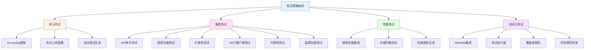
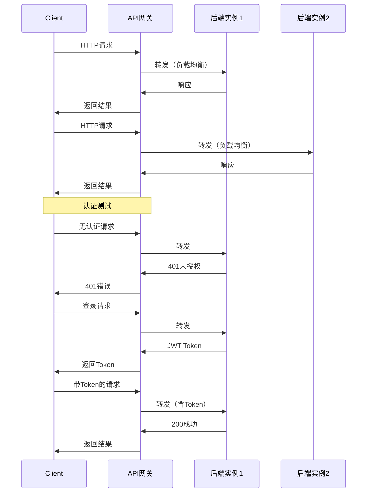
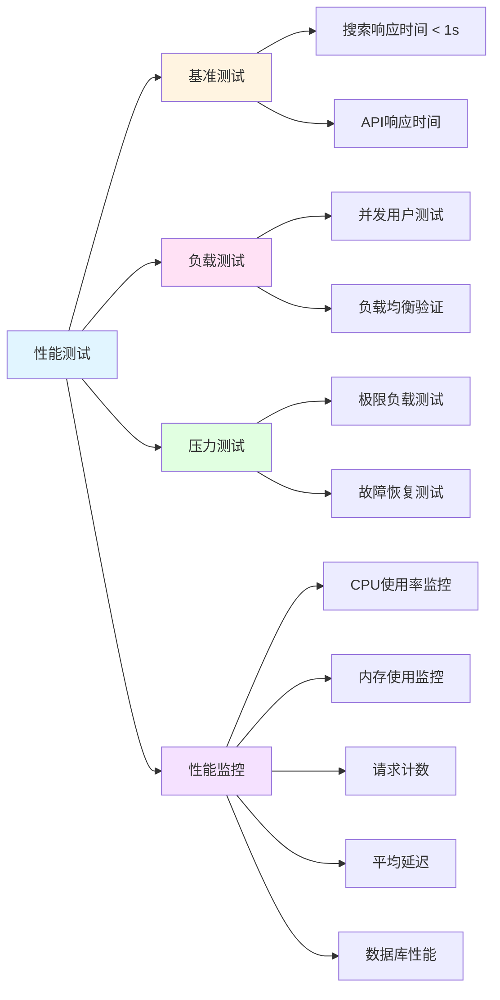
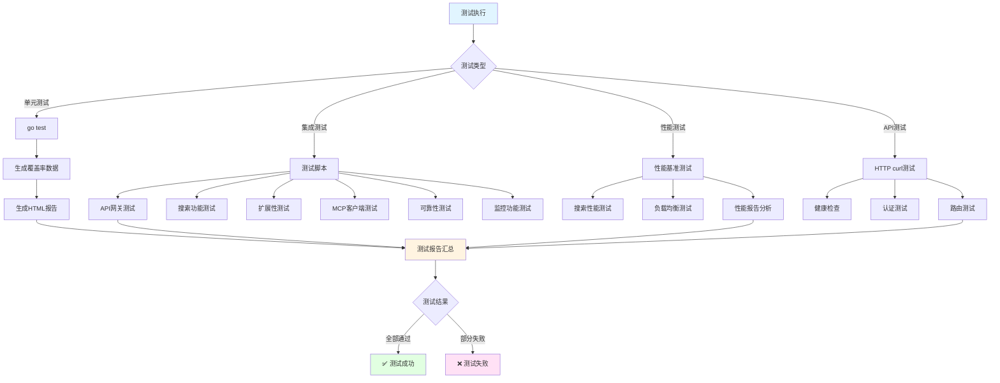

# 测试策略

<details>
<summary>相关源文件</summary>
cmd/main_test.go
internal/repository/test_utils.go
scripts/generate-tests.sh
scripts/test-runner.sh
scripts/test_reliability.sh
scripts/test_performance_report.sh
scripts/test_monitor_functionality.sh
test_api_gateway.sh
test_search_functionality.sh
test_scalability.sh
test_mcp_client.py
Makefile
</details>

## 概述

AI技术文档库项目建立了完整的测试体系，涵盖单元测试、集成测试、性能测试和自动化测试四个维度。测试策略基于Go标准testing框架，结合多种测试脚本和工具，确保系统质量、性能和可靠性。项目采用分层测试方法，从单元级别的函数测试到端到端的场景测试，构建了全面的质量保障体系。

## 测试策略核心架构



## 单元测试

### 测试框架与工具

项目采用Go标准库的[`testing`](cmd/main_test.go:1)框架作为单元测试核心，结合[`gotests`](scripts/generate-tests.sh:16)自动化测试生成工具，提升了测试开发效率。测试框架提供了以下核心能力：

- **测试运行**：支持并行测试和子测试组织
- **断言机制**：使用标准库的testing.T进行断言和错误报告
- **测试覆盖率**：集成coverage工具，支持代码覆盖率分析
- **基准测试**：支持性能基准测试，评估函数执行效率

### 测试用例设计

#### 环境变量测试

[`testGetEnv()`](cmd/main_test.go:24)函数测试环境变量获取逻辑，覆盖了已设置和未设置两种场景：

```go
func testGetEnv(t *testing.T) {
    // 测试已设置的环境变量
    testKey := "TEST_ENV_VAR"
    testValue := "test_value"
    os.Setenv(testKey, testValue)
    defer os.Unsetenv(testKey)
    
    // 测试获取已设置的环境变量
    result := getEnv(testKey, "default")
    if result != testValue {
        t.Errorf("getEnv(%s, 'default') = %s, want %s", testKey, result, testValue)
    }
    
    // 测试获取未设置的环境变量
    result = getEnv("NON_EXISTENT_VAR", "default_value")
    if result != "default_value" {
        t.Errorf("getEnv('NON_EXISTENT_VAR', 'default_value') = %s, want default_value", result)
    }
}
```

#### 数据库连接测试

[`testBuildDSN()`](cmd/main_test.go:47)函数验证数据库连接字符串构建的正确性，采用表驱动测试方法：

```go
func testBuildDSN(t *testing.T) {
    tests := []struct {
        name     string
        host     string
        port     string
        user     string
        password string
        dbname   string
        expected string
    }{
        {
            name:     "标准配置",
            host:     "localhost",
            port:     "5432",
            user:     "postgres",
            password: "postgres",
            dbname:   "testdb",
            expected: "host=localhost user=postgres password=postgres dbname=testdb port=5432 sslmode=disable TimeZone=Asia/Shanghai",
        },
        // ... 更多测试用例
    }
    
    for _, tt := range tests {
        t.Run(tt.name, func(t *testing.T) {
            result := buildDSN(tt.host, tt.port, tt.user, tt.password, tt.dbname)
            if result != tt.expected {
                t.Errorf("buildDSN() = %s, want %s", result, tt.expected)
            }
        })
    }
}
```

#### 数据库迁移测试

[`testAutoMigrate()`](cmd/main_test.go:88)函数端到端测试数据库自动迁移功能，验证表结构创建和约束建立：

- 创建临时测试数据库
- 执行自动迁移
- 验证核心表创建（documents、document_versions、document_metadata）
- 验证约束创建（idx_document_version_unique）
- 清理测试数据库

### Mock和Stub技术实现

项目通过[`test_utils.go`](internal/repository/test_utils.go:1)提供测试工具函数，实现数据Mock和测试环境隔离：

#### 测试数据库设置

[`SetupTestDB()`](internal/repository/test_utils.go:13)函数创建独立的测试数据库环境，确保测试数据隔离：

```go
func SetupTestDB(t *testing.T) *gorm.DB {
    // 使用PostgreSQL的内存数据库用于测试
    dsn := "host=localhost user=postgres password=postgres dbname=test_db port=5432 sslmode=disable TimeZone=Asia/Shanghai"
    db, err := gorm.Open(postgres.Open(dsn), &gorm.Config{})
    if err != nil {
        // 如果连接失败，尝试使用内存中的PostgreSQL
        dsn = "host=localhost user=postgres password=postgres dbname=postgres port=5432 sslmode=disable TimeZone=Asia/Shanghai"
        db, err = gorm.Open(postgres.Open(dsn), &gorm.Config{})
        if err != nil {
            t.Skipf("无法连接测试数据库，跳过测试: %v", err)
        }
    }
    
    // 创建测试数据库
    err = db.Exec("CREATE DATABASE IF NOT EXISTS test_db").Error
    if err != nil {
        t.Logf("创建测试数据库失败，使用默认数据库: %v", err)
    } else {
        // 重新连接到新创建的数据库
        dsn = "host=localhost user=postgres password=postgres dbname=test_db port=5432 sslmode=disable TimeZone=Asia/Shanghai"
        db, err = gorm.Open(postgres.Open(dsn), &gorm.Config{})
        if err != nil {
            t.Skipf("无法连接到新创建的测试数据库，跳过测试: %v", err)
        }
    }
    
    // 自动迁移表结构
    err = db.AutoMigrate(&model.Document{}, &model.DocumentVersion{}, &model.DocumentMetadata{})
    if err != nil {
        t.Fatalf("数据库迁移失败: %v", err)
    }
    
    // 清理测试数据
    db.Exec("DELETE FROM document_versions")
    db.Exec("DELETE FROM document_metadata")
    db.Exec("DELETE FROM documents")
    
    return db
}
```

#### 测试数据工厂函数

提供多个工厂函数创建测试数据对象：

- [`CreateTestDocument()`](internal/repository/test_utils.go:55)：创建测试文档对象
- [`CreateTestDocumentMetadata()`](internal/repository/test_utils.go:72)：创建测试文档元数据
- [`CreateTestDocumentVersion()`](internal/repository/test_utils.go:86)：创建测试文档版本

### 覆盖度评估

项目使用Go内置的覆盖率工具评估测试覆盖度：

```bash
# 生成覆盖率数据
go test -coverprofile=coverage.out ./...

# 生成HTML覆盖率报告
go tool cover -html=coverage.out -o coverage.html

# 查看函数级覆盖率
go tool cover -func=coverage.out
```

[`test-runner.sh`](scripts/test-runner.sh:27)脚本集成了覆盖率报告生成，自动化测试执行流程。

### 自动测试生成

[`generate-tests.sh`](scripts/generate-tests.sh:1)脚本使用`gotests`工具自动生成测试框架：

```bash
# 安装gotests工具
go get github.com/cweill/gotests/...

# 生成服务层测试
gotests -all -w -template_dir=test_templates internal/service/

# 生成仓库层测试
gotests -all -w -template_dir=test_templates internal/repository/

# 生成处理器层测试
gotests -all -w -template_dir=test_templates internal/handler/

# 生成路由层测试
gotests -all -w -template_dir=test_templates internal/router/
```

自动生成的测试框架提供了基础测试结构，开发者可以在此基础上添加具体的测试逻辑和断言。项目采用混合策略：基础框架使用自动生成，复杂业务逻辑手写实现。

## 集成测试

### API网关集成测试

[`test_api_gateway.sh`](test_api_gateway.sh:1)脚本全面测试API网关功能，包含16个测试用例，覆盖请求路由、负载均衡、认证等核心功能：

#### 请求路由测试

验证API网关的路由转发能力：

```bash
# 测试1: 健康检查端点
curl -s -o /dev/null -w "%{http_code}" $API_GATEWAY_URL/health

# 测试2: API路由
curl -s -w " HTTP_CODE:%{http_code}" "$API_GATEWAY_URL/api/v1/documents"

# 测试3: MCP路由
curl -s -w " HTTP_CODE:%{http_code}" -X POST "$API_GATEWAY_URL/mcp" \
    -H "Content-Type: application/json" \
    -d '{"jsonrpc": "2.0", "id": 1, "method": "initialize", "params": {"protocolVersion": "1.0"}}'
```

#### 请求认证测试

验证认证机制的正确性：

```bash
# 测试4: 未认证访问受保护端点
curl -s -w " HTTP_CODE:%{http_code}" "$API_GATEWAY_URL/api/v1/users/profile"
# 预期返回401

# 测试5: 用户注册
curl -s -X POST "$API_GATEWAY_URL/api/v1/auth/register" \
    -H "Content-Type: application/json" \
    -d "{\"username\":\"$username\",\"email\":\"$email\",\"password\":\"$password\"}"

# 测试6: 用户登录
curl -s -X POST "$API_GATEWAY_URL/api/v1/auth/login" \
    -H "Content-Type: application/json" \
    -d "{\"username\":\"$username\",\"password\":\"$password\"}"

# 测试7: 使用JWT认证访问受保护端点
curl -s "$API_GATEWAY_URL/api/v1/users/profile" \
    -H "Authorization: Bearer $token"
# 预期返回200

# 测试8: 使用错误的token
curl -s "$API_GATEWAY_URL/api/v1/users/profile" \
    -H "Authorization: Bearer invalid_token_12345"
# 预期返回401
```

#### 负载均衡测试

验证负载均衡功能：

```bash
# 测试11: 发送多个请求验证负载均衡
success_count=0
for i in {1..5}; do
    response=$(curl -s -w "%{http_code}" "$API_GATEWAY_URL/health" || true)
    if [ "$response" = "200" ]; then
        ((success_count++))
    fi
done
# 验证所有请求都成功
```

#### CORS和代理头部测试

验证跨域支持和头部转发：

```bash
# 测试9: CORS支持
curl -s -I -w " HTTP_CODE:%{http_code}" -H "Origin: http://example.com" "$API_GATEWAY_URL/api/v1/documents"
# 验证响应包含access-control-allow-origin头

# 测试10: 代理头部转发（X-Real-IP, X-Forwarded-For）
curl -s -w "%{http_code}" "$API_GATEWAY_URL/health"
```



### 搜索功能集成测试

[`test_search_functionality.sh`](test_search_functionality.sh:1)脚本测试文档搜索功能，验证三种搜索模式（关键词、语义、混合）和性能要求：

#### 搜索API测试

```bash
# 关键词搜索
curl -s -X POST "http://localhost:8081/api/v1/search" \
    -H "Content-Type: application/json" \
    -d '{"query": "测试", "searchType": "keyword", "page": 1, "size": 10}'

# 语义搜索
curl -s -X POST "http://localhost:8081/api/v1/search" \
    -H "Content-Type: application/json" \
    -d '{"query": "测试", "searchType": "semantic", "page": 1, "size": 10}'

# 混合搜索
curl -s -X POST "http://localhost:8081/api/v1/search" \
    -H "Content-Type: application/json" \
    -d '{"query": "测试", "searchType": "hybrid", "page": 1, "size": 10}'

# GET方式搜索
curl -s "http://localhost:8081/api/v1/search?query=测试&search_type=keyword&page=1&size=10"
```

#### 搜索性能测试

验证搜索响应时间满足1秒内的性能要求：

```bash
# 执行10次搜索并计算平均时间
start_time=$(date +%s.%N)
for i in {1..10}; do
    curl -s -X POST "http://localhost:8081/api/v1/search" \
        -H "Content-Type: application/json" \
        -d '{"query": "性能测试", "searchType": "keyword", "page": 1, "size": 10}' > /dev/null
done
end_time=$(date +%s.%N)
elapsed_time=$(echo "$end_time - $start_time" | bc)
avg_time=$(echo "scale=3; $elapsed_time / 10" | bc)

# 检查是否满足1秒内的要求
if (( $(echo "$avg_time < 1.0" | bc -l) )); then
    echo "✓ 搜索性能满足要求（小于1秒）"
else
    echo "✗ 搜索性能不满足要求（大于等于1秒）"
fi
```

### 扩展性集成测试

[`test_scalability.sh`](test_scalability.sh:1)脚本验证系统的横向扩展能力，包括存储服务抽象、容器化部署和负载均衡配置：

#### 存储服务测试

验证多种存储后端的支持：

```bash
# 检查存储服务接口
test_case "StorageService接口存在" "grep -q 'type StorageService interface' internal/service/storage_service.go"
test_case "LocalStorageService实现存在" "grep -q 'type LocalStorageService struct' internal/service/storage_service.go"
test_case "S3StorageService实现存在" "grep -q 'type S3StorageService struct' internal/service/s3_storage_service.go"
test_case "存储工厂函数存在" "grep -q 'func NewStorageService' internal/service/storage_factory.go"
```

#### Docker Compose配置测试

验证容器化部署配置：

```bash
# 检查后端服务配置
test_case "主后端服务配置" "grep -q 'container_name: ai-doc-backend-1' docker-compose.yml"
test_case "存储类型环境变量" "grep -q 'STORAGE_TYPE' docker-compose.yml"
test_case "节点ID环境变量" "grep -q 'NODE_ID' docker-compose.yml"

# 检查MinIO服务
test_case "MinIO服务配置" "grep -q 'image: minio/minio' docker-compose.yml"
test_case "MinIO存储卷配置" "grep -q 'minio_data:' docker-compose.yml"

# 检查扩展实例配置（注释状态）
test_case "扩展实例配置模板" "grep -q 'backend2:' docker-compose.yml"
```

#### Nginx负载均衡配置测试

验证Nginx配置的负载均衡能力：

```bash
# 检查upstream配置
test_case "Nginx upstream配置" "grep -q 'upstream ai_doc_backend' nginx.conf"
test_case "最少连接算法" "grep -q 'least_conn' nginx.conf"
test_case "后端服务器配置" "grep -q 'server backend:8080' nginx.conf"
test_case "扩展服务器配置模板" "grep -q 'server ai-doc-backend-2:8080' nginx.conf"

# 检查健康检查
test_case "健康检查配置" "grep -q 'max_fails' nginx.conf"
test_case "失败超时配置" "grep -q 'fail_timeout' nginx.conf"
```

### MCP客户端集成测试

[`test_mcp_client.py`](test_mcp_client.py:1)脚本提供Python实现的MCP客户端，用于测试MCP协议集成：

#### MCP客户端类

```python
class MCPClient:
    """MCP客户端类"""
    
    def __init__(self, base_url: str, api_key: str):
        self.base_url = base_url.rstrip('/')
        self.api_key = api_key
        self.headers = {
            "API_KEY": api_key,
            "Content-Type": "application/json"
        }
    
    def test_connection(self) -> Dict[str, Any]:
        """测试MCP连接"""
        try:
            response = requests.get(
                f"{self.base_url}/api/v1/mcp/test",
                headers=self.headers
            )
            response.raise_for_status()
            return response.json()
        except requests.RequestException as e:
            return {"error": f"连接测试失败: {str(e)}"}
    
    def list_tools(self) -> Dict[str, Any]:
        """获取可用工具列表"""
        try:
            request_data = {
                "jsonrpc": "2.0",
                "id": "tools_list",
                "method": "tools/list",
                "params": {}
            }
            
            response = requests.post(
                f"{self.base_url}/mcp",
                headers=self.headers,
                json=request_data
            )
            response.raise_for_status()
            return response.json()
        except requests.RequestException as e:
            return {"error": f"获取工具列表失败: {str(e)}"}
    
    def search_documents(self, query: str, limit: int = 10, doc_types: Optional[list] = None) -> Dict[str, Any]:
        """搜索文档"""
        try:
            arguments = {
                "query": query,
                "limit": limit
            }
            
            if doc_types:
                arguments["types"] = doc_types
            
            request_data = {
                "jsonrpc": "2.0",
                "id": "search_docs",
                "method": "tools/call",
                "params": {
                    "name": "search_documents",
                    "arguments": arguments
                }
            }
            
            response = requests.post(
                f"{self.base_url}/mcp",
                headers=self.headers,
                json=request_data
            )
            response.raise_for_status()
            return response.json()
        except requests.RequestException as e:
            return {"error": f"搜索文档失败: {str(e)}"}
    
    def get_document_content(self, document_id: str, version: Optional[str] = None) -> Dict[str, Any]:
        """获取文档内容"""
        try:
            arguments = {
                "document_id": document_id
            }
            
            if version:
                arguments["version"] = version
            
            request_data = {
                "jsonrpc": "2.0",
                "id": "get_doc",
                "method": "tools/call",
                "params": {
                    "name": "get_document_content",
                    "arguments": arguments
                }
            }
            
            response = requests.post(
                f"{self.base_url}/mcp",
                headers=self.headers,
                json=request_data
            )
            response.raise_for_status()
            return response.json()
        except requests.RequestException as e:
            return {"error": f"获取文档内容失败: {str(e)}"}
```

#### 使用示例

```bash
# 连接测试
python3 test_mcp_client.py --key "your_api_key" --test

# 列出可用工具
python3 test_mcp_client.py --key "your_api_key" --list-tools

# 搜索文档
python3 test_mcp_client.py --key "your_api_key" --search "测试关键词" --limit 10

# 获取文档内容
python3 test_mcp_client.py --key "your_api_key" --get-doc "document_id" --version "1.0.0"
```

### 可靠性集成测试

[`test_reliability.sh`](scripts/test_reliability.sh:1)脚本测试系统的可靠性功能，包括健康检查、备份机制、容器编排和断路器：

#### 健康检查测试

```bash
# 存活探针
test_case "存活探针端点" "curl -f -s ${API_URL}/health/live"

# 就绪探针
test_case "就绪探针端点" "curl -f -s ${API_URL}/health/ready"

# 完整健康检查
test_case "完整健康检查端点" "curl -f -s ${API_URL}/health"

# 断路器状态
test_case "断路器状态端点" "curl -f -s ${API_URL}/health/circuit-breakers"

# 验证健康状态JSON格式
test_case "健康状态返回有效JSON" "curl -s ${API_URL}/health | jq .status"
```

#### 备份功能测试

```bash
# 创建测试数据库备份
test_case "pg_dump 命令可用" "which pg_dump"
test_case "psql 命令可用" "which psql"
test_case "备份脚本可执行" "test -x scripts/backup-script.sh"
test_case "创建数据库备份" "PGPASSWORD=postgres pg_dump -h localhost -U postgres -d ai_doc_library > /tmp/test_backup.sql && test -s /tmp/test_backup.sql"
```

#### 容器编排测试

Docker Compose高可用测试：

```bash
test_case "docker-compose.yml存在" "test -f docker-compose.yml"
test_case "docker-compose包含backend2服务" "grep -q 'backend2:' docker-compose.yml"
test_case "docker-compose包含健康检查" "grep -q 'healthcheck:' docker-compose.yml"
test_case "docker-compose包含Nginx负载均衡" "grep -q 'nginx:' docker-compose.yml"
```

Kubernetes高可用配置测试：

```bash
test_case "K8s部署配置存在" "test -f k8s/deployment.yaml"
test_case "K8s配置HPA" "grep -q 'HorizontalPodAutoscaler' k8s/deployment.yaml"
test_case "K8s配置健康检查" "grep -q 'livenessProbe' k8s/deployment.yaml"
test_case "K8s配置就绪探针" "grep -q 'readinessProbe' k8s/deployment.yaml"
test_case "K8s配置PVC" "test -f k8s/pvc.yaml"
test_case "K8s配置Secrets" "test -f k8s/secrets.yaml"
test_case "K8s配置ConfigMap" "test -f k8s/configmap.yaml"
test_case "K8s配置PostgreSQL" "test -f k8s/postgres.yaml"
test_case "K8s配置Ingress" "test -f k8s/ingress.yaml"
```

### 监控功能集成测试

[`test_monitor_functionality.sh`](scripts/test_monitor_functionality.sh:1)脚本测试系统监控功能，验证监控API的可用性和响应格式：

#### 监控API测试流程

```bash
# 1. 管理员登录获取token
LOGIN_RESPONSE=$(curl -s -X POST "${BASE_URL}/api/v1/auth/login" \
  -H "Content-Type: application/json" \
  -d '{"username":"admin","password":"admin123"}')
TOKEN=$(echo $LOGIN_RESPONSE | grep -o '"access_token":"[^"]*' | cut -d'"' -f4)

# 2. 获取系统状态
STATUS_RESPONSE=$(curl -s -X GET "${BASE_URL}/api/v1/monitor/status" \
  -H "Authorization: Bearer ${TOKEN}")

# 3. 获取当前系统指标
METRICS_RESPONSE=$(curl -s -X GET "${BASE_URL}/api/v1/monitor/metrics/current" \
  -H "Authorization: Bearer ${TOKEN}")

# 4. 获取指标历史
HISTORY_RESPONSE=$(curl -s -X GET "${BASE_URL}/api/v1/monitor/metrics/history" \
  -H "Authorization: Bearer ${TOKEN}" \
  -G -d "start_time=$(date -u -d '1 hour ago' +%Y-%m-%dT%H:%M:%SZ)" \
  -d "end_time=$(date -u +%Y-%m-%dT%H:%M:%SZ)")

# 5. 获取指标报告
REPORT_RESPONSE=$(curl -s -X GET "${BASE_URL}/api/v1/monitor/metrics/report" \
  -H "Authorization: Bearer ${TOKEN}" \
  -G -d "duration=1h")

# 6. 获取日志列表
LOGS_RESPONSE=$(curl -s -X GET "${BASE_URL}/api/v1/monitor/logs" \
  -H "Authorization: Bearer ${TOKEN}")

# 7. 获取日志统计
STATS_RESPONSE=$(curl -s -X GET "${BASE_URL}/api/v1/monitor/logs/stats" \
  -H "Authorization: Bearer ${TOKEN}" \
  -G -d "start_time=$(date -u -d '24 hours ago' +%Y-%m-%dT%H:%M:%SZ)" \
  -d "end_time=$(date -u +%Y-%m-%dT%H:%M:%SZ)")

# 8. 获取性能报告
PERFORMANCE_RESPONSE=$(curl -s -X GET "${BASE_URL}/api/v1/monitor/performance" \
  -H "Authorization: Bearer ${TOKEN}" \
  -G -d "start_time=$(date -u -d '24 hours ago' +%Y-%m-%dT%H:%M:%SZ)" \
  -d "end_time=$(date -u +%Y-%m-%dT%H:%M:%SZ)")
```

### 端到端测试

端到端测试通过完整的用户场景验证系统功能，包括：

- 用户注册、登录、权限验证
- 文档上传、解析、搜索、下载
- MCP协议集成和工具调用
- 监控指标采集和报告生成
- 备份和恢复操作

## 性能测试

### 性能测试策略

项目性能测试采用多层次策略，覆盖响应时间、吞吐量、资源消耗等多个维度：

#### 搜索性能基准

搜索功能要求响应时间小于1秒，通过重复测试验证：

```bash
# 执行10次搜索并计算平均时间
start_time=$(date +%s.%N)
for i in {1..10}; do
    curl -s -X POST "http://localhost:8081/api/v1/search" \
        -H "Content-Type: application/json" \
        -d '{"query": "性能测试", "searchType": "keyword", "page": 1, "size": 10}' > /dev/null
done
end_time=$(date +%s.%N)
elapsed_time=$(echo "$end_time - $start_time" | bc)
avg_time=$(echo "scale=3; $elapsed_time / 10" | bc)
```

#### 负载测试和压力测试

通过API网关测试脚本验证负载均衡能力：

```bash
# 测试11: 负载均衡功能 - 发送多个请求验证负载均衡
success_count=0
for i in {1..5}; do
    response=$(curl -s -w "%{http_code}" "$API_GATEWAY_URL/health" || true)
    if [ "$response" = "200" ]; then
        ((success_count++))
    fi
done
```

#### 性能报告生成

[`test_performance_report.sh`](scripts/test_performance_report.sh:1)脚本验证性能报告API的功能：

```bash
# 获取管理员token
TOKEN=$(curl -s -X POST "http://localhost:8080/api/v1/auth/login" \
  -H "Content-Type: application/json" \
  -d '{"username":"admin","password":"admin123"}' \
  | grep -o '"access_token":"[^"]*' | cut -d'"' -f4)

# 测试性能报告（24小时）
START_TIME=$(date -u -d '24 hours ago' +%Y-%m-%dT%H:%M:%SZ)
END_TIME=$(date -u +%Y-%m-%dT%H:%M:%SZ)

REPORT_RESPONSE=$(curl -s -X GET "http://localhost:8080/api/v1/monitor/performance" \
  -H "Authorization: Bearer ${TOKEN}" \
  -G -d "start_time=${START_TIME}" \
  -d "end_time=${END_TIME}")

# 检查响应结构
if echo "$REPORT_RESPONSE" | grep -q "cpu_usage"; then
  DATA_COUNT=$(echo "$REPORT_RESPONSE" | grep -o '"cpu_usage":\[[^]]*' | grep -o ',[^]]*' | head -1 | cut -d',' -f2 | wc -w)
  echo "✅ 响应包含cpu_usage，数据点数量: $(echo "$DATA_COUNT" | tr -d ' ')"
fi
```

### 性能瓶颈分析

通过监控API收集的性能指标进行分析：

- **CPU使用率**：监控系统CPU资源消耗
- **内存使用**：跟踪内存占用情况
- **请求计数**：统计请求数量和速率
- **平均延迟**：分析响应时间分布
- **数据库性能**：监控查询执行时间和连接池状态



## 自动化测试

### CI/CD集成

项目通过[`Makefile`](Makefile:1)集成了自动化测试任务：

#### 测试目标定义

```makefile
# 运行测试
test:
	go test -v -cover ./...

# 生成覆盖率报告
coverage:
	go test -coverprofile=coverage.out ./...
	go tool cover -html=coverage.out -o coverage.html

# 检查代码规范
lint:
	golangci-lint run

# 格式化代码
fmt:
	go fmt ./...
```

#### 完整构建流程

```makefile
# 默认目标
all: deps build test

# 构建项目
build:
	go build -o bin/ai-doc-library cmd/main.go

# 安装依赖
deps:
	go mod tidy
	go mod download
```

### 测试自动化脚本

[`test-runner.sh`](scripts/test-runner.sh:1)脚本提供统一的测试执行入口：

```bash
#!/bin/bash

# 文档管理系统测试运行脚本
# 该脚本用于验证测试机制是否正常工作

set -e  # 遇到错误时退出

echo "=========================================="
echo "文档管理系统 - 测试机制验证"
echo "=========================================="

# 1. 运行单元测试
echo ""
echo "1. 运行单元测试..."
echo "------------------------------------------"
if go test -v -cover ./internal/...; then
    echo "✅ 单元测试执行成功"
else
    echo "❌ 单元测试执行失败"
    exit 1
fi

# 2. 运行所有测试并生成覆盖率报告
echo ""
echo "2. 生成测试覆盖率报告..."
echo "------------------------------------------"
if go test -coverprofile=coverage.out ./...; then
    echo "✅ 覆盖率数据生成成功"
    
    # 生成HTML覆盖率报告
    if go tool cover -html=coverage.out -o coverage.html; then
        echo "✅ HTML覆盖率报告生成成功"
    else
        echo "❌ HTML覆盖率报告生成失败"
    fi
else
    echo "❌ 覆盖率数据生成失败"
    exit 1
fi

# 3. 运行代码格式检查
echo ""
echo "3. 检查代码格式..."
echo "------------------------------------------"
if go fmt ./...; then
    echo "✅ 代码格式检查通过"
else
    echo "❌ 代码格式检查失败"
    exit 1
fi

# 4. 运行代码规范检查（如果golangci-lint已安装）
echo ""
echo "4. 检查代码规范..."
echo "------------------------------------------"
if command -v golangci-lint &> /dev/null; then
    if golangci-lint run; then
        echo "✅ 代码规范检查通过"
    else
        echo "❌ 代码规范检查失败"
        exit 1
    fi
else
    echo "⚠️ golangci-lint 未安装，跳过代码规范检查"
fi

# 5. 运行构建测试
echo ""
echo "5. 运行构建测试..."
echo "------------------------------------------"
if go build -o bin/ai-doc-library-test cmd/main.go; then
    echo "✅ 构建测试通过"
    rm -f bin/ai-doc-library-test  # 清理测试构建文件
else
    echo "❌ 构建测试失败"
    exit 1
fi

echo ""
echo "=========================================="
echo "所有测试验证完成！"
echo "=========================================="

# 显示覆盖率报告位置
if [ -f "coverage.html" ]; then
    echo "覆盖率报告已生成: coverage.html"
fi

echo ""
echo "如需查看详细覆盖率信息，请运行: go tool cover -func=coverage.out"
```

### 测试报告生成

项目提供多种格式的测试报告：

#### 覆盖率报告

- **数据报告**：`go tool cover -func=coverage.out` 生成函数级覆盖率
- **HTML报告**：`go tool cover -html=coverage.out -o coverage.html` 生成可视化报告

#### 脚本测试报告

各个测试脚本生成详细的测试结果汇总：

```bash
echo "=========================================="
echo "测试总结"
echo "=========================================="
echo -e "${GREEN}通过${NC}: $PASSED"
echo -e "${RED}失败${NC}: $FAILED"
echo "总计: $((PASSED + FAILED))"
echo ""

if [ $FAILED -eq 0 ]; then
    echo -e "${GREEN}所有测试通过！${NC}"
    exit 0
else
    echo -e "${RED}部分测试失败！${NC}"
    exit 1
fi
```

### 集成测试执行流程



## 测试最佳实践

### 测试设计原则

1. **独立性**：每个测试应独立运行，不依赖于其他测试
2. **可重复性**：测试结果应稳定且可重复
3. **快速执行**：单元测试应快速完成
4. **清晰命名**：测试名称应清晰描述测试目的
5. **单一职责**：每个测试只验证一个功能点

### 测试组织结构

```
项目根目录/
├── cmd/
│   └── main_test.go              # 主应用测试
├── internal/
│   ├── repository/
│   │   └── test_utils.go         # 测试工具函数
│   ├── service/
│   │   └── *_test.go             # 服务层测试
│   ├── handler/
│   │   └── *_test.go             # 处理器层测试
│   └── repository/
│       └── *_test.go             # 仓库层测试
├── scripts/
│   ├── generate-tests.sh         # 自动生成测试
│   ├── test-runner.sh            # 测试运行器
│   ├── test_reliability.sh       # 可靠性测试
│   ├── test_performance_report.sh # 性能报告测试
│   └── test_monitor_functionality.sh # 监控功能测试
├── test_*.sh                     # 集成测试脚本
├── test_mcp_client.py            # MCP客户端测试
└── Makefile                      # 测试任务定义
```

### Mock和测试工具使用

1. **测试数据库**：使用独立的测试数据库，避免污染生产数据
2. **测试数据工厂**：使用工厂函数创建测试数据，保持一致性
3. **环境变量隔离**：在每个测试中独立设置和恢复环境变量
4. **临时文件管理**：使用临时目录存储测试文件，确保清理

## 测试挑战与展望

### 当前挑战

1. **测试覆盖率**：部分核心业务逻辑的测试覆盖率有待提高
2. **Mock复杂性**：外部依赖（如AI服务、S3存储）的Mock需要进一步完善
3. **性能测试自动化**：性能测试尚未完全自动化，需要手动触发
4. **端到端测试**：完整的端到端测试场景覆盖不足

### 未来方向

1. **增强测试覆盖率**：目标达到80%以上的代码覆盖率
2. **引入Mock框架**：集成gomock等Mock框架，简化依赖管理
3. **性能测试自动化**：将性能测试集成到CI/CD流程
4. **端到端测试框架**：引入Cypress或Playwright进行前端自动化测试
5. **持续集成增强**：完善CI/CD流程，实现测试结果自动分析和报警
6. **测试数据管理**：建立测试数据管理系统，提高测试数据复用性

## 总结

AI技术文档库项目建立了完整的测试体系，涵盖单元测试、集成测试、性能测试和自动化测试四个核心维度。通过Go标准testing框架、多种测试脚本和工具的集成，项目实现了全方位的质量保障。测试策略支持从单元级别的函数测试到端到端的场景验证，确保系统功能正确性、性能达标和稳定可靠。未来将继续深化测试覆盖度，引入更先进的测试工具和框架，进一步提升测试自动化水平和质量保障能力。