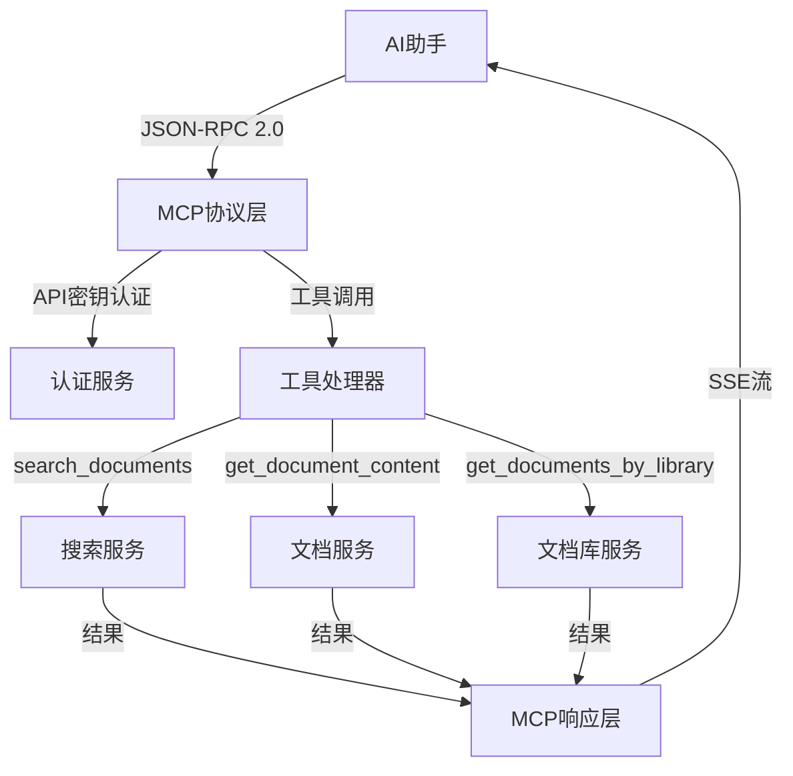
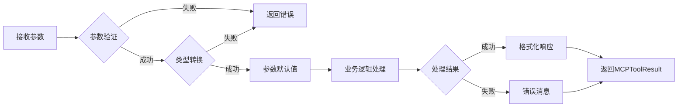

# 19、MCP协议实现

<details>
<summary>相关源文件</summary>
internal/service/mcp_service.go
internal/handler/mcp_handler.go
internal/model/mcp.go
internal/router/router.go
web/src/utils/mcpService.js
web/src/views/MCPView.vue
test_mcp_client.py
</details>

## 概述

MCP（Model Context Protocol）协议是AI技术文档库的核心特色功能，为AI助手提供了标准化的文档访问接口。该协议基于JSON-RPC 2.0规范，通过HTTP SSE（Server-Sent Events）实现双向通信，允许Claude、ChatGPT等AI助手直接查询文档库内容。实现包括完整的服务端协议处理、API密钥管理、工具接口定义以及前端集成支持，为AI应用提供了强大的上下文注入能力。

## MCP协议概述

MCP协议是一种标准化的通信协议，旨在简化AI助手与外部系统的集成。AI技术文档库作为MCP服务器，暴露标准的文档查询和检索工具，使AI助手能够在对话中直接访问技术文档，提供准确、实时的上下文信息。

### 协议设计目标

1. **标准化接口**: 提供统一的JSON-RPC 2.0接口，降低集成复杂度
2. **类型安全**: 通过严格的参数验证和返回格式，确保数据一致性
3. **可扩展性**: 支持工具列表动态更新，便于扩展新功能
4. **安全性**: 基于API密钥的认证机制，控制访问权限
5. **性能优化**: 使用SSE流式响应，减少网络延迟

### 协议版本

当前实现采用MCP协议版本`2024-11-05`，该版本支持以下核心能力：

- **工具能力**（Tools）: 提供可调用的工具列表
- **动态列表**: 支持工具列表的动态更新（`listChanged: true`）

### 应用场景



## MCP服务端实现

服务端实现基于Go语言，采用清晰的分层架构，包括模型层、服务层和处理器层。

### 核心架构

```mermaid
classDiagram
    class MCPService {
        +HandleRequest(ctx, req, apiKey) MCPResponse
        +Initialize(ctx, params) InitializeResult
        +ListTools(ctx, params) ToolListResult
        +CallTool(ctx, params) ToolResult
        +ValidateAPIKey(apiKey) MCPAPIKey
    }
    
    class MCPHandler {
        +HandleMCPRequest(c)
        +GetMCPConfig(c)
        +CreateAPIKey(c)
        +GetAPIKeys(c)
        +DeleteAPIKey(c)
        +TestMCPConnection(c)
    }
    
    class MCPRequest {
        +string JSONRPC
        +interface{} ID
        +string Method
        +interface{} Params
    }
    
    class MCPResponse {
        +string JSONRPC
        +interface{} ID
        +string Method
        +interface{} Result
        +MCPError Error
    }
    
    class MCPAPIKey {
        +string ID
        +string Name
        +string Key
        +string UserID
        +bool Enabled
        +*time.Time ExpiresAt
        +*time.Time LastUsed
    }
    
    MCPHandler --> MCPService
    MCPHandler --> MCPRequest
    MCPHandler --> MCPResponse
    MCPService --> MCPAPIKey
```

### 协议处理流程

服务端实现了完整的JSON-RPC 2.0协议处理逻辑，包括请求解析、方法路由、错误处理和响应格式化。

#### 1. 请求接收与验证

[`HandleMCPRequest`](internal/handler/mcp_handler.go:32)方法负责接收和处理MCP请求：

```go
func (h *MCPHandler) HandleMCPRequest(c *gin.Context) {
    // 读取请求体
    body, err := io.ReadAll(c.Request.Body)
    
    // 解析MCP请求
    var req model.MCPRequest
    if err := json.Unmarshal(body, &req); err != nil {
        h.sendSSEError(c, "Invalid JSON-RPC request")
        return
    }
    
    // 验证JSON-RPC版本
    if req.JSONRPC != "2.0" {
        h.sendSSEError(c, "Unsupported JSON-RPC version")
        return
    }
    
    // 获取API密钥
    apiKey := c.GetHeader("API_KEY")
    if apiKey == "" {
        authHeader := c.GetHeader("Authorization")
        if strings.HasPrefix(authHeader, "Bearer ") {
            apiKey = strings.TrimPrefix(authHeader, "Bearer ")
        }
    }
    
    // 处理请求
    resp, err := h.mcpService.HandleRequest(ctx, &req, apiKey)
    
    // 返回SSE响应
    h.sendSSEResponse(c, resp)
}
```

**关键特性**：
- 支持多种API密钥传递方式（`API_KEY`头和`Authorization`头）
- 严格验证JSON-RPC版本，确保协议兼容性
- 统一的错误处理机制

#### 2. 方法路由

[`HandleRequest`](internal/service/mcp_service.go:66)方法实现了基于方法名的请求路由：

```go
func (s *mcpService) HandleRequest(ctx context.Context, req *model.MCPRequest, apiKey string) (*model.MCPResponse, error) {
    // 验证API密钥
    _, err := s.ValidateAPIKey(apiKey)
    if err != nil {
        return s.createErrorResponse(req.ID, req.Method, -32600, "Invalid API key", nil)
    }
    
    switch req.Method {
    case "initialize":
        return s.handleInitialize(ctx, req)
    case "tools/list":
        return s.handleListTools(ctx, req)
    case "tools/call":
        return s.handleCallTool(ctx, req)
    default:
        return s.createErrorResponse(req.ID, req.Method, -32601, "Method not found", nil)
    }
}
```

**支持的方法**：
- `initialize`: 初始化MCP连接，交换服务器能力信息
- `tools/list`: 获取可用工具列表
- `tools/call`: 调用指定工具

#### 3. SSE响应格式

[`sendSSEResponse`](internal/handler/mcp_handler.go:82)方法实现了Server-Sent Events格式的响应：

```go
func (h *MCPHandler) sendSSEResponse(c *gin.Context, resp *model.MCPResponse) {
    // 设置SSE响应头
    c.Header("Content-Type", "text/event-stream")
    c.Header("Cache-Control", "no-cache")
    c.Header("Connection", "keep-alive")
    c.Header("X-Accel-Buffering", "no") // 禁用nginx缓冲
    
    // 构建SSE消息
    jsonData, _ := json.Marshal(resp)
    
    // 只保留result或error中的一个
    var sseResp map[string]interface{}
    json.Unmarshal(jsonData, &sseResp)
    
    if resp.Error != nil {
        delete(sseResp, "result")
    } else {
        delete(sseResp, "error")
    }
    
    jsonData, _ = json.Marshal(sseResp)
    sseMessage := fmt.Sprintf("event: message\ndata: %s\n\n", jsonData)
    
    // 写入响应
    c.Writer.WriteString(sseMessage)
    c.Writer.Flush()
}
```

**设计要点**：
- 禁用nginx缓冲，确保实时性
- 根据MCP协议要求，只返回`result`或`error`中的一个
- 使用`event: message`的标准SSE格式

### API密钥管理

API密钥机制是MCP协议安全性的核心，实现了完整的密钥生命周期管理。

#### 密钥验证

[`ValidateAPIKey`](internal/service/mcp_service.go:207)方法实现了多层次的安全检查：

```go
func (s *mcpService) ValidateAPIKey(apiKey string) (*model.MCPAPIKey, error) {
    // 检查密钥存在性和启用状态
    var key model.MCPAPIKey
    err := s.db.Where("key = ? AND enabled = ?", apiKey, true).First(&key).Error
    if err != nil {
        if err == gorm.ErrRecordNotFound {
            return nil, fmt.Errorf("无效的API密钥")
        }
        return nil, fmt.Errorf("查询API密钥失败: %v", err)
    }
    
    // 检查密钥是否过期
    if key.ExpiresAt != nil && time.Now().After(*key.ExpiresAt) {
        return nil, fmt.Errorf("API密钥已过期")
    }
    
    // 检查用户是否激活
    var user model.User
    if err := s.db.Where("id = ?", key.UserID).First(&user).Error; err != nil {
        return nil, fmt.Errorf("用户不存在")
    }
    if !user.IsActive {
        return nil, fmt.Errorf("用户账户已被禁用")
    }
    
    return &key, nil
}
```

**安全特性**：
- 数据库级别的密钥检查
- 过期时间验证
- 用户状态验证
- 软删除支持（`enabled`字段）

#### 密钥创建

[`CreateAPIKey`](internal/service/mcp_service.go:239)方法支持带过期时间的密钥创建：

```go
func (s *mcpService) CreateAPIKey(ctx context.Context, name, userID string, expiresAt *time.Time) (*model.MCPAPIKey, error) {
    // 验证用户是否存在
    var user model.User
    if err := s.db.Where("id = ? AND is_active = ?", userID, true).First(&user).Error; err != nil {
        return nil, fmt.Errorf("用户不存在或已被禁用")
    }
    
    // 生成API密钥（UUID）
    key := uuid.New().String()
    
    apiKey := &model.MCPAPIKey{
        Name:      name,
        Key:       key,
        UserID:    userID,
        ExpiresAt: expiresAt,
    }
    
    err := s.db.Create(apiKey).Error
    if err != nil {
        return nil, fmt.Errorf("创建API密钥失败: %v", err)
    }
    
    return apiKey, nil
}
```

#### 密钥管理接口

Web界面提供完整的密钥管理功能：

- 创建密钥：[`CreateAPIKey`](internal/handler/mcp_handler.go:205)
- 获取密钥列表：[`GetAPIKeys`](internal/handler/mcp_handler.go:256)
- 删除密钥：[`DeleteAPIKey`](internal/handler/mcp_handler.go:293)
- 测试连接：[`TestMCPConnection`](internal/handler/mcp_handler.go:346)

### 资源管理

MCP协议将文档库资源抽象为工具接口，通过标准化的调用方式访问。

#### 初始化握手

[`Initialize`](internal/service/mcp_service.go:86)方法实现MCP协议的初始化握手：

```go
func (s *mcpService) Initialize(ctx context.Context, params *model.MCPInitializeParams) (*model.MCPInitializeResult, error) {
    result := &model.MCPInitializeResult{
        ProtocolVersion: "2024-11-05",
        Capabilities: model.MCPCapabilities{
            Tools: &model.MCPToolsCapability{
                ListChanged: true, // 支持工具列表动态更新
            },
        },
        ServerInfo: model.MCPServerInfo{
            Name:    "AI技术文档库",
            Version: "1.0.0",
        },
    }
    
    return result, nil
}
```

**返回信息**：
- 协议版本
- 服务器能力（工具支持）
- 服务器信息

#### 工具列表

[`ListTools`](internal/service/mcp_service.go:106)方法返回所有可用工具：

```go
func (s *mcpService) ListTools(ctx context.Context, params *model.MCPToolListParams) (*model.MCPToolListResult, error) {
    tools := []model.MCPTool{
        {
            Name:        "search_documents",
            Description: "搜索技术文档，支持关键词搜索和语义搜索",
            InputSchema: map[string]interface{}{
                "type": "object",
                "properties": map[string]interface{}{
                    "query": map[string]interface{}{
                        "type":        "string",
                        "description": "搜索查询关键词",
                    },
                    "types": map[string]interface{}{
                        "type": "array",
                        "items": map[string]interface{}{
                            "type": "string",
                        },
                        "description": "文档类型过滤器，如 pdf, docx, markdown等",
                    },
                    "version": map[string]interface{}{
                        "type":        "string",
                        "description": "文档版本过滤器",
                    },
                    "limit": map[string]interface{}{
                        "type":        "integer",
                        "description": "返回结果数量限制，默认为10",
                    },
                },
                "required": []string{"query"},
            },
        },
        {
            Name:        "get_document_content",
            Description: "获取指定文档的详细内容",
            InputSchema: map[string]interface{}{
                "type": "object",
                "properties": map[string]interface{}{
                    "document_id": map[string]interface{}{
                        "type":        "string",
                        "description": "文档ID",
                    },
                    "version": map[string]interface{}{
                        "type":        "string",
                        "description": "文档版本，如果未指定则使用最新版本",
                    },
                },
                "required": []string{"document_id"},
            },
        },
        {
            Name:        "get_documents_by_library",
            Description: "根据所属库名称获取文档列表",
            InputSchema: map[string]interface{}{
                "type": "object",
                "properties": map[string]interface{}{
                    "library": map[string]interface{}{
                        "type":        "string",
                        "description": "库名称",
                    },
                    "page": map[string]interface{}{
                        "type":        "integer",
                        "description": "页码，默认为1",
                    },
                    "size": map[string]interface{}{
                        "type":        "integer",
                        "description": "每页数量，默认为10",
                    },
                },
                "required": []string{"library"},
            },
        },
    }
    
    return &model.MCPToolListResult{
        Tools: tools,
    }, nil
}
```

**工具特性**：
- 完整的参数schema定义（JSON Schema）
- 参数类型和描述
- 必需参数标记

### 上下文管理

MCP协议支持上下文传递，包括客户端信息、工作区信息等。

#### 上下文结构

```go
type MCPInitializeParams struct {
    ProtocolVersion       string                 `json:"protocolVersion"`
    Capabilities          map[string]interface{} `json:"capabilities"`
    ClientInfo            MCPClientInfo          `json:"clientInfo"`
    Trace                 string                 `json:"trace"`
    Locale                string                 `json:"locale"`
    Root                  *MCPRoot               `json:"root"`
    RootPath              string                 `json:"rootPath"`
    WorkspaceFolders      []MCPWorkspaceFolder   `json:"workspaceFolders"`
    InitializationOptions map[string]interface{} `json:"initializationOptions"`
}

type MCPClientInfo struct {
    Name    string `json:"name"`
    Version string `json:"version"`
}

type MCPWorkspaceFolder struct {
    URI  string `json:"uri"`
    Name string `json:"name"`
}
```

**上下文应用**：
- 客户端标识和版本追踪
- 工作区信息传递
- 本地化设置
- 自定义初始化选项

## MCP客户端集成

MCP客户端集成支持两种主要模式：标准HTTP集成和AI助手集成。

### HTTP REST接口

除了标准的MCP协议端点（`/mcp`），系统还提供了HTTP REST接口，便于传统应用集成。

#### 路由配置

```go
// MCP协议路由
router.POST("/mcp", r.mcpHandler.HandleMCPRequest)
router.GET("/mcp", r.mcpHandler.SendMessage)

// MCP配置和管理路由
mcp := v1.Group("/mcp")
{
    // 获取MCP配置
    mcp.GET("/config", r.mcpHandler.GetMCPConfig)
    
    // 测试MCP连接
    mcp.GET("/test", r.mcpHandler.TestMCPConnection)
    
    // API密钥管理
    keys := mcp.Group("/keys")
    keys.Use(r.authMiddleware.RequireAuth())
    {
        keys.POST("", r.mcpHandler.CreateAPIKey)
        keys.GET("", r.mcpHandler.GetAPIKeys)
        keys.DELETE("/:id", r.mcpHandler.DeleteAPIKey)
    }
}
```

#### 配置获取

[`GetMCPConfig`](internal/handler/mcp_handler.go:153)返回标准化的MCP配置：

```go
func (h *MCPHandler) GetMCPConfig(c *gin.Context) {
    // 验证API密钥
    _, err := h.mcpService.ValidateAPIKey(apiKey)
    if err != nil {
        c.JSON(http.StatusUnauthorized, gin.H{
            "error": "Invalid API key",
        })
        return
    }
    
    // 构建服务器地址
    serverURL := fmt.Sprintf("%s://%s", scheme, host)
    
    // 返回MCP配置
    config := gin.H{
        "mcpServers": gin.H{
            "ai-doc-library": gin.H{
                "type": "streamable-http",
                "url":  serverURL + "/mcp",
                "headers": gin.H{
                    "API_KEY": apiKey,
                },
            },
        },
    }
    
    c.JSON(http.StatusOK, config)
}
```

### AI助手集成

系统支持与Claude、ChatGPT等AI助手的无缝集成。

#### Claude Desktop配置

```json
{
  "mcpServers": {
    "ai-doc-library": {
      "command": "node",
      "args": ["path/to/mcp-server.js"],
      "env": {
        "API_KEY": "your-api-key-here",
        "SERVER_URL": "http://localhost:8080"
      }
    }
  }
}
```

#### 通用HTTP配置

```json
{
  "mcpServers": {
    "ai-doc-library": {
      "type": "streamable-http",
      "url": "http://localhost:8080/mcp",
      "headers": {
        "API_KEY": "your-api-key-here"
      }
    }
  }
}
```

### 前端集成

Web应用提供了完整的MCP管理界面。

#### 配置页面

[`MCPView.vue`](web/src/views/MCPView.vue:1)提供了：

- MCP配置展示和复制
- 连接测试功能
- 使用说明和文档

```vue
<template>
  <div class="mcp-view">
    <div class="card">
      <div class="card-body">
        <h3>CoStrict插件配置</h3>
        <p>将以下配置添加到CoStrict的MCP服务器配置中：</p>
        
        <div class="config-box">
          <pre><code>{{ mcpConfig }}</code></pre>
        </div>
        
        <div class="config-actions">
          <button @click="copyConfig" class="btn btn-primary">复制配置</button>
          <button @click="testConnection" class="btn btn-secondary">测试连接</button>
        </div>
      </div>
    </div>
  </div>
</template>
```

#### 客户端服务

[`mcpService.js`](web/src/utils/mcpService.js:1)封装了所有MCP客户端操作：

```javascript
const mcpService = {
  // 搜索文档（通过MCP协议）
  async searchDocuments(query, options = {}) {
    const message = {
      jsonrpc: '2.0',
      id: Date.now().toString(),
      method: 'tools/call',
      params: {
        name: 'search_documents',
        arguments: {
          query,
          types: options.types,
          version: options.version,
          limit: options.limit || 10
        }
      }
    };
    
    const response = await this.sendMessage(message, apiKey);
    return response.result;
  },
  
  // 获取文档内容
  async getDocumentContent(documentId, version) {
    const message = {
      jsonrpc: '2.0',
      id: Date.now().toString(),
      method: 'tools/call',
      params: {
        name: 'get_document_content',
        arguments: {
          document_id: documentId,
          version
        }
      }
    };
    
    const response = await this.sendMessage(message, apiKey);
    return response.result;
  },
  
  // 初始化MCP连接
  async initialize(clientInfo) {
    const message = {
      jsonrpc: '2.0',
      id: Date.now().toString(),
      method: 'initialize',
      params: {
        protocolVersion: '2024-11-05',
        capabilities: {},
        clientInfo: clientInfo
      }
    };
    
    const response = await this.sendMessage(message, apiKey);
    return response.result;
  }
};
```

### 测试客户端

项目提供了Python测试客户端[`test_mcp_client.py`](test_mcp_client.py:1)，用于验证MCP功能：

```python
class MCPClient:
    """MCP客户端类"""
    
    def list_tools(self) -> Dict[str, Any]:
        """获取可用工具列表"""
        request_data = {
            "jsonrpc": "2.0",
            "id": "tools_list",
            "method": "tools/list",
            "params": {}
        }
        
        response = requests.post(
            f"{self.base_url}/mcp",
            headers=self.headers,
            json=request_data
        )
        response.raise_for_status()
        return response.json()
    
    def search_documents(self, query: str, limit: int = 10, doc_types: Optional[list] = None) -> Dict[str, Any]:
        """搜索文档"""
        request_data = {
            "jsonrpc": "2.0",
            "id": "search_docs",
            "method": "tools/call",
            "params": {
                "name": "search_documents",
                "arguments": {
                    "query": query,
                    "limit": limit,
                    "types": doc_types
                }
            }
        }
        
        response = requests.post(
            f"{self.base_url}/mcp",
            headers=self.headers,
            json=request_data
        )
        response.raise_for_status()
        return response.json()
```

**使用示例**：

```bash
# 测试连接
python test_mcp_client.py --url http://localhost:8080 --key your-api-key --test

# 列出工具
python test_mcp_client.py --url http://localhost:8080 --key your-api-key --list-tools

# 搜索文档
python test_mcp_client.py --url http://localhost:8080 --key your-api-key --search "Vue组件" --limit 5
```

## MCP工具接口

MCP工具接口是协议的核心，定义了可调用的功能及其参数规范。

### 工具定义结构

每个工具都遵循标准的JSON Schema定义：

```go
type MCPTool struct {
    Name        string                 `json:"name"`
    Description string                 `json:"description"`
    InputSchema map[string]interface{} `json:"inputSchema"`
}
```

### search_documents工具

**功能描述**：搜索技术文档，支持关键词和语义搜索

**参数schema**：

```json
{
  "type": "object",
  "properties": {
    "query": {
      "type": "string",
      "description": "搜索查询关键词"
    },
    "types": {
      "type": "array",
      "items": {
        "type": "string"
      },
      "description": "文档类型过滤器，如 pdf, docx, markdown等"
    },
    "version": {
      "type": "string",
      "description": "文档版本过滤器"
    },
    "limit": {
      "type": "integer",
      "description": "返回结果数量限制，默认为10"
    }
  },
  "required": ["query"]
}
```

**实现逻辑**：

[`searchDocumentsTool`](internal/service/mcp_service.go:403)方法实现了搜索功能：

```go
func (s *mcpService) searchDocumentsTool(ctx context.Context, args map[string]interface{}) (*model.MCPToolResult, error) {
    // 参数解析和验证
    query, ok := args["query"].(string)
    if !ok || query == "" {
        return &model.MCPToolResult{
            Content: []interface{}{
                model.MCPTextContent{
                    Type: "text",
                    Text: "搜索查询不能为空",
                },
            },
            IsError: true,
        }, nil
    }
    
    // 构建搜索请求
    searchRequest := &model.SearchRequest{
        Query:      query,
        Filters:    filters,
        Page:       1,
        Size:       limit,
        SearchType: "hybrid", // 默认使用混合搜索
    }
    
    // 调用搜索服务
    searchResult, err := s.searchService.Search(ctx, searchRequest)
    
    // 转换搜索结果为MCP格式
    var documents []model.MCPSearchDocument
    for _, item := range searchResult.Items {
        documents = append(documents, model.MCPSearchDocument{
            ID:          item.ID,
            Name:        item.Title,
            Type:        item.Type,
            Version:     item.Version,
            Library:     item.Library,
            Score:       float64(item.Score),
            Content:     item.Content,
            ContentType: item.ContentType,
            Section:     item.Section,
        })
    }
    
    // 构造结果文本
    resultText := fmt.Sprintf("搜索查询: %s\n找到 %d 个相关文档:\n\n", query, len(documents))
    for i, doc := range documents {
        resultText += fmt.Sprintf("%d. %s (版本: %s, 类型: %s)\n", i+1, doc.Name, doc.Version, doc.Type)
        resultText += fmt.Sprintf("   所属库: %s\n", doc.Library)
        resultText += fmt.Sprintf("   相关度: %.2f\n", doc.Score)
        resultText += fmt.Sprintf("   内容片段: %s...\n\n", s.truncateText(doc.Content, 200))
    }
    
    return &model.MCPToolResult{
        Content: []interface{}{
            model.MCPTextContent{
                Type: "text",
                Text: resultText,
            },
        },
        IsError: false,
    }, nil
}
```

**特性**：
- 参数验证和错误提示
- 搜索结果格式化
- 相关度排序
- 内容截断（避免过长响应）

### get_document_content工具

**功能描述**：获取指定文档的详细内容

**参数schema**：

```json
{
  "type": "object",
  "properties": {
    "document_id": {
      "type": "string",
      "description": "文档ID"
    },
    "version": {
      "type": "string",
      "description": "文档版本，如果未指定则使用最新版本"
    }
  },
  "required": ["document_id"]
}
```

**实现逻辑**：

```go
func (s *mcpService) getDocumentContentTool(ctx context.Context, args map[string]interface{}) (*model.MCPToolResult, error) {
    documentID, ok := args["document_id"].(string)
    if !ok || documentID == "" {
        return &model.MCPToolResult{
            Content: []interface{}{
                model.MCPTextContent{
                    Type: "text",
                    Text: "文档ID不能为空",
                },
            },
            IsError: true,
        }, nil
    }
    
    version, _ := args["version"].(string)
    
    // 调用文档服务
    document, err := s.documentService.GetDocument(ctx, documentID, version)
    if err != nil {
        return &model.MCPToolResult{
            Content: []interface{}{
                model.MCPTextContent{
                    Type: "text",
                    Text: fmt.Sprintf("获取文档失败: %v", err),
                },
            },
            IsError: true,
        }, nil
    }
    
    // 构造结果
    resultText := fmt.Sprintf("文档名称: %s\n", document.Name)
    resultText += fmt.Sprintf("文档版本: %s\n", document.Version)
    resultText += fmt.Sprintf("文档类型: %s\n", document.Type)
    resultText += fmt.Sprintf("创建时间: %s\n", document.CreatedAt)
    resultText += fmt.Sprintf("\n文档内容:\n%s", document.Content)
    
    return &model.MCPToolResult{
        Content: []interface{}{
            model.MCPTextContent{
                Type: "text",
                Text: resultText,
            },
        },
        IsError: false,
    }, nil
}
```

### get_documents_by_library工具

**功能描述**：根据所属库名称获取文档列表

**参数schema**：

```json
{
  "type": "object",
  "properties": {
    "library": {
      "type": "string",
      "description": "库名称"
    },
    "page": {
      "type": "integer",
      "description": "页码，默认为1"
    },
    "size": {
      "type": "integer",
      "description": "每页数量，默认为10"
    }
  },
  "required": ["library"]
}
```

### 参数处理机制

统一的参数处理流程：



### 结果返回格式

标准化的工具结果格式：

```go
type MCPToolResult struct {
    Content []interface{} `json:"content"`
    IsError bool          `json:"isError,omitempty"`
    _Meta   interface{}   `json:"_meta,omitempty"`
}

type MCPTextContent struct {
    Type string `json:"type"` // 固定为"text"
    Text string `json:"text"`
}
```

**Content数组**：支持多种内容类型
- `text`: 纯文本内容
- 可扩展：图像、代码块等

**错误处理**：
- `IsError: true`表示工具调用失败
- 错误信息在Content中的Text字段

### 错误处理

统一的错误处理机制：

```go
func (s *mcpService) createErrorResponse(id interface{}, method string, code int, message string, data interface{}) *model.MCPResponse {
    return &model.MCPResponse{
        JSONRPC: "2.0",
        ID:      id,
        Method:  method,
        Error: &model.MCPError{
            Code:    code,
            Message: message,
            Data:    data,
        },
    }
}
```

**错误代码**：
- `-32600`: 无效请求
- `-32601`: 方法未找到
- `-32602`: 无效参数
- `-32603`: 内部错误
- `-32000`: 自定义错误

## 技术深度剖析

### JSON-RPC 2.0实现

MCP协议基于JSON-RPC 2.0标准，但有其特殊化处理：

1. **SSE流式响应**：标准JSON-RPC不支持流式，MCP通过SSE扩展了这一能力
2. **Method字段保留**：响应中保留method字段，便于路由和日志
3. **Result/Error互斥**：根据CoStrict要求，响应中只包含result或error中的一个

### 性能优化策略

1. **并发处理**：使用Goroutine处理独立请求
2. **连接复用**：HTTP Keep-Alive减少连接开销
3. **缓存机制**：工具列表等静态内容可缓存
4. **批量操作**：支持批量文档查询（未来扩展）

```go
// 示例：并发工具调用
func (s *mcpService) CallToolsConcurrently(ctx context.Context, calls []MCPToolCallParams) ([]MCPToolResult, error) {
    results := make([]MCPToolResult, len(calls))
    errChan := make(chan error, len(calls))
    
    for i, call := range calls {
        go func(idx int, c MCPToolCallParams) {
            result, err := s.CallTool(ctx, &c)
            if err != nil {
                errChan <- err
                return
            }
            results[idx] = *result
        }(i, call)
    }
    
    // 等待所有goroutine完成
    for i := 0; i < len(calls); i++ {
        if err := <-errChan; err != nil {
            return nil, err
        }
    }
    
    return results, nil
}
```

### 安全机制

1. **API密钥验证**：每次请求都进行密钥验证
2. **参数消毒**：严格的参数类型检查
3. **SQL注入防护**：使用参数化查询
4. **XSS防护**：输出转义
5. **权限分离**：密钥级别权限控制

### 可扩展性设计

1. **工具注册机制**：支持动态工具注册
2. **插件架构**：易于添加新工具
3. **版本兼容**：协议版本管理
4. **配置驱动**：工具定义可配置化

```go
// 扩展：工具注册模板
type ToolRegistry interface {
    RegisterTool(name string, handler ToolHandler) error
    UnregisterTool(name string) error
    GetTool(name string) (ToolHandler, error)
    ListTools() []string
}

type ToolHandler func(ctx context.Context, args map[string]interface{}) (*MCPToolResult, error)
```

## 部署和运维

### 配置项

环境变量配置：

```bash
# MCP配置
MCP_ENABLED=true
MCP_PORT=8080
MCP_TIMEOUT=30s

# API密钥配置
MCP_API_KEY_EXPIRY=30d
MCP_MAX_KEYS_PER_USER=10

# 安全配置
MCP_RATE_LIMIT=100
MCP_RATE_WINDOW=1h
```

### 监控指标

关键监控指标：

1. **请求指标**：
   - MCP请求数量（按方法分类）
   - 请求延迟（P50, P95, P99）
   - 错误率

2. **API密钥指标**：
   - 有效密钥数量
   - 密钥使用频率
   - 过期密钥数量

3. **工具调用指标**：
   - 各工具调用次数
   - 工具执行时间
   - 工具失败率

### 日志记录

结构化日志：

```go
log.Printf("MCP Request: method=%s, id=%v, user=%s", req.Method, req.ID, apiKey.UserID)
log.Printf("MCP Response: id=%v, duration=%v, success=%v", req.ID, duration, success)
log.Printf("Tool Call: name=%s, duration=%v, result_size=%d", params.Name, duration, len(content))
```

### 故障排查

常见问题和解决方案：

1. **连接失败**：
   - 检查端口是否开放
   - 验证API密钥有效性
   - 检查防火墙规则

2. **超时问题**：
   - 增加超时配置
   - 优化查询性能
   - 检查网络连接

3. **认证失败**：
   - 验证API密钥格式
   - 检查密钥是否过期
   - 确认用户状态

## 最佳实践

### API密钥管理

1. **定期轮换**：建议每30-90天轮换密钥
2. **最小权限**：为不同应用使用不同密钥
3. **监控使用**：定期检查密钥使用情况
4. **及时撤销**：发现异常立即撤销密钥

### 工具设计

1. **单一职责**：每个工具只做一件事
2. **幂等性**：相同参数多次调用结果一致
3. **错误清晰**：提供明确的错误信息
4. **性能优化**：避免长时间执行

### 客户端集成

1. **重试机制**：实现指数退避重试
2. **超时设置**：合理的超时配置
3. **错误处理**：优雅的错误处理
4. **降级策略**：服务不可用时的降级方案

## 总结

MCP协议实现为AI技术文档库提供了强大的AI助手集成能力。通过标准化的JSON-RPC 2.0接口、完整的API密钥管理、丰富的工具接口以及完善的前后端支持，系统可以轻松集成到Claude、ChatGPT等AI助手中，实现智能的文档查询和上下文注入。架构设计遵循SOLID原则，具有良好的可维护性和可扩展性，为未来功能扩展奠定了坚实基础。