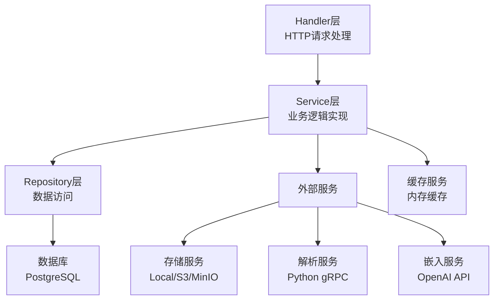
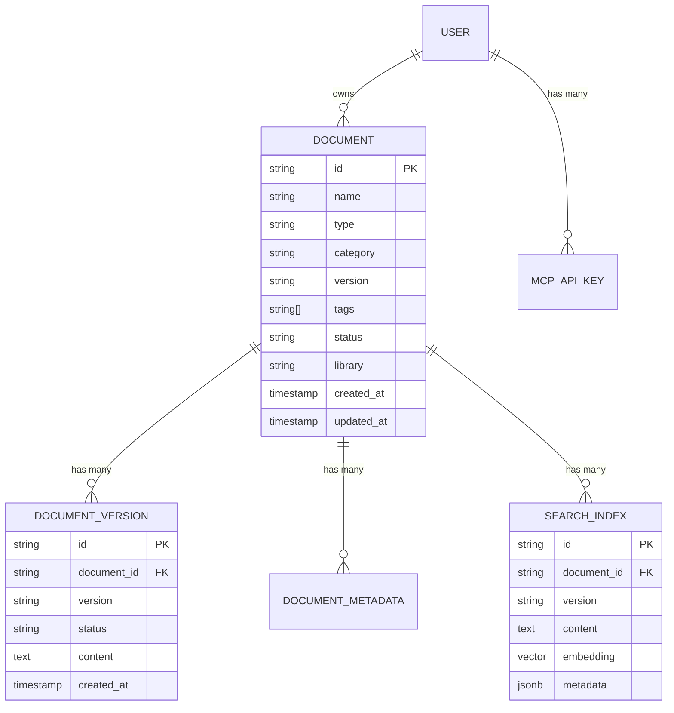
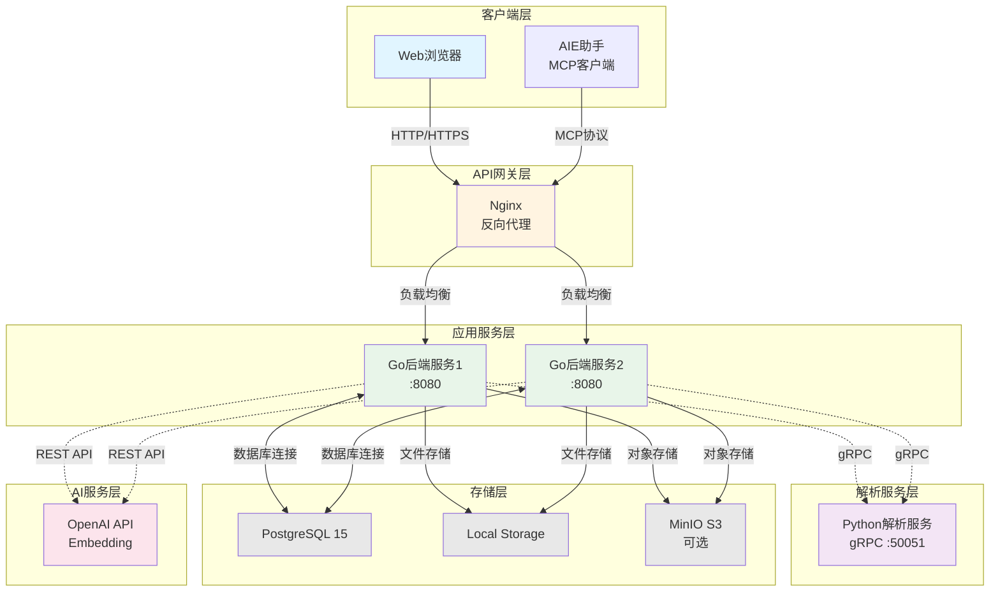
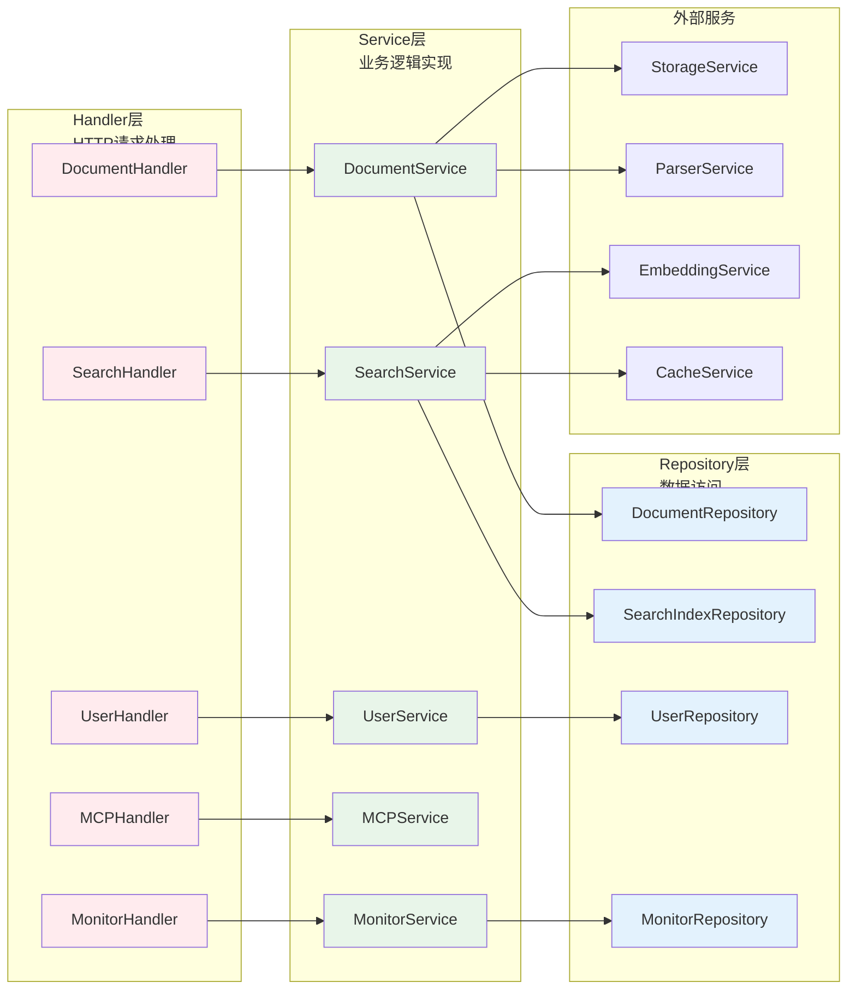
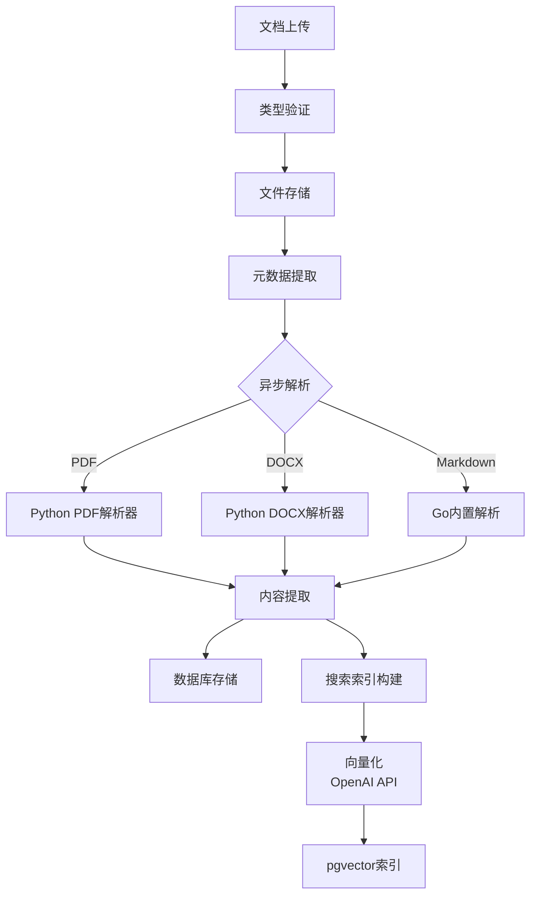
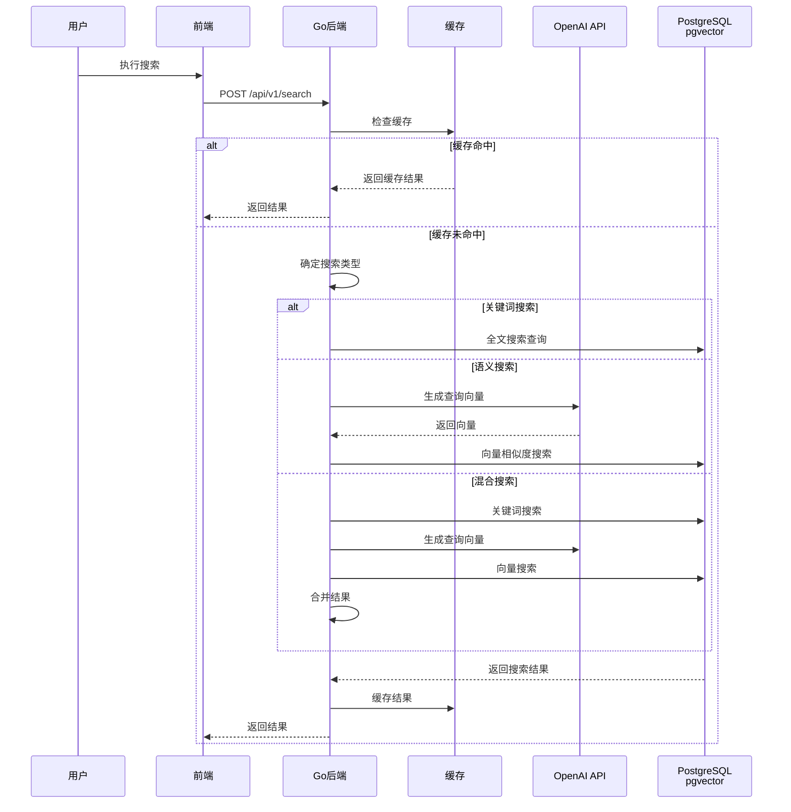
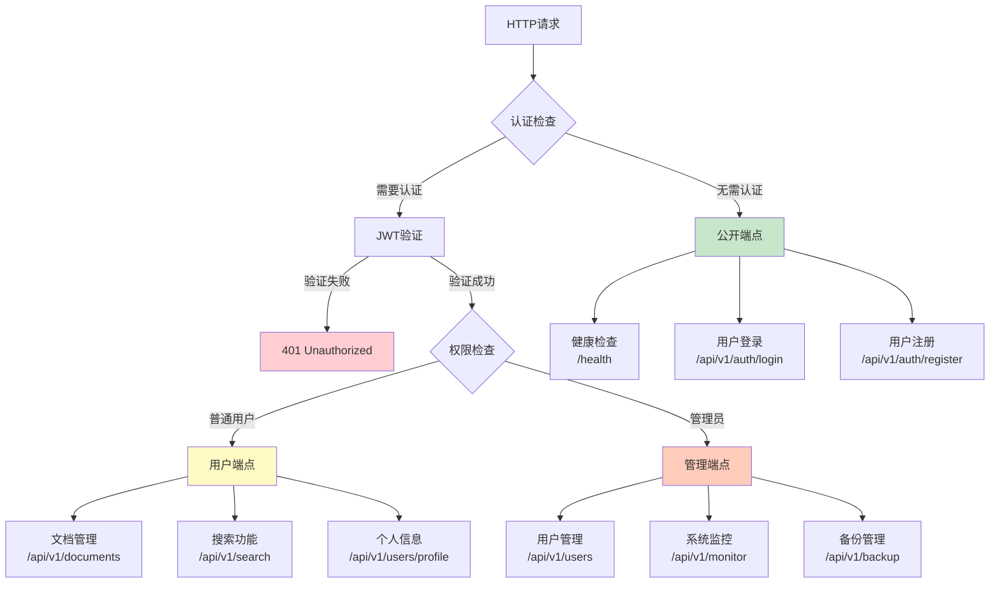
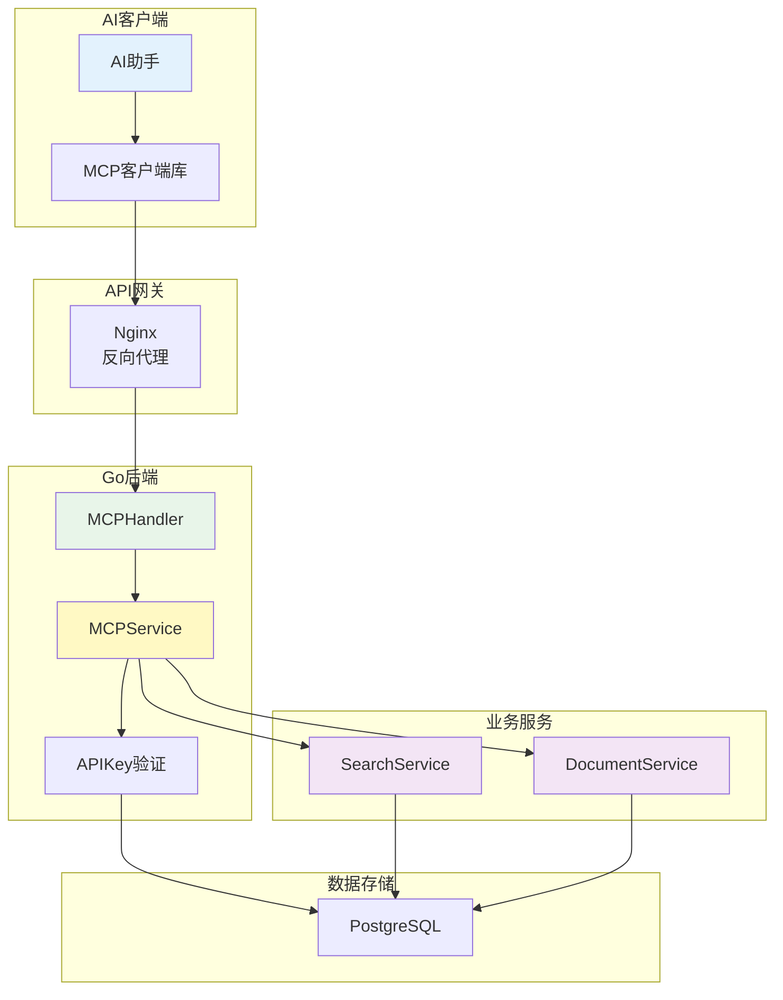
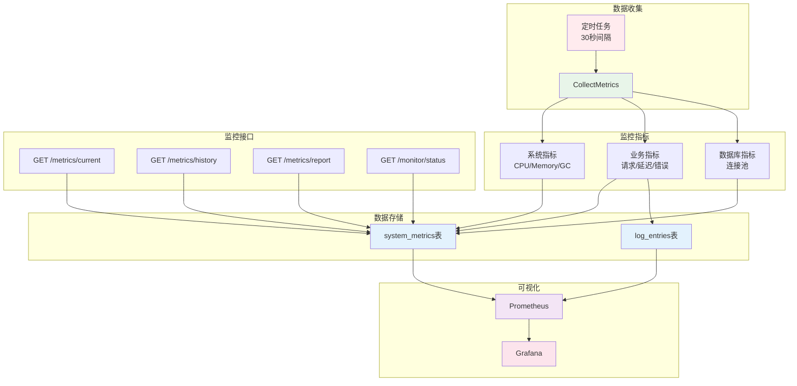
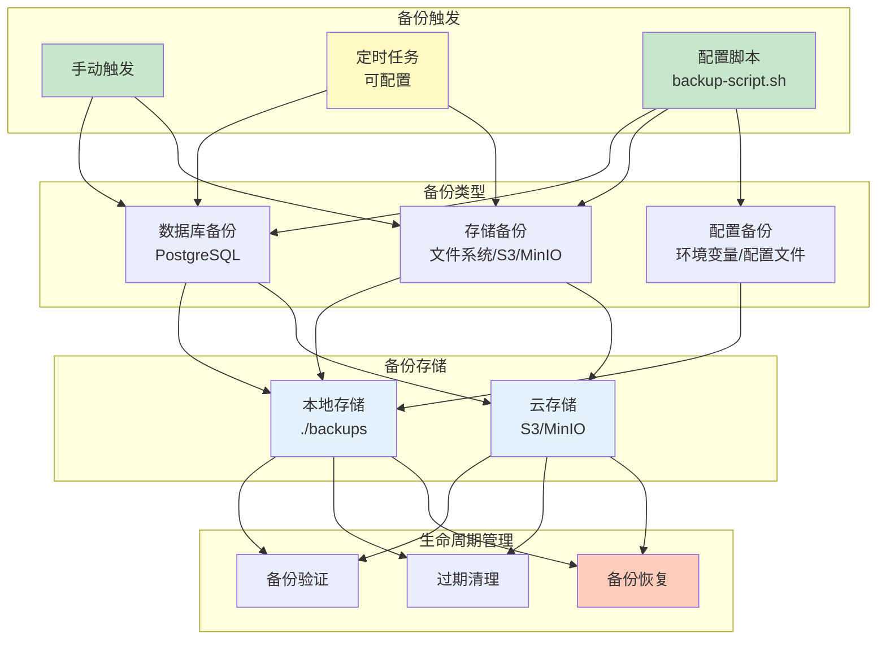

# 1、项目概述

<details>
<summary>相关源文件</summary>
cmd/main.go
internal/router/router.go
internal/service/document_service.go
internal/service/search_service.go
internal/service/mcp_service.go
internal/handler/document_handler.go
internal/handler/user_handler.go
python-parser-service/service/server.py
docker-compose.yml
internal/model/document.go
internal/service/storage_service.go
internal/service/monitor_service.go
</details>

## 项目简介

### 项目定位与核心价值

AI技术文档库（LAST-doc）是一个基于微服务架构的智能文档管理系统，旨在为开发者和企业提供一个高效、智能、可扩展的文档管理解决方案。系统采用现代化的技术栈，融合了传统文档管理能力与人工智能技术，实现了文档的全生命周期管理。

项目的核心价值体现在以下几个方面：

**智能化文档处理**：
- 通过Python微服务实现PDF、DOCX、Markdown等多种格式文档的智能解析
- 集成OpenAI Embedding API，实现基于语义理解的智能检索
- 支持向量搜索（pgvector），提供关键词搜索、语义搜索和混合搜索三种模式

**企业级文档管理**：
- 完整的版本控制机制，支持同一文档多版本管理
- 细粒度的元数据管理，包括文档分类、标签、描述等
- 灵活的存储策略，支持本地存储、S3、MinIO等多种存储后端

**现代化技术架构**：
- 采用Go 1.24 + Gin框架构建高性能后端服务
- Vue.js 3构建响应式前端应用
- gRPC实现微服务间高效通信
- 支持Docker和Kubernetes两种部署方式，满足不同规模的应用场景

### 解决的问题与应用场景

**问题一：传统文档管理系统的局限性**

传统文档管理系统通常面临以下挑战：
1. 文档格式单一，难以统一管理PDF、DOCX、Markdown等多种格式
2. 检索能力有限，主要依赖关键词匹配，无法理解语义
3. 缺乏版本控制，文档更新后历史版本难以追溯
4. 扩展性差，难以适应业务增长和数据量增加

LAST-doc通过以下方式解决这些问题：
- 提供统一的文档解析接口，支持多种格式文档的上传和处理
- 实现基于向量相似度的语义搜索，大幅提升检索准确率
- 完整的版本控制机制，保留所有历史版本，支持版本间的快速切换
- 微服务架构设计，支持水平扩展，可部署多个后端实例实现高可用

**问题二：AI应用中的文档知识获取困难**

随着AI技术（如大语言模型）的广泛应用，如何让AI系统高效获取和利用文档知识成为关键问题。传统方式需要手动整理文档或依赖简单的文本匹配，效率低下。

LAST-doc提供MCP（Model Context Protocol）协议支持，实现了：
- 标准化的AI集成接口，AI助手可以直接调用文档搜索和内容获取工具
- 多粒度文档表示，支持AI友好的文档格式输出
- 向量化索引，使AI系统能够基于语义相似度快速定位相关文档内容

**应用场景**：

1. **企业知识库管理**：
   - 企业内部技术文档标准化管理
   - 多部门文档集中存储和共享
   - 版本控制和权限管理

2. **开发文档中心**：
   - API文档、技术规格说明的集中管理
   - 代码文档与业务文档的统一检索
   - 支持markdown格式的技术文档快速发布

3. **AI辅助开发**：
   - 为AI编码助手提供文档知识库支持
   - MCP协议集成，AI可直接查询文档内容
   - 语义搜索提升AI回答的准确性

4. **教育与研究**：
   - 学术论文和研究资料的集中管理
   - 跨文档内容检索和知识关联
   - 文档版本追踪和对比

### 目标用户群体

**主要用户**：

1. **开发团队**：
   - 需要管理大量技术文档的软件开发团队
   - 需要快速检索文档信息的开发者
   - 希望利用AI提升文档利用效率的技术团队

2. **企业IT部门**：
   - 负责企业知识库建设的信息化部门
   - 需要统一管理企业文档的管理员
   - 追求高可用、可扩展系统的运维工程师

3. **内容创作者**：
   - 技术文档编写者
   - 需要文档版本管理的内容创作者
   - 希望建立个人文档知识库的独立开发者

**次要用户**：

1. **AI应用开发者**：
   - 需要集成文档检索能力的AI应用开发者
   - 使用MCP协议的AI助手开发者

2. **系统集成商**：
   - 为客户部署文档管理系统的集成商
   - 需要定制化文档管理解决方案的实施团队

## 技术栈总览

### 整体技术选型

AI技术文档库采用前后端分离的微服务架构，技术栈经过精心选择，兼顾性能、可维护性和扩展性。整体技术架构基于Go 1.24、Vue.js 3、Python 3.8+三大核心技术，辅以PostgreSQL 15数据库、Docker容器化、Kubernetes编排等企业级技术栈，构建了一个现代化、高可用的文档管理系统。

技术选型的核心原则：
- **性能优先**：选择Go语言作为后端核心，利用其出色的并发性能和编译型语言的高效性
- **现代化前端**：Vue.js 3提供响应式用户体验，TypeScript增强代码可维护性
- **AI能力集成**：Python处理文档解析，OpenAI API提供语义理解能力
- **云原生设计**：Docker + Kubernetes支持容器化部署和弹性扩展
- **可观测性**：Prometheus + Grafana实现全方位系统监控

### 后端技术栈

#### Go语言框架

**Go 1.24 核心框架选择**：

后端服务采用Go 1.24作为核心开发语言，主要基于以下考虑：

1. **高性能与并发能力**：
   - Go的goroutine机制提供轻量级并发，能够高效处理大量并发请求
   - 内置的channel和select机制简化并发编程
   - garbage collector优化减少内存管理开销

2. **Gin Web框架优势**：
   [`go.mod`](go.mod:1-15)显示项目使用的Gin框架版本为v1.9.1，Gin框架提供：
   - 高性能HTTP路由，基于radix tree实现路由匹配
   - 中间件机制，支持认证、日志、CORS等功能扩展
   - JSON验证和绑定，简化API请求处理
   - 内置的错误处理机制

3. **GORM ORM框架**：
   [`cmd/main.go`](cmd/main.go:39)显示使用GORM v1.25.4作为ORM层，优势包括：
   - 支持多种数据库，项目使用PostgreSQL驱动
   - 自动迁移功能（[`main.go:45`](cmd/main.go:45)），简化数据库表结构管理
   - 钩子函数支持，便于在CRUD操作前后添加业务逻辑
   - 关联查询优化，支持预加载和批量查询

**服务层架构设计**：

后端采用经典的分层架构，从[`cmd/main.go`](cmd/main.go:73-174)的初始化代码可以看出：



这种分层架构的优势：
- **职责清晰**：每层专注于特定职责，降低耦合度
- **可测试性**：易于进行单元测试和集成测试
- **可扩展性**：新增功能只需在对应层添加代码

**关键技术组件分析**：

1. **gRPC微服务通信**：
   [`go.mod`](go.mod:11)显示使用gRPC v1.77.0，[`proto/document_parser.proto`](proto/document_parser.proto:1)定义了文档解析服务的接口：
   - 使用Protocol Buffers进行数据序列化，性能优于JSON
   - 双向流式RPC支持，适合大文件传输场景
   - 自动生成客户端和服务端代码，减少开发工作量

2. **JWT认证系统**：
   [`go.mod`](go.mod:7)使用golang-jwt/jwt v5.2.0实现JWT令牌认证：
   - 无状态认证，适合分布式系统
   - 支持令牌刷新机制（[`router.go:187`](internal/router/router.go:187)）
   - 可配置过期时间，平衡安全性和用户体验

3. **依赖注入模式**：
   [`cmd/main.go`](cmd/main.go:73-174)完全采用依赖注入的方式初始化服务：
   - 通过构造函数注入依赖，便于单元测试
   - 使用接口抽象，便于替换具体实现
   - 工厂模式创建存储服务（[`storage_factory.go`](internal/service/storage_factory.go:1)），支持多种存储后端

#### 数据存储技术

**PostgreSQL 15数据库选择**：

PostgreSQL被选为核心数据库，主要基于以下优势：

1. **关系型数据库的可靠性**：
   - ACID事务支持，确保数据一致性
   - 行级锁定机制，高并发场景下性能优异
   - 完善的备份和恢复机制

2. **pgvector向量扩展**：
   [`scripts/setup_pgvector.sql`](scripts/setup_pgvector.sql:1)启用了pgvector扩展，支持：
   - 向量相似度搜索，实现语义检索
   - 余弦相似度、欧几里得距离等多种距离度量
   - 索引加速向量查询性能

3. **JSONB数据类型支持**：
   [`internal/model/document.go`](internal/model/document.go:86)使用JSONB存储文档元数据：
   - 灵活的schema设计，适应不同文档类型的元数据需求
   - 内置的JSON操作函数，查询和更新元数据高效
   - 支持GIN索引，加速JSON字段的查询

**数据库设计亮点**：

从[`internal/model/document.go`](internal/model/document.go:44-61)可以看出数据模型设计：

- **字符串数组类型**：实现[`StringArray`](internal/model/document.go:12)类型，处理PostgreSQL数组
- **文档版本分离**：[`DocumentVersion`](internal/model/document.go:64-75)独立表设计，支持版本管理
- **元数据灵活存储**：JSONB类型存储动态元数据



#### 服务通信机制

**gRPC与RESTful API并存**：

系统同时支持gRPC和RESTful API两种通信方式：

1. **gRPC用于内部微服务通信**：
   - Go后端与Python解析服务之间使用gRPC通信
   - [`proto/document_parser.proto`](proto/document_parser.proto:1)定义的接口包括：
     - `ParsePDF`：PDF文档解析
     - `ParseDOCX`：DOCX文档解析
     - `HealthCheck`：健康检查

2. **RESTful API用于外部客户端**：
   [`internal/router/router.go`](internal/router/router.go:64-266)定义了完整的RESTful API：
   - 统一的API版本前缀 `/api/v1`
   - 资源导向的URL设计（如`/documents/:id`）
   - 标准HTTP方法使用（GET、POST、PUT、DELETE）
   - 统一的响应格式（code、data、message）

### 前端技术栈

#### Vue.js 3框架

**Vue.js 3核心优势**：

前端应用采用Vue.js 3框架，[`web/src/main.js`](web/src/main.js:1-9)显示项目使用Vue 3 Composition API：

1. **响应式数据绑定**：
   - Composition API提供更灵活的逻辑复用
   - `reactive`和`ref`实现细粒度响应式
   - 计算属性和侦听器优化性能

2. **组件化开发**：
   [`web/src/views/`](web/src/views/)目录下包含多个视图组件：
   - `DocumentListView.vue`：文档列表展示
   - `UploadView.vue`：文档上传界面
   - `SearchView.vue`：搜索功能界面
   - `MonitorView.vue`：系统监控面板

3. **路由管理**：
   虽然代码中未直接展示路由配置，但基于Vue.js生态，项目使用Vue Router进行单页面应用（SPA）路由管理。

#### 组件库与工具

**Bootstrap 5集成**：
[`web/src/main.js`](web/src/main.js:3-5)显示项目集成Bootstrap：
- Bootstrap 5作为UI框架，提供响应式布局
- Bootstrap Icons图标库，增强视觉效果
- 预设的组件样式，加快开发速度

**Axios HTTP客户端**：
[`web/src/utils/`](web/src/utils/)目录下的服务模块使用Axios进行HTTP请求：
- 拦截器机制，统一处理请求和响应
- 请求取消功能，避免重复请求
- 自动JSON序列化和错误处理

#### 状态管理

**Composition API + Composables**：
[`web/src/composables/`](web/src/composables/)目录展示了项目使用Composition API进行状态管理：
- [`useAuth.js`](web/src/composables/useAuth.js:1)：认证状态管理
- 自定义hook实现逻辑复用
- 响应式状态与业务逻辑结合

## 系统架构概览

### 微服务架构设计

AI技术文档库采用微服务架构，将系统功能拆分为三个独立的服务：Go后端服务、Vue前端应用和Python文档解析服务。这种架构设计实现了关注点分离，提高了系统的可维护性和可扩展性。

**架构核心原则**：

1. **服务独立性**：
   每个服务可以独立开发、部署和扩展，互不干扰。从[`docker-compose.yml`](docker-compose.yml:1-250)可以看出，系统支持启动多个后端实例（backend和backend2），实现高可用。

2. **明确的服务边界**：
   - Go后端：负责业务逻辑处理、数据持久化、API提供
   - Python解析：专门处理文档内容解析，使用gRPC通信
   - Vue前端：负责用户界面和用户交互

3. **松耦合通信**：
   - 服务间通过定义良好的接口通信（gRPC、HTTP RESTful API）
   - 使用标准协议和数据格式（Protocol Buffers、JSON）
   - 服务之间避免直接依赖数据库，通过API交换数据

### 三核心组件交互



**组件职责划分**：

1. **Go后端服务**（多个实例）：
   - 提供RESTful API（[`router.go`](internal/router/router.go:44-266)）
   - 文档上传、下载、管理
   - 智能搜索服务（关键词、语义、混合）
   - 用户认证授权（JWT + RBAC）
   - MCP协议支持
   - 系统监控和指标收集
   - 数据库操作和缓存管理

2. **Python解析服务**：
   - PDF文档解析（[`pdf_parser.py`](python-parser-service/service/pdf_parser.py:1)）
   - DOCX文档解析（[`docx_parser.py`](python-parser-service/service/docx_parser.py:1)）
   - gRPC服务实现（[`server.py`](python-parser-service/service/server.py:49-201)）
   - 元数据提取和内容结构化

3. **Vue前端应用**：
   - 用户界面展示
   - 文档管理操作界面
   - 搜索和检索界面
   - 系统监控面板
   - API密钥管理

**数据流转分析**：

1. **文档上传流程**：
    ```
    用户 → 前端 → Nginx → Go后端 → 存储服务
                         ↓
                   Python解析服务（异步）
                         ↓
                    更新数据库 → 构建搜索索引
    ```

2. **智能搜索流程**：
    ```
    搜索请求 → Go后端 → 检查缓存
                     ↓
               OpenAI API（生成查询向量）
                     ↓
               PostgreSQL pgvector（向量相似度搜索）
                     ↓
               返回结果 → 缓存 → 用户
    ```

3. **MCP协议调用**：
    ```
    AI助手 → MCP请求 → Nginx → Go后端
                            ↓
                      验证API密钥
                            ↓
                      调用搜索或文档服务
                            ↓
                      返回结构化结果
    ```

**技术深度剖析：高可用与负载均衡机制**

系统采用Nginx作为反向代理和负载均衡器，实现了高可用架构。从[`nginx.conf`](nginx.conf:1)配置可以看出：

1. **负载均衡策略**：
   - 轮询（Round Robin）：默认的负载均衡算法，按时间顺序逐个分配请求
   - 最少连接（Least Connections）：将请求分配给活动连接数最少的服务器
   - IP哈希（IP Hash）：基于客户端IP地址的哈希值分配请求，保证同一客户端的请求始终由同一服务器处理

2. **健康检查机制**：
   [`docker-compose.yml`](docker-compose.yml:61-66)定义了后端服务的健康检查：
   ```yaml
   healthcheck:
     test: ["CMD", "/bin/sh", "/app/scripts/healthcheck.sh"]
     interval: 30s
     timeout: 10s
     retries: 3
     start_period: 40s
   ```
   这确保了只有健康的后端实例才会接收流量。

3. **故障转移与恢复**：
   - 自动检测失败的后端实例
   - 临时移除不健康的实例，避免影响用户体验
   - 实例恢复后自动重新加入负载均衡池

**并发控制与容错机制**：

系统实现了多层容错机制，确保服务的高可用：

1. **断路器模式**（[`circuit_breaker.go`](internal/service/circuit_breaker.go:1)）：
   - 当外部服务（如OpenAI API）失败率超过阈值时，自动断开连接
   - 快速失败，避免雪崩效应
   - 半开状态，允许少量测试请求以检测服务是否恢复

2. **重试机制**：
   - 对暂时性故障进行指数退避重试
   - 最大重试次数限制，避免无限重试
   - 重试条件：网络错误、超时、5xx服务器错误

3. **超时控制**：
   - HTTP请求超时设置
   - gRPC调用超时控制
   - 数据库查询超时限制

### 分层架构模式

系统在代码层面采用严格的分层架构，确保代码的可维护性和可测试性。



**分层职责详解**：

1. **Handler层**（[`internal/handler/`](internal/handler/)）：
   - 负责HTTP请求和响应处理
   - 参数验证和绑定
   - 调用Service层处理业务逻辑
   - 统一错误处理和响应格式化
   
   示例：[`DocumentHandler.UploadDocument`](internal/handler/document_handler.go:29-133)
   - 解析multipart表单数据
   - 验证必填字段
   - 调用DocumentService上传文档
   - 返回标准化JSON响应

2. **Service层**（[`internal/service/`](internal/service/)）：
   - 实现核心业务逻辑
   - 协调多个Repository和外部服务
   - 事务管理
   - 异步任务处理
   
   示例：[`DocumentService.UploadDocument`](internal/service/document_service.go:70-197)
   - 文档类型验证
   - 版本号唯一性检查
   - 文件存储
   - 异步调用解析服务
   - 搜索索引构建

3. **Repository层**（[`internal/repository/`](internal/repository/)）：
   - 数据库CRUD操作
   - 复杂查询封装
   - 批量操作支持
   - 数据库事务管理

**设计模式应用**：

1. **依赖注入**：
   [`cmd/main.go`](cmd/main.go:73-174)完全采用依赖注入初始化系统
   - 通过构造函数注入依赖
   - 使用接口抽象具体实现
   - 便于单元测试和替换实现

2. **工厂模式**：
   [`StorageService`](internal/service/storage_factory.go:1)使用工厂模式创建存储服务
   - 支持多种存储类型（Local、S3、MinIO）
   - 通过环境变量配置存储类型
   - 统一的接口定义

3. **中间件模式**：
   [`middleware/`](internal/middleware/)目录实现认证和日志中间件
   - 认证中间件：JWT令牌验证
   - 日志中间件：请求日志记录
   - 可复用横切关注点

## 核心功能特性

### 文档管理能力

AI技术文档库提供完整的文档管理功能，支持文档的全生命周期管理。从[`internal/model/document.go`](internal/model/document.go:14-42)可以看出，系统支持多种文档类型和分类。

**支持的文档类型**：
- Markdown：代码文档、技术说明
- PDF：官方文档、研究报告
- DOCX：办公文档、技术规范
- Swagger/OpenAPI：API文档
- JavaDoc：代码文档

**核心功能模块**：

1. **文档上传与解析**：
   [`DocumentHandler.UploadDocument`](internal/handler/document_handler.go:29-133)实现文档上传流程：
   - 支持multipart表单上传
   - 文档类型和验证
   - 分类和标签管理
   - 异步文档解析（通过gRPC调用Python服务）
   - 版本控制（同一文档支持多版本）

2. **版本控制机制**：
   [`DocumentService.UploadDocument`](internal/service/document_service.go:147-190)展示版本控制实现：
   - 基于版本号的版本管理
   - 版本唯一性检查（同文档下版本号不重复）
   - 版本状态跟踪（uploading、processing、completed、failed）
   - 支持获取特定版本内容

3. **元数据管理**：
   [`DocumentMetadata`](internal/model/document.go:83-89)模型提供灵活的元数据存储：
   - JSONB类型存储动态元数据
   - 支持不同文档类型的自定义元数据
   - 元数据查询和过滤

**文档管理架构**：



### 智能检索系统

智能检索是AI技术文档库的核心竞争力，[`SearchService`](internal/service/search_service.go:17-25)提供了先进的搜索能力。

**三种搜索模式**：

1. **关键词搜索**：
   - 基于PostgreSQL全文搜索
   - 支持多关键词组合
   - 相关性评分算法
   - 适合精确匹配场景

2. **语义搜索**：
   - 基于OpenAI Embedding API
   - 向量相似度计算（余弦相似度）
   - pgvector索引加速查询
   - 理解查询意图，返回语义相关结果

3. **混合搜索**：
   [`search_service.go`](internal/service/search_service.go:136-166)实现混合搜索：
   - 结合关键词和语义搜索
   - 结果合并和去重
   - 优化相关性评分
   - 提供最全面的搜索结果

**搜索流程**：



**智能缓存策略**：

[`SearchService.applyCacheStrategy`](internal/service/search_service.go:197)实现智能缓存：
- 基于搜索查询、类型、过滤器生成缓存键
- 根据搜索耗时动态调整缓存时长
- 自动清理过期缓存
- 提升重复查询性能

### 用户认证授权

系统实现了完整的用户认证和授权机制，从[`internal/handler/user_handler.go`](internal/handler/user_handler.go:26-71)可以看出支持的认证功能。

**认证机制**：

1. **JWT令牌认证**：
   - 用户登录后获取JWT令牌
   - 令牌包含用户ID和角色信息
   - 访问受保护资源时验证令牌
   - 支持令牌刷新机制

2. **用户管理**：
   [`UserHandler`](internal/handler/user_handler.go:1)提供完整的用户管理功能：
   - 用户注册和登录
   - 密码重置（通过邮件）
   - 用户信息更新
   - 用户列表和详情查询

3. **基于角色的访问控制（RBAC）**：
   [`middleware/auth.go`](internal/middleware/auth.go:1)实现权限控制：
   - RequireAuth：认证中间件
   - RequireAdmin：管理员权限检查
   - 用户角色：admin、user

**权限架构**：



### MCP协议支持

MCP（Model Context Protocol）是专为AI应用设计的协议，[`MCPService`](internal/service/mcp_service.go:16-47)实现了完整的MCP协议支持。

**MCP协议功能**：

1. **标准化AI集成**：
   - 实现MCP 2024-11-05协议版本
   - 提供标准化的工具调用接口
   - 支持AI助手的即插即用集成

2. **工具列表管理**：
   [`ListTools`](internal/service/mcp_service.go:106-182)提供可用工具：
   - `search_documents`：搜索技术文档
   - `get_documents_by_library`：按库获取文档
   - `get_document_content`：获取文档详细内容

3. **API密钥认证**：
   [`ValidateAPIKey`](internal/service/mcp_service.go:207-236)实现密钥验证：
   - 每个AI客户端使用独立的API密钥
   - 密钥有效期管理
   - 密钥使用审计日志

**MCP集成架构**：



### 系统监控

系统提供全方位的监控能力，[`MonitorService`](internal/service/monitor_service.go:16-50)实现了完整的监控体系。

**监控指标**：

1. **系统性能指标**（[`CollectMetrics`](internal/service/monitor_service.go:73-180)）：
   - CPU使用率（使用gopsutil获取真实数据）
   - 内存使用情况（堆内存、系统内存）
   - Goroutine数量
   - GC统计信息

2. **业务指标**：
   - 请求总数和错误率
   - 平均响应延迟
   - 数据库连接池状态
   - 数据库查询性能

3. **数据库指标**：
   - 连接数统计
   - 最大连接数
   - 活跃连接数
   - 空闲连接数

**监控架构**：



**监控功能特性**：

- **自动指标收集**：后台goroutine每30秒自动收集指标
- **历史数据查询**：支持按时间范围查询历史指标
- **性能报告**：生成详细的性能分析报告
- **告警机制**：支持自定义告警规则（可扩展）
- **日志记录**：记录所有API请求日志，包含错误级别

### 备份恢复机制

系统提供完整的备份和恢复能力，确保数据安全性和业务连续性。

**备份功能**：

1. **数据库备份**：
   [`PostgreSQLBackup`](internal/service/postgres_backup.go:1)实现数据库备份：
   - 使用pg_dump工具
   - 支持全量和增量备份
   - 备份文件压缩
   - 自动清理过期备份

2. **文档备份**：
   [`BackupService`](internal/service/backup_service.go:1)集成存储服务备份：
   - 支持本地、S3、MinIO存储
   - 备份文件版本管理
   - 断点续传支持

3. **备份管理接口**：
   [`BackupHandler`](internal/handler/backup_handler.go:1)提供备份管理API：
   - 手动触发备份
   - 查看备份历史
   - 恢复指定备份
   - 备份状态监控

**备份策略**：



**恢复流程**：

1. 选择备份文件
2. 验证备份完整性
3. 停止应用服务
4. 恢复数据库
5. 恢复文件存储
6. 验证数据一致性
7. 重启应用服务

系统通过Docker Compose和Kubernetes的部署配置，支持自动化备份流程，确保数据安全性和业务连续性。