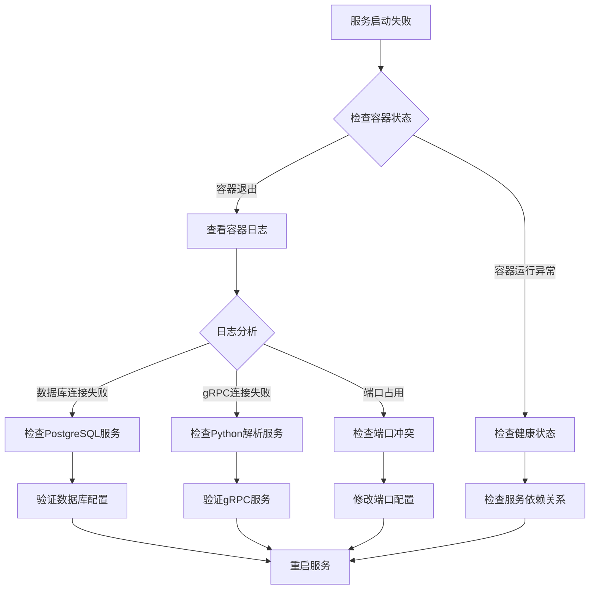
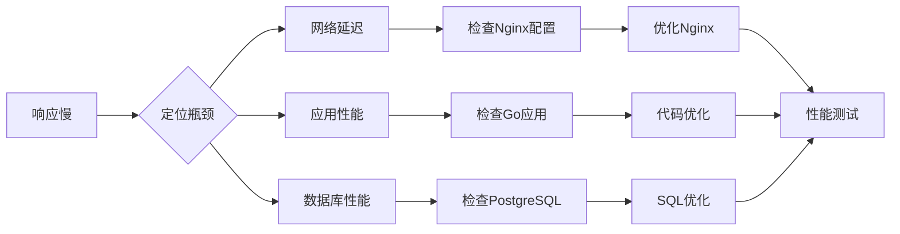
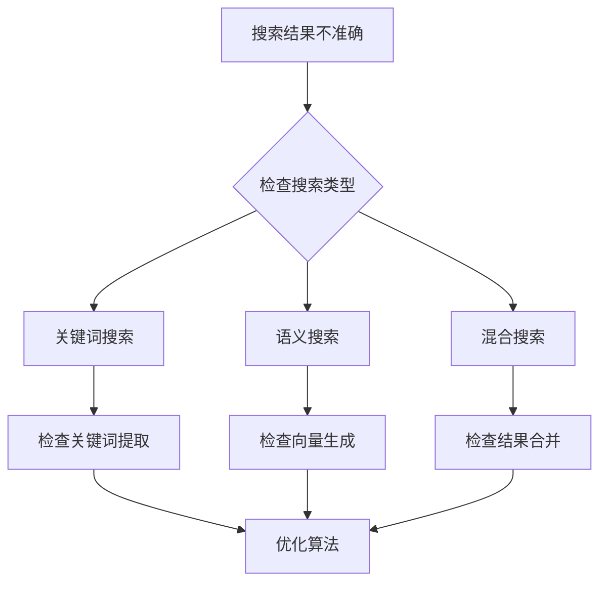
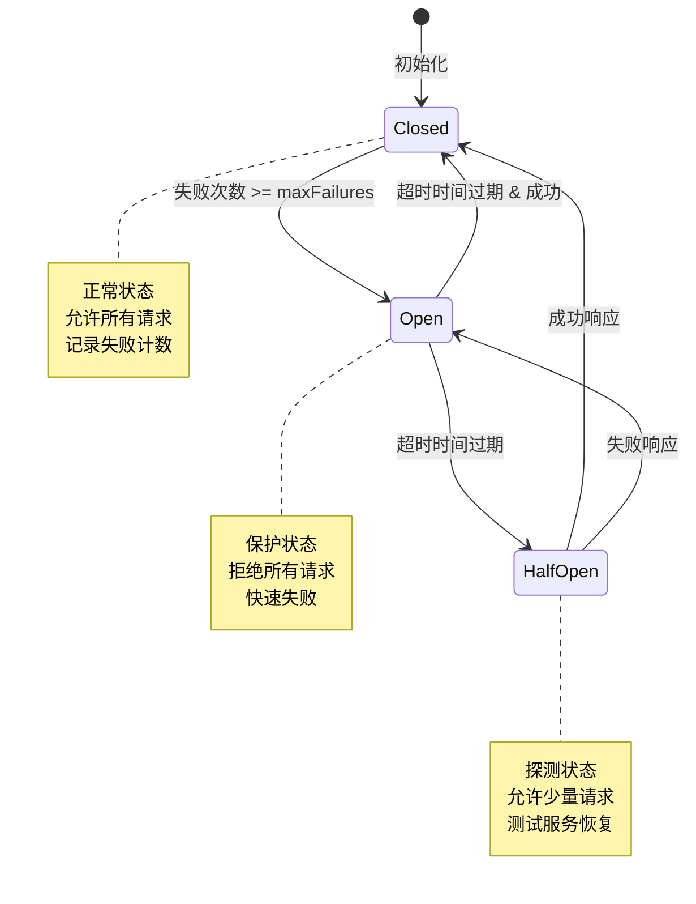
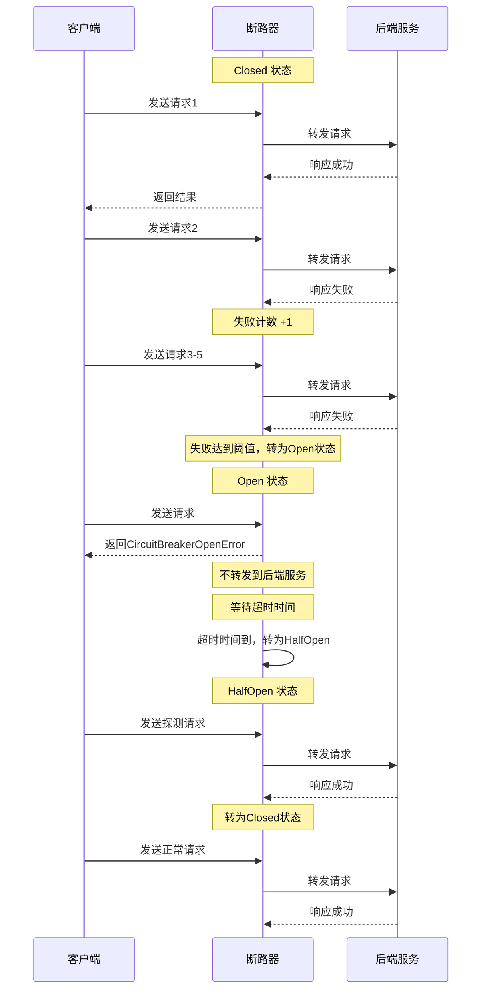

# 20、Troubleshooting指南

<details>
<summary>相关源文件</summary>
docker-compose.yml
Dockerfile
nginx.conf
cmd/main.go
internal/service/search_service.go
internal/service/embedding_service.go
internal/service/storage_service.go
internal/service/grpc_client.go
internal/service/circuit_breaker.go
scripts/check_monitor_setup.sh
scripts/validate-deployment-configs.sh
python-parser-service/DEPLOYMENT.md
</details>

## 概述

本指南提供了AI技术文档库系统在部署、性能、检索和集成等方面的常见问题排查与解决方案。通过系统化的故障诊断流程，帮助开发者和运维人员快速定位并解决问题，确保系统稳定运行。内容涵盖从服务启动失败到性能瓶颈优化的全方位技术指导，基于实际代码实现和运维经验总结而成。

**快速故障定位指南：**


**故障排查优先级：**

| 优先级 | 问题类型 | 影响范围 | 预计修复时间 |
|--------|----------|----------|--------------|
| P0 | 服务完全不可用 | 所有用户 | 1-2小时 |
| P1 | 核心功能异常 | 部分用户 | 2-4小时 |
| P2 | 性能严重下降 | 大部分用户 | 4-8小时 |
| P3 | 次要功能异常 | 少数用户 | 1-2天 |
| P4 | 性能轻微下降 | 部分用户 | 2-3天 |

**相关文档交叉引用：**
- 部署问题详见[`13_部署运维方案.md`](13_部署运维方案.md:1)
- 性能优化详见[`16_性能优化.md`](16_性能优化.md:1)
- 系统监控详见[`14_系统监控与日志.md`](14_系统监控与日志.md:1)
- 安全机制详见[`15_安全机制.md`](15_安全机制.md:1)

## troubleshooting-deployment (部署问题排查)

### 服务启动失败问题

#### 问题描述

服务启动失败是部署过程中最常见的问题，可能由多种原因导致，包括依赖服务未就绪、配置错误、端口冲突等。

#### 诊断流程



#### 常见问题与解决方案

**1. 数据库连接失败**

根据[`cmd/main.go`](cmd/main.go:39)的实现，数据库连接失败通常表现为：
```
Failed to connect to database: connection refused
```

**排查步骤：**
```bash
# 1. 检查PostgreSQL容器状态
docker-compose ps postgres

# 2. 查看PostgreSQL日志
docker-compose logs postgres

# 3. 验证数据库连接
docker exec -it ai-doc-postgres psql -U postgres -d ai_doc_library -c "SELECT 1"

# 4. 检查数据库初始化脚本
docker exec -it ai-doc-postgres ls -la /docker-entrypoint-initdb.d/
```

**解决方案：**
- 确保PostgreSQL容器健康状态：检查[`docker-compose.yml`](docker-compose.yml:189)中的健康检查配置
- 验证环境变量配置：DB_HOST、DB_PORT、DB_USER、DB_PASSWORD、DB_NAME
- 检查数据库迁移是否成功执行：查看[`cmd/main.go`](cmd/main.go:44)中的自动迁移逻辑

**2. gRPC连接失败**

在[`internal/service/grpc_client.go`](internal/service/grpc_client.go:36)中，gRPC连接失败会导致文档解析功能不可用：
```
连接解析服务失败: connection refused
```

**排查步骤：**
```bash
# 1. 检查Python解析服务状态
docker-compose ps python-parser

# 2. 查看Python服务日志
docker-compose logs python-parser

# 3. 测试gRPC端口连通性
docker exec -it ai-doc-backend-1 nc -z python-parser 50051 && echo "Connection successful"

# 4. 验证gRPC服务健康
docker exec -it ai-doc-backend-1 python -c "import socket; s=socket.socket(); s.connect(('python-parser', 50051)); s.close(); print('OK')"
```

**解决方案：**
- 确保Python解析服务在backend之前启动：检查[`docker-compose.yml`](docker-compose.yml:101)中的depends_on配置
- 验证gRPC服务地址配置：检查环境变量GRPC_SERVER_HOST和GRPC_SERVER_PORT
- 参考[`python-parser-service/DEPLOYMENT.md`](python-parser-service/DEPLOYMENT.md:79)中的故障排除指南

**3. 端口冲突问题**

端口冲突常见于多个服务或本地进程占用相同端口。根据[`docker-compose.yml`](docker-compose.yml:9)和[`nginx.conf`](nginx.conf:57)的配置，系统使用的端口包括：
- 80: Nginx前端服务
- 8080: Go后端服务实例1
- 8081: Go后端服务实例2
- 50051: Python gRPC解析服务
- 5432: PostgreSQL数据库

**排查步骤：**
```bash
# 1. 检查端口占用
netstat -tulpn | grep -E '80|8080|8081|50051|5432'

# 2. 查看Docker容器端口映射
docker-compose ps

# 3. 检查防火墙规则
sudo iptables -L -n -v | grep -E '80|8080|8081|50051|5432'
```

**解决方案：**
- 停止占用端口的服务：kill or systemctl stop
- 修改docker-compose.yml中的端口映射
- 调整系统服务配置，避免端口冲突

### 容器健康检查失败

#### 问题诊断

根据[`docker-compose.yml`](docker-compose.yml:22)中的健康检查配置，服务健康检查失败会导致容器重启或服务不可用。

**检查健康状态：**
```bash
# 1. 查看所有服务健康状态
docker-compose ps

# 2. 查看特定服务健康检查日志
docker inspect --format='{{json .State.Health}}' ai-doc-backend-1 | jq

# 3. 手动执行健康检查命令
docker exec ai-doc-backend-1 /bin/sh /app/scripts/healthcheck.sh
```

**常见原因：**

1. **PostgreSQL健康检查失败**
   - 数据库未完全启动
   - 连接数达到上限
   - 磁盘空间不足

2. **Backend健康检查失败**
   - 应用启动时间过长
   - API端点响应异常
   - 依赖服务未就绪

3. **Nginx健康检查失败**
   - 配置文件错误
   - 后端服务不可达
   - 静态文件缺失

**解决方案：**
```bash
# 1. 增加健康检查超时时间（修改docker-compose.yml）
healthcheck:
  test: ["CMD", "/bin/sh", "/app/scripts/healthcheck.sh"]
  interval: 30s
  timeout: 20s  # 增加到20秒
  retries: 5    # 增加重试次数
  start_period: 60s  # 增加启动等待时间

# 2. 检查应用日志排查启动问题
docker-compose logs -f backend

# 3. 验证Nginx配置
docker exec ai-doc-nginx nginx -t
```

### 数据库迁移问题

#### 问题分析

根据[`cmd/main.go`](cmd/main.go:44)的实现，数据库迁移问题通常有：

1. **pgvector扩展缺失**
```
type "vector" does not exist
```

**解决方案：**
```bash
# 1. 安装pgvector扩展
docker exec -it ai-doc-postgres psql -U postgres -d ai_doc_library -c "CREATE EXTENSION IF NOT EXISTS vector"

# 2. 执行pgvector初始化脚本
docker exec ai-doc-postgres psql -U postgres -d ai_doc_library -f /docker-entrypoint-initdb.d/02-setup_pgvector.sql
```

2. **表结构冲突**
```
relation already exists
```

**解决方案：**
```bash
# 1. 检查已有表结构
docker exec -it ai-doc-postgres psql -U postgres -d ai_doc_library -c "\d"

# 2. 手动清理冲突表（谨慎操作）
docker exec -it ai-doc-postgres psql -U postgres -d ai_doc_library -c "DROP TABLE IF EXISTS search_indices CASCADE"

# 3. 重新执行迁移
docker-compose restart backend
```

3. **数据类型不匹配**

根据[`scripts/fix_search_indices_vector_type.sql`](scripts/fix_search_indices_vector_type.sql)脚本，可能需要修复向量列类型：
```bash
# 执行修复脚本
docker exec -it ai-doc-postgres psql -U postgres -d ai_doc_library -f /app/scripts/fix_search_indices_vector_type.sql
```

### 配置文件验证

#### 自动化检查

使用[`scripts/validate-deployment-configs.sh`](scripts/validate-deployment-configs.sh:1)进行全面的配置验证：

```bash
# 执行配置验证
./scripts/validate-deployment-configs.sh
```

该脚本会检查：
- Docker配置完整性和语法
- Kubernetes配置文件
- Nginx配置正确性
- Shell脚本语法
- 安全配置符合性

#### 手动验证步骤

**1. Docker Compose配置验证**
```bash
# 语法检查
docker-compose config

# 服务依赖关系验证
docker-compose config | grep depends_on

# 环境变量验证
docker-compose config | grep environment
```

**2. Nginx配置验证**
```bash
# 语法检查
docker exec ai-doc-nginx nginx -t

# 配置测试
curl -I http://localhost/health
```

**3. 应用配置验证**
```bash
# 检查环境变量注入
docker exec ai-doc-backend-1 env | grep -E 'DB_|STORAGE_|GRPC_'

# 验证配置文件路径
docker exec ai-doc-backend-1 ls -la /app/
```

### 网络连接问题

#### Docker网络问题

系统使用Docker自定义网络`ai-doc-network`，可能出现以下问题：

**诊断步骤：**
```bash
# 1. 检查Docker网络
docker network ls
docker network inspect 3c8ab84585b0  # ai-doc-network

# 2. 测试容器间连通性
docker exec ai-doc-backend-1 ping postgres
docker exec ai-doc-backend-1 python -c "socket.create_connection(('python-parser', 50051)).close()"

# 3. 检查DNS解析
docker exec ai-doc-backend-1 nslookup postgres
```

**解决方案：**
```bash
# 1. 重建Docker网络
docker-compose down
docker network prune
docker-compose up -d

# 2. 检查防火墙规则
sudo iptables -L DOCKER -n -v

# 3. 验证DNS配置
docker exec ai-doc-backend-1 cat /etc/resolv.conf
```

### 文件系统问题

#### 存储目录问题

根据[`Dockerfile`](Dockerfile:77)和[`docker-compose.yml`](docker-compose.yml:54)的配置，系统使用的存储目录可能存在问题：

**1. 目录权限问题**
```bash
# 检查存储目录权限
ls -la storage/
ls -la backups/

# 修复权限
chmod -R 755 storage/
chmod -R 755 backups/
chown -R 1000:1000 storage/
```

**2. 磁盘空间不足**
```bash
# 检查磁盘使用情况
df -h

# 清理Docker未使用的资源
docker system prune -a

# 清理旧日志
find ./logs -type f -name "*.log" -mtime +7 -delete
```

**3. 存储目录挂载问题**
```bash
# 检查卷挂载
docker volume ls
docker inspect ai-doc-backend-1 | grep -A 10 Mounts

# 验证存储服务健康检查
curl http://localhost:8080/api/v1/health/storage
```

## troubleshooting-performance (性能问题排查)

### 响应慢问题

#### 系统性诊断流程



#### 网络层性能优化

根据[`nginx.conf`](nginx.conf:98)的配置，Nginx可能是性能瓶颈：

**性能检查：**
```bash
# 1. 检查Nginx响应时间
curl -w "@curl-format.txt" -o /dev/null -s http://localhost/api/v1/health

# 2. 查看Nginx访问日志分析
tail -f logs/nginx/access.log | grep "api/v1"

# 3. 检查Nginx进程状态
docker exec ai-doc-nginx ps aux | grep nginx
```

**优化措施：**
```nginx
# 在nginx.conf中添加性能优化配置
worker_processes auto;
worker_rlimit_nofile 65535;
worker_connections 4096;

# 启用缓存
proxy_cache_path /var/cache/nginx levels=1:2 keys_zone=my_cache:10m max_size=1g inactive=60m;

# API端点缓存配置
location /api/v1/search {
    proxy_cache my_cache;
    proxy_cache_valid 200 5m;
    proxy_cache_key "$scheme$request_method$host$request_uri";
}
```

#### 应用层性能优化

**1. 搜索服务性能检查**

根据[`internal/service/search_service.go`](internal/service/search_service.go:97)的实现，搜索性能问题可能表现为：

```bash
# 检查搜索响应时间
time curl -X POST http://localhost/api/v1/search \
  -H "Content-Type: application/json" \
  -d '{"query": "测试", "page": 1, "size": 10}'

# 查看搜索服务日志
docker-compose logs backend | grep "Search completed"
```

**优化建议：**
- 启用查询缓存：[`search_service.go`](internal/service/search_service.go:106)中已实现缓存机制
- 优化数据库查询：为search_indices表添加合适的索引
- 调整分页大小：避免一次性返回过多数据

**2. 嵌入向量生成性能问题**

根据[`internal/service/embedding_service.go`](internal/service/embedding_service.go:56)的实现，OpenAI API调用可能成为性能瓶颈：

```bash
# 检查embedding生成时间
docker-compose logs backend | grep "GenerateEmbedding"

# 测试Mock服务性能（如果使用Mock）
curl http://localhost:8080/api/v1/search \
  -d '{"query": "test", "searchType": "semantic"}'
```

**优化措施：**
- 批量处理embedding请求
- 使用本地embedding模型替代OpenAI API
- 实现embedding结果缓存

#### 数据库性能优化

**1. 慢查询分析**

```bash
# 1. 启用PostgreSQL慢查询日志
docker exec -it ai-doc-postgres psql -U postgres -d ai_doc_library -c "
ALTER SYSTEM SET log_min_duration_statement = 1000;
SELECT pg_reload_conf();
"

# 2. 查看慢查询日志
docker exec ai-doc-postgres tail -f /var/lib/postgresql/data/pgdata/log/postgresql-*.csv

# 3. 分析查询执行计划
docker exec -it ai-doc-postgres psql -U postgres -d ai_doc_library -c "
EXPLAIN ANALYZE SELECT * FROM search_indices WHERE content LIKE '%test%' LIMIT 10;
"
```

**优化措施：**
- 为search_indices表的content字段添加全文搜索索引
- 创建向量索引：CREATE INDEX ON search_indices USING ivfflat (embedding vector_cosine_ops);
- 优化连接查询：为外键字段添加索引

**2. 连接池优化**

```bash
# 1. 检查数据库连接数
docker exec -it ai-doc-postgres psql -U postgres -d ai_doc_library -c "SELECT count(*) FROM pg_stat_activity;"

# 2. 调整连接池配置
```

在应用配置中调整数据库连接池参数，避免连接泄漏。

### 内存泄漏问题

#### 内存使用监控

```bash
# 1. 查看容器内存使用
docker stats --format "table {{.Container}}\t{{.MemUsage}}\t{{.MemPerc}}"

# 2. 检查Go应用内存
docker exec ai-doc-backend-1 ps aux | grep main

# 3. 详细内存分析
docker exec ai-doc-backend-1 cat /proc/$(pgrep main)/status | grep -E 'VmPeak|VmSize|VmRSS'
```

#### 常见内存泄漏场景

**1. 文件上传内存泄漏**

在处理大文件上传时，可能因未正确释放资源导致内存泄漏：

```bash
# 监控上传过程内存
watch -n 1 'docker stats --no-stream | grep backend'
```

**解决方案：**
- 使用流式处理而非一次性加载文件
- 及时关闭文件句柄
- 限制上传文件大小

**2. 缓存未清理**

根据[`internal/service/cache_service.go`](internal/service/cache_service.go)的实现，缓存可能无限增长：

```bash
# 检查缓存大小
curl http://localhost:8080/api/v1/health/cache
```

**解决方案：**
- 实现LRU缓存策略
- 设置缓存过期时间
- 定期清理缓存

**3. gRPC连接泄漏**

根据[`internal/service/grpc_client.go`](internal/service/grpc_client.go:48)的实现，连接可能未正确关闭：

```bash
# 检查gRPC连接
docker exec ai-doc-backend-1 netstat -an | grep 50051
```

**解决方案：**
- 使用连接池管理gRPC连接
- 实现连接回收机制
- 设置连接超时

### CPU占用高问题

#### CPU使用分析

```bash
# 1. 查看容器CPU使用率
docker stats --format "table {{.Container}}\t{{.CPUPerc}}"

# 2. 详细的CPU分析
docker exec ai-doc-backend-1 top -b -n 1

# 3. 分析Go应用CPU配置文件
# 需要启动时添加: --cpuprofile=cpu.prof
```

#### 高CPU负载常见原因

**1. 向量计算密集型操作**

根据[`internal/service/search_service.go`](internal/service/search_service.go:130)的实现，语义搜索涉及大量向量计算：

```bash
# 检查搜索操作的CPU使用
docker exec ai-doc-backend-1 perf top -p $(pgrep main)
```

**优化措施：**
- 使用向量化计算库（如BLAS）
- 限制并发搜索请求数
- 考虑使用专用向量数据库（如Milvus）

**2. 文档解析CPU密集型操作**

在解析大型文档时，Python解析服务可能出现CPU瓶颈：

```bash
# 检查Python进程CPU使用
docker exec python-parser-service top -b -n 1
```

**优化措施：**
- 调整线程池大小：在[`service/server.py`](python-parser-service/service/server.py)中配置max_workers
- 实现解析结果缓存
- 使用异步处理避免阻塞

**3. 垃圾回收频繁触发**

Go应用的GC可能导致CPU峰值：

```bash
# 启用GC日志
docker exec ai-doc-backend-1 GODEBUG=gctrace=1 ./main

# 调整GC参数
GOGC=100  # 控制GC触发频率
```

### 超时问题排查

#### 超时配置检查

根据[`nginx.conf`](nginx.conf:99)和[`internal/service/grpc_client.go`](internal/service/grpc_client.go:68)的配置，系统有多层超时设置：

```bash
# 检查Nginx超时配置
docker exec ai-doc-nginx grep -E "timeout" /etc/nginx/nginx.conf

# 检查应用超时设置
docker exec ai-doc-backend-1 grep -r "WithTimeout" /app/
```

#### 常见超时场景

**1. 文档上传超时**

```bash
# 监控上传时间
time curl -X POST http://localhost/api/v1/documents/upload \
  -F "file=@large_file.pdf"
```

**解决方案：**
- 增加Nginx的client_max_body_size和proxy_read_timeout
- 实现分片上传
- 添加上传进度反馈

**2. 文档解析超时**

根据[`internal/service/grpc_client.go`](internal/service/grpc_client.go:68)的配置，gRPC调用有30秒超时：

```bash
# 检查解析日志
docker-compose logs python-parser | grep "Parse"
```

**解决方案：**
- 增加gRPC超时时间
- 实现异步解析
- 优化解析算法

**3. 数据库查询超时**

```bash
# 检查慢查询
docker exec -it ai-doc-postgres psql -U postgres -d ai_doc_library -c "
SELECT query, mean_exec_time 
FROM pg_stat_statements 
ORDER BY mean_exec_time DESC 
LIMIT 10;
"
```

**解决方案：**
- 优化SQL查询
- 添加数据库索引
- 实现查询结果分页

## troubleshooting-search (检索问题排查)

### 搜索结果不准确

#### 问题诊断流程



#### 关键词搜索问题

根据[`internal/service/search_service.go`](internal/service/search_service.go:122)的实现，关键词搜索可能出现：

**1. 关键词提取不准确**

```bash
# 测试关键词提取
curl -X POST http://localhost/api/v1/search \
  -H "Content-Type: application/json" \
  -d '{"query": "机器学习", "searchType": "keyword"}'

# 查看日志
docker-compose logs backend | grep "extractKeywords"
```

**解决方案：**
- 改进关键词分词算法
- 添加同义词扩展
- 实现模糊匹配

**2. 相关性评分不合理**

根据[`search_service.go`](internal/service/search_service.go:126)的实现，相关性计算可能不准确：

```bash
# 检查搜索结果得分
curl -s -X POST http://localhost/api/v1/search \
  -d '{"query": "测试", "searchType": "keyword"}' | jq '.items[].score'
```

**优化措施：**
- 调整评分权重
- 考虑文档新鲜度
- 添加点击反馈学习

#### 语义搜索问题

**1. 向量质量问题**

根据[`internal/service/embedding_service.go`](internal/service/embedding_service.go:56)的实现，embedding质量直接影响搜索结果：

```bash
# 检查embedding生成
docker-compose logs backend | grep "GenerateEmbedding"

# 测试Mock vs OpenAI的embedding差异
```

**解决方案：**
- 使用更高质量的embedding模型
- 调整向量维度
- 实现向量归一化

**2. 向量索引错误**

```bash
# 检查向量索引
docker exec -it ai-doc-postgres psql -U postgres -d ai_doc_library -c "
SELECT indexname, indexdef FROM pg_indexes WHERE tablename = 'search_indices';
"

# 重建向量索引
docker exec -it ai-doc-postgres psql -U postgres -d ai_doc_library -c "
DROP INDEX IF EXISTS search_indices_embedding_idx;
CREATE INDEX search_indices_embedding_idx ON search_indices USING ivfflat (embedding vector_cosine_ops) WITH (lists = 100);
"
```

**3. 向量维度不匹配**

根据[`scripts/fix_search_indices_vector_type.sql`](scripts/fix_search_indices_vector_type.sql)的脚本，可能出现向量维度问题：

```bash
# 检查向量维度
docker exec -it ai-doc-postgres psql -U postgres -d ai_doc_library -c "
SELECT array_length(embedding, 1) as vector_dim, COUNT(*) 
FROM search_indices 
GROUP BY array_length(embedding, 1);
"
```

#### 混合搜索问题

根据[`internal/service/search_service.go`](internal/service/search_service.go:136)的实现，混合搜索可能出现：

**1. 结果合并策略不当**

```bash
# 测试混合搜索
curl -X POST http://localhost/api/v1/search \
  -d '{"query": "测试", "searchType": "hybrid"}'

# 分析合并结果
docker-compose logs backend | grep "mergeSearchResults"
```

**优化措施：**
- 调整关键词和语义搜索的权重比例
- 实现结果去重
- 优化排序算法

**2. 性能问题**

```bash
# 监控混合搜索性能
time curl -X POST http://localhost/api/v1/search \
  -d '{"query": "测试", "searchType": "hybrid"}'
```

**解决方案：**
- 并行执行关键词和语义搜索
- 实现结果缓存
- 限制初始结果数量

### Embedding失败问题

#### OpenAI API调用失败

根据[`internal/service/embedding_service.go`](internal/service/embedding_service.go:56)的实现，可能出现：

**1. API密钥无效**

```bash
# 检查API密钥配置
docker exec ai-doc-backend-1 env | grep OPENAI

# 测试API连接
curl https://api.openai.com/v1/models \
  -H "Authorization: Bearer $OPENAI_API_KEY"
```

**解决方案：**
- 验证API密钥有效性
- 检查API配额
- 更新API密钥

**2. 网络连接问题**

```bash
# 测试网络连接
docker exec ai-doc-backend-1 curl -I https://api.openai.com

# 检查代理设置
docker exec ai-doc-backend-1 env | grep -i proxy
```

**解决方案：**
- 配置HTTP代理
- 检查防火墙规则
- 使用自定义API端点（OPENAI_BASE_URL）

**3. API限流**

```bash
# 查看限流错误日志
docker-compose logs backend | grep "rate limit"
```

**解决方案：**
- 实现请求队列
- 添加指数退避重试
- 升级API计划

### 向量索引问题

#### 索引创建失败

```bash
# 检查索引创建日志
docker-compose logs backend | grep "CreateIndex"

# 查看数据库错误日志
docker-compose logs postgres | grep "ERROR"
```

**常见错误及解决方案：**

**1. pgvector扩展未安装**

```bash
# 安装pgvector扩展
docker exec -it ai-doc-postgres psql -U postgres -d ai_doc_library -c "CREATE EXTENSION IF NOT EXISTS vector"
```

**2. 向量列数据类型错误**

```bash
# 检查向量列类型
docker exec -it ai-doc-postgres psql -U postgres -d ai_doc_library -c "\d search_indices"

# 修正向量列类型
docker exec -it ai-doc-postgres psql -U postgres -d ai_doc_library -c "
ALTER TABLE search_indices 
ALTER COLUMN embedding TYPE vector(384) USING embedding::vector;
"
```

**3. 存储空间不足**

```bash
# 检查向量索引大小
docker exec -it ai-doc-postgres psql -U postgres -d ai_doc_library -c "
SELECT pg_size_pretty(pg_total_relation_size('search_indices')) as total_size;
"
```

**解决方案：**
- 清理旧索引数据
- 优化索引参数（lists值）
- 考虑分区表

### 缓存相关问题

#### 缓存未命中

根据[`internal/service/search_service.go`](internal/service/search_service.go:106)的实现，缓存问题可能影响搜索性能：

```bash
# 检查缓存命中率
curl http://localhost:8080/api/v1/health/cache

# 查看缓存日志
docker-compose logs backend | grep "Cache"
```

**解决方案：**
- 调整缓存键生成逻辑
- 增加缓存容量
- 优化缓存过期策略

#### 缓存数据过期

```bash
# 清空缓存
curl -X POST http://localhost:8080/api/v1/search/cache/clear

# 重建索引
curl -X POST http://localhost:8080/api/v1/search/index/rebuild
```

## troubleshooting-integration (集成问题排查)

### API调用失败

#### API网关问题

根据[`nginx.conf`](nginx.conf:81)和[`nginx.conf`](nginx.conf:119)的配置，API代理可能存在问题：

```bash
# 1. 检查Nginx API代理配置
docker exec ai-doc-nginx nginx -T | grep -A 20 "location /api/v1"

# 2. 测试API直连
curl http://localhost:8080/api/v1/health

# 3. 测试通过Nginx的API访问
curl http://localhost/api/v1/health

# 4. 查看Nginx访问日志
docker-compose logs nginx | grep "/api/v1"
```

**常见问题：**

**1. 反向代理超时**
```nginx
# 在nginx.conf中调整超时配置
location /api/v1/ {
    proxy_connect_timeout 60s;  # 增加到60秒
    proxy_send_timeout 60s;
    proxy_read_timeout 60s;
}
```

**2. 上传文件大小限制**
根据[`nginx.conf`](nginx.conf:104)的配置，client_max_body_size设置为100M：
```nginx
# 如需支持更大文件，调整配置
client_max_body_size 200M;
```

**3. 请求头转发问题**

根据[`nginx.conf`](nginx.conf:132)的配置，确保MCP相关的API_KEY正确转发：
```bash
# 测试API_KEY转发
curl -H "API_KEY: test-key" http://localhost/mcp/health
```

### 数据库连接问题

#### 连接池问题

```bash
# 1. 检查数据库连接数
docker exec -it ai-doc-postgres psql -U postgres -d ai_doc_library -c "
SELECT count(*) as active_connections, 
       state, 
       application_name 
FROM pg_stat_activity 
GROUP BY state, application_name;
"

# 2. 查看连接配置
docker exec -it ai-doc-postgres psql -U postgres -d ai_doc_library -c "
SHOW max_connections;
SHOW shared_buffers;
"
```

**解决方案：**
- 调整应用连接池大小
- 增加数据库最大连接数
- 实现连接池监控

#### 连接泄漏检测

```bash
# 监控长连接
docker exec -it ai-doc-postgres psql -U postgres -d ai_doc_library -c "
SELECT pid, 
       now() - query_start as duration, 
       query 
FROM pg_stat_activity 
WHERE state = 'active' 
AND now() - query_start > interval '5 minutes';
"
```

**解决方案：**
- 确保所有数据库查询正确关闭
- 实现连接超时机制
- 定期清理空闲连接

### 存储服务异常

#### 本地存储问题

根据[`internal/service/storage_service.go`](internal/service/storage_service.go:236)的实现，存储服务健康检查：

```bash
# 1. 执行存储健康检查
curl http://localhost:8080/api/v1/health/storage

# 2. 检查存储目录权限
ls -la storage/

# 3. 查看存储目录使用情况
du -sh storage/*
```

**常见问题：**

**1. 磁盘空间不足**
```bash
# 检查磁盘空间
df -h

# 清理旧文件
find storage/ -type f -mtime +30 -delete
```

**2. 文件权限错误**
```bash
# 修复存储目录权限
chmod -R 755 storage/
chown -R 1000:1000 storage/
```

**3. 文件损坏**
```bash
# 检查文件完整性
find storage/ -type f | while read file; do
    if [ ! -s "$file" ]; then
        echo "Empty file: $file"
    fi
done
```

#### S3/MinIO存储问题

如果使用S3或MinIO作为存储后端：

```bash
# 1. 测试S3连接
docker exec ai-doc-backend-1 curl -I https://s3.amazonaws.com

# 2. 检查MinIO服务
docker-compose ps minio
docker-compose logs minio

# 3. 验证MinIO凭据
docker exec ai-doc-backend-1 env | grep MINIO
```

**解决方案：**
- 验证S3/MinIO访问密钥
- 检查bucket创建和权限
- 确保网络连通性

### MCP连接问题

#### MCP协议集成问题

根据[`nginx.conf`](nginx.conf:119)的配置，MCP端点的代理配置：

```bash
# 1. 测试MCP端点
curl -H "API_KEY: test-key" http://localhost/mcp/health

# 2. 查看MCP访问日志
docker-compose logs nginx | grep "/mcp"

# 3. 检查MCP API密钥
curl -X GET http://localhost:8080/api/v1/mcp/api-keys
```

**常见问题：**

**1. API Key认证失败**
```bash
# 查看MCP日志
docker-compose logs backend | grep "MCP"

# 检查API Key配置
curl -X GET http://localhost:8080/api/v1/mcp/api-keys/enable
```

**2. API Key未启用**

根据[`internal/model/mcp.go`](internal/model/mcp.go)的实现，API Key需要启用才能使用：

```bash
# 启用API Key
curl -X PUT http://localhost:8080/api/v1/mcp/api-keys/{key_id}/enable
```

**3. API Key权限不足**
```bash
# 验证API Key权限
curl -H "API_KEY: test-key" http://localhost/mcp/documents
```

#### gRPC服务集成问题

根据[`internal/service/grpc_client.go`](internal/service/grpc_client.go:186)的健康检查实现：

```bash
# 1. 执行gRPC健康检查
curl http://localhost:8080/api/v1/health/grpc

# 2. 查看gRPC连接日志
docker-compose logs backend | grep "gRPC"

# 3. 测试gRPC服务连通性
docker exec ai-doc-backend-1 python -c "
import grpc
channel = grpc.insecure_channel('python-parser:50051')
try:
    grpc.channel_ready_future(channel).result(timeout=5)
    print('gRPC service is ready')
except:
    print('gRPC service is not available')
"
```

**解决方案：**

**1. gRPC连接超时**
根据[`internal/service/grpc_client.go`](internal/service/grpc_client.go:68)的实现，调整超时时间：
```go
// 在grpc_client.go中调整超时
ctx, cancel := context.WithTimeout(context.Background(), 60*time.Second)  // 增加到60秒
```

**2. gRPC服务未启动**
```bash
# 重启Python解析服务
docker-compose restart python-parser

# 等待服务就绪
sleep 10
docker-compose ps python-parser
```

**3. gRPC端口不可达**
```bash
# 检查Docker网络
docker network inspect 3c8ab84585b0

# 测试端口连通性
docker exec ai-doc-backend-1 nc -zv python-parser 50051
```

### 外部服务监控

#### 服务健康检查综合诊断

使用[`scripts/check_monitor_setup.sh`](scripts/check_monitor_setup.sh:1)进行系统健康检查：

```bash
# 执行监控设置检查
./scripts/check_monitor_setup.sh
```

该脚本会验证：
- 后端监控组件完整性
- 前端监控配置
- 数据库监控表
- Chart.js依赖

#### 断路器状态检查

根据[`internal/service/circuit_breaker.go`](internal/service/circuit_breaker.go:92)的实现，断路器保护可能影响集成：

```bash
# 1. 检查断路器状态
curl http://localhost:8080/api/v1/health/circuit-breakers

# 2. 查看断路器日志
docker-compose logs backend | grep "CircuitBreaker"

# 3. 重置断路器
curl -X POST http://localhost:8080/api/v1/health/circuit-breakers/reset
```

**断路器状态说明：**

根据[`internal/service/circuit_breaker.go`](internal/service/circuit_breaker.go:12)的实现，断路器采用状态机模式：



**断路器工作流程示意：**



- **Closed**（关闭状态）：正常状态，允许所有请求通过。每次失败会递增失败计数器，每次成功会重置计数器
  - 算法复杂度：O(1) - 使用互斥锁保护状态转换
  - 阈值配置：maxFailures（默认5次）会触发状态转换
  - 失败记录：每次失败记录lastFailTime时间戳

- **Open**（打开状态）：断路器打开，拒绝所有请求，直接返回[`CircuitBreakerOpenError`](internal/service/circuit_breaker.go:107)
  - 持续时间：timeout配置（默认60秒）后转入HalfOpen
  - 性能优势：避免不必要的超时等待，快速失败
  - 资源保护：防止级联故障和资源耗尽

- **HalfOpen**（半开状态）：允许少量请求通过，用于测试服务是否恢复
  - 探测机制：允许第一个请求通过，根据结果决定状态
  - 成功路径：请求成功 → 转为Closed状态，重置失败计数
  - 失败路径：请求失败 → 转回Open状态，重新开始超时计时

**技术实现细节：**

1. **线程安全保障**
根据[`circuit_breaker.go`](internal/service/circuit_breaker.go:52)的实现：
```go
func (cb *CircuitBreaker) allow() bool {
    cb.mu.Lock()
    defer cb.mu.Unlock()
    // 状态检查逻辑...
}
```
- 使用`sync.RWMutex`实现读写锁优化
- 读操作（状态查询）使用RLock，支持高并发读取
- 写操作（状态修改）使用Lock，保证原子性
- 避免竞态条件和脏读

2. **状态转换时机**
- **Closed → Open**：当failure次数达到maxFailures阈值时立即转换
  - 防抖设计：不立即重置，给服务恢复时间
  - 最小保护时间：timeout参数确保至少保护一段时间
  
- **Open → HalfOpen**：超时时间（timeout）流逝后转换
  - 条件：`time.Since(cb.lastFailTime) > cb.timeout`
  - 自动恢复：无需手动干预，系统自动尝试恢复
  
- **HalfOpen → Closed/Open**：根据首个探测请求结果转换
  - 暴露服务风险：只允许一个请求通过，失败立即返回Open
  - 快速恢复：成功立即返回Closed，恢复全部流量

3. **性能影响分析**
- **正常情况（Closed）**：
  - 时间复杂度：O(1)
  - 空间复杂度：O(1) - 只维护计数器和时间戳
  - 性能开销：极小，仅有一次互斥锁操作
  
- **异常情况（Open）**：
  - 时间复杂度：O(1) - 直接返回错误，无需等待
  - 性能提升：避免大量超时等待（通常30秒）
  - 资源节约：减少无效的数据库/网络连接

- **恢复阶段（HalfOpen）**：
  - 风险控制：每次只允许一个探测请求
  - 恢复速度：取决于timeout配置，通常60秒开始探测
  - 雪崩防护：防止服务未完全恢复就接收大量请求

**配置调优建议：**

```go
// 数据库服务断路器配置
dbBreaker := service.NewCircuitBreaker(
    "database",              // 断路器名称，用于日志追踪
    5,                      // maxFailures: 5次失败后打开
    1 * time.Minute         // timeout: 1分钟后尝试恢复
)

// gRPC服务断路器配置（更严格的保护）
grpcBreaker := service.NewCircuitBreaker(
    "grpc-parser",           // 断路器名称
    3,                      // maxFailures: 3次失败后打开（更激进）
    30 * time.Second        // timeout: 30秒后尝试恢复（更快恢复）
)
```

**最佳实践：**
- 连续失败阈值设置：3-10次之间，根据服务重要性调整
- 超时时间设置：1-5分钟，平衡服务恢复速度和稳定性
- 监控指标：记录断路器状态转换次数和持续时间
- 告警机制：断路器打开超过阈值时间时发送告警

**解决方案：**

**1. 服务恢复正常后断路器仍处于Open状态**
```bash
# 等待超时时间后自动转为HalfOpen状态
# 根据circuit_breaker.go中的timeout配置
```

**2. 降低失败阈值**
在应用启动代码中调整：
```go
// 在cmd/main.go或service初始化中
breaker := service.NewCircuitBreaker("database", 10, time.Minute)  // 增加失败次数阈值
```

**3. 增加超时时间**
```bash
# 调整超时时间，避免误触发断路器
breaker := service.NewCircuitBreaker("database", 5, 5*time.Minute)  // 增加超时时间
```

## 系统恢复建议

### 数据备份恢复

```bash
# 1. 数据库备份
docker-compose exec -T postgres pg_dump -U postgres ai_doc_library > backup_$(date +%Y%m%d).sql

# 2. 从备份恢复
docker-compose exec -T postgres psql -U postgres ai_doc_library < backup_20240101.sql

# 3. 使用应用备份服务
curl -X POST http://localhost:8080/api/v1/backup/create
curl -X GET http://localhost:8080/api/v1/backup/list
```

### 完整系统重启

```bash
# 1. 停止所有服务
docker-compose down

# 2. 清理Docker资源（可选）
docker system prune -a

# 3. 重新构建镜像
docker-compose build --no-cache

# 4. 启动所有服务
docker-compose up -d

# 5. 验证服务状态
docker-compose ps
docker-compose logs -f
```

### 性能调优检查清单

- [ ] 所有服务健康检查通过
- [ ] 数据库连接数在合理范围内
- [ ] 搜索响应时间 < 2秒
- [ ] 文档上传超时配置合理
- [ ] 缓存命中率 > 80%
- [ ] CPU使用率 < 80%
- [ ] 内存使用率 < 85%
- [ ] 磁盘空间使用率 < 70%
- [ ] 网络延迟 < 100ms

### 安全检查清单

- [ ] 修改默认密码和密钥
- [ ] 启用HTTPS/TLS加密
- [ ] 配置API访问限制
- [ ] 启用防火墙规则
- [ ] 定期更新依赖包
- [ ] 实施日志审计
- [ ] 配置备份策略
- [ ] 定期安全扫描

## 参考资源

### 文档资源

- 项目README：[`README.md`](README.md:1)
- 部署指南：[`DEPLOYMENT.md`](DEPLOYMENT.md:1)
- Python解析服务部署：[`python-parser-service/DEPLOYMENT.md`](python-parser-service/DEPLOYMENT.md:1)
- 快速开始：[`docs/QUICK_START.md`](docs/QUICK_START.md:1)

### 监控脚本

- 监控设置检查：[`scripts/check_monitor_setup.sh`](scripts/check_monitor_setup.sh:1)
- 部署配置验证：[`scripts/validate-deployment-configs.sh`](scripts/validate-deployment-configs.sh:1)
- 数据验证：[`scripts/verify_monitor_data.sh`](scripts/verify_monitor_data.sh:1)

### 日志位置

- Nginx日志：`logs/nginx/`
- Backend日志：`logs/backend/` 和 `logs/backend2/`
- Docker日志：`docker-compose logs [service_name]`

### 数据库维护脚本

- 索引修复：[`scripts/fix_search_indices_vector_type.sql`](scripts/fix_search_indices_vector_type.sql:1)
- 清理重复版本：[`scripts/clean_duplicate_versions.sql`](scripts/clean_duplicate_versions.sql:1)
- 清理孤立索引：[`scripts/clean_orphan_search_indices.sql`](scripts/clean_orphan_search_indices.sql:1)