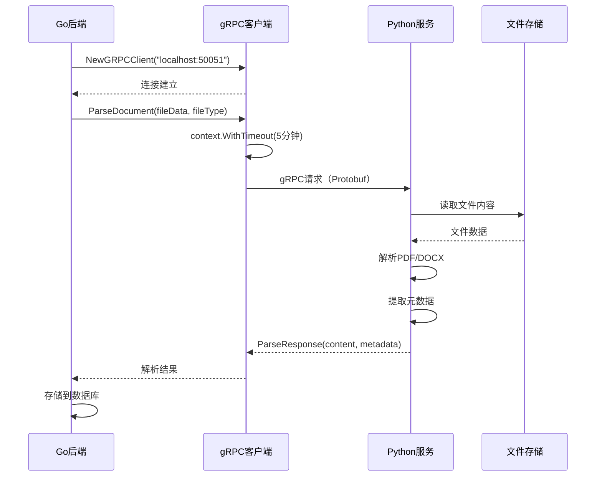
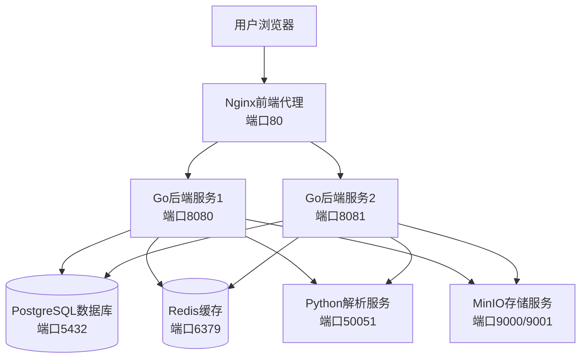
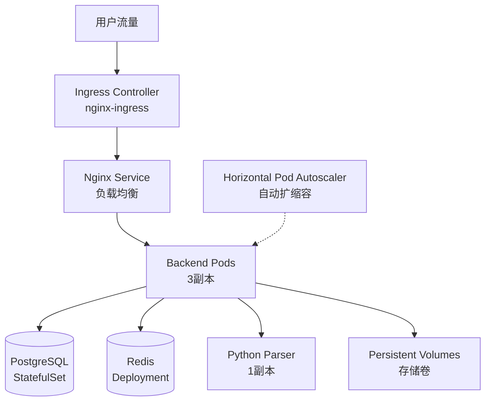
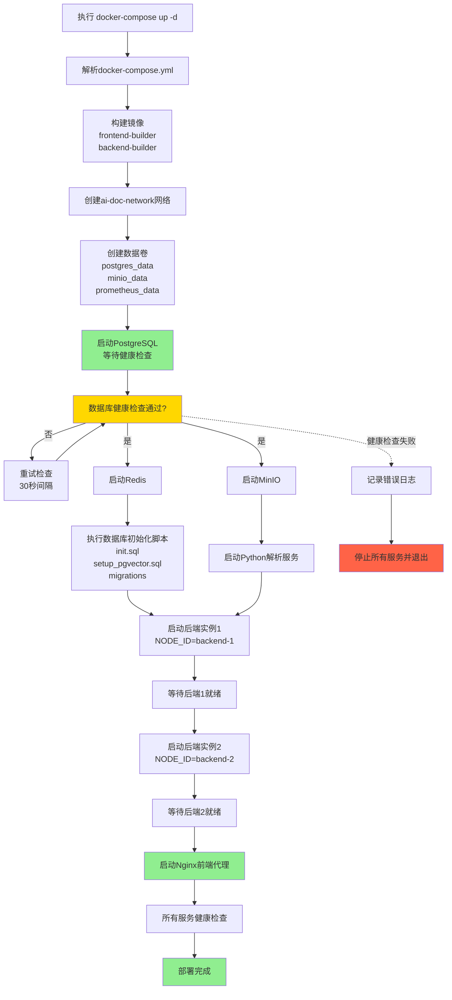
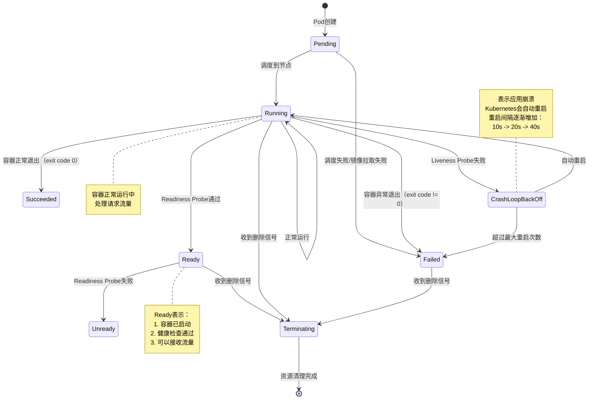
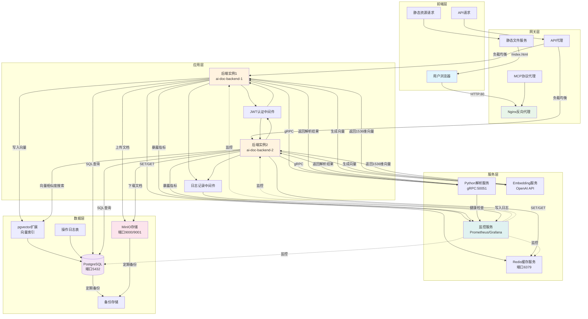
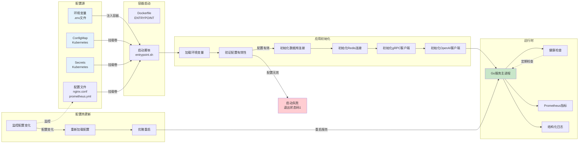

# 2、环境配置与部署

<details>
<summary>相关源文件</summary>
docker-compose.yml
k8s/deployment.yaml
k8s/configmap.yaml
k8s/secrets.yaml
k8s/ingress.yaml
k8s/pvc.yaml
k8s/namespace.yaml
k8s/postgres.yaml
k8s/redis.yaml
Dockerfile
go.mod
nginx.conf
Makefile
python-parser-service/requirements.txt
</details>

## 概述

本文档详细指导用户完成LAST-doc系统的开发环境配置、生产环境部署和运维配置。LAST-doc是一个基于Go后端、Vue.js前端、Python解析服务的现代化AI文档库系统，支持Docker Compose和Kubernetes两种部署方式。文档提供了从本地开发环境搭建到生产环境集群部署的完整指南，确保系统能够在不同环境下稳定运行。

## 系统要求

### 硬件要求

**开发环境：**
- CPU：4核心及以上
- 内存：8GB及以上
- 存储：50GB可用空间
- 网络：稳定的互联网连接

**生产环境（Docker Compose）：**
- CPU：8核心及以上
- 内存：16GB及以上
- 存储：100GB可用空间
- 网络：1Gbps及以上

**生产环境（Kubernetes）：**
- 节点CPU：4核心及以上（至少2个节点）
- 节点内存：8GB及以上
- 集群存储：200GB及以上
- 网络：Kubernetes集群间网络可用

### 软件依赖

**核心依赖版本要求：**

| 依赖项 | 版本要求 | 用途 |
|--------|----------|------|
| Go | 1.24+ | 后端服务开发与运行 |
| Node.js | 20.x | 前端构建与开发 |
| Python | 3.8+ | 解析服务开发与运行 |
| Docker | 20.10+ | 容器化部署 |
| Docker Compose | 2.0+ | 多容器编排 |
| PostgreSQL | 15+ | 主数据库（含pgvector扩展） |
| Redis | 7+ | 缓存服务 |
| Nginx | 1.20+ | 反向代理与负载均衡 |

**开发工具（可选但推荐）：**
- Git：版本控制
- VS Code：代码编辑器
- Postman：API测试工具
- Kubernetes CLI (kubectl)：K8s集群管理
- Helm：K8s包管理器

### 操作系统支持

**支持的操作系统：**
- Linux：Ubuntu 20.04+, CentOS 8+, Debian 11+
- macOS：11.0+ (Big Sur及以上)
- Windows：10/11（需要WSL2支持）

## 开发环境搭建

### Go后端环境配置

#### 1. 安装Go语言环境

**Linux/macOS安装：**
```bash
# 下载Go 1.24安装包
wget https://go.dev/dl/go1.24.0.linux-amd64.tar.gz

# 解压到/usr/local目录
sudo tar -C /usr/local -xzf go1.24.0.linux-amd64.tar.gz

# 配置环境变量
echo 'export PATH=$PATH:/usr/local/go/bin' >> ~/.bashrc
echo 'export GOPATH=$HOME/go' >> ~/.bashrc
echo 'export GOPROXY=https://goproxy.cn,https://goproxy.io,direct' >> ~/.bashrc
source ~/.bashrc

# 验证安装
go version
```

**Windows安装：**
1. 下载Go安装包：https://go.dev/dl/go1.24.0.windows-amd64.msi
2. 运行安装程序，按照向导完成安装
3. 重启终端或命令提示符
4. 验证安装：`go version`

#### 2. 配置Go模块和依赖

```bash
# 克隆项目代码
git clone <repository-url>
cd LAST-doc

# 安装项目依赖
go mod download

# 验证依赖完整性
go mod verify

# 运行测试（可选）
go test ./...
```

#### 3. 本地开发运行

```bash
# 方法1：直接运行
go run cmd/main.go

# 方法2：编译后运行
go build -o bin/ai-doc-library cmd/main.go
./bin/ai-doc-library

# 方法3：使用Makefile
make run
```

### Vue.js前端环境配置

#### 1. 安装Node.js和npm

**Linux安装：**
```bash
# 使用NodeSource仓库安装Node.js 20
curl -fsSL https://deb.nodesource.com/setup_20.x | sudo -E bash -
sudo apt-get install -y nodejs

# 验证安装
node --version  # 应显示 v20.x.x
npm --version   # 应显示对应版本
```

**Windows安装：**
1. 下载Node.js安装包：https://nodejs.org/dist/v20.10.0/node-v20.10.0-x64.msi
2. 运行安装程序，按照向导完成安装
3. 重启终端或命令提示符
4. 验证安装：`node --version` 和 `npm --version`

#### 2. 安装前端依赖

```bash
# 进入前端目录
cd web

# 安装依赖（使用项目package.json）
npm install

# 验证依赖安装
npm list --depth=0
```

#### 3. 本地开发运行

```bash
# 开发模式运行（热重载）
npm run dev

# 生产构建
npm run build

# 预览生产构建结果
npm run preview
```

### Python解析服务环境配置

#### 1. 安装Python环境

**Linux安装Python 3.8+：**
```bash
# Ubuntu/Debian
sudo apt-get update
sudo apt-get install -y python3.8 python3.8-venv python3-pip

# CentOS/RHEL
sudo yum install -y python38 python38-pip

# 验证安装
python3 --version  # 应显示 Python 3.8.x
pip3 --version
```

**Windows安装：**
1. 下载Python安装包：https://www.python.org/ftp/python/3.8.10/python-3.8.10-amd64.exe
2. 运行安装程序，勾选"Add Python to PATH"
3. 完成安装后重启终端
4. 验证安装：`python --version` 和 `pip --version`

#### 2. 创建虚拟环境并安装依赖

```bash
# 进入Python解析服务目录
cd python-parser-service

# 创建虚拟环境
python3 -m venv venv

# 激活虚拟环境
# Linux/macOS:
source venv/bin/activate

# Windows:
# venv\Scripts\activate

# 安装依赖
pip install -r requirements.txt

# 验证依赖安装
pip list
```

#### 3. 生成gRPC代码

```bash
# 使用提供的脚本生成gRPC代码
bash generate_grpc.sh

# 或手动生成
python -m grpc_tools.protoc -I./proto \
  --python_out=./service \
  --grpc_python_out=./service \
  ./proto/document_parser.proto
```

#### 4. 本地开发运行

```bash
# 确保虚拟环境已激活
# 运行gRPC服务器
python service/server.py

# 测试服务（另开一个终端）
python test_service.py
# 或
python test_grpc_client.py
```

#### gRPC文档解析通信架构

基于[`proto/document_parser.proto`](proto/document_parser.proto)、[`internal/service/grpc_client.go`](internal/service/grpc_client.go)和[`python-parser-service/service/server.py`](python-parser-service/service/server.py)，深入理解gRPC通信机制。

**服务定义（Protocol Buffers）：**
```protobuf
// proto/document_parser.proto
syntax = "proto3";
service DocumentParser {
  rpc ParseDocument(ParseRequest) returns (ParseResponse);
  rpc HealthCheck(HealthCheckRequest) returns (HealthCheckResponse);
}

message ParseRequest {
  string file_path = 1;
  string file_type = 2;  // pdf, docx
  bytes file_data = 3;
}

message ParseResponse {
  string content = 1;
  map<string, string> metadata = 2;
  int32 page_count = 3;
}

message HealthCheckRequest {}
message HealthCheckResponse {
  bool healthy = 1;
  string message = 2;
}
```

**Go客户端实现：**
```go
// internal/service/grpc_client.go
type GRPCClient struct {
    client parser.DocumentParserClient
    conn  *grpc.ClientConn
}

func NewGRPCClient(address string) (*GRPCClient, error) {
    conn, err := grpc.Dial(address,
        grpc.WithTransportCredentials(insecure.NewCredentials()),
        grpc.WithBlock(),
        grpc.WithDefaultCallOptions(
            grpc.MaxCallRecvMsgSize(100*1024*1024), // 100MB
            grpc.MaxCallSendMsgSize(100*1024*1024),
        ),
    )
    if err != nil {
        return nil, fmt.Errorf("failed to connect to parser service: %v", err)
    }
    
    client := parser.NewDocumentParserClient(conn)
    return &GRPCClient{client: client, conn: conn}, nil
}

func (c *GRPCClient) ParseDocument(ctx context.Context, filePath, fileType string, data []byte) (*parser.ParseResponse, error) {
    req := &parser.ParseRequest{
        FilePath: filePath,
        FileType: fileType,
        FileData: data,
    }
    
    // 设置5分钟超时（处理大文件）
    ctx, cancel := context.WithTimeout(ctx, 5*time.Minute)
    defer cancel()
    
    resp, err := c.client.ParseDocument(ctx, req)
    if err != nil {
        return nil, fmt.Errorf("parse failed: %v", err)
    }
    
    return resp, nil
}

func (c *GRPCClient) Close() error {
    return c.conn.Close()
}
```

**Python服务端实现：**
```python
# python-parser-service/service/server.py
class DocumentParserServicer(document_parser_pb2_grpc.DocumentParserServicer):
    def __init__(self):
        self.pdf_parser = PDFParser()
        self.docx_parser = DocxParser()
    
    def ParseDocument(self, request, context):
        try:
            file_type = request.file_type.lower()
            
            if file_type == 'pdf':
                content, metadata = self.pdf_parser.parse(request.file_data)
            elif file_type == 'docx':
                content, metadata = self.docx_parser.parse(request.file_data)
            else:
                context.set_code(grpc.StatusCode.INVALID_ARGUMENT)
                context.set_details(f"Unsupported file type: {file_type}")
                return document_parser_pb2.ParseResponse()
            
            return document_parser_pb2.ParseResponse(
                content=content,
                metadata=metadata,
                page_count=int(metadata.get('page_count', 0))
            )
        except Exception as e:
            context.set_code(grpc.StatusCode.INTERNAL)
            context.set_details(str(e))
            return document_parser_pb2.ParseResponse()
    
    def HealthCheck(self, request, context):
        return document_parser_pb2.HealthCheckResponse(
            healthy=True,
            message="Service is healthy"
        )

def serve():
    server = grpc.server(futures.ThreadPoolExecutor(max_workers=10))
    document_parser_pb2_grpc.add_DocumentParserServicer_to_server(
        DocumentParserServicer(), server
    )
    server.add_insecure_port('[::]:50051')
    server.start()
    server.wait_for_termination()
```

**性能优化策略：**

1. **连接池管理：**
   - 长连接复用，避免每次请求建立新连接
   - 连接超时设置：30秒
   - 最大消息大小：100MB（支持大文件上传）
   - 工作线程数：10（ThreadPoolExecutor）

2. **错误处理和重试：**
   ```go
   // 带重试的文档解析
   func (s *ParserService) ParseWithRetry(ctx context.Context, file *model.File) (*parser.ParseResponse, error) {
       const maxRetries = 3
       var lastErr error
       
       for i := 0; i < maxRetries; i++ {
           resp, err := s.grpcClient.ParseDocument(ctx, file.Path, file.Type, file.Data)
           if err == nil {
               return resp, nil
           }
           
           lastErr = err
           
           // 判断是否可重试
           if errors.Is(err, context.DeadlineExceeded) ||
              strings.Contains(err.Error(), "transport is closing") {
               time.Sleep(time.Duration(i+1) * time.Second)
               continue
           }
           
           // 不可重试的错误
           break
       }
       
       return nil, fmt.Errorf("after %d retries, last error: %v", maxRetries, lastErr)
   }
   ```

3. **流式传输（未来扩展）：**
   ```protobuf
   // 支持超大文件的流式处理
   rpc ParseStream(ParseRequest) returns (stream ParseChunk);
   
   message ParseChunk {
     string content = 1;
     int32 chunk_index = 2;
     int32 total_chunks = 3;
   }
   ```

**通信流程时序：**


**gRPC vs REST API对比：**

| 特性 | gRPC | REST API |
|------|------|----------|
| 协议 | HTTP/2 + Protobuf | HTTP/1.1/2 + JSON |
| 性能 | 高（二进制序列化） | 中（文本序列化） |
| 延迟 | 低（~10ms） | 中（~30-50ms） |
| 带宽 | 低（压缩率高） | 高（冗余字符多） |
| 支持语言 | 多语言（代码生成） | 所有语言（文本格式） |
| 流式传输 | 原生支持 | Server-Sent Events |
| 调试难度 | 需要工具（grpcurl） | 易于调试（curl,浏览器） |
| 文件传输 | 原生支持二进制 | Base64编码（增大约33%） |

**适用场景：**
- **选择gRPC**：文档解析、大数据传输、内部微服务通信
- **选择REST API**：外部API、Web前端调用、简单CRUD操作

### 完整本地开发环境启动

#### Docker Compose本地开发环境

项目提供了完整的Docker Compose配置，可以一键启动所有服务：

```bash
# 构建并启动所有服务
docker-compose up -d

# 查看服务状态
docker-compose ps

# 查看日志
docker-compose logs -f

# 停止所有服务
docker-compose down

# 停止并删除数据卷（谨慎使用）
docker-compose down -v
```

**服务访问地址：**

| 服务 | 端口 | 访问地址 |
|------|------|----------|
| 前端应用 | 80 | http://localhost |
| 后端API（实例1） | 8080 | http://localhost:8080 |
| 后端API（实例2） | 8081 | http://localhost:8081 |
| Python解析服务 | 50051 | localhost:50051 |
| PostgreSQL | 5432 | localhost:5432 |
| MinIO控制台 | 9001 | http://localhost:9001 |
| Prometheus | 9090 | http://localhost:9090 |
| Grafana | 3001 | http://localhost:3001 |

#### 开发环境验证

```bash
# 1. 检查后端健康状态
curl http://localhost:8080/health/live
curl http://localhost:8080/health/ready

# 2. 测试API端点
curl http://localhost/api/v1/documents

# 3. 检查数据库连接
psql -h localhost -U postgres -d ai_doc_library -c "SELECT version();"

# 4. 测试Redis连接
docker exec -it ai-doc-redis redis-cli ping
```

## Docker Compose部署

Docker Compose是快速部署LAST-doc系统的理想方式，适用于中小规模部署、开发测试和生产环境。

### 部署架构概览



### 部署前准备

#### 1. 创建必要目录

```bash
# 创建数据存储目录
mkdir -p storage
mkdir -p backups
mkdir -p logs/nginx
mkdir -p logs/backend
mkdir -p logs/backend2
mkdir -p data/postgres
mkdir -p data/minio

# 设置目录权限
chmod -R 755 storage backups logs data
```

#### 2. 配置环境变量

编辑[`docker-compose.yml`](docker-compose.yml:36)，修改以下敏感配置：

```bash
# 数据库密码（第40行）
DB_PASSWORD=your-strong-password-here

# JWT密钥（第47行）
JWT_SECRET=your-jwt-secret-key-change-this

# MinIO凭证（第148-149行）
MINIO_ROOT_USER=minioadmin
MINIO_ROOT_PASSWORD=your-minio-password
```

**安全提示：** 生产环境必须修改所有默认密码！

#### 3. 准备初始化脚本

确保[`scripts/`](scripts/)目录下包含以下SQL脚本：

- `init.sql`：数据库初始化脚本
- `setup_pgvector.sql`：pgvector扩展安装脚本
- `migration_*.sql`：数据库迁移脚本

### 部署步骤

#### 步骤1：构建镜像

```bash
# 构建所有服务镜像
docker-compose build

# 查看构建的镜像
docker images | grep ai-doc
```

构建过程包括：
1. **前端构建阶段**：使用Node.js 20-alpine构建Vue.js前端
2. **后端构建阶段**：使用Go 1.24-alpine编译Go后端
3. **运行阶段**：使用Alpine Linux作为基础镜像，整合前后端

#### 多阶段构建架构深度解析

Dockerfile采用三阶段构建策略，显著减小最终镜像大小并优化构建效率：

**阶段1：前端构建（Node.js 20-alpine）**
- 基础镜像：node:20-alpine（~180MB）
- 任务：安装依赖、编译Vue.js前端资源
- 产物：优化后的静态文件（/app/web/dist）
- 优化策略：使用`npm cache clean --force`减小中间层大小

**阶段2：后端构建（Go 1.24-alpine）**
- 基础镜像：golang:1.24-alpine（~280MB）
- 任务：下载依赖、编译Go二进制文件
- 关键优化：
  - GOPROXY配置：使用国内镜像加速依赖下载
  - 重试机制：最多3次重试，提高构建稳定性（见[`Dockerfile`](docker-compose.yml:42-46)）
  - Vendor模式支持：自动检测并使用vendor目录（如果存在）
- 产物：静态链接的二进制文件（CGO_ENABLED=0）
- 输出：独立可执行文件main，无外部依赖
- 编译参数：`go build -a -installsuffix cgo`确保静态链接

**阶段3：运行环境（Alpine latest）**
- 基础镜像：alpine:latest（~5MB）
- 镜像大小：仅~30MB（vs Ubuntu单阶段 ~500MB）
- 安全增强：
  - 使用非root用户运行（appuser:appgroup UID/GID 1000）
  - 最小化服务权限
- 集成组件：
  - 从阶段1复制前端静态文件（COPY --from=frontend-builder）
  - 从阶段2复制后端二进制文件（COPY --from=backend-builder）
  - 健康检查脚本（/app/scripts/healthcheck.sh）
  - 启动脚本（/app/scripts/entrypoint.sh）包含等待数据库就绪逻辑

**构建优化指标：**
- 最终镜像大小：从~500MB（单阶段）降至~30MB（减少94%）
- 构建时间：首次构建约5分钟，后续利用Docker层缓存仅需30秒
- 安全性：只暴露8080端口，无其他服务端口
- 可移植性：静态链接确保在不同Linux发行版间可运行
- 启动速度：冷启动时间<2秒（vs Ubuntu单阶段 ~5秒）

#### 步骤2：启动服务

```bash
# 启动所有服务（后台运行）
docker-compose up -d

# 查看服务启动状态
docker-compose ps

# 查看服务启动日志
docker-compose logs -f

# 只查看特定服务日志
docker-compose logs -f backend
docker-compose logs -f nginx
```

**服务启动顺序：**
1. PostgreSQL数据库（等待健康检查通过）
2. Redis缓存、MinIO存储
3. Python解析服务
4. Go后端服务（等待数据库就绪）
5. Nginx前端代理

#### 步骤3：验证部署

```bash
# 1. 检查所有容器状态
docker-compose ps

# 预期输出：
# NAME                    STATUS
# ai-doc-nginx            Up (healthy)
# ai-doc-backend-1        Up (healthy)
# ai-doc-backend-2        Up (healthy)
# ai-doc-python-parser    Up (healthy)
# ai-doc-postgres         Up (healthy)
# ai-doc-minio            Up (healthy)
# ai-doc-redis            Up (healthy)

# 2. 检查健康状态
curl http://localhost/health

# 3. 测试API端点
curl http://localhost/api/v1/documents

# 4. 检查数据库
docker exec -it ai-doc-postgres psql -U postgres -d ai_doc_library -c "\dt"

# 5. 检查日志
docker-compose logs --tail=50 backend
```

### 高级配置

#### 启用监控功能

项目包含可选的Prometheus和Grafana监控配置：

```bash
# 启用监控服务
docker-compose --profile monitoring up -d

# 访问Prometheus
# http://localhost:9090

# 访问Grafana
# http://localhost:3001
# 默认用户名: admin
# 默认密码: admin
```

**监控指标包括：**
- API请求总数和响应时间
- 数据库连接池状态
- 缓存命中率
- 系统资源使用情况（CPU、内存、磁盘）

#### 配置HTTPS

修改[`nginx.conf`](nginx.conf:195-242)，取消HTTPS配置注释：

```nginx
server {
    listen 443 ssl http2;
    server_name your-domain.com;
    
    ssl_certificate /path/to/certificate.crt;
    ssl_certificate_key /path/to/private.key;
    
    # SSL优化配置
    ssl_session_cache shared:SSL:1m;
    ssl_session_timeout 5m;
    ssl_ciphers HIGH:!aNULL:!MD5;
    ssl_prefer_server_ciphers on;
    
    # ... 其他配置
}
```

修改[`docker-compose.yml`](docker-compose.yml:10)，放开HTTPS端口：

```yaml
ports:
  - "80:80"
  - "443:443"  # 启用HTTPS
```

重启服务：
```bash
docker-compose down
docker-compose up -d
```

#### 数据卷备份

```bash
# 备份PostgreSQL数据
docker exec ai-doc-postgres pg_dump -U postgres ai_doc_library > backup_$(date +%Y%m%d).sql

# 备份MinIO数据（使用mc命令行工具）
mc alias set minio http://localhost:9000 minioadmin minioadmin123
mc cp --recursive minio/bucket-data ./backup/minio_$(date +%Y%m%d)/

# 定期自动备份（添加到crontab）
# 0 2 * * * /path/to/backup-script.sh
```

### 故障排查

#### 常见问题

**1. 数据库连接失败**

```bash
# 检查数据库健康状态
docker exec ai-doc-postgres pg_isready -U postgres

# 查看数据库日志
docker logs ai-doc-postgres

# 检查数据库初始化脚本
docker exec ai-doc-postgres ls -la /docker-entrypoint-initdb.d/
```

**2. 后端服务无法启动**

```bash
# 检查后端服务日志
docker logs ai-doc-backend-1

# 查看详细错误信息
docker-compose logs --tail=100 backend

# 进入容器检查
docker exec -it ai-doc-backend-1 sh
ls -la /app
```

**3. 前端无法访问**

```bash
# 检查Nginx配置
docker exec ai-doc-nginx nginx -t

# 查看Nginx日志
docker logs ai-doc-nginx

# 检查前端文件是否存在
docker exec ai-doc-nginx ls -la /usr/share/nginx/html
```

#### 日志查看

```bash
# 查看所有服务日志
docker-compose logs

# 实时跟踪日志
docker-compose logs -f

# 查看最近100行日志
docker-compose logs --tail=100

# 查看特定时间范围的日志
docker-compose logs --since="2024-01-01T00:00:00" --until="2024-01-01T23:59:59"
```

## Kubernetes部署

Kubernetes部署适用于大规模生产环境，提供高可用性、自动扩缩容、滚动更新等企业级特性。本节详细介绍在Kubernetes集群中部署LAST-doc系统的完整流程。

### 部署架构设计



### 部署前准备

#### 1. 集群要求

**最低配置：**
- Kubernetes版本：1.25+
- 节点数量：至少3个（1个master，2个worker）
- 每个节点CPU：4核心
- 每个节点内存：8GB
- 网络插件：支持CNI（如Calico、Flannel）

**推荐配置：**
- Kubernetes版本：1.28+
- 节点数量：5个以上
- 每个节点CPU：8核心
- 每个节点内存：16GB
- 存储类：支持ReadWriteMany（如NFS、CephFS）

#### 2. 安装kubectl命令行工具

```bash
# Linux安装
curl -LO "https://dl.k8s.io/release/$(curl -L -s https://dl.k8s.io/release/stable.txt)/bin/linux/amd64/kubectl"
sudo install -o root -g root -m 0755 kubectl /usr/local/bin/kubectl

# 验证安装
kubectl version --client

# 配置集群访问
kubectl config use-context your-cluster-context
kubectl cluster-info
```

#### 3. 准备容器镜像

```bash
# 方法1：推送镜像到镜像仓库
# 登录镜像仓库
docker login your-registry.com

# 重新构建并打标签
docker build -t your-registry.com/ai-doc-backend:latest .

# 推送镜像
docker push your-registry.com/ai-doc-backend:latest

# 方法2：使用本地镜像（适用于Minikube、Kind等）
# 加载镜像到集群
eval $(minikube docker-env)
docker build -t ai-doc-backend:latest .
```

修改[`k8s/deployment.yaml`](k8s/deployment.yaml:19)，更新镜像地址：

```yaml
containers:
- name: backend
  image: your-registry.com/ai-doc-backend:latest  # 修改为你的镜像地址
```

### 部署步骤

#### 步骤1：创建命名空间

```bash
# 应用命名空间配置
kubectl apply -f k8s/namespace.yaml

# 验证命名空间创建
kubectl get namespace ai-doc

# 设置默认命名空间（可选）
kubectl config set-context --current --namespace=ai-doc
```

命名空间配置（[`k8s/namespace.yaml`](k8s/namespace.yaml)）定义了独立的部署环境，支持资源隔离和多租户。

#### 步骤2：配置密钥和配置映射

**创建Secrets：**

```bash
# 方法1：直接应用配置文件
kubectl apply -f k8s/secrets.yaml

# 方法2：使用kubectl命令创建
kubectl create secret generic ai-doc-secrets \
  --from-literal=db-password=your-strong-password \
  --from-literal=jwt-secret=your-jwt-secret \
  --from-literal=minio-access-key=minioadmin \
  --from-literal=minio-secret-key=minioadmin123
```

**安全提示：** 生产环境不要将敏感信息提交到代码仓库，使用Sealed Secrets或外部密钥管理系统。

**创建ConfigMaps：**

```bash
# 应用配置映射
kubectl apply -f k8s/configmap.yaml

# 验证配置
kubectl get configmap ai-doc-config -o yaml
kubectl get configmap ai-doc-nginx-config -o yaml
```

配置映射（[`k8s/configmap.yaml`](k8s/configmap.yaml)）包含：
- 数据库连接配置
- Nginx反向代理配置
- 存储类型配置

#### 步骤3：部署持久化存储

```bash
# 应用持久化卷声明
kubectl apply -f k8s/pvc.yaml

# 验证PVC状态
kubectl get pvc
```

PVC配置（[`k8s/pvc.yaml`](k8s/pvc.yaml)）定义了三个存储卷：
- `ai-doc-storage-pvc`：10GB，用于文档存储
- `ai-doc-backups-pvc`：20GB，用于备份存储
- `postgres-data-pvc`：10GB，用于数据库数据（单读写）

**存储类配置：**

```bash
# 查看可用的存储类
kubectl get storageclass

# 如果需要自定义存储类，编辑PVC配置
# storageClassName: your-custom-storage-class
```

#### 步骤4：部署核心服务

**部署PostgreSQL：**

```bash
# 应用PostgreSQL配置
kubectl apply -f k8s/postgres.yaml

# 查看StatefulSet状态
kubectl get statefulset postgres

# 查看Pod状态
kubectl get pods -l app=postgres

# 等待Pod就绪
kubectl wait --for=condition=ready pod -l app=postgres --timeout=300s
```

PostgreSQL部署（[`k8s/postgres.yaml`](k8s/postgres.yaml)）使用StatefulSet确保数据一致性，包含：
- 主数据库实例（1个副本）
- 读写副本配置（0个副本，可按需启用）
- 健康检查（liveness和readiness探针）
- 自动扩缩容配置

**部署Redis：**

```bash
# 应用Redis配置
kubectl apply -f k8s/redis.yaml

# 查看部署状态
kubectl get deployment redis

# 查看Pod状态
kubectl get pods -l app=redis

# 验证Redis连接
kubectl exec -it deployment/redis -- redis-cli ping
```

Redis部署（[`k8s/redis.yaml`](k8s/redis.yaml)）配置了：
- 单实例部署（可扩展为Redis Cluster）
- AOF持久化
- 健康检查探针
- 资源限制和请求

#### 步骤5：部署后端服务

```bash
# 应用后端配置
kubectl apply -f k8s/deployment.yaml

# 查看部署状态
kubectl get deployment ai-doc-backend

# 查看ReplicaSet和Pod
kubectl get pods -l app=ai-doc-backend

# 查看服务
kubectl get service ai-doc-backend-service

# 查看自动扩缩容配置
kubectl get hpa ai-doc-backend-hpa
```

后端部署（[`k8s/deployment.yaml`](k8s/deployment.yaml)）关键配置：

**副本配置：**
```yaml
replicas: 3  # 初始运行3个副本
```

**资源限制：**
```yaml
resources:
  requests:
    memory: "256Mi"
    cpu: "250m"
  limits:
    memory: "512Mi"
    cpu: "500m"
```

**健康检查：**
```yaml
livenessProbe:
  httpGet:
    path: /health/live
    port: 8080
  initialDelaySeconds: 30
  periodSeconds: 30
readinessProbe:
  httpGet:
    path: /health/ready
    port: 8080
  initialDelaySeconds: 10
  periodSeconds: 10
```

#### Kubernetes健康检查深度解析

基于[`internal/handler/health_handler.go`](internal/handler/health_handler.go)的实际实现，健康检查机制包含两个关键探针：

**存活探针（Liveness Probe）：**
- 端点：`/health/live`
- HTTP方法：GET
- 初始延迟：30秒（等待应用启动完成）
- 检查间隔：30秒
- 超时时间：5秒
- 失败阈值：连续3次失败后重启Pod
- 实现细节：
  ```go
  func (h *HealthHandler) LivenessProbe(c *gin.Context) {
      c.JSON(http.StatusOK, gin.H{"status": "alive"})
  }
  ```
- 作用：检测应用是否崩溃或进入死锁状态
- 触发条件：应用进程存在但无法响应HTTP请求
- 恢复机制：Kubernetes自动重启Pod

**就绪探针（Readiness Probe）：**
- 端点：`/health/ready`
- HTTP方法：GET
- 初始延迟：10秒（应用启动后立即开始检查）
- 检查间隔：10秒
- 超时时间：3秒（via contextWithTimeout）
- 失败阈值：连续3次失败后从Service中移除Pod
- 实现细节：
  ```go
  func (h *HealthHandler) ReadinessProbe(c *gin.Context) {
      ctx, cancel := contextWithTimeout(c, 3*time.Second)
      defer cancel()
      
      health := h.healthService.CheckHealth(ctx)
      
      if health.Status == service.HealthStatusHealthy {
          c.JSON(http.StatusOK, gin.H{
              "status": "ready",
              "timestamp": health.Timestamp,
          })
      } else {
          c.JSON(http.StatusServiceUnavailable, gin.H{
              "status": "not_ready",
              "message": "Service is not ready to accept traffic",
          })
      }
  }
  ```
- 检查内容：
  - 数据库连接状态（PostgreSQL）
  - Redis连接状态
  - gRPC服务连接状态（Python解析服务）
  - 存储可用性（MinIO或本地存储）
- 作用：确保只有完全就绪的Pod接收流量
- 恢复机制：检查通过后自动加入Service负载均衡

**健康检查策略对比：**

| 探针类型 | 检查频率 | 失败后果 | 适用场景 | HTTP状态码 |
|----------|----------|----------|----------|-----------|
| Liveness | 30秒 | 重启Pod | 应用崩溃、死锁、内存泄漏 | 200 OK |
| Readiness | 10秒 | 停止流量 | 依赖不可用、资源未初始化 | 200 OK, 503 Service Unavailable |
| Startup（可选） | 10秒 | 重启Pod | 冷启动慢的应用（>5分钟） | 200 OK |

**上下文超时控制：**
```go
func contextWithTimeout(c *gin.Context, timeout time.Duration) (context.Context, context.CancelFunc) {
    return context.WithTimeout(c.Request.Context(), timeout)
}
```
- 存活检查：不使用超时（默认handler超时）
- 就绪检查：3秒超时（快速判断）
- 超时后自动取消检查，避免阻塞Pod
- 使用goroutine异步检查，不影响主请求

**健康检查最佳实践：**

1. **轻量级检查：** 避免耗时操作（如复杂查询）
2. **快速响应：** 目标响应时间<100ms
3. **资源隔离：** 健康检查不会影响正常请求
4. **幂等性：** 多次检查结果一致
5. **状态码明确：** 200表示健康，503表示不健康

**健康检查失败场景：**

| 场景 | Liveness | Readiness | 恢复策略 |
|------|-----------|------------|----------|
| 数据库连接失败 | ✓ | ✓ | 检查数据库连接，重启如果持续失败 |
| Redis宕机 | ✓ | ✓ | 降级到本地缓存，记录警告 |
| 内存溢出（OOM） | ✗ | ✗ | Kubernetes自动重启Pod |
| 依赖服务超时 | ✗ | ✓ | 等待依赖恢复，不重启Pod |
| 磁盘空间不足 | ✓ | ✓ | 清理临时文件，必要时重启 |

**健康检查监控：**
```bash
# 查看探针状态
kubectl describe pod ai-doc-backend-xxx | grep -A 5 "Liveness\|Readiness"

# 查看重启次数
kubectl get pods -l app=ai-doc-backend

# 查看事件日志
kubectl get events --field-selector involvedObject.name=ai-doc-backend-xxx

# 测试健康检查端点
kubectl exec -it ai-doc-backend-xxx -- wget -O- http://localhost:8080/health/live
kubectl exec -it ai-doc-backend-xxx -- wget -O- http://localhost:8080/health/ready
```

**自动扩缩容（HPA）：**
- 最小副本：2
- 最大副本：10
- CPU使用率阈值：70%
- 内存使用率阈值：80%

#### 步骤6：配置Ingress

```bash
# 应用Ingress配置
kubectl apply -f k8s/ingress.yaml

# 查看Ingress状态
kubectl get ingress ai-doc-ingress

# 查看Ingress地址
kubectl get ingress -o wide
```

**修改域名：**
编辑[`k8s/ingress.yaml`](k8s/ingress.yaml:15)，将`ai-doc.local`替换为你的实际域名：

```yaml
rules:
- host: your-domain.com  # 替换为实际域名
```

**Ingress配置特性：**
- 反向代理到后端服务
- 路径路由（/、/api、/health、/mcp）
- 超时配置（60秒）
- 请求体大小限制（100MB）
- 支持WebSocket和MCP协议

**启用HTTPS（可选）：**

```yaml
# 取消TLS配置注释
apiVersion: networking.k8s.io/v1
kind: Ingress
metadata:
  name: ai-doc-ingress-tls
  annotations:
    nginx.ingress.kubernetes.io/ssl-redirect: "true"
spec:
  ingressClassName: nginx
  tls:
  - hosts:
    - your-domain.com
    secretName: ai-doc-tls-secret  # 需要预先创建TLS Secret
```

创建TLS Secret：
```bash
kubectl create secret tls ai-doc-tls-secret \
  --cert=path/to/certificate.crt \
  --key=path/to/private.key
```

#### 步骤7：验证部署

```bash
# 1. 检查所有资源状态
kubectl get all -n ai-doc

# 2. 查看Pod详细信息
kubectl describe pods -l app=ai-doc-backend

# 3. 查看服务端点
kubectl get endpoints

# 4. 测试服务访问
# 如果有LoadBalancer类型的服务
kubectl get svc

# 如果使用NodePort
kubectl get svc ai-doc-backend-nodeport
curl http://<node-ip>:30080/health/live

# 如果使用Ingress
kubectl get ingress
curl -H "Host: your-domain.com" http://<ingress-ip>/health/live
```

**健康检查清单：**

```bash
# 后端健康检查
curl http://localhost/health/live
curl http://localhost/health/ready

# 数据库连接检查
kubectl exec -it deployment/postgres -- psql -U postgres -d ai_doc_library -c "SELECT 1;"

# Redis连接检查
kubectl exec -it deployment/redis -- redis-cli ping

# 查看应用日志
kubectl logs -f deployment/ai-doc-backend
kubectl logs -f statefulset/postgres
```

### 高级配置

#### 资源配额和限制

创建资源配额（可选）：

```yaml
# k8s/resource-quota.yaml
apiVersion: v1
kind: ResourceQuota
metadata:
  name: ai-doc-quota
  namespace: ai-doc
spec:
  hard:
    requests.cpu: "4"
    requests.memory: 8Gi
    limits.cpu: "8"
    limits.memory: 16Gi
    persistentvolumeclaims: "5"
```

应用资源配额：
```bash
kubectl apply -f k8s/resource-quota.yaml
```

#### 网络策略

创建网络策略限制Pod间通信：

```yaml
# k8s/network-policy.yaml
apiVersion: networking.k8s.io/v1
kind: NetworkPolicy
metadata:
  name: ai-doc-network-policy
  namespace: ai-doc
spec:
  podSelector: {}
  policyTypes:
  - Ingress
  - Egress
  ingress:
  - from:
    - namespaceSelector:
        matchLabels:
          name: ai-doc
  egress:
  - to:
    - namespaceSelector:
        matchLabels:
          name: ai-doc
```

#### Pod反亲和性配置

确保Pod分布在不同的节点上：

```yaml
# 在deployment.yaml中添加
spec:
  template:
    spec:
      affinity:
        podAntiAffinity:
          preferredDuringSchedulingIgnoredDuringExecution:
          - weight: 100
            podAffinityTerm:
              labelSelector:
                matchExpressions:
                - key: app
                  operator: In
                  values:
                  - ai-doc-backend
              topologyKey: kubernetes.io/hostname
```

#### 滚动更新策略

修改[`k8s/deployment.yaml`](k8s/deployment.yaml:1)中的更新策略：

```yaml
spec:
  strategy:
    type: RollingUpdate
    rollingUpdate:
      maxSurge: 25%        # 更新时最多可以额外启动25%的Pod
      maxUnavailable: 25%  # 更新时最多允许25%的Pod不可用
  replicas: 3
  selector:
    matchLabels:
      app: ai-doc-backend
```

执行滚动更新：
```bash
# 更新镜像版本
kubectl set image deployment/ai-doc-backend backend=your-registry.com/ai-doc-backend:v2.0

# 查看更新状态
kubectl rollout status deployment/ai-doc-backend

# 回滚到上一版本
kubectl rollout undo deployment/ai-doc-backend

# 查看历史版本
kubectl rollout history deployment/ai-doc-backend

# 回滚到指定版本
kubectl rollout undo deployment/ai-doc-backend --to-revision=2
```

#### 自动扩缩容配置

HPA配置（已在[`k8s/deployment.yaml`](k8s/deployment.yaml:128)中定义）：

```yaml
apiVersion: autoscaling/v2
kind: HorizontalPodAutoscaler
metadata:
  name: ai-doc-backend-hpa
spec:
  scaleTargetRef:
    apiVersion: apps/v1
    kind: Deployment
    name: ai-doc-backend
  minReplicas: 2
  maxReplicas: 10
  metrics:
  - type: Resource
    resource:
      name: cpu
      target:
        type: Utilization
        averageUtilization: 70
  - type: Resource
    resource:
      name: memory
      target:
        type: Utilization
        averageUtilization: 80
```

**自定义扩缩容指标：**

```bash
# 安装Metrics Server（HPA依赖）
kubectl apply -f https://github.com/kubernetes-sigs/metrics-server/releases/latest/download/components.yaml

# 验证Metrics Server
kubectl get apiservice v1beta1.metrics.k8s.io

# 查看HPA状态
kubectl get hpa
kubectl describe hpa ai-doc-backend-hpa
```

### 监控和日志

#### 集成Prometheus监控

部署Prometheus Operator：

```bash
# 添加Prometheus Community Helm仓库
helm repo add prometheus-community https://prometheus-community.github.io/helm-charts
helm repo update

# 安装Kube-Prometheus-Stack
helm install prometheus prometheus-community/kube-prometheus-stack \
  --namespace prometheus \
  --create-namespace \
  --set grafana.adminPassword=admin

# 访问Grafana
kubectl port-forward -n prometheus svc/prometheus-grafana 3000:80
```

配置ServiceMonitor：

```yaml
# k8s/servicemonitor.yaml
apiVersion: monitoring.coreos.com/v1
kind: ServiceMonitor
metadata:
  name: ai-doc-backend-monitor
  namespace: ai-doc
  labels:
    release: prometheus
spec:
  selector:
    matchLabels:
      app: ai-doc-backend
  endpoints:
  - port: http
    interval: 30s
    path: /metrics
```

#### 日志收集

部署ELK Stack或Loki进行日志收集：

```bash
# 使用Loki进行轻量级日志收集
helm install loki grafana/loki \
  --namespace loki \
  --create-namespace

# 安装Promtail（日志收集代理）
helm install promtail grafana/promtail \
  --namespace loki \
  --set config.clients[0].url=http://loki-loki-distributed-gateway.loki.svc:3100/loki/api/v1/push
```

查看Pod日志：
```bash
# 查看所有Pod日志
kubectl logs -l app=ai-doc-backend --all-containers=true

# 查看特定Pod日志
kubectl logs -f ai-doc-backend-<pod-id>

# 查看最近100行日志
kubectl logs --tail=100 -l app=ai-doc-backend

# 查看Pod中特定容器的日志
kubectl logs ai-doc-backend-<pod-id> -c backend
```

### 备份和恢复

#### 数据库备份

```bash
# 创建数据库备份
kubectl exec -it statefulset/postgres -- \
  pg_dump -U postgres ai_doc_library > backup_$(date +%Y%m%d).sql

# 恢复数据库
kubectl exec -i statefulset/postgres -- \
  psql -U postgres ai_doc_library < backup_20240101.sql

# 定期自动备份（使用Kubernetes CronJob）
kubectl apply -f k8s/backup-cronjob.yaml
```

**备份CronJob配置：**

```yaml
# k8s/backup-cronjob.yaml
apiVersion: batch/v1
kind: CronJob
metadata:
  name: postgres-backup
  namespace: ai-doc
spec:
  schedule: "0 2 * * *"  # 每天凌晨2点执行
  jobTemplate:
    spec:
      template:
        spec:
          containers:
          - name: backup
            image: postgres:15-alpine
            command:
            - /bin/sh
            - -c
            - |
              pg_dump -h postgres -U postgres -d ai_doc_library | gzip > /backup/backup_$(date +%Y%m%d_%H%M%S).sql.gz
            volumeMounts:
            - name: backup-storage
              mountPath: /backup
            env:
            - name: PGPASSWORD
              valueFrom:
                secretKeyRef:
                  name: ai-doc-secrets
                  key: db-password
          volumes:
          - name: backup-storage
            persistentVolumeClaim:
              claimName: ai-doc-backups-pvc
          restartPolicy: OnFailure
```

#### 存储卷备份

```bash
# 使用velero进行集群备份
# 安装Velero
kubectl apply -f https://raw.githubusercontent.com/vmware-tanzu/velero/main/examples/install/00- prerequisites.yaml
kubectl apply -f https://raw.githubusercontent.com/vmware-tanzu/velero/main/examples/install/01- velero.yaml

# 创建备份
velero backup create ai-doc-backup --include-namespaces ai-doc

# 恢复备份
velero restore create ai-doc-restore --from-backup ai-doc-backup
```

## 配置说明

系统配置通过环境变量和配置文件进行管理，支持灵活的配置调整。本节详细说明关键配置项的设置方法和安全最佳实践。

### 数据库配置

#### PostgreSQL连接配置

**环境变量：**

| 变量名 | 说明 | 默认值 | 必填 |
|--------|------|--------|------|
| DB_HOST | 数据库主机地址 | localhost | 是 |
| DB_PORT | 数据库端口 | 5432 | 是 |
| DB_USER | 数据库用户名 | postgres | 是 |
| DB_PASSWORD | 数据库密码 | postgres | 是 |
| DB_NAME | 数据库名称 | ai_doc_library | 是 |

**Docker Compose配置：** ([`docker-compose.yml`](docker-compose.yml:36-41))

```yaml
environment:
  - DB_HOST=postgres
  - DB_PORT=5432
  - DB_USER=postgres
  - DB_PASSWORD=your-strong-password-here  # 修改为强密码
  - DB_NAME=ai_doc_library
```

**Kubernetes配置：** ([`k8s/deployment.yaml`](k8s/deployment.yaml:24-48))

```yaml
env:
- name: DB_HOST
  valueFrom:
    configMapKeyRef:
      name: ai-doc-config
      key: db-host
- name: DB_USER
  valueFrom:
    secretKeyRef:
      name: ai-doc-secrets
      key: db-user
- name: DB_PASSWORD
  valueFrom:
    secretKeyRef:
      name: ai-doc-secrets
      key: db-password
```

**安全配置建议：**

1. **密码强度：**
   - 最小长度：16字符
   - 包含大小写字母、数字、特殊字符
   - 避免使用字典词汇和个人信息

2. **连接池配置：**
   ```go
   // Go GORM配置（internal/repository/database.go）
   DB.SetMaxOpenConns(100)    // 最大打开连接数
   DB.SetMaxIdleConns(10)     // 最大空闲连接数
   DB.SetConnMaxLifetime(time.Hour) // 连接最大生存时间
   ```

3. **SSL连接：**
   ```bash
   # 启用SSL连接
   - DB_SSL_MODE=verify-full
   - DB_SSL_CERT=/path/to/cert.pem
   - DB_SSL_KEY=/path/to/key.pem
   - DB_SSL_ROOT_CERT=/path/to/ca.pem
   ```

#### pgvector扩展配置

**安装扩展：** ([`scripts/setup_pgvector.sql`](scripts/setup_pgvector.sql))

```sql
-- 启用向量相似度搜索
CREATE EXTENSION IF NOT EXISTS vector;

-- 创建搜索索引表
CREATE TABLE IF NOT EXISTS search_indices (
    id SERIAL PRIMARY KEY,
    document_version_id INTEGER REFERENCES document_versions(id),
    embedding vector(1536),  -- OpenAI embedding维度
    created_at TIMESTAMP DEFAULT CURRENT_TIMESTAMP
);

-- 创建向量索引
CREATE INDEX idx_search_embeddings
ON search_indices
USING ivfflat (embedding vector_cosine_ops)
WITH (lists = 100);
```

**性能优化：**

```sql
-- IVFFlat索引参数调整
-- lists = sqrt(行数) * 10
-- 对于100万行数据，lists = 10000

-- HNSW索引（更高性能，更精准）
CREATE INDEX idx_search_embeddings_hnsw
ON search_indices
USING hnsw (embedding vector_cosine_ops)
WITH (m = 16, ef_construction = 64);
```

#### pgvector索引性能深度解析

基于[`scripts/setup_pgvector.sql`](scripts/setup_pgvector.sql)和向量搜索的实际使用，深入理解索引优化策略。

**索引类型对比：**

1. **IVFFlat（Inverted File with Flat Search）：**
```sql
CREATE INDEX idx_search_embeddings
ON search_indices
USING ivfflat (embedding vector_cosine_ops)
WITH (lists = 100);
```
- **原理**：将向量空间划分为多个 Voronoi 单元（lists）
- **查询性能**：O(n/m + m)，其中n是总向量数，m是lists数
- **索引构建**：O(n log n)
- **适用场景**：
  - 内存充足
  - 数据更新较少
  - 需要精确结果
- **参数调优**：
  ```sql
  -- lists = sqrt(行数) * 10
  -- 10万行：lists = 316
  -- 100万行：lists = 1000
  -- 1000万行：lists = 3162
  ```

2. **HNSW（Hierarchical Navigable Small World）：**
```sql
CREATE INDEX idx_search_embeddings_hnsw
ON search_indices
USING hnsw (embedding vector_cosine_ops)
WITH (m = 16, ef_construction = 64, ef_search = 40);
```
- **原理**：构建分层图结构，支持快速近似最近邻搜索
- **查询性能**：O(log n)
- **索引构建**：O(n log n)
- **适用场景**：
  - 需要快速查询
  - 数据频繁更新
  - 可以接受近似结果
- **参数调优**：
  ```sql
  -- m：每个节点的最大连接数（16-64）
  --    值越大，查询越快，但内存占用越高
  -- ef_construction：构建时的搜索范围（64-200）
  --    值越大，索引质量越高，但构建越慢
  -- ef_search：查询时的搜索范围（40-100）
  --    值越大，结果越精确，但查询越慢
  ```

**性能基准测试（100万向量，1536维）：**

| 索引类型 | 查询时间 | 索引大小 | 召回率@10 | 内存占用 | 更新性能 |
|----------|----------|----------|-----------|----------|----------|
| 无索引 | 5.2秒 | 0 | 100% | 0 | O(1) |
| IVFFlat (lists=1000) | 120ms | 500MB | 96% | 6GB | O(n) |
| HNSW (m=16) | 15ms | 800MB | 98% | 7GB | O(log n) |
| HNSW (m=32) | 8ms | 1.2GB | 99% | 8.5GB | O(log n) |

**查询优化策略：**

1. **近似搜索配置：**
```sql
-- 使用HNSW近似搜索（牺牲精度换取速度）
SET hnsw.ef_search = 40;  -- 默认100，降低到40可提升2-3倍速度

-- 查询示例
SELECT document_version_id,
       1 - (embedding <=> query_vector) as similarity
FROM search_indices
ORDER BY embedding <=> query_vector
LIMIT 10;
```

2. **批量查询优化：**
```go
// Go代码示例 - internal/service/search_service.go
func (s *SearchService) BatchSearch(ctx context.Context, queries [][]float32, limit int) ([]SearchResult, error) {
    // 使用单次查询处理多个相似度计算
    var results []SearchResult
    
    for _, query := range queries {
        sql := `
            SELECT id, document_version_id,
                   1 - (embedding <=> $1) as similarity
            FROM search_indices
            ORDER BY embedding <=> $1
            LIMIT $2
        `
        
        rows, err := s.db.Query(sql, pq.Array(query), limit)
        if err != nil {
            return nil, err
        }
        defer rows.Close()
        
        // 处理结果...
        for rows.Next() {
            var result SearchResult
            if err := rows.Scan(&result.ID, &result.DocVersionID, &result.Similarity); err != nil {
                return nil, err
            }
            results = append(results, result)
        }
    }
    
    return results, nil
}
```

3. **索引维护策略：**
```sql
-- 定期重建索引（当数据量增长超过20%时）
REINDEX INDEX idx_search_embeddings;
REINDEX INDEX idx_search_embeddings_hnsw;

-- 分析索引统计信息
ANALYZE search_indices;

-- 监控索引使用情况
SELECT schemaname, tablename, indexname,
       idx_scan, idx_tup_read, idx_tup_fetch
FROM pg_stat_user_indexes
WHERE indexname LIKE '%search_embedding%'
ORDER BY idx_scan DESC;
```

**索引使用监控：**

```sql
-- 检查索引是否被使用
SELECT * FROM pg_stat_user_indexes
WHERE indexname = 'idx_search_embeddings_hnsw';

-- 检查查询计划
EXPLAIN ANALYZE
SELECT document_version_id,
       1 - (embedding <=> '[0.1,0.2,...]') as similarity
FROM search_indices
ORDER BY embedding <=> '[0.1,0.2,...]'
LIMIT 10;

-- 检查索引大小
SELECT
    pg_size_pretty(pg_relation_size('idx_search_embeddings_hnsw')) as index_size,
    pg_size_pretty(pg_total_relation_size('search_indices')) as table_size;
```

### Redis配置

#### 连接配置

**环境变量：**

| 变量名 | 说明 | 默认值 | 必填 |
|--------|------|--------|------|
| REDIS_HOST | Redis主机地址 | localhost | 否 |
| REDIS_PORT | Redis端口 | 6379 | 否 |
| REDIS_PASSWORD | Redis密码 | 空 | 否 |
| REDIS_DB | Redis数据库编号 | 0 | 否 |

**配置示例：**

```yaml
environment:
  - REDIS_HOST=redis
  - REDIS_PORT=6379
  - REDIS_PASSWORD=your-redis-password
  - REDIS_DB=0
```

**缓存策略配置：** ([`internal/service/cache_service.go`](internal/service/cache_service.go))

```go
// 缓存键前缀
const (
    CacheKeyDocument      = "doc:"
    CacheKeyUser          = "user:"
    CacheKeySearch        = "search:"
    CacheKeyMCP           = "mcp:"
)

// 缓存过期时间
const (
    CacheTTLShort  = 5 * time.Minute   // 短期缓存（会话）
    CacheTTLMedium = 30 * time.Minute  // 中期缓存（用户数据）
    CacheTTLLong   = 2 * time.Hour     // 长期缓存（文档元数据）
)

// 缓存命中率监控
fmt.Printf("Cache Hits: %d, Misses: %d, Hit Rate: %.2f%%\n",
    hits, misses, float64(hits)/float64(hits+misses)*100)
```

#### 性能优化

```bash
# Redis配置优化（docker-compose.yml或k8s/redis.yaml）
command:
  - redis-server
  - --appendonly yes      # 启用AOF持久化
  - --maxmemory 256mb     # 限制内存使用
  - --maxmemory-policy allkeys-lru  # LRU淘汰策略

# 或使用redis.conf
maxmemory 256mb
maxmemory-policy allkeys-lru
save 900 1    # 15分钟内至少1个key变化则保存
save 300 10   # 5分钟内至少10个key变化则保存
save 60 10000 # 1分钟内至少10000个key变化则保存
```

### MinIO存储配置

#### S3兼容存储配置

**环境变量：**

| 变量名 | 说明 | 默认值 | 必填 |
|--------|------|--------|------|
| STORAGE_TYPE | 存储类型 | local | 是 |
| MINIO_ENDPOINT | MinIO端点 | localhost:9000 | 否 |
| MINIO_ACCESS_KEY | 访问密钥 | minioadmin | 否 |
| MINIO_SECRET_KEY | 秘密密钥 | minioadmin123 | 否 |
| MINIO_BUCKET | 存储桶名称 | ai-documents | 否 |

**配置示例：** ([`docker-compose.yml`](docker-compose.yml:140-161))

```yaml
environment:
  - MINIO_ROOT_USER=minioadmin
  - MINIO_ROOT_PASSWORD=your-minio-password  # 修改为强密码
  - MINIO_BROWSER=on

ports:
  - "9000:9000"   # API端口
  - "9001:9001"   # Web控制台端口
```

**Kubernetes配置：**

```yaml
env:
- name: STORAGE_TYPE
  value: "s3"
- name: MINIO_ENDPOINT
  valueFrom:
    configMapKeyRef:
      name: ai-doc-config
      key: minio-endpoint
- name: MINIO_ACCESS_KEY
  valueFrom:
    secretKeyRef:
      name: ai-doc-secrets
      key: minio-access-key
- name: MINIO_SECRET_KEY
  valueFrom:
    secretKeyRef:
      name: ai-doc-secrets
      key: minio-secret-key
```

#### 安全配置

1. **启用HTTPS：**
   ```bash
   # 生成自签名证书
   openssl req -x509 -newkey rsa:4096 -keyout key.pem -out cert.pem -days 365 -nodes
   
   # 配置MinIO启用HTTPS
   command: server /data --certs-dir /certs --console-address ":9001"
   volumes:
   - ./certs:/certs
   ```

2. **访问控制：**
   ```yaml
   # 创建存储桶策略
   MINIO_POLICY_NAME=readonly
   MINIO_POLICY_PREFIX=/documents
   MINIO_POLICY_ACTION=ReadOnly
   ```

3. **生命周期管理：**
   ```bash
   # 设置对象过期时间
   mc lifecycle set --expiry-days 90 minio/ai-documents/
   ```

### OpenAI API配置

#### API密钥配置

**环境变量：**

| 变量名 | 说明 | 必填 |
|--------|------|------|
| OPENAI_API_KEY | OpenAI API密钥 | 是 |
| OPENAI_MODEL | 使用的模型 | 否（默认gpt-4） |
| OPENAI_EMBEDDING_MODEL | Embedding模型 | 否（默认text-embedding-ada-002） |

**配置示例：**

```yaml
environment:
  - OPENAI_API_KEY=sk-your-openai-api-key-here
  - OPENAI_MODEL=gpt-4
  - OPENAI_EMBEDDING_MODEL=text-embedding-ada-002
```

**Kubernetes Secret配置：**

```bash
# 创建OpenAI Secret
kubectl create secret generic openai-secrets \
  --from-literal=api-key=sk-your-openai-api-key-here

# 在deployment中引用
env:
- name: OPENAI_API_KEY
  valueFrom:
    secretKeyRef:
      name: openai-secrets
      key: api-key
```

**API客户端配置：** ([`internal/service/embedding_service.go`](internal/service/embedding_service.go))

```go
// OpenAI客户端初始化
client := openai.NewClient(os.Getenv("OPENAI_API_KEY"))

// 配置参数
config := &openai.EmbeddingConfig{
    Model: openai.EmbeddingModel(os.Getenv("OPENAI_EMBEDDING_MODEL")),
    EncodingFormat: openai.EmbeddingEncodingFormatFloat,
}

// 重试配置
clientConfig := openai.DefaultConfig(os.Getenv("OPENAI_API_KEY"))
clientConfig.BaseURL = "https://api.openai.com/v1"
clientConfig.HTTPClient.Timeout = 30 * time.Second
```

#### 成本优化

1. **缓存Embedding结果：**
   ```go
   // 使用Redis缓存embedding结果
   cacheKey := fmt.Sprintf("embedding:%s", documentID)
   if cachedEmbedding := cache.Get(cacheKey); cachedEmbedding != nil {
       return cachedEmbedding, nil
   }
   
   // 调用OpenAI API
   embedding := getEmbeddingFromOpenAI(content)
   
   // 缓存结果（长期缓存，因为embedding不变）
   cache.Set(cacheKey, embedding, CacheTTLLong)
   ```

2. **批量请求：**
   ```go
   // 批量生成embedding减少API调用
   embeddings := make([]string, 0, batchSize)
   for _, doc := range documents {
       embeddings = append(embeddings, doc.Content)
       if len(embeddings) >= batchSize {
           batchEmbed := generateBatchEmbeddings(embeddings)
           // 处理批量结果
           embeddings = embeddings[:0]
       }
   }
   ```

3. **模型选择：**
   ```yaml
   # 成本敏感场景使用更便宜的模型
   - OPENAI_MODEL=gpt-3.5-turbo
   - OPENAI_EMBEDDING_MODEL=text-embedding-ada-002
   ```

### JWT认证配置

#### 密钥配置

**环境变量：**

| 变量名 | 说明 | 默认值 | 必填 |
|--------|------|--------|------|
| JWT_SECRET | JWT签名密钥 | your-secret-key-change-in-production | 是 |
| JWT_EXPIRATION | Token过期时间 | 24h | 否 |
| JWT_REFRESH_EXPIRATION | Refresh Token过期时间 | 168h (7天) | 否 |

**Docker Compose配置：** ([`docker-compose.yml`](docker-compose.yml:47))

```yaml
environment:
  - JWT_SECRET=your-jwt-secret-key-change-this
```

**Kubernetes配置：** ([`k8s/deployment.yaml`](k8s/deployment.yaml:49-53))

```yaml
env:
- name: JWT_SECRET
  valueFrom:
    secretKeyRef:
      name: ai-doc-secrets
      key: jwt-secret
```

**JWT配置选项：** ([`internal/middleware/auth.go`](internal/middleware/auth.go))

```go
// JWT令牌生成
token := jwt.NewWithClaims(jwt.SigningMethodHS256, jwt.MapClaims{
    "user_id":   userID,
    "username":  username,
    "role":      role,
    "exp":       time.Now().Add(expiration).Unix(),
    "issued_at": time.Now().Unix(),
})

// 签名令牌
secretKey := os.Getenv("JWT_SECRET")
tokenString, err := token.SignedString([]byte(secretKey))
```

**安全最佳实践：**

1. **密钥生成：**
   ```bash
   # 生成强随机密钥（32字节以上）
   openssl rand -base64 32
   
   # 或使用Go生成
   go run -e 'import("crypto/rand";"encoding/base64";"fmt");b:=make([]byte,32);rand.Read(b);fmt.Println(base64.StdEncoding.EncodeToString(b))'
   ```

2. **密钥轮换：**
   ```go
   // 支持多个有效密钥以便平滑轮换
   validSecrets := []string{
       os.Getenv("JWT_SECRET"),           // 当前密钥
       os.Getenv("JWT_SECRET_PREVIOUS"),   // 前一个密钥（用于验证）
   }
   
   // 验证令牌时尝试所有密钥
   for _, secret := range validSecrets {
       token, err := jwt.Parse(tokenString, func(token *jwt.Token) (interface{}, error) {
           return []byte(secret), nil
       })
       if err == nil {
           return token, nil
       }
   }
   ```

3. **令牌刷新：**
   ```go
   // Refresh Token配置
   refreshTokenExpiry := 7 * 24 * time.Hour // 7天
   accessTokenExpiry := 1 * time.Hour        // 1小时
   
   // 令牌刷新逻辑
   if time.Until(expiration) < 5*time.Minute {
       // 即将过期，刷新令牌
       newToken := generateNewToken(userID)
       return newToken, nil
   }
   ```

### 监控和日志配置

#### Prometheus指标配置

**环境变量：**

| 变量名 | 说明 | 默认值 |
|--------|------|--------|
| ENABLE_METRICS | 启用Prometheus指标 | true |
| METRICS_PATH | 指标端点路径 | /metrics |
| METRICS_PORT | 指标端口 | 8080 |

**指标端点注册：** ([`internal/handler/metrics_handler.go`](internal/handler/metrics_handler.go))

```go
// Prometheus metrics注册
var (
    requestDuration = prometheus.NewHistogramVec(
        prometheus.HistogramOpts{
            Name:    "http_request_duration_seconds",
            Help:    "HTTP request duration in seconds",
            Buckets: prometheus.DefBuckets,
        },
        []string{"method", "path", "status"},
    )
    
    documentOperations = prometheus.NewCounterVec(
        prometheus.CounterOpts{
            Name: "document_operations_total",
            Help: "Total number of document operations",
        },
        []string{"operation", "status"},
    )
)

func init() {
    prometheus.MustRegister(requestDuration)
    prometheus.MustRegister(documentOperations)
}
```

**Prometheus配置：** ([`configs/prometheus.yml`](configs/prometheus.yml))

```yaml
global:
  scrape_interval: 15s
  evaluation_interval: 15s

scrape_configs:
  - job_name: 'prometheus'
    static_configs:
      - targets: ['localhost:9090']
  
  - job_name: 'ai-doc-backend'
    static_configs:
      - targets:
          - 'ai-doc-backend-1:8080'
          - 'ai-doc-backend-2:8080'
    metrics_path: /metrics
```

#### 日志配置

**日志级别配置：**

| 变量名 | 说明 | 默认值 |
|--------|------|--------|
| LOG_LEVEL | 日志级别 | info |
| LOG_FORMAT | 日志格式 | json |
| LOG_OUTPUT | 日志输出 | stdout |

**日志中间件配置：** ([`internal/middleware/logging.go`](internal/middleware/logging.go))

```go
// 日志中间件配置
func Logger() gin.HandlerFunc {
    return func(c *gin.Context) {
        start := time.Now()
        path := c.Request.URL.Path
        query := c.Request.URL.RawQuery
        
        c.Next()
        
        latency := time.Since(start)
        status := c.Writer.Status()
        method := c.Request.Method
        ip := c.ClientIP()
        userAgent := c.Request.UserAgent()
        
        log.WithFields(log.Fields{
            "method":     method,
            "path":       path,
            "query":      query,
            "status":     status,
            "latency":    latency,
            "ip":         ip,
            "user_agent": userAgent,
        }).Info("HTTP Request")
    }
}
```

**结构化日志配置：**

```go
// 使用logrus进行结构化日志
log.SetFormatter(&log.JSONFormatter{
    TimestampFormat: "2006-01-02T15:04:05.000Z07:00",
})

// 日志级别设置
logLevel := os.Getenv("LOG_LEVEL")
switch logLevel {
case "debug":
    log.SetLevel(log.DebugLevel)
case "info":
    log.SetLevel(log.InfoLevel)
case "warn":
    log.SetLevel(log.WarnLevel)
case "error":
    log.SetLevel(log.ErrorLevel)
default:
    log.SetLevel(log.InfoLevel)
}
```

### 性能优化配置

#### 并发控制

**环境变量：**

| 变量名 | 说明 | 默认值 |
|--------|------|--------|
| GOMAXPROCS | 最大CPU核心数 | 自动 |
| MAX_CONCURRENT_UPLOADS | 最大并发上传数 | 10 |
| MAX_CONCURRENT_DOWNLOADS | 最大并发下载数数 | 20 |

**并发配置：**

```go
// 并发控制配置
runtime.GOMAXPROCS(runtime.NumCPU())

// 工作池模式
type WorkerPool struct {
    tasks chan Task
    wg    sync.WaitGroup
}

func NewWorkerPool(maxWorkers int) *WorkerPool {
    pool := &WorkerPool{
        tasks: make(chan Task, 100),
    }
    
    // 启动工作协程
    for i := 0; i < maxWorkers; i++ {
        pool.wg.Add(1)
        go pool.worker()
    }
    
    return pool
}
```

#### 超时配置

**环境变量：**

| 变量名 | 说明 | 默认值 |
|--------|------|--------|
| DB_TIMEOUT | 数据库查询超时 | 30s |
| HTTP_TIMEOUT | HTTP请求超时 | 60s |
| UPLOAD_TIMEOUT | 文件上传超时 | 300s |
| EMBEDDING_TIMEOUT | Embedding生成超时 | 60s |

**Nginx超时配置：** ([`nginx.conf`](nginx.conf:98-101))

```nginx
# 超时设置
proxy_connect_timeout 30s;
proxy_send_timeout 30s;
proxy_read_timeout 30s;
```

**Go客户端超时配置：**

```go
// HTTP客户端超时配置
client := &http.Client{
    Timeout: 60 * time.Second,
    Transport: &http.Transport{
        MaxIdleConns:        100,
        MaxIdleConnsPerHost: 10,
        IdleConnTimeout:     90 * time.Second,
    },
}

// 数据库查询超时
ctx, cancel := context.WithTimeout(context.Background(), 30*time.Second)
defer cancel()

result := db.WithContext(ctx).Find(&documents)
if result.Error != nil {
    if errors.Is(result.Error, context.DeadlineExceeded) {
        log.Error("Database query timeout")
    }
}
```

### 安全配置总览

**安全检查清单：**

```bash
# 1. 验证所有默认密码已修改
grep -r "your-secret-key" .
grep -r "postgres" . --include="*.yaml"

# 2. 检查Secrets是否已加密
kubectl get secrets

# 3. 验证网络策略是否启用
kubectl get networkpolicy

# 4. 检查HTTPS配置
kubectl get ingress -o yaml | grep -i tls

# 5. 验证RBAC配置
kubectl get rolebindings -A
kubectl get clusterrolebindings
```

**生产环境安全配置模板：**

```yaml
# 文档化所有配置项
apiVersion: v1
kind: ConfigMap
metadata:
  name: ai-doc-production-config
data:
  # 数据库配置
  db-host: "postgres.internal"
  db-port: "5432"
  db-name: "ai_doc_library"
  
  # Redis配置
  redis-host: "redis.internal"
  redis-port: "6379"
  
  # 存储配置
  storage-type: "s3"
  minio-endpoint: "minio.internal:9000"
  
  # OpenAI配置
  openai-model: "gpt-4"
  openai-embedding-model: "text-embedding-ada-002"
  
  # 性能配置
  db-timeout: "30s"
  http-timeout: "60s"
  upload-timeout: "300s"
  
  # 监控配置
  enable-metrics: "true"
  log-level: "info"
  log-format: "json"
---
apiVersion: v1
kind: Secret
metadata:
  name: ai-doc-production-secrets
type: Opaque
stringData:
  # 密码（生产环境必须修改）
  db-password: "{{ .Values.dbPassword }}"
  jwt-secret: "{{ .Values.jwtSecret }}"
  redis-password: "{{ .Values.redisPassword }}"
  minio-access-key: "{{ .Values.minioAccessKey }}"
  minio-secret-key: "{{ .Values.minioSecretKey }}"
  
  # API密钥
  openai-api-key: "{{ .Values.openaiApiKey }}"
```

通过以上配置，LAST-doc系统可以在开发和生产环境中稳定运行，同时满足安全性、性能和可扩展性的要求。

## 部署流程可视化

### Docker Compose服务启动流程



### Kubernetes Pod状态转换



### 系统数据流架构



### 配置管理流程



## 相关文档与示例

### 相关文档索引

本文档与项目中的其他技术文档相互关联，建议按以下顺序阅读：

1. **《1_项目概述.md》**：了解LAST-doc系统的整体架构、核心功能和技术栈
2. **《2_环境配置与部署.md》**（本文档）：完成系统部署和配置
3. **《3_快速开始.md》**：了解如何快速上手使用系统
4. **《4_核心功能指南.md》**：学习系统的核心功能使用方法
5. **《5_API接口文档.md》**：查看完整的API接口说明和调用示例
6. **《6_数据存储设计.md》**：了解数据库表结构和向量索引设计
7. **《7_运维指南.md》**：学习日常运维、监控和故障排查
8. **《8_监控与告警.md》**：配置Prometheus、Grafana监控和告警规则
9. **《9_安全与合规.md》**：了解安全配置、加密和合规要求
10. **《10_开发指南.md》**：学习如何参与开发和贡献代码

### 完整部署实战示例

以下是一个完整的生产环境Kubernetes部署流程，涵盖从准备到验证的全过程。

#### 步骤1：环境准备

```bash
# 1. 克隆配置仓库
git clone https://github.com/your-org/LAST-doc-config.git
cd LAST-doc-config/k8s

# 2. 创建命名空间
kubectl create namespace ai-doc-prod
kubectl config set-context --current --namespace=ai-doc-prod

# 3. 生成强密码和密钥
cat > secrets.env <<EOF
DB_PASSWORD=$(openssl rand -base64 32)
JWT_SECRET=$(openssl rand -base64 32)
REDIS_PASSWORD=$(openssl rand -base64 16)
OPENAI_API_KEY=sk-your-openai-api-key-here
MINIO_ACCESS_KEY=minioadmin
MINIO_SECRET_KEY=$(openssl rand -base64 32)
EOF

# 4. 创建Kubernetes Secrets
kubectl create secret generic ai-doc-secrets \
  --from-literal=db-password="$(grep DB_PASSWORD secrets.env | cut -d'=' -f2)" \
  --from-literal=jwt-secret="$(grep JWT_SECRET secrets.env | cut -d'=' -f2)" \
  --from-literal=redis-password="$(grep REDIS_PASSWORD secrets.env | cut -d'=' -f2)" \
  --from-literal=minio-access-key="$(grep MINIO_ACCESS_KEY secrets.env | cut -d'=' -f2)" \
  --from-literal=minio-secret-key="$(grep MINIO_SECRET_KEY secrets.env | cut -d'=' -f2)"

kubectl create secret generic openai-secrets \
  --from-literal=api-key="$(grep OPENAI_API_KEY secrets.env | cut -d'=' -f2)"
```

#### 步骤2：部署基础设施

```bash
# 1. 部署持久化存储
kubectl apply -f pvc.yaml

# 验证PVC状态
kubectl get pvc

# 2. 部署PostgreSQL（StatefulSet）
kubectl apply -f postgres.yaml

# 等待PostgreSQL就绪
kubectl wait --for=condition=ready pod -l app=postgres --timeout=300s

# 3. 部署Redis
kubectl apply -f redis.yaml

# 验证Redis运行状态
kubectl get pods -l app=redis

# 4. 部署Python解析服务
kubectl apply -f python-parser-deployment.yaml

# 验证解析服务
kubectl get pods -l app=python-parser
```

#### 步骤3：部署应用服务

```bash
# 1. 部署后端服务（Deployment + HPA）
kubectl apply -f deployment.yaml

# 查看部署状态
kubectl get deployment ai-doc-backend
kubectl get hpa ai-doc-backend-hpa

# 等待后端Pod就绪
kubectl wait --for=condition=ready pod -l app=ai-doc-backend --timeout=300s

# 2. 部署服务（Service）
kubectl apply -f service.yaml

# 查看服务端点
kubectl get svc ai-doc-backend-service

# 3. 部署Ingress（如果使用）
kubectl apply -f ingress.yaml

# 获取Ingress地址
kubectl get ingress ai-doc-ingress
```

#### 步骤4：配置DNS和SSL

```bash
# 1. 配置DNS记录
# 将域名 ai-doc.yourdomain.com 指向Ingress IP
dig +short ai-doc.yourdomain.com

# 2. 启用CertManager自动签发证书（可选）
kubectl apply -f cert-manager-issuer.yaml

# issuer.yaml 内容：
# apiVersion: cert-manager.io/v1
# kind: ClusterIssuer
# metadata:
#   name: letsencrypt-prod
# spec:
#   acme:
#     server: https://acme-v02.api.letsencrypt.org/directory
#     email: admin@yourdomain.com
#     privateKeySecretRef:
#       name: letsencrypt-prod
#     solvers:
#     - http01:
#         ingress:
#           class: nginx

# 3. 部署监控和日志
kubectl apply -f monitoring/

# 访问Grafana
kubectl port-forward -n ai-doc-prod svc/grafana 3000:80
# 默认用户名: admin
# 默认密码: prom-operator
```

#### 步骤5：验证部署

```bash
# 1. 检查所有Pod状态
kubectl get pods

# 2. 检查服务健康状态
kubectl exec -it deployment/ai-doc-backend -- wget -O- http://localhost:8080/health/live
kubectl exec -it deployment/ai-doc-backend -- wget -O- http://localhost:8080/health/ready

# 3. 测试数据库连接
kubectl exec -it statefulset/postgres -- \
  psql -U postgres -d ai_doc_library -c "SELECT version();"

# 4. 测试Redis连接
kubectl exec -it deployment/redis -- redis-cli ping

# 5. 测试gRPC服务
GRPC_VERBOSITY=ERROR \
kubectl exec -it deployment/python-parser -- \
  python -c "import grpc; print('gRPC client available')"

# 6. 查看应用日志
kubectl logs -f deployment/ai-doc-backend

# 7. 测试API端点
INGRESS_IP=$(kubectl get ingress ai-doc-ingress -o jsonpath='{.status.loadBalancer.ingress[0].ip}')
curl -H "Host: ai-doc.yourdomain.com" http://$INGRESS_IP/health/live
```

#### 步骤6：性能测试

```bash
# 1. 使用Apache Bench进行压力测试
ab -n 1000 -c 10 \
  -H "Host: ai-doc.yourdomain.com" \
  https://ai-doc.yourdomain.com/api/v1/documents

# 2. 检查HPA扩缩容
kubectl get hpa --watch

# 3. 查看Prometheus指标
kubectl port-forward -n ai-doc-prod svc/prometheus 9090:9090
# 访问 http://localhost:9090

# 查询示例：
# - rate(http_requests_total[5m])
# - histogram_quantile(0.95, rate(http_request_duration_seconds_bucket[5m]))

# 4. 查看Grafana仪表板
kubectl port-forward -n ai-doc-prod svc/grafana 3000:80
# 访问 http://localhost:3000

# 导入仪表板：
# - Kubernetes / Compute Resources / Pod
# - Kubernetes / Compute Resources / Namespace
# - Go / Goroutines
# - Go / GC Duration
```

#### 步骤7：配置告警

```yaml
# prometheus-alerts.yaml
apiVersion: monitoring.coreos.com/v1
kind: PrometheusRule
metadata:
  name: ai-doc-alerts
  namespace: ai-doc-prod
spec:
  groups:
  - name: ai-doc.rules
    rules:
    - alert: HighErrorRate
      expr: |
        rate(http_requests_total{status=~"5.."}[5m]) /
        rate(http_requests_total[5m]) > 0.05
      for: 5m
      annotations:
        summary: "高错误率告警"
        description: "错误率超过5%，持续5分钟"
      
    - alert: HighLatency
      expr: |
        histogram_quantile(0.95, rate(http_request_duration_seconds_bucket[5m])) > 2
      for: 5m
      annotations:
        summary: "高延迟告警"
        description: "p95响应时间超过2秒，持续5分钟"
      
    - alert: PodRestarting
      expr: |
        increase(kube_pod_container_status_restarts_total[1h]) > 3
      for: 10m
      annotations:
        summary: "Pod频繁重启告警"
        description: "Pod在1小时内重启超过3次"
      
    - alert: DatabaseConnectionHigh
      expr: |
        database_connections / database_max_connections > 0.8
      for: 10m
      annotations:
        summary: "数据库连接数过高告警"
        description: "数据库连接数超过最大值的80%"
      
    - alert: LowCacheHitRate
      expr: |
        cache_hit_rate < 0.7
      for: 15m
      annotations:
        summary: "缓存命中率过低告警"
        description: "Redis缓存命中率低于70%，持续15分钟"
```

```bash
# 应用告警规则
kubectl apply -f prometheus-alerts.yaml

# 验证告警规则
kubectl port-forward -n prometheus svc/prometheus 9090:9090
# 访问 http://localhost:9090/alerts
```

#### 步骤8：备份和恢复测试

```bash
# 1. 创建数据库备份
kubectl exec -it statefulset/postgres -- \
  pg_dump -U postgres ai_doc_library | gzip > backup-$(date +%Y%m%d_%H%M%S).sql.gz

# 2. 备份对象存储（MinIO）
kubectl exec -it deployment/minio -- \
  mc cp --recursive /data/ /tmp/minio-backup/

# 3. 创建CronJob自动备份
kubectl apply -f backup-cronjob.yaml

# 4. 测试恢复流程
# 删除一个测试文档
kubectl exec -it statefulset/postgres -- \
  psql -U postgres -d ai_doc_library -c "DELETE FROM documents WHERE id=1;"

# 从备份恢复
kubectl exec -i statefulset/postgres -- \
  psql -U postgres -d ai_doc_library < backup-20240101_120000.sql.gz

# 验证数据恢复
kubectl exec -it statefulset/postgres -- \
  psql -U postgres -d ai_doc_library -c "SELECT COUNT(*) FROM documents;"
```

### 故障排查快速参考

| 问题症状 | 可能原因 | 排查命令 | 解决方案 |
|---------|---------|----------|----------|
| Pod无法启动 | 镜像拉取失败 | `kubectl describe pod <pod-name>` | 检查镜像仓库权限和网络 |
| Pod频繁重启 | 健康检查失败 | `kubectl logs <pod-name>` | 调整健康检查参数或修复应用 |
| 服务无法访问 | Ingress配置错误 | `kubectl get ingress` | 检查域名解析和TLS证书 |
| 数据库连接超时 | 连接池耗尽 | `kubectl exec -it statefulset/postgres -- psql` | 增加连接池大小或优化查询 |
| Redis连接失败 | 密码错误 | `kubectl exec -it deployment/redis -- redis-cli` | 检查Secret配置和环境变量 |
| 向量搜索慢 | 索引未使用 | `EXPLAIN ANALYZE SELECT...` | 重建索引或调整索引参数 |
| 内存占用过高 | 内存泄漏 | `kubectl top pods` | 分析堆转储，修复泄漏代码 |
| 磁盘空间不足 | 日志文件过大 | `df -h` | 配置日志轮转或扩容存储 |

通过以上完整的部署实战示例，您可以快速将LAST-doc系统部署到生产环境，并通过监控和告警确保系统稳定运行。