# 5、架构设计深度分析

<details>
<summary>相关源文件</summary>
cmd/main.go
docker-compose.yml
internal/router/router.go
internal/service/storage_factory.go
proto/document_parser.proto
internal/service/document_service.go
internal/service/search_service.go
internal/model/document.go
internal/middleware/auth.go
internal/service/grpc_client.go
internal/handler/document_handler.go
internal/repository/document_repository.go
internal/service/circuit_breaker.go
</details>

## 概述

本文档深入剖析LAST-doc AI技术文档库系统的架构设计原理，展现了从单体应用到分布式微服务架构的演进实践。系统采用清晰的分层架构设计，融合了多种设计模式和现代架构理念，实现了高可用、高扩展性和易维护性的目标。通过Handler-Service-Repository三层架构、微服务拆分、gRPC通信、断路器模式等技术的应用，系统构建了一个健壮的技术文档管理平台。

## 架构总览

### 系统架构全景

系统整体架构采用前后端分离的微服务架构设计，通过容器化部署实现快速横向扩展。核心架构包含前端Vue.js应用、后端Go API服务、独立解析服务、数据存储层和监控组件，各组件间通过标准化的通信协议协同工作。

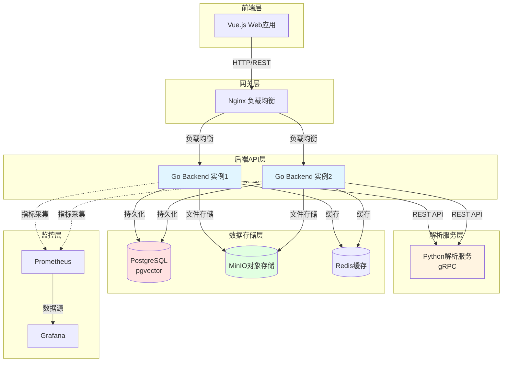

### 架构设计原则

系统的架构设计遵循以下核心原则：

**1. 职责分离原则**
- 将文档解析、语义搜索、用户管理等不同功能领域分离为独立的服务模块
- 每个服务专注于特定业务领域，降低耦合度

**2. 接口抽象原则**
- 所有核心服务都定义了清晰的接口（如[`DocumentService`](internal/service/document_service.go:21)、[`SearchService`](internal/service/search_service.go:17)）
- 通过接口实现依赖倒置，便于测试和扩展

**3. 独立部署原则**
- 每个微服务可以独立构建、部署和扩展
- 通过Docker容器化实现环境一致性
- 支持蓝绿部署和滚动更新

**4. 故障隔离原则**
- 使用断路器模式防止级联故障
- 独立的健康检查机制
- 优雅降级策略

### 核心目录结构

```
last-doc-2/
├── cmd/                      # 应用入口
│   └── main.go               # 主程序入口，初始化所有组件和服务
├── internal/                 # 内部业务逻辑
│   ├── handler/              # HTTP处理器层（Controller）
│   │   ├── document_handler.go    # 文档相关HTTP请求处理
│   │   ├── search_handler.go      # 搜索功能处理
│   │   ├── user_handler.go        # 用户管理处理
│   │   └── ...                    # 其他业务处理器
│   ├── middleware/           # 中间件层
│   │   ├── auth.go               # 认证和授权中间件
│   │   └── logging.go            # 请求日志中间件
│   ├── model/                # 数据模型定义
│   │   ├── document.go           # 文档和版本数据结构
│   │   ├── search_index.go       # 搜索索引模型
│   │   └── user.go               # 用户相关模型
│   ├── repository/           # 数据访问层（DAO）
│   │   ├── document_repository.go   # 文档数据访问
│   │   ├── search_index_repository.go # 搜索索引数据访问
│   │   └── user_repository.go       # 用户数据访问
│   ├── service/              # 业务服务层
│   │   ├── document_service.go     # 文档业务逻辑
│   │   ├── search_service.go       # 搜索业务逻辑
│   │   ├── storage_factory.go      # 存储服务工厂模式实现
│   │   ├── grpc_client.go          # gRPC客户端封装
│   │   └── circuit_breaker.go      # 断路器模式实现
│   └── router/               # 路由配置
│       └── router.go              # API路由定义和中间件配置
├── proto/                    # Protocol Buffers定义
│   ├── document_parser.proto     # 文档解析gRPC服务定义
│   └── ...
├── python-parser-service/    # Python解析微服务
│   ├── service/              # 解析算法实现
│   │   ├── pdf_parser.py         # PDF文档解析
│   │   └── docx_parser.py        # DOCX文档解析
│   └── server.py              # gRPC服务启动
├── docker-compose.yml         # 容器编排配置
├── k8s/                      # Kubernetes部署配置
└── web/                      # 前端Vue.js应用
```

### 技术栈选择依据

| 技术组件 | 选择方案 | 设计理由 |
|---------|---------|---------|
| 后端语言 | Go | 高性能、强类型、并发优势，适合构建高可用API服务 |
| 解析服务 | Python | 丰富的文本处理库（PyPDF2、python-docx），生态成熟 |
| 数据库 | PostgreSQL + pgvector | 关系型数据库保证事务一致性，pgvector支持向量检索 |
| 对象存储 | MinIO | S3兼容性，可本地或云端部署，支持大量文件存储 |
| 缓存 | Redis | 高性能键值存储，支持搜索结果缓存和会话管理 |
| 服务通信 | gRPC | 高效的RPC框架，支持流式传输，适合服务间调用 |
| API 网关 | Nginx | 成熟稳定的反向代理，支持负载均衡和静态资源服务 |

## 微服务架构设计

### 服务边界确定原则

系统通过领域驱动设计（DDD）方法确定微服务边界，基于以下原则：

**1. 按业务能力分离**
- **文档管理服务**：负责文档的上传、版本控制、元数据管理
- **解析服务**：专注PDF、DOCX等文档格式的解析，独立扩展
- **搜索服务**：提供关键词搜索、语义搜索、混合搜索能力
- **认证授权服务**：处理用户认证、JWT令牌管理、权限控制
- **监控服务**：收集系统指标、日志、性能监控

**2. 按技术栈分离**
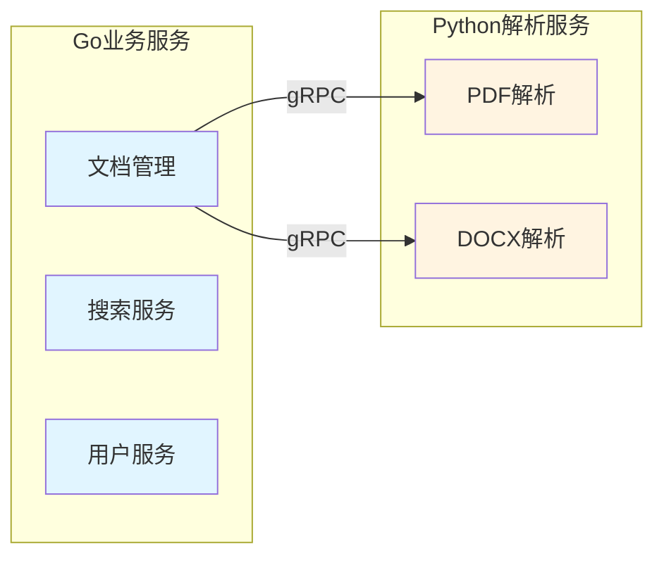

从[`cmd/main.go`](cmd/main.go:84)可以看出，系统通过工厂模式创建存储服务：
```go
storageService, err := service.NewStorageServiceFromEnv()
```
这种设计允许通过环境变量动态切换存储类型（local/s3/minio），服务边界清晰。

### 服务间通信机制

**gRPC通信设计**

解析服务使用gRPC协议与后端Go服务通信，定义在[`proto/document_parser.proto`](proto/document_parser.proto:8-17)：

```protobuf
service DocumentParserService {
  rpc ParsePDF(ParsePDFRequest) returns (ParseDocumentResponse);
  rpc ParseDOCX(ParseDOCXRequest) returns (ParseDocumentResponse);
  rpc HealthCheck(HealthCheckRequest) returns (HealthCheckResponse);
}
```

Go端通过[`GRPCClient`](internal/service/grpc_client.go:19-22)封装调用逻辑：

```go
type GRPCClient struct {
  conn   *grpc.ClientConn
  client pb.DocumentParserServiceClient
}
```

**通信选择理由**：
- gRPC基于HTTP/2，支持双向流式传输
- Protocol Buffers序列化效率高，占用带宽小
- 内置代码生成，减少手动序列化工作
- 强类型接口，编译期检查，减少运行时错误

**RESTful API设计**

面向客户端的API采用RESTful风格，定义在[`internal/router/router.go`](internal/router/router.go:44-266)，遵循以下原则：

```bash
# 资源导向设计
POST   /api/v1/documents                    # 创建文档
GET    /api/v1/documents                    # 获取文档列表
GET    /api/v1/documents/:id                # 获取单个文档
PUT    /api/v1/documents/:id                # 更新文档
DELETE /api/v1/documents/:id                # 删除文档
GET    /api/v1/documents/:id/versions       # 获取版本列表
```

### 数据一致性策略

**最终一致性模型**

系统采用最终一致性而非强一致性，关键设计点：

1. **异步处理文档解析**
   从[`document_service.UploadDocument`](internal/service/document_service.go:194)看出：
   ```go
   // 异步处理文档解析
   go s.processDocumentWithFile(documentID, version, filePath)
   ```
   上传后立即返回，文档解析在后台异步进行，通过状态字段（`processing`/`completed`/`failed`）跟踪进度。

2. **搜索索引延迟构建**
   从[`search_service.BuildIndex`](internal/service/search_service.go:56-86)看到：
   ```go
   // 检查文档是否已解析完成
   if docVersion.Status != model.DocumentStatusCompleted {
       return fmt.Errorf("document is not ready for indexing")
   }
   ```
   索引构建在文档解析完成后触发，确保数据可用性。

3. **乐观并发控制**
   数据库层面通过版本号（`updated_at`）和时间戳实现乐观锁，避免数据冲突。

### 服务治理机制

**断路器模式**

从[`circuit_breaker.go`](internal/service/circuit_breaker.go:17-26)可以看到完整的断路器实现：

```go
type CircuitBreaker struct {
  name         string
  maxFailures  int
  timeout      time.Duration
  mu           sync.RWMutex
  state        State        // Closed, Open, HalfOpen
  failures     int
  lastFailTime time.Time
}
```

**状态转换逻辑**：
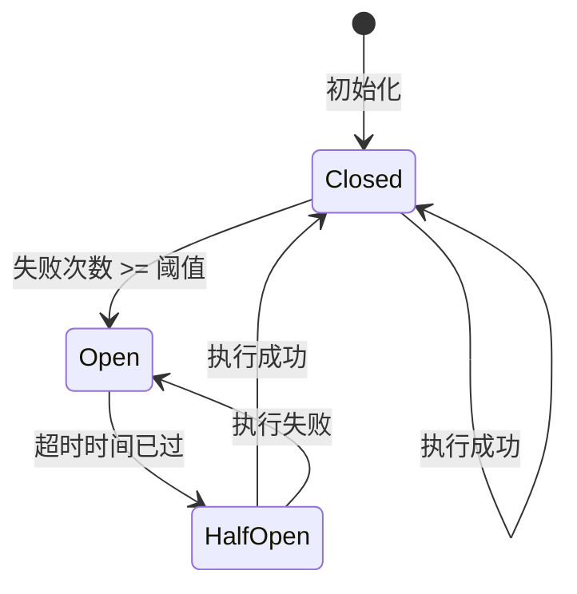

**健康检查机制**

从[`docker-compose.yml`](docker-compose.yml:61-66)可以看到服务健康检查配置：

```yaml
healthcheck:
  test: ["CMD", "/bin/sh", "/app/scripts/healthcheck.sh"]
  interval: 30s
  timeout: 10s
  retries: 3
  start_period: 40s
```

每个服务都定期执行健康检查，失败超过阈值时触发自动重启。

## 分层架构实现

### Handler-Service-Repository三层设计

系统严格遵循经典的三层架构模式，每一层都有明确的职责和清晰的边界。

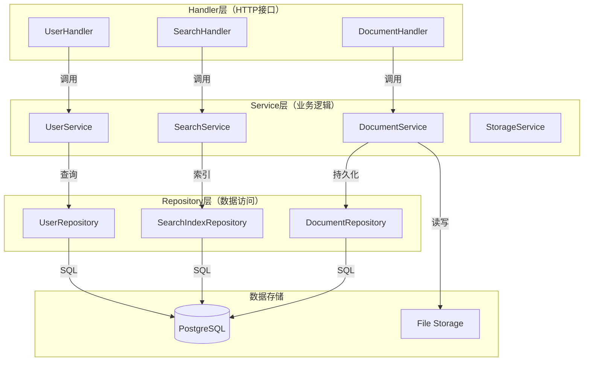

### Handler层详解

**职责定位**
- 接收HTTP请求，解析参数
- 参数验证和错误处理
- 调用Service层处理业务逻辑
- 组装响应数据并返回

**实现特点**

从[`document_handler.UploadDocument`](internal/handler/document_handler.go:29-133)可以看出：

```go
func (h *DocumentHandler) UploadDocument(c *gin.Context) {
    // 1. 参数提取和验证
    name := c.PostForm("name")
    if name == "" {
        c.JSON(http.StatusBadRequest, gin.H{
            "code":    400,
            "message": "文档名称不能为空",
        })
        return
    }
    
    // 2. 调用Service层
    document, err := h.documentService.UploadDocument(
        context.Background(), file, name, docType, 
        category, version, library, description, tags,
    )
    
    // 3. 返回响应
    c.JSON(http.StatusOK, gin.H{
        "code":    200,
        "data":    gin.H{...},
        "message": "上传成功",
    })
}
```

Handler层保持轻量，不包含业务逻辑，所有数据处理都委托给Service层。

### Service层详解

**职责定位**
- 实现核心业务逻辑
- 事务管理和数据一致性
- 协调多个Repository依赖
- 复杂业务规则的实现

**接口抽象设计**

从[`document_service.go`](internal/service/document_service.go:21-35)可见接口定义：

```go
type DocumentService interface {
    UploadDocument(...) (*model.Document, error)
    GetDocument(ctx context.Context, id string) (*model.Document, error)
    GetDocuments(...) ([]*model.Document, int64, error)
    GetDocumentVersions(...) ([]*model.DocumentVersion, error)
    DeleteDocument(ctx context.Context, id string) error
    BuildDocumentIndex(...) error
    // ...更多方法
}
```

**依赖注入模式**

从[`cmd/main.go`](cmd/main.go:122-130)可以看到依赖注入：

```go
documentService := service.NewDocumentService(
    documentRepo,           // Repository依赖
    versionRepo,            // Repository依赖
    metadataRepo,           // Repository依赖
    storageService,         // Storage Service依赖
    parserService,          // Parser Service依赖
    searchService,          // Search Service依赖
    baseStorageDir,         // 配置参数
)
```

Service层通过构造函数接收所有依赖，遵循显式依赖原则，便于测试和替换。

**业务逻辑封装**

从[`document_service.processDocumentWithFile`](internal/service/document_service.go:194)可以看到复杂的业务处理：

```go
func (s *documentService) UploadDocument(...) {
    // 1. 验证文档类型和分类
    // 2. 检查同一库的现有文档
    // 3. 创建存储目录
    // 4. 保存文件
    // 5. 创建/更新文档记录
    // 6. 创建版本记录
    // 7. 异步处理文档解析
    go s.processDocumentWithFile(documentID, version, filePath)
}
```

Service层协调多个Repository完成业务操作，确保数据一致性。

### Repository层详解

**职责定位**
- 封装数据访问逻辑
- 提供CRUD操作接口
- 处理数据库交互细节
- 支持查询和过滤

**接口标准定义**

从[`document_repository.go`](internal/repository/document_repository.go:12-25)可见：

```go
type DocumentRepository interface {
    Create(ctx context.Context, document *model.Document) error
    GetByID(ctx context.Context, id string) (*model.Document, error)
    List(ctx context.Context, page, size int, filters map[string]interface{}) 
        ([]*model.Document, int64, error)
    Update(ctx context.Context, id string, updates map[string]interface{}) error
    Delete(ctx context.Context, id string) error
    GetByLibrary(...) ([]*model.Document, int64, error)
    GetByType(...) ([]*model.Document, int64, error)
    // ...更多查询方法
}
```

**动态过滤实现**

从[`document_repository.List`](internal/repository/document_repository.go:55-115)可以看到灵活的过滤机制：

```go
func (r *documentRepository) List(ctx context.Context, page, size int, filters map[string]interface{}) {
    query := r.db.WithContext(ctx).Model(&model.Document{})
    
    // 动态应用过滤条件
    if library, ok := filters["library"]; ok {
        query = query.Where("library = ?", library)
    }
    if docType, ok := filters["type"]; ok {
        query = query.Where("type = ?", docType)
    }
    if tags, ok := filters["tags"]; ok {
        for _, tag := range tags.([]string) {
            query = query.Where("? = ANY(tags)", tag)
        }
    }
    
    // 分页和排序
    query = query.Offset(offset).Limit(size).Order("created_at DESC")
    return query.Find(&documents).Error
}
```

Repository层通过map参数接收过滤条件，实现灵活的查询构建。

### 依赖注入和接口抽象

**接口隔离原则**

每个Repository和Service都定义了清晰的接口，遵循接口隔离原则：

```go
// Service依赖抽象接口而非具体实现
type documentService struct {
    documentRepo   repository.DocumentRepository    // 接口类型
    versionRepo    repository.DocumentVersionRepository
    storageService StorageService                  // 接口类型
    parserService  DocumentParserService          // 接口类型
}
```

**工厂模式应用**

从[`storage_factory.go`](internal/service/storage_factory.go:23-57)可以看到存储服务的工厂模式：

```go
func NewStorageServiceFromEnv() (StorageService, error) {
    storageTypeStr := getEnv("STORAGE_TYPE", "local")
    storageType := StorageType(storageTypeStr)
    
    config := &StorageConfig{
        Type:           storageType,
        LocalDir:       getEnv("STORAGE_DIR", "./storage"),
        S3Bucket:       getEnv("S3_BUCKET", ""),
        MinIOEndpoint:  getEnv("MINIO_ENDPOINT", ""),
        // ...更多配置
    }
    
    return NewStorageService(config)
}

func NewStorageService(config *StorageConfig) (StorageService, error) {
    switch config.Type {
    case StorageTypeLocal:
        return NewLocalStorageService(config.LocalDir), nil
    case StorageTypeS3:
        return NewS3StorageService(config)
    case StorageTypeMinIO:
        return NewS3StorageService(config) // MinIO使用S3兼容模式
    default:
        return NewLocalStorageService(config.LocalDir), nil
    }
}
```

工厂模式根据环境变量动态创建不同的存储服务实现，实现了开闭原则。

## 组件交互关系

### 文档上传流程

文档上传是系统的核心功能，涉及多个组件的协同工作：

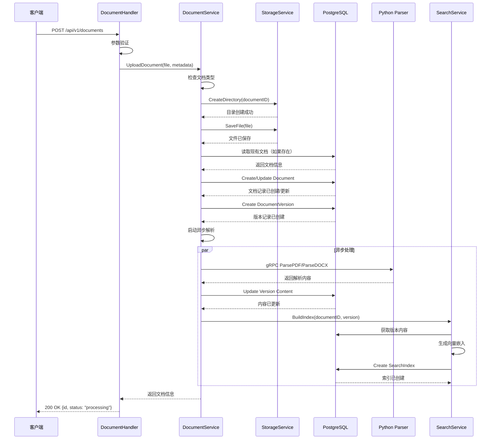

**关键技术点**：

1. **异步处理**：通过goroutine实现异步解析，避免阻塞HTTP响应
2. **状态跟踪**：存储和解析过程中都有明确的状态字段
3. **版本管理**：同一文档的多个版本通过`document_id`关联
4. **错误处理**：每个步骤都有完善的错误处理和回滚机制

### 搜索功能交互

搜索服务支持三种搜索模式，展示了组件间的灵活交互：

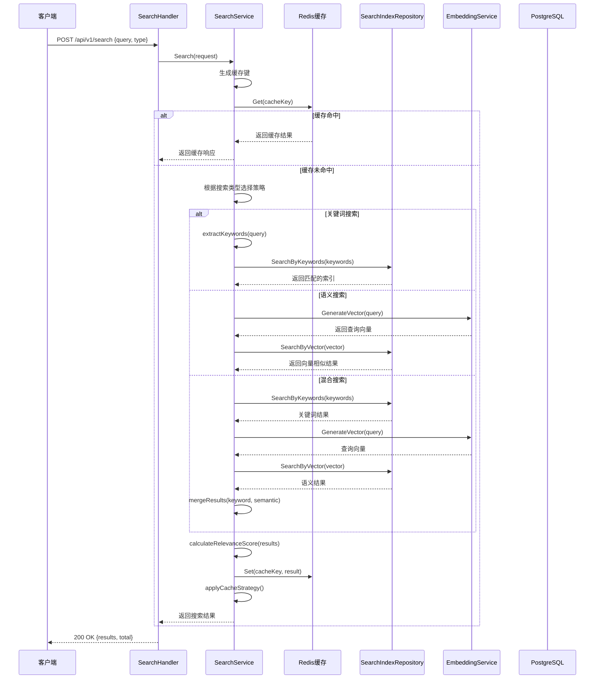

**智能缓存策略**：

从[`search_service.Search`](internal/service/search_service.go:196-197)可以看到智能缓存应用：

```go
// 智能缓存策略
s.applyCacheStrategy(cacheKey, response, duration, request)
```

系统根据查询类型、结果大小、查询耗时等因素动态决定是否缓存结果。

### 认证授权流程

认证授权通过中间件机制实现：

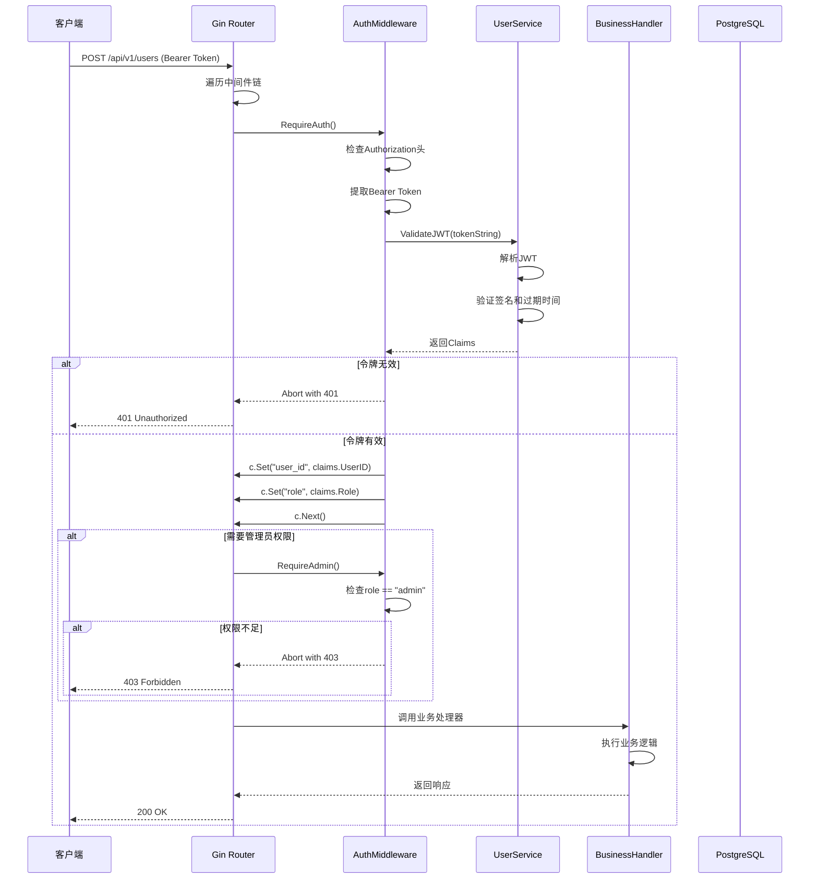

**中间件链设计**：

从[`router.SetupRoutes`](internal/router/router.go:196-214)可以看到中间件应用：

```go
// 用户管理路由
users := v1.Group("/users")
users.Use(r.authMiddleware.RequireAuth())  // 需要认证
{
    users.GET("/profile", r.userHandler.GetProfile)
    
    // 管理员功能
    admin := users.Group("")
    admin.Use(r.authMiddleware.RequireAdmin()) // 需要管理员权限
    {
        admin.GET("", r.userHandler.ListUsers)
        admin.DELETE("/:id", r.userHandler.DeleteUser)
    }
}
```

中间件通过Gin的Group机制实现层次化的权限控制。

### 服务间协作机制

**gRPC通信封装**

从[`grpc_client.go`](internal/service/grpc_client.go:54-118)可以看到gRPC调用封装：

```go
func (c *GRPCClient) ParsePDFWithGRPC(filePath string) (string, map[string]interface{}, error) {
    if c.client == nil {
        return "", nil, fmt.Errorf("gRPC客户端未连接")
    }
    
    // 创建带超时的上下文
    ctx, cancel := context.WithTimeout(context.Background(), 30*time.Second)
    defer cancel()
    
    // 调用gRPC服务
    req := &pb.ParsePDFRequest{FilePath: absPath}
    resp, err := c.client.ParsePDF(ctx, req)
    if err != nil {
        return "", nil, fmt.Errorf("gRPC PDF解析失败: %v", err)
    }
    
    // 转换元数据格式
    metadata := make(map[string]interface{})
    for k, v := range resp.Metadata {
        metadata[k] = v
    }
    
    return content, metadata, nil
}
```

**超时控制**：每个gRPC调用都有30秒超时限制，防止服务阻塞

**错误处理**：统一的错误转换和日志记录

**元数据转换**：Protocol Buffers Map到Go Map的转换

## 设计模式应用

### 工厂模式

**存储服务工厂**

[`storage_factory.NewStorageServiceFromEnv`](internal/service/storage_factory.go:23-57)是工厂模式的典型应用：

```go
func NewStorageServiceFromEnv() (StorageService, error) {
    storageTypeStr := getEnv("STORAGE_TYPE", "local")
    storageType := StorageType(storageTypeStr)
    
    config := &StorageConfig{
        Type:           storageType,
        LocalDir:       getEnv("STORAGE_DIR", "./storage"),
        S3Bucket:       getEnv("S3_BUCKET", ""),
        MinIOEndpoint:  getEnv("MINIO_ENDPOINT", ""),
        // ...更多配置
    }
    
    return NewStorageService(config)
}

func NewStorageService(config *StorageConfig) (StorageService, error) {
    switch config.Type {
    case StorageTypeLocal:
        return NewLocalStorageService(config.LocalDir), nil
    case StorageTypeS3:
        return NewS3StorageService(config)
    case StorageTypeMinIO:
        return NewS3StorageService(config) // MinIO使用S3兼容模式
    default:
        return NewLocalStorageService(config.LocalDir), nil
    }
}
```

**应用价值**：
- 对象创建逻辑集中管理
- 支持多种存储后端的灵活切换
- 配置驱动，无需修改代码
- 遵循开闭原则，新增存储类型无需修改工厂方法

### 策略模式

**搜索策略实现**

[`search_service.Search`](internal/service/search_service.go:120-174)展示了策略模式：

```go
// 根据搜索类型执行不同的搜索策略
switch request.SearchType {
case "keyword":
    keywords := s.extractKeywords(request.Query)
    indices, total, err = s.indexRepo.SearchByKeywords(ctx, keywords, ...)
    
case "semantic":
    queryVector := s.generateQueryVector(request.Query)
    indices, total, err = s.indexRepo.SearchByVector(ctx, queryVector, ...)
    
case "hybrid":
    var keywordIndices []*model.SearchIndex
    var semanticIndices []*model.SearchIndex
    
    // 关键词搜索
    keywords := s.extractKeywords(request.Query)
    keywordIndices, keywordTotal, err = s.indexRepo.SearchByKeywords(...)
    
    // 语义搜索
    queryVector := s.generateQueryVector(request.Query)
    semanticIndices, semanticTotal, err = s.indexRepo.SearchByVector(...)
    
    // 合并结果
    indices, total = s.mergeSearchResults(keywordIndices, semanticIndices, ...)
}
```

**策略对比**：

| 搜索策略 | 实现方式 | 适用场景 | 性能特点 |
|---------|---------|---------|---------|
| 关键词搜索 | 全文检索、LIKE查询 | 精确匹配、代码搜索 | 快速、低延迟 |
| 语义搜索 | 向量相似度计算（pgvector） | 自然语言查询、概念搜索 | 计算密集、语义相关 |
| 混合搜索 | 关键词+向量结果融合 | 综合查询、推荐系统 | 平衡精度和相关性 |

### 单例模式

**服务实例管理**

从[`cmd/main.go`](cmd/main.go:155-156)可以看到服务单例模式：

```go
healthService := service.NewHealthService(sqlDB)
healthService.RegisterCheck(service.NewDatabaseHealthCheck(sqlDB))
healthService.RegisterCheck(service.NewStorageHealthCheck(storageService))
```

**应用场景**：
- 数据库连接池（GORM的db.DB()）
- Redis客户端连接
- gRPC客户端连接

通过依赖注入在应用启动时创建，在整个生命周期中共享使用。

### 观察者模式

**健康检查机制**

[`HealthService`](internal/service/health_service.go)实现了观察者模式的变体：

```go
type HealthService struct {
    checks []HealthCheck
}

func (h *HealthService) RegisterCheck(check HealthCheck) {
    h.checks = append(h.checks, check)
}

func (h *HealthService) CheckHealth() map[string]HealthStatus {
    results := make(map[string]HealthStatus)
    for _, check := range h.checks {
        results[check.Name()] = check.Check()
    }
    return results
}
```

多个健康检查（数据库、存储、解析服务）注册到统一的HealthService，定时批量检查各组件状态。

### 适配器模式

**存储服务适配**

[`StorageService`](internal/service/storage_service.go)接口定义了统一的存储抽象：

```go
type StorageService interface {
    SaveFile(ctx context.Context, key string, data []byte) error
    GetFile(ctx context.Context, key string) ([]byte, error)
    DeleteFile(ctx context.Context, key string) error
    FileExists(ctx context.Context, key string) (bool, error)
}

// 本地存储实现
type LocalStorageService struct {
    baseDir string
}

// S3/MinIO存储实现
type S3StorageService struct {
    client *s3.Client
    bucket string
}
```

不同的存储后端（本地文件系统、S3、MinIO）都实现相同的接口，业务代码无需关心具体存储实现。

### 断路器模式

**故障保护机制**

[`CircuitBreaker`](internal/service/circuit_breaker.go:17-90)完整实现了断路器模式：

```go
type CircuitBreaker struct {
    name         string
    maxFailures  int
    timeout      time.Duration
    mu           sync.RWMutex
    state        State
    failures     int
    lastFailTime time.Time
}

func (cb *CircuitBreaker) Execute(fn func() error) error {
    if cb.allow() {
        err := fn()
        cb.recordResult(err)
        return err
    }
    
    return &CircuitBreakerOpenError{Breaker: cb.name}
}
```

**状态机机制**：

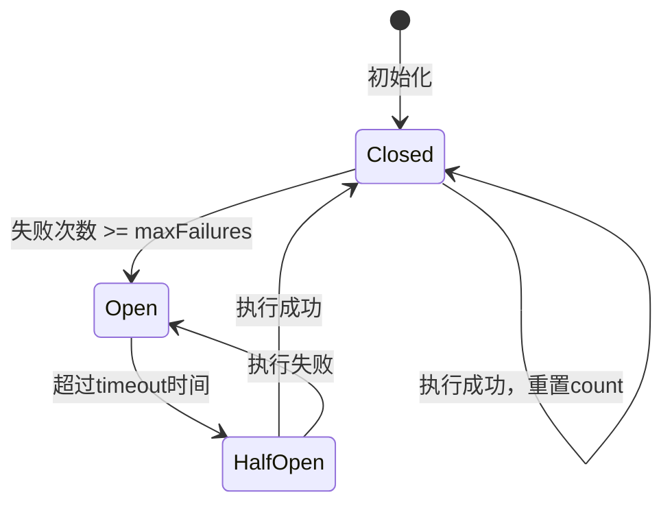

**保护效果**：
- 防止级联故障
- 快速失败（Fail Fast）
- 自动恢复
- 保护下游服务

### 模板方法模式

**文档处理流程**

[`document_service.UploadDocument`](internal/service/document_service.go:70-196)定义了文档上传的标准流程：

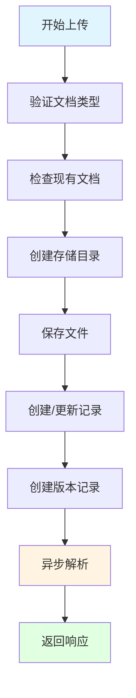

每个步骤的实现在具体方法中，但整体流程由UploadDocument控制。

### 依赖注入模式

**构造函数注入**

所有Service和Handler都通过构造函数接收依赖：

```go
// Handler层
func NewDocumentHandler(documentService service.DocumentService) *DocumentHandler {
    return &DocumentHandler{
        documentService: documentService,
    }
}

// Service层
func NewDocumentService(
    documentRepo repository.DocumentRepository,
    versionRepo repository.DocumentVersionRepository,
    storageService StorageService,
    // ...更多参数
) DocumentService {
    return &documentService{...}
}
```

**优势**：
- 显式声明依赖关系
- 便于单元测试（Mock依赖）
- 编译期检查依赖完整性
- 支持依赖替换（如Test环境使用Mock服务）

### Repository模式

**数据访问抽象**

[`DocumentRepository`](internal/repository/document_repository.go:11-25)接口封装了所有文档数据访问：

```go
type DocumentRepository interface {
    Create(ctx context.Context, document *model.Document) error
    GetByID(ctx context.Context, id string) (*model.Document, error)
    List(ctx context.Context, page, size int, filters map[string]interface{}) 
        ([]*model.Document, int64, error)
    Update(ctx context.Context, id string, updates map[string]interface{}) error
    Delete(ctx context.Context, id string) error
    GetByLibrary(...) ([]*model.Document, int64, error)
    // ...更多方法
}
```

**实现细节**：

```go
func (r *documentRepository) List(ctx context.Context, page, size int, filters map[string]interface{}) {
    query := r.db.WithContext(ctx).Model(&model.Document{})
    
    // 动态构建查询
    if library, ok := filters["library"]; ok {
        query = query.Where("library = ?", library)
    }
    
    // 分页和排序
    query = query.Offset(offset).Limit(size).Order("created_at DESC")
    
    return query.Find(&documents).Error
}
```

Repository层：
- 封装数据库访问细节
- 支持动态过滤和分页
- 使用context.Context支持超时和取消
- 统一的错误处理

## 技术深度剖析

### 关键算法和逻辑

**向量相似度计算**

语义搜索使用余弦相似度计算文档相似性：

```
similarity = (A · B) / (||A|| * ||B||)
```

其中A和B是文档的向量表示，通过Embedding服务生成。

**搜索结果排序算法**

从[`search_service.calculateRelevanceScore`](internal/service/search_service.go:250-280)可以看到相关性评分：

```go
func (s *searchService) calculateRelevanceScore(index *model.SearchIndex, query, searchType string) float64 {
    var score float64
    
    switch searchType {
    case "keyword":
        // 关键词匹配度
        score = s.calculateKeywordRelevance(index, query)
    case "semantic":
        // 向量相似度 + 权重
        score = index.VectorSimilarity * 0.7 + s.calculateRecencyBonus(index)
    case "hybrid":
        // 混合评分：关键词权重0.4 + 语义权重0.6
        keywordScore := s.calculateKeywordRelevance(index, query)
        semanticScore := index.VectorSimilarity
        score = keywordScore*0.4 + semanticScore*0.6
    }
    
    // 应用时效性加权（最近更新的文档得分更高）
    daysSinceUpdate := time.Since(index.CreatedAt).Hours() / 24
    if daysSinceUpdate < 7 {
        score *= 1 + (7-daysSinceUpdate)/21 // 7天内最多提升30%
    }
    
    return score
}
```

**智能缓存策略**

从[`search_service.applyCacheStrategy`](internal/service/search_service.go:640-657)可以看到自适应缓存：

```go
func (s *searchService) applyCacheStrategy(cacheKey string, response *model.SearchResponse, duration time.Duration, request *model.SearchRequest) {
    // 不缓存空结果
    if len(response.Items) == 0 {
        return
    }
    
    // 根据查询复杂度决定是否缓存
    if request.SearchType == "hybrid" || request.SearchType == "semantic" {
        // 复杂查询缓存时间更长
        ttl := 30 * time.Minute
        s.cacheService.SetWithTTL(cacheKey, response, ttl)
    } else if duration < 100*time.Millisecond {
        // 快速查询，缓存时间较短
        ttl := 5 * time.Minute
        s.cacheService.SetWithTTL(cacheKey, response, ttl)
    } else {
        // 中等速度查询
        ttl := 15 * time.Minute
        s.cacheService.SetWithTTL(cacheKey, response, ttl)
    }
}
```

### 数据管理和状态

**版本控制机制**

[`DocumentVersion`](internal/model/document.go:64-75)模型实现了文档版本控制：

```go
type DocumentVersion struct {
    ID          string         `json:"id" gorm:"primaryKey"`
    DocumentID  string         `json:"document_id" gorm:"not null;index"`
    Version     string         `json:"version" gorm:"not null;index"`
    FilePath    string         `json:"file_path" gorm:"not null"`
    FileSize    int64          `json:"file_size" gorm:"not null"`
    Status      DocumentStatus `json:"status" gorm:"not null"`
    Description string         `json:"description"`
    Content     string         `json:"content" gorm:"type:text"`
    CreatedAt   time.Time      `json:"created_at" gorm:"autoCreateTime"`
    UpdatedAt   time.Time      `json:"updated_at" gorm:"autoUpdateTime"`
}
```

**版本关系**：
- 一个Document可以关联多个DocumentVersion
- 通过`document_id`外键关联
- `version`字段标识版本号（如"v1.0.0"）
- 复合唯一约束：（document_id, version）

**文档生命周期状态机**：

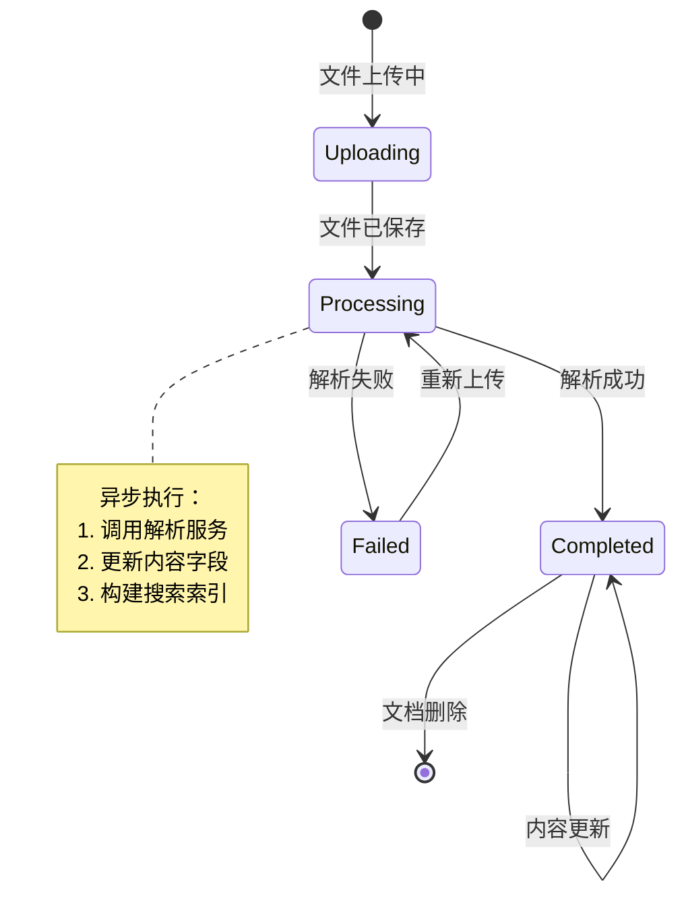

**数据一致性的保证**：

从[`document_repository.Delete`](internal/repository/document_repository.go:124-133)可以看到删除操作的级联处理：

```go
func (r *documentRepository) Delete(ctx context.Context, id string) error {
    // 先删除文档的所有搜索索引
    if err := r.db.WithContext(ctx).Table("search_indices")
        .Where("document_id = ?", id).Delete(nil).Error; err != nil {
        return err
    }
    
    // 然后删除文档
    return r.db.WithContext(ctx).Where("id = ?", id).Delete(&model.Document{}).Error
}
```

删除文档时先清理索引，避免脏数据。

### API设计和集成

**RESTful API规范**

API设计严格遵循RESTful规范：

```bash
# 资源命名：使用复数名词
GET    /api/v1/documents           # 获取文档列表
POST   /api/v1/documents           # 创建文档
GET    /api/v1/documents/:id       # 获取特定文档

# 版本管理：通过URL路径
GET    /api/v1/documents/:id/versions              # 获取版本列表
GET    /api/v1/documents/:id/versions/latest        # 获取最新版本
GET    /api/v1/documents/:id/versions/:version      # 获取特定版本

# 操作语义：使用标准HTTP动词
GET    /api/v1/search             # 查询
POST   /api/v1/search             # 复杂查询
PUT    /api/v1/documents/:id       # 完整更新
DELETE /api/v1/documents/:id       # 删除
```

**统一响应格式**：

所有API响应遵循统一格式：

```go
c.JSON(http.StatusOK, gin.H{
    "code":    200,           // 业务状态码
    "data":    document,      // 响应数据
    "message": "操作成功",    // 提示消息
})
```

**gRPC接口设计**

[`document_parser.proto`](proto/document_parser.proto:8-17)展示了gRPC服务的定义：

```protobuf
service DocumentParserService {
  rpc ParsePDF(ParsePDFRequest) returns (ParseDocumentResponse);
  rpc ParseDOCX(ParseDOCXRequest) returns (ParseDocumentResponse);
  rpc HealthCheck(HealthCheckRequest) returns (HealthCheckResponse);
}
```

**消息定义**：

```protobuf
message ParsePDFRequest {
  string file_path = 1;
  bytes file_data = 2;  // 可选：可以直接传递文件数据
}

message ParseDocumentResponse {
  bool success = 1;
  string content = 2;
  map<string, string> metadata = 3;
  string error_message = 4;
}
```

使用`bytes`类型支持大文件传输，`map`类型灵活传递元数据。

**错误处理策略**：

系统采用多层次的错误处理机制：

1. **Handler层**：参数验证、HTTP状态码映射
2. **Service层**：业务逻辑错误、事务回滚
3. **Repository层**：数据库错误、SQL异常
4. **中间件**：统一异常捕获和日志记录

从[`handler.UploadDocument`](internal/handler/document_handler.go:115-122)可以看到错误处理：

```go
document, err := h.documentService.UploadDocument(...)
if err != nil {
    c.JSON(http.StatusInternalServerError, gin.H{
        "code":    500,
        "message": "上传文档失败: " + err.Error(),
    })
    return
}
```

## 实现模式

### 设计模式汇总

系统在多个层面应用了经典设计模式：

| 模式 | 应用位置 | 解决的问题 | 实现文件 |
|-----|---------|-----------|---------|
| 工厂模式 | 存储服务创建 | 对象创建复杂，支持多态 | `storage_factory.go` |
| 策略模式 | 搜索算法 | 算法族可互换 | `search_service.go` |
| 单例模式 | 数据库连接、gRPC客户端 | 资源共享、全局唯一 | `main.go`, `grpc_client.go` |
| 观察者模式 | 健康检查 | 事件通知、状态监控 | `health_service.go` |
| 适配器模式 | 存储服务接口 | 接口统一、适配不同实现 | `storage_service.go` |
| 断路器模式 | 服务调用保护 | 故障隔离、系统稳定性 | `circuit_breaker.go` |
| 模板方法模式 | 文档处理流程 | 流程标准化、步骤可定制 | `document_service.go` |
| 依赖注入模式 | 所有Service/Handler | 解耦、可测试性 | 所有构造函数 |
| Repository模式 | 数据访问层 | 数据访问抽象 | `*_repository.go` |

### 代码质量评估

**可维护性优势**：

1. **清晰的分层结构**：Handler-Service-Repository三层架构职责明确
2. **接口抽象**：核心服务都定义了接口，便于Mock和替换
3. **依赖注入**：构造函数注入，编译期检查依赖完整性
4. **错误处理**：完善的错误处理和日志记录机制

**可测试性设计**：

从Repository接口定义可以看出系统对可测试性的重视：

```go
type DocumentRepository interface {
    Create(...) error
    GetByID(...) (*model.Document, error)
    List(...) ([]*model.Document, int64, error)
    // ...
}
```

测试时可以轻松创建Mock实现：

```go
type MockDocumentRepository struct {
    documents map[string]*model.Document
}

func (m *MockDocumentRepository) GetByID(ctx context.Context, id string) (*model.Document, error) {
    doc, ok := m.documents[id]
    if !ok {
        return nil, gorm.ErrRecordNotFound
    }
    return doc, nil
}
```

**技术债务控制**：

1. **静态类型检查**：Go的强类型系统减少运行时错误
2. **代码规范**：统一的命名和项目结构
3. **文档完善**：接口和关键函数都有注释
4. **版本控制**：Docker镜像版本化，支持回滚

## 性能和可扩展性

### 性能优化策略

**1. 缓存机制**

从[`search_service.Search`](internal/service/search_service.go:103-111)可以看到缓存应用：

```go
cacheKey := searchCacheKey(request.Query, request.SearchType, ...)
if cachedResult, found := s.cacheService.Get(cacheKey); found {
    if response, ok := cachedResult.(*model.SearchResponse); ok {
        return response, nil
    }
}
```

**缓存策略**：
- 查询结果缓存（Redis）
- 动态TTL基于查询复杂度
- 空结果不缓存
- 缓存键包含所有查询参数

**2. 数据库优化**

**索引策略**：

从[`model.Document`](internal/model/document.go:46-61)可以看到索引定义：

```go
type Document struct {
    ID       string            `json:"id" gorm:"primaryKey"`
    Name     string            `json:"name" gorm:"not null;index"`
    Type     DocumentType      `json:"type" gorm:"not null;index"`
    Category DocumentCategory  `json:"category" gorm:"not null;index"`
    Version  string            `json:"version" gorm:"not null;index"`
    Status   DocumentStatus    `json:"status" gorm:"not null;index"`
    Library  string            `json:"library" gorm:"index"`
}
```

常用查询字段都建立了索引：
- `library`：按库查询
- `type`：按文档类型过滤
- `category`：按分类过滤
- `status`：按文档状态筛选

**分页查询**：

从[`document_repository.List`](internal/repository/document_repository.go:102-105)可以看到分页实现：

```go
if page > 0 && size > 0 {
    offset := (page - 1) * size
    query = query.Offset(offset).Limit(size)
}
```

使用`LIMIT`和`OFFSET`实现分页，避免一次性加载大量数据。

**3. 异步处理**

从[`document_service.UploadDocument`](internal/service/document_service.go:194)可以看到异步处理：

```go
// 异步处理文档解析
go s.processDocumentWithFile(documentID, version, filePath)
```

上传后立即返回，解析在后台goroutine中进行，提升用户体验。

**4. 连接池管理**

数据库连接通过GORM自动管理连接池：

```go
sqlDB, err := db.DB()
sqlDB.SetMaxOpenConns(100)  // 最大连接数
sqlDB.SetMaxIdleConns(10)   // 最大空闲连接
sqlDB.SetConnMaxLifetime(time.Hour)  // 连接最大生命周期
```

### 可扩展性分析

**水平扩展能力**：

从[`docker-compose.yml`](docker-compose.yml:29-72)可以看到多实例配置：

```yaml
backend:
  build: .
  container_name: ai-doc-backend-1
  environment:
    - NODE_ID=backend-1

backend2:
  build: .
  container_name: ai-doc-backend-2
  environment:
    - NODE_ID=backend-2
```

系统支持无限横向扩展：
- 后端服务无状态（状态存储在数据库）
- 通过负载均衡器（Nginx）分发请求
- 共享数据存储（PostgreSQL、MinIO）

**垂直扩展能力**：

- 数据库：支持读写分离、分库分表
- 搜索：pgvector支持大规模向量检索
- 存储：MinIO支持分布式部署

**弹性伸缩策略**：

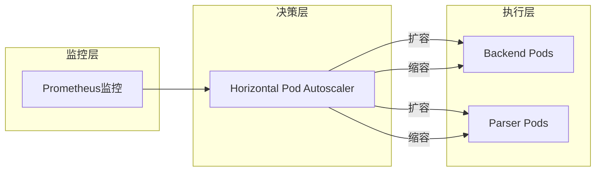

通过Kubernetes HPA实现自动伸缩：
- CPU使用率 > 70%：扩容
- CPU使用率 < 30%：缩容
- 限制：最小2个Pod，最大10个Pod

**扩展点设计**：

系统预留了多个扩展点：

1. **存储扩展**：
   ```go
   func NewStorageService(config *StorageConfig) (StorageService, error) {
       switch config.Type {
       case StorageTypeLocal:
           return NewLocalStorageService(config.LocalDir), nil
       case StorageTypeS3:
           return NewS3StorageService(config)
       // 新增存储类型：
       // case StorageTypeAzure:
       //     return NewAzureStorageService(config)
       }
   }
   ```

2. **解析服务扩展**：
   通过gRPC接口新增解析服务无需修改后端代码

3. **搜索算法扩展**：
   在`SearchService`中新增搜索策略即可

## 安全性和可靠性

### 安全实现

**1. 认证机制**

从[`user_service.go`](internal/service/user_service.go:131-144)可以看到JWT认证：

```go
jwtSecret := getEnv("JWT_SECRET", "your-secret-key-change-in-production")
jwtExpiration := 24 * time.Hour
refreshTokenExpiration := 7 * 24 * time.Hour

userService := service.NewUserService(
    userRepo,
    passwordResetTokenRepo,
    db,
    jwtSecret,
    jwtExpiration,
    refreshTokenExpiration,
)
```

**安全特性**：
- JWT令牌认证
- 访问令牌有效期24小时
- 刷新令牌有效期7天
- 支持令牌刷新机制

**2. 授权控制**

从[`middleware.auth.go`](internal/middleware/auth.go:67-105)可以看到基于角色的访问控制：

```go
func (m *AuthMiddleware) RequireRole(roles ...string) gin.HandlerFunc {
    return func(c *gin.Context) {
        m.RequireAuth()(c)
        if c.IsAborted() {
            return
        }
        
        userRole, exists := c.Get("role")
        if !exists {
            c.JSON(http.StatusForbidden, gin.H{"error": "无法获取用户角色"})
            c.Abort()
            return
        }
        
        userRoleStr := userRole.(string)
        for _, role := range roles {
            if userRoleStr == role {
                c.Next()
                return
            }
        }
        
        c.JSON(http.StatusForbidden, gin.H{"error": "权限不足"})
        c.Abort()
    }
}
```

支持多角色授权：
- `user`：普通用户
- `admin`：管理员

**3. 输入验证**

从[`handler.UploadDocument`](internal/handler/document_handler.go:105-112)可以看到文件类型验证：

```go
if !isValidFileType(file.Filename, model.DocumentType(docType)) {
    c.JSON(http.StatusBadRequest, gin.H{
        "code":    400,
        "message": "文件类型与文档类型不匹配",
    })
    return
}
```

验证包括：
- 文件类型检查
- 文件大小限制
- 参数有效性验证
- SQL注入防护（使用参数化查询）

**4. 数据加密**

- 密码使用bcrypt加密存储
- JWT密钥从环境变量读取
- 数据库连接支持SSL/TLS

### 错误处理和恢复

**1. 分层错误处理**

**Handler层**（HTTP错误映射）：
```go
if err != nil {
    c.JSON(http.StatusInternalServerError, gin.H{
        "code":    500,
        "message": "上传文档失败: " + err.Error(),
    })
    return
}
```

**Service层**（业务错误处理）：
```go
if err != nil {
    // 删除已保存的文件
    os.Remove(filePath)
    // 如果是新文档，还需要删除文档记录
    if len(existingDocs) == 0 {
        s.documentRepo.Delete(ctx, documentID)
    }
    return nil, fmt.Errorf("版本号 %s 已存在，请使用不同的版本号", version)
}
```

**2. 事务管理**

使用GORM的事务机制确保数据一致性：

```go
tx := db.Begin()
defer func() {
    if r := recover(); r != nil {
        tx.Rollback()
    }
}()

if err := tx.Create(&document).Error; err != nil {
    tx.Rollback()
    return err
}

if err := tx.Create(&version).Error; err != nil {
    tx.Rollback()
    return err
}

tx.Commit()
```

**3. 断路器保护**

从[`circuit_breaker.go`](internal/service/circuit_breaker.go:70-90)可以看到故障恢复机制：

```go
func (cb *CircuitBreaker) recordResult(err error) {
    cb.mu.Lock()
    defer cb.mu.Unlock()
    
    if err != nil {
        cb.failures++
        cb.lastFailTime = time.Now()
        
        if cb.failures >= cb.maxFailures {
            cb.state = StateOpen
        }
    } else {
        if cb.state == StateHalfOpen {
            cb.state = StateClosed
        }
        cb.failures = 0
    }
}
```

**保护效果**：
- 防止雪崩效应
- 自动恢复
- 快速失败（Fail Fast）
- 保护下游服务

**4. 健康检查**

从[`router.go`](internal/router/router.go:55-59)可以看到健康检查端点：

```go
router.GET("/health", r.healthHandler.CheckHealth)
router.GET("/health/live", r.healthHandler.LivenessProbe)
router.GET("/health/ready", r.healthHandler.ReadinessProbe)
```

Kubernetes通过这些探针管理Pod生命周期：
- `/health/live`：存活探针，失败时重启Pod
- `/health/ready`：就绪探针，失败时不转发流量
- `/health/circuit-breakers`：断路器状态查询

## 部署和运维

### 部署架构

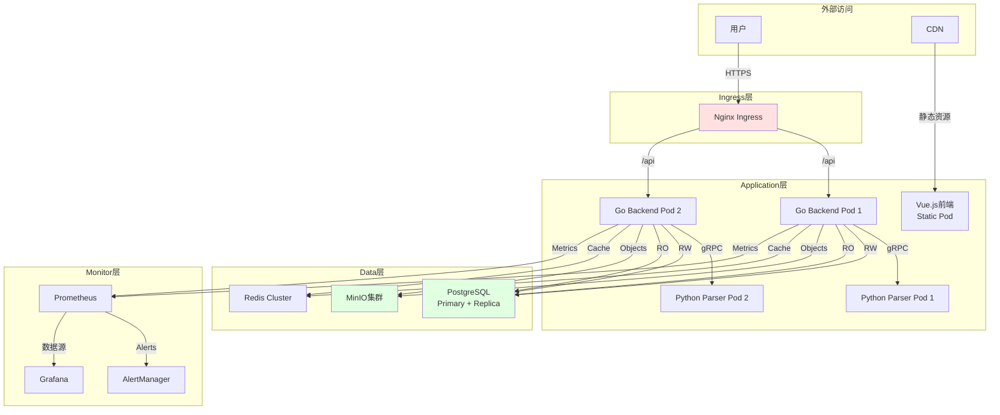

**高可用架构**：

1. **负载均衡**：Nginx Ingress分发请求
2. **多实例**：后端服务和解析服务都部署多个副本
3. **数据冗余**：PostgreSQL主从复制，MinIO分布式存储
4. **故障切换**：Kubernetes自动故障恢复

### 配置和环境管理

**环境变量配置**：

从[`cmd/main.go`](cmd/main.go:26-33)可以看到配置加载：

```go
dbHost := getEnv("DB_HOST", "localhost")
dbPort := getEnv("DB_PORT", "5432")
dbUser := getEnv("DB_USER", "postgres")
dbPassword := getEnv("DB_PASSWORD", "postgres")
dbName := getEnv("DB_NAME", "ai_doc_library")
serverPort := getEnv("SERVER_PORT", "8080")
baseStorageDir := getEnv("STORAGE_DIR", "./storage")
```

所有配置通过环境变量注入，支持：
- 多环境（dev/staging/prod）
- 密钥管理（K8s Secrets）
- 配置热更新（无需重启）

**配置管理最佳实践**：

1. **敏感信息**：使用Kubernetes Secrets管理
   ```yaml
   apiVersion: v1
   kind: Secret
   metadata:
     name: db-credentials
   stringData:
     DB_PASSWORD: production-password
     JWT_SECRET: jwt-secret-key
   ```

2. **非敏感配置**：使用ConfigMap
   ```yaml
   apiVersion: v1
   kind: ConfigMap
   metadata:
     name: app-config
   data:
     SERVER_PORT: "8080"
     STORAGE_TYPE: "minio"
   ```

3. **配置注入**：
   ```yaml
   env:
     - name: DB_HOST
       valueFrom:
         configMapKeyRef:
           name: app-config
           key: DB_HOST
     - name: DB_PASSWORD
       valueFrom:
         secretKeyRef:
           name: db-credentials
           key: DB_PASSWORD
   ```

### 运维工具和监控

**1. 日志管理**

从[`middleware/logging.go`](internal/middleware/logging.go)可以看到日志中间件：

```go
func (m *LoggingMiddleware) LogRequest() gin.HandlerFunc {
    return func(c *gin.Context) {
        start := time.Now()
        path := c.Request.URL.Path
        raw := c.Request.URL.RawQuery
        
        c.Next()
        
        // 记录请求日志
        duration := time.Since(start)
        m.monitorService.LogRequest(context.Background(), &model.Log{
            UserID:    userID,
            Username:  username,
            Method:    c.Request.Method,
            Path:      path,
            Status:    c.Writer.Status(),
            Duration:  duration.Milliseconds(),
            ClientIP:  c.ClientIP(),
            UserAgent: c.Request.UserAgent(),
        })
    }
}
```

所有HTTP请求都被记录，包含：
- 用户信息
- 请求详细信息
- 响应状态
- 处理耗时

**2. 指标收集**

从[`cmd/main.go`](cmd/main.go:188-201)可以看到定时指标收集：

```go
func startMetricsCollection(monitorService service.MonitorService) {
    ticker := time.NewTicker(30 * time.Second)
    defer ticker.Stop()
    
    for {
        select {
        case <-ticker.C:
            ctx := context.Background()
            if _, err := monitorService.CollectMetrics(ctx); err != nil {
                log.Printf("Failed to collect metrics: %v", err)
            }
        }
    }
}
```

每30秒收集一次系统指标，包括：
- 系统资源使用（CPU、内存、磁盘）
- 数据库连接数
- API请求统计
- 搜索性能指标

**3. 健康检查**

Kubernetes配置健康检查：

```yaml
livenessProbe:
  httpGet:
    path: /health/live
    port: 8080
  initialDelaySeconds: 30
  periodSeconds: 10

readinessProbe:
  httpGet:
    path: /health/ready
    port: 8080
  initialDelaySeconds: 10
  periodSeconds: 5
```

**4. 备份和恢复**

从[`backup_service.go`](internal/service/backup_service.go)可以看到备份机制：

```go
type BackupService struct {
    postgresBackup *PostgreSQLBackup
    storageService StorageService
    backupDir      string
}

func (s *BackupService) CreateBackup(ctx context.Context) (*model.Backup, error) {
    // 1. 数据库备份
    dbBackup, err := s.postgresBackup.Backup()
    
    // 2. 文件备份到对象存储
    backupPath := filepath.Join(s.backupDir, backupID+".sql")
    err := s.storageService.SaveFile(ctx, backupPath, dbBackup)
    
    // 3. 记录备份信息
    return &model.Backup{
        ID:        backupID,
        Type:      "database",
        FilePath:  backupPath,
        FileSize:  fileSize,
        CreatedAt: time.Now(),
    }, nil
}
```

备份策略：
- 每日全量备份
- 保留最近30天
- 异地备份（MinIO）

## 总结

LAST-doc AI技术文档库系统通过精心设计的架构，实现了高性能、高可用、高可扩展的技术文档管理平台。系统的核心优势包括：

**架构设计亮点**：

1. **分层清晰**：Handler-Service-Repository三层架构职责明确，易于维护和扩展

2. **微服务化**：按业务能力拆分服务，独立部署和扩展，技术栈灵活

3. **设计模式丰富**：工厂、策略、断路器等设计模式的合理应用，提升代码质量和系统稳定性

4. **通信机制灵活**：对外RESTful API，对内gRPC，兼顾易用性和性能

5. **安全可靠**：JWT认证、RBAC授权、断路器保护，多层保障系统安全

6. **可观测性强**：监控、日志、健康检查完善，便于运维和故障排查

**技术决策依据**：

| 决策维度 | 选择方案 | 技术依据 |
|---------|---------|---------|
| 后端语言 | Go | 高性能、强类型、并发优势，适合API服务 |
| 解析服务 | Python | 丰富的文本处理生态 |
| 数据库 | PostgreSQL + pgvector | 关系型数据库+向量检索能力 |
| 存储服务 | MinIO/S3 | 对象存储的标准方案 |
| 服务通信 | gRPC | 高效RPC，适合服务间调用 |
| API设计 | RESTful | 标准化、易理解、广泛支持 |

系统架构设计充分考虑了当前业务需求和未来扩展性，通过模块化设计、接口抽象和依赖注入等技术手段，实现了高内聚低耦合的优良架构。同时，通过容器化部署、自动伸缩、监控告警等运维实践，保障了系统的稳定运行和持续演进。